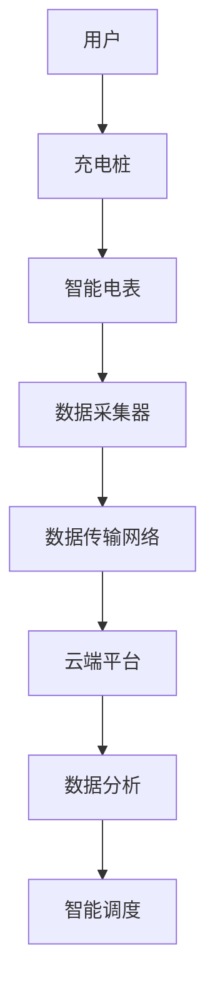
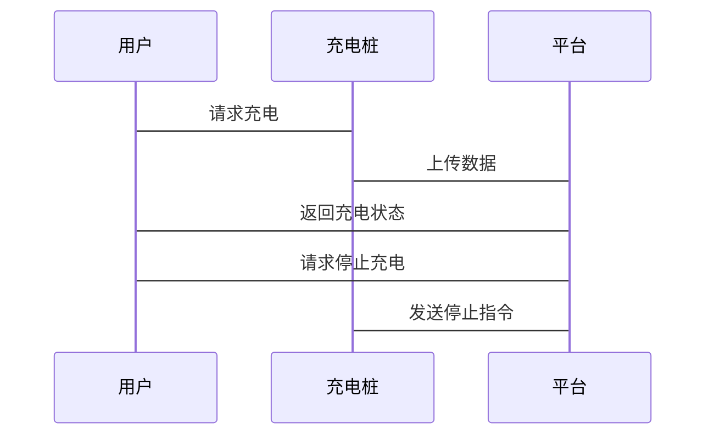

                 


# 价值投资中的智能电动汽车充电网络分析

> 关键词：智能电动汽车、充电网络、价值投资、充电技术、充电市场

> 摘要：智能电动汽车充电网络作为电动汽车普及的关键基础设施，其发展不仅影响着电动汽车的使用体验，也蕴含着巨大的投资机会。本文从技术、市场、用户行为等多个维度，系统分析智能电动汽车充电网络的价值链、技术实现、系统架构，并通过实际案例探讨投资机会，为投资者提供深度洞察。

---

## 第1章 智能电动汽车充电网络的背景与现状

### 1.1 智能充电网络的定义与特点

智能充电网络是指通过智能化技术实现电动汽车充电设施互联互通、资源共享和智能管理的网络系统。其特点包括：

- **智能化**：通过物联网、大数据和人工智能技术，实现充电设备的智能调度和用户行为预测。
- **互联互通**：支持不同品牌充电设备的统一接入和管理。
- **资源共享**：通过平台优化充电资源的利用率，降低运营成本。

### 1.2 智能充电网络的发展背景

#### 1.2.1 全球电动汽车市场的增长趋势

近年来，全球电动汽车市场呈现快速增长态势。根据市场研究机构的数据，2022年全球电动汽车销量达到1000万辆，预计到2030年，这一数字将超过5000万辆。电动汽车的普及催生了对充电基础设施的巨大需求。

#### 1.2.2 智能电网的发展与充电网络的关系

智能电网的建设为充电网络提供了技术支撑。通过智能电网，充电网络可以实现与电力系统的实时互动，优化电力资源的分配和利用。

#### 1.2.3 政策推动下的充电网络建设

各国政府纷纷出台政策，推动充电网络的建设和普及。例如，中国提出到2025年建成充电桩超过1000万台，欧盟则计划在2030年实现充电网络的全面覆盖。

### 1.3 智能电动汽车充电网络的市场分析

#### 1.3.1 充电桩市场的现状与未来预测

目前，全球充电桩市场主要集中在欧美和亚洲地区。未来几年，随着电动汽车销量的增长，充电桩市场将保持高速增长。

#### 1.3.2 不同类型充电设施的市场占比

从市场占比来看，公共充电桩和私人充电桩的比例大致为3:7。未来，随着私桩共享模式的普及，公共充电桩的市场份额可能会进一步下降。

#### 1.3.3 用户需求与充电网络布局的关系

用户需求是充电网络布局的重要影响因素。通过分析用户的充电行为和需求，可以优化充电网络的布局，提高用户体验。

---

## 第2章 智能电动汽车充电网络的价值链分析

### 2.1 智能充电网络的价值链构成

#### 2.1.1 上游产业：充电设备与技术供应商

上游产业包括充电设备制造商和充电技术开发商。这些企业通过提供高质量的充电设备和技术，为充电网络的建设和运营提供支持。

#### 2.1.2 中游产业：充电运营商与平台服务商

中游产业主要包括充电运营商和平台服务商。充电运营商负责充电桩的建设和运营，平台服务商则提供充电网络的管理和服务。

#### 2.1.3 下游产业：电动汽车制造商与用户

下游产业包括电动汽车制造商和最终用户。电动汽车制造商通过提供支持智能充电的车辆，提升用户体验；用户则是充电网络的主要使用者。

### 2.2 智能充电网络的核心价值要素

#### 2.2.1 充电效率与用户体验

充电效率直接影响用户的使用体验。高效率的充电网络能够缩短用户的充电时间，提升用户体验。

#### 2.2.2 网络覆盖与资源共享

网络覆盖范围决定了充电网络的可用性。通过资源共享，可以降低运营成本，提高充电资源的利用率。

#### 2.2.3 数据分析与智能调度

通过对用户数据的分析，可以实现充电资源的智能调度，优化充电网络的运行效率。

### 2.3 智能充电网络的价值实现路径

#### 2.3.1 通过规模效应降低成本

通过规模化运营，可以降低单位成本，实现经济效益。

#### 2.3.2 通过数据驱动提升收益

通过对数据的分析，可以实现精准营销和资源优化，提升收益。

#### 2.3.3 通过技术创新创造溢价

技术创新可以提升充电网络的竞争力，创造更高的溢价。

---

## 第3章 智能电动汽车充电网络的技术分析

### 3.1 智能充电网络的关键技术

#### 3.1.1 充电桩的智能化改造

智能化改造包括引入物联网技术，实现充电桩的远程监控和管理。

#### 3.1.2 充电网络的互联互通技术

互联互通技术包括统一接口标准和平台的互操作性。

#### 3.1.3 大数据分析与预测技术

大数据分析技术可以帮助预测用户需求，优化资源分配。

### 3.2 智能充电网络的算法原理

#### 3.2.1 充电需求预测算法

通过分析历史数据，预测用户的充电需求。

#### 3.2.2 充电资源优化分配算法

通过优化算法，实现充电资源的合理分配。

#### 3.2.3 用户行为分析算法

通过分析用户行为，优化充电网络的服务策略。

### 3.3 智能充电网络的数学模型

#### 3.3.1 充电需求预测模型

$$ D(t) = \alpha \cdot D(t-1) + \beta \cdot t $$

其中，\( D(t) \) 表示第 \( t \) 时刻的充电需求，\( \alpha \) 和 \( \beta \) 是模型参数。

#### 3.3.2 资源分配优化模型

$$ \text{Minimize } \sum_{i=1}^{n} c_i x_i $$

其中，\( c_i \) 是第 \( i \) 个充电桩的单位成本，\( x_i \) 是第 \( i \) 个充电桩的使用率。

#### 3.3.3 用户行为分析模型

$$ P(a) = \frac{e^{\beta a}}{1 + e^{\beta a}} $$

其中，\( P(a) \) 是用户选择充电桩的概率，\( a \) 是充电桩的可用性，\( \beta \) 是模型参数。

---

## 第4章 智能电动汽车充电网络的系统架构设计

### 4.1 系统架构概述

#### 4.1.1 分层架构设计

充电网络系统可以分为感知层、网络层和应用层。

#### 4.1.2 模块化设计原则

系统设计应遵循模块化原则，便于功能扩展和维护。

#### 4.1.3 可扩展性考虑

系统设计应考虑未来的扩展需求，确保系统的可持续发展。

### 4.2 系统功能模块设计

#### 4.2.1 感知层

感知层包括充电桩、智能电表等设备，负责采集数据和实时监控。

#### 4.2.2 网络层

网络层负责数据的传输和通信，确保数据的实时性和可靠性。

#### 4.2.3 应用层

应用层包括用户界面、数据分析和智能调度等功能。

### 4.3 系统架构设计

#### 4.3.1 系统架构图



#### 4.3.2 接口设计

系统需要定义统一的接口标准，确保不同设备和平台的互联互通。

#### 4.3.3 交互流程



---

## 第5章 项目实战：智能充电网络的投资分析

### 5.1 环境配置

#### 5.1.1 技术环境

需要搭建一个包含充电桩、数据采集器和云端平台的系统环境。

#### 5.1.2 数据来源

数据来源包括用户充电记录、充电桩使用情况等。

### 5.2 核心代码实现

#### 5.2.1 数据采集模块

```python
import serial

ser = serial.Serial('COM3', 9600)
data = ser.readline().decode()
print(data)
```

#### 5.2.2 数据分析模块

```python
import pandas as pd

dataframe = pd.read_csv('charging_data.csv')
print(dataframe.head())
```

#### 5.2.3 智能调度算法

```python
def dispatch(charging_demand, available_capacity):
    return min(charging_demand, available_capacity)
```

### 5.3 案例分析

#### 5.3.1 案例背景

假设在一个城市中，已建成100个充电桩，用户数量为5000人。

#### 5.3.2 数据分析

通过数据分析，发现用户充电需求在高峰时段集中，导致部分充电桩使用率低。

#### 5.3.3 投资回报分析

通过优化充电网络布局，可以提高充电桩的利用率，降低运营成本，提升投资回报率。

### 5.4 项目小结

通过实际案例分析，验证了智能充电网络的投资价值。优化的充电网络布局可以有效提升用户体验，降低运营成本，实现投资回报。

---

## 第6章 总结与展望

### 6.1 总结

智能电动汽车充电网络作为电动汽车普及的重要基础设施，其发展不仅影响着用户的使用体验，也蕴含着巨大的投资机会。通过技术分析、系统设计和案例研究，本文为投资者提供了深度的洞察。

### 6.2 投资机会

未来，随着技术的不断进步和市场的扩展，智能充电网络的投资价值将进一步提升。

### 6.3 展望

未来，智能充电网络将与智能电网、智慧城市等技术深度融合，推动电动汽车行业的进一步发展。

---

## 附录

### 附录A 数据表格

| 充电桩编号 | 使用率 | 位置 |
|------------|--------|------|
| 1          | 80%    | 区域1 |
| 2          | 60%    | 区域2 |

### 附录B 图表


### 附录C 参考文献

1. 研究机构报告：全球电动汽车市场分析，2023年。
2. 国际能源署：智能电网与充电网络，2022年。

---

通过以上结构和内容，本文系统地分析了智能电动汽车充电网络的价值投资机会，为投资者提供了全面的技术和市场洞察。

