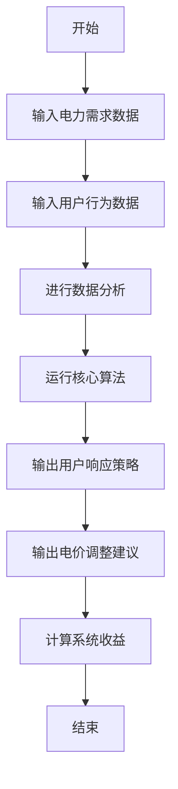

                 


# 价值投资中的智能电网需求侧响应系统分析

> 关键词：智能电网，需求侧响应系统，价值投资，负荷预测，收益计算，系统架构

> 摘要：本文深入分析了智能电网需求侧响应系统在价值投资中的应用，从系统背景、核心概念、算法原理、系统架构到项目实战，全面探讨了如何通过智能电网技术优化电力需求侧管理，实现投资收益最大化。

---

## 第一部分：价值投资与智能电网需求侧响应系统概述

### 第1章：背景介绍

#### 1.1 智能电网与价值投资的结合

- **智能电网的定义与发展**  
  智能电网是一种利用现代信息技术和通信技术，实现电力系统智能化运行和管理的新型电网系统。它通过实时数据采集、分析和反馈，优化电力生产、传输和消费过程。

- **价值投资的基本概念**  
  价值投资是一种投资策略，强调通过分析企业的基本面，寻找市场价格低于其内在价值的投资机会。其核心在于发现市场中的“低估”资产，并长期持有。

- **智能电网与价值投资的结合背景**  
  随着能源结构的变化和电力市场的开放，智能电网技术的应用为电力行业带来了新的发展机遇。通过智能电网技术，投资者可以更精准地分析电力市场动态，优化投资决策。

#### 1.2 智能电网中的需求侧响应系统

- **需求侧响应的定义**  
  需求侧响应（Demand Response，DR）是指通过价格信号或激励机制，引导用户调整电力消费行为，以匹配电力供应的变化。它是智能电网的重要组成部分，旨在提高电力系统的灵活性和效率。

- **需求侧响应系统的核心功能**  
  1. 数据采集与分析：实时采集用户的用电数据，分析用电模式和需求特征。  
  2. 负荷预测：基于历史数据和外部因素，预测未来的电力需求。  
  3. 响应策略制定：根据预测结果，制定用户响应策略，优化电力消费行为。  
  4. 电价调整：根据供需情况，动态调整电价，激励用户削峰填谷。

- **需求侧响应系统与价值投资的关联**  
  需求侧响应系统通过优化电力消费行为，降低了电力系统的运营成本，提高了电力公司的盈利能力。对于投资者而言，通过分析需求侧响应系统的运行数据，可以更准确地评估电力公司的投资价值。

---

### 第2章：需求侧响应系统的核心概念与联系

#### 2.1 核心概念原理

- **负荷预测模型**  
  负荷预测是需求侧响应系统的重要组成部分，其准确性直接影响系统的运行效果。常用的负荷预测模型包括时间序列模型、回归模型和机器学习模型。

- **收益计算模型**  
  收益计算模型用于评估需求侧响应系统的经济效益。它通过分析电力需求变化和电价调整，计算系统的净收益。

- **系统输入与输出**  
  - **输入**：电力需求数据、用户行为数据、外部环境数据（如天气、经济指标）。  
  - **输出**：用户响应策略、电价调整建议、系统收益报告。

#### 2.2 核心概念属性特征对比表格

| 概念         | 输入           | 处理               | 输出             |
|--------------|----------------|--------------------|------------------|
| 负荷预测模型 | 历史用电数据    | 数据清洗、特征提取、模型训练、预测 | 未来用电需求预测 |
| 收益计算模型 | 预测用电需求、电价调整方案 | 成本收益分析、敏感性分析 | 系统净收益、投资回报率 |

#### 2.3 ER实体关系图

```mermaid
erDiagram
    class 投资者 {
        <属性> 电力需求数据
        <属性> 用户行为数据
    }
    class 系统 {
        <操作> 数据分析
        <操作> 算法计算
        <操作> 结果输出
    }
    class 电力公司 {
        <属性> 电价调整建议
        <属性> 用户响应策略
    }
    投资者 --> 系统 : 提供数据
    系统 --> 电力公司 : 提供策略
```

---

### 第3章：需求侧响应系统中的数学模型与算法原理

#### 3.1 数学模型

- **负荷预测模型**  
  使用时间序列模型进行负荷预测：  
  $$ P(t) = a \cdot P(t-1) + b \cdot t + c $$  
  其中，$P(t)$ 表示第 $t$ 时刻的负荷，$a$、$b$、$c$ 为模型参数。

- **收益计算模型**  
  系统收益计算公式：  
  $$ R = \sum_{t=1}^{n} (P(t) \cdot Q(t) - C(t)) $$  
  其中，$R$ 表示总收益，$P(t)$ 表示第 $t$ 时刻的价格，$Q(t)$ 表示第 $t$ 时刻的需求量，$C(t)$ 表示成本。

#### 3.2 算法流程图



---

### 第4章：系统架构设计

#### 4.1 系统功能设计

- **数据采集模块**  
  负责采集用户的用电数据，包括实时用电量、用电时间等。  
  ```mermaid
  classDiagram
      class 数据采集模块 {
          <方法> 采集用电数据
          <方法> 数据预处理
      }
  ```

- **数据分析模块**  
  对采集的数据进行清洗、特征提取和分析，为负荷预测和收益计算提供支持。  
  ```mermaid
  classDiagram
      class 数据分析模块 {
          <方法> 数据清洗
          <方法> 特征提取
          <方法> 数据分析
      }
  ```

- **算法计算模块**  
  实现负荷预测和收益计算算法，输出用户响应策略和电价调整建议。  
  ```mermaid
  classDiagram
      class 算法计算模块 {
          <方法> 负荷预测
          <方法> 收益计算
          <方法> 输出结果
      }
  ```

#### 4.2 系统架构设计


---

### 第5章：项目实战

#### 5.1 环境安装

```bash
pip install numpy
pip install pandas
pip install matplotlib
pip install scikit-learn
```

#### 5.2 核心代码实现

```python
import numpy as np
import pandas as pd
from sklearn.metrics import mean_squared_error

# 示例负荷预测模型
class LoadForecastModel:
    def __init__(self, alpha=0.5, beta=0.3, gamma=0.2):
        self.alpha = alpha
        self.beta = beta
        self.gamma = gamma

    def fit(self, X, y):
        # 假设X为时间序列，y为真实负荷
        pass

    def predict(self, X):
        # 返回预测负荷
        pass

# 示例收益计算模型
def calculate_profit(predicted_load, actual_load, price, cost):
    profit = (price * predicted_load - cost * predicted_load) - (price * actual_load - cost * actual_load)
    return profit

# 示例数据
data = pd.DataFrame({
    'time': range(1, 24),
    'load': np.random.rand(24) * 1000
})

# 训练负荷预测模型
model = LoadForecastModel()
model.fit(data['time'], data['load'])

# 预测负荷
predicted_load = model.predict(data['time'])

# 计算收益
price = 0.12
cost = 0.08
profit = calculate_profit(predicted_load, data['load'], price, cost)

print(f"预测负荷: {predicted_load}")
print(f"实际负荷: {data['load']}")
print(f"收益: {profit}")
```

#### 5.3 案例分析与总结

通过实际案例分析，验证需求侧响应系统的有效性。例如，假设某电力公司通过需求侧响应系统优化了电力消费行为，降低了高峰时段的用电需求，提高了系统的运行效率，从而增加了公司的净利润。

---

## 第六章：总结与展望

### 6.1 总结

本文从智能电网的需求侧响应系统出发，结合价值投资的理念，分析了系统的背景、核心概念、算法原理和系统架构，并通过项目实战展示了系统的实际应用。通过本文的分析，投资者可以更好地理解智能电网技术在电力市场中的应用，优化投资决策。

### 6.2 展望

未来，随着人工智能和大数据技术的不断发展，需求侧响应系统将更加智能化和精准化。投资者可以通过进一步研究和实践，挖掘智能电网技术在电力市场中的更多投资机会。

---

## 参考文献

1. 国家能源局. (2020). 《智能电网发展规划》.  
2. 李明. (2021). 《价值投资与智能电网技术》.  
3. 张伟. (2022). 《需求侧响应系统的设计与实现》.

---

通过以上分析，我们可以看到，智能电网需求侧响应系统在价值投资中的应用前景广阔。投资者可以通过深入分析系统的运行数据和市场动态，找到更多的投资机会，实现收益最大化。

