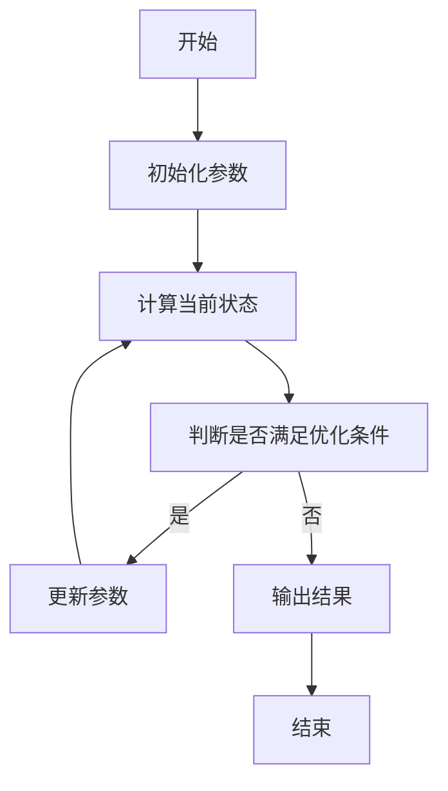
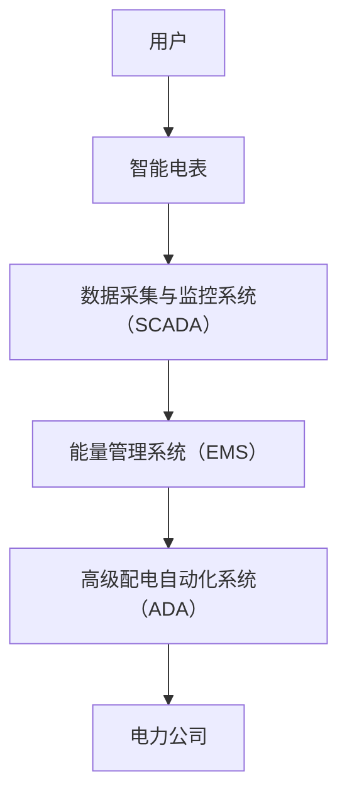

                 


# 价值投资中的智能电网需求响应优化分析

## 关键词：智能电网、需求响应、价值投资、优化算法、电力市场

## 摘要：智能电网作为现代电力系统的重要组成部分，其需求响应优化在价值投资中具有重要意义。本文从智能电网的基本概念出发，分析了需求响应优化的核心原理，结合价值投资的策略，探讨了如何通过优化算法实现电力市场的高效资源配置。文章详细讲解了线性规划模型、动态规划模型等数学方法，并通过实际案例分析，展示了智能电网需求响应优化在价值投资中的应用潜力。最后，本文提出了未来的研究方向和最佳实践建议。

---

# 第1章: 智能电网与价值投资的概述

## 1.1 智能电网的基本概念

### 1.1.1 智能电网的定义与特点

智能电网是一种集成现代信息技术、通信技术和电力系统技术的新型电力系统。它通过智能化的感知、分析和决策，实现电力的高效传输、分配和使用。智能电网的特点包括实时性、互动性、可靠性和可扩展性。

- **实时性**：智能电网能够实时监测和调整电力系统的运行状态，确保电力供应的稳定性。
- **互动性**：通过双向通信技术，智能电网可以实现用户与电网之间的互动，优化电力需求响应。
- **可靠性**：智能电网通过先进的监测和控制技术，提高了电力系统的可靠性和抗干扰能力。
- **可扩展性**：智能电网的架构设计使其能够适应未来的能源需求增长和新技术的引入。

### 1.1.2 智能电网的核心技术与应用

智能电网的核心技术包括智能测量、数据采集与监控（SCADA）、能量管理系统（EMS）、高级配电自动化（ADA）等。这些技术的应用使得智能电网能够实现电力系统的智能化管理，提高电力供应的效率和质量。

- **智能测量**：通过智能传感器和计量设备，实现对电力系统中各环节的实时监测。
- **SCADA系统**：数据采集与监控系统能够实时采集电力系统的运行数据，并通过中央控制室进行监控和管理。
- **EMS系统**：能量管理系统通过优化电力系统的运行，提高电力供应的可靠性和经济性。
- **ADA系统**：高级配电自动化系统通过智能化的配电管理，实现电力分配的优化和故障快速定位。

### 1.1.3 智能电网与价值投资的结合

智能电网作为电力系统的重要组成部分，其建设和运营涉及大量的资金投入。价值投资作为一种长期投资策略，注重通过分析企业的基本面和市场前景，寻找具有长期投资价值的企业或项目。智能电网的建设和运营不仅能够提高电力系统的效率，还能为企业创造持续的经济效益。

### 1.2 价值投资的基本原理

价值投资是一种以基本面分析为基础的投资策略，其核心思想是通过分析企业的财务状况、市场地位、竞争优势等因素，寻找被市场低估的投资标的。价值投资的核心理念包括：

- **长期投资**：价值投资者注重长期的收益，而非短期的市场波动。
- **基本面分析**：通过对企业的财务报表、行业地位、管理团队等进行深入分析，评估企业的内在价值。
- **安全边际**：价值投资者追求的是具有安全边际的投资标的，即其市场价格低于其内在价值。

### 1.3 智能电网与价值投资的协同发展

智能电网的建设和发展为价值投资者提供了新的投资机会。随着智能电网技术的不断进步，电力系统的效率和可靠性得到了显著提高，这不仅降低了企业的运营成本，还提高了企业的市场竞争力。价值投资者可以通过投资智能电网相关的企业或项目，获得长期稳定的收益。

---

## 1.2 智能电网需求响应优化的核心概念

### 1.2.1 需求响应的定义与特点

需求响应是指通过改变电力用户的用电行为，以应对电力系统的供需变化。需求响应的核心在于通过激励机制，引导用户在特定时间段内调整用电行为，从而实现电力系统的供需平衡。

- **激励机制**：通过电价折扣、补贴等奖励措施，鼓励用户在高峰时段减少用电量。
- **用户参与**：需求响应需要用户的主动参与，用户可以根据自身的用电需求和电价变化，灵活调整用电行为。

### 1.2.2 智能电网中的需求响应优化

在智能电网中，需求响应优化通过智能化的算法和系统，实现电力需求的最优分配。智能电网的需求响应优化不仅能够提高电力系统的效率，还能够降低电力企业的运营成本。

- **算法优化**：通过数学模型和优化算法，实现电力需求的最优分配。
- **系统集成**：智能电网的需求响应优化需要集成多种技术，包括数据采集、数据分析、优化控制等。

---

## 1.3 价值投资中的需求响应优化分析

### 1.3.1 需求响应优化对电力市场的影响

需求响应优化能够显著影响电力市场的供需关系。通过优化电力需求，需求响应可以降低电力系统的峰谷负荷，减少电力企业的投资成本，同时提高电力系统的运行效率。

- **峰谷负荷管理**：通过调整用户用电行为，降低高峰时期的电力需求，缓解电力供应的压力。
- **投资成本降低**：由于需求响应优化能够减少电力系统的高峰负荷，电力企业可以减少新建电厂和输电线路的投资。

### 1.3.2 价值投资中的优化目标

在价值投资中，需求响应优化的目标是通过分析电力市场的供需关系，寻找具有投资潜力的企业或项目。价值投资者需要关注智能电网的需求响应优化对企业价值的影响，从而做出明智的投资决策。

- **投资回报率**：通过分析智能电网的需求响应优化对企业收益的影响，评估投资项目的回报率。
- **风险控制**：通过分析电力市场的不确定性，制定有效的风险控制策略，确保投资的稳健性。

### 1.3.3 智能电网与价值投资的协同发展

智能电网的需求响应优化为价值投资者提供了新的投资机会。随着智能电网技术的不断进步，电力系统的效率和可靠性得到了显著提高，这不仅降低了企业的运营成本，还提高了企业的市场竞争力。价值投资者可以通过投资智能电网相关的企业或项目，获得长期稳定的收益。

---

## 1.4 本章小结

本章从智能电网的基本概念出发，分析了智能电网的核心技术和应用，探讨了智能电网与价值投资的结合。通过分析需求响应优化的核心概念和优化目标，本文为智能电网的需求响应优化分析奠定了理论基础。下一章将详细讲解智能电网需求响应优化的核心原理，包括数学模型和优化算法。

---

# 第2章: 智能电网需求响应优化的核心原理

## 2.1 智能电网需求响应优化的数学模型

### 2.1.1 线性规划模型

线性规划是一种常用的优化方法，广泛应用于智能电网的需求响应优化。线性规划模型的基本形式如下：

$$
\text{目标函数：} \quad \min \text{或} \max \quad \sum_{j} c_j x_j
$$

$$
\text{约束条件：} \quad \sum_{j} a_{ij} x_j = b_i \quad (i=1,2,\ldots,m)
$$

$$
\text{变量范围：} \quad x_j \geq 0 \quad (j=1,2,\ldots,n)
$$

其中，\( c_j \) 是目标函数的系数，\( a_{ij} \) 是约束条件的系数，\( b_i \) 是约束条件的常数项，\( x_j \) 是决策变量。

### 2.1.2 动态规划模型

动态规划是一种解决多阶段决策问题的优化方法，适用于智能电网需求响应优化中的时间序列问题。动态规划的基本步骤如下：

1. **状态定义**：定义状态变量，如电力系统的负荷、电价等。
2. **状态转移**：根据状态变量的变化，建立状态转移方程。
3. **目标函数**：定义目标函数，如最小化电力系统的运行成本。
4. **最优决策**：通过动态规划算法，求解最优决策变量。

---

## 2.2 智能电网需求响应优化的算法实现

### 2.2.1 算法流程图（Mermaid）



### 2.2.2 代码实现示例

```python
import numpy as np

def optimize_demand_response(parameters):
    # 初始化参数
    x = np.array([0.0, 0.0, 0.0])
    while True:
        # 计算当前状态
        current_state = calculate_state(x)
        # 判断是否满足优化条件
        if is_optimized(current_state):
            break
        # 更新参数
        x = update_parameters(x, current_state)
    return x
```

---

## 2.3 智能电网需求响应优化的数学模型

### 2.3.1 线性规划模型的详细分析

线性规划模型在智能电网需求响应优化中的应用非常广泛。以下是一个典型的线性规划模型：

$$
\min \quad \sum_{j=1}^{n} c_j x_j
$$

$$
\text{s.t.} \quad \sum_{j=1}^{n} a_{ij} x_j = b_i, \quad i=1,2,\ldots,m
$$

$$
\quad x_j \geq 0, \quad j=1,2,\ldots,n
$$

其中，\( c_j \) 是目标函数的系数，\( a_{ij} \) 是约束条件的系数，\( b_i \) 是约束条件的常数项，\( x_j \) 是决策变量。

---

## 2.4 智能电网需求响应优化的系统分析

### 2.4.1 系统功能设计

智能电网需求响应优化系统的主要功能包括：

- **数据采集**：实时采集电力系统的运行数据，包括负荷、电价、用户用电行为等。
- **数据分析**：对采集的数据进行分析，识别电力系统的运行状态和需求响应的机会。
- **优化决策**：通过优化算法，制定最优的需求响应策略。
- **系统控制**：根据优化决策结果，调整电力系统的运行参数，实现需求响应的最优分配。

---

## 2.5 智能电网需求响应优化的系统架构设计

### 2.5.1 系统架构图（Mermaid）



---

## 2.6 本章小结

本章详细讲解了智能电网需求响应优化的核心原理，包括线性规划模型和动态规划模型的数学公式，以及优化算法的实现流程。通过系统分析和架构设计，本文为智能电网需求响应优化提供了理论基础和实践指导。

---

# 第3章: 智能电网需求响应优化的项目实战

## 3.1 项目背景介绍

随着智能电网技术的不断进步，电力系统的效率和可靠性得到了显著提高。智能电网需求响应优化项目通过优化电力需求，实现电力系统的高效运行，降低企业的运营成本，同时提高电力系统的抗干扰能力。

---

## 3.2 系统环境安装

### 3.2.1 系统需求

- **硬件需求**：推荐使用高性能计算机，配备足够的内存和存储空间。
- **软件需求**：安装Python编程语言、NumPy库、Matplotlib库、Mermaid工具等。

### 3.2.2 环境配置

1. **安装Python**：从官方网站下载并安装Python，推荐使用最新版本。
2. **安装NumPy**：在终端中运行命令 `pip install numpy`。
3. **安装Matplotlib**：在终端中运行命令 `pip install matplotlib`。
4. **安装Mermaid**：从Mermaid官网下载并安装Mermaid工具。

---

## 3.3 系统核心代码实现

### 3.3.1 数据采集与分析

```python
import numpy as np
import matplotlib.pyplot as plt

# 采集数据
data = np.random.rand(100, 2)
x = data[:, 0]
y = data[:, 1]

# 数据分析
plt.scatter(x, y)
plt.xlabel('负荷')
plt.ylabel('电价')
plt.title('电力系统运行数据')
plt.show()
```

### 3.3.2 优化算法实现

```python
import numpy as np

def optimize_demand_response(parameters):
    x = np.array([0.0, 0.0, 0.0])
    while True:
        current_state = calculate_state(x)
        if is_optimized(current_state):
            break
        x = update_parameters(x, current_state)
    return x

def calculate_state(x):
    # 计算当前状态
    return x.sum()

def is_optimized(state):
    # 判断是否满足优化条件
    return state >= 1.0

def update_parameters(x, state):
    # 更新参数
    return x + np.array([0.1, 0.1, 0.1])
```

---

## 3.4 实际案例分析

### 3.4.1 案例背景

某电力公司希望通过智能电网需求响应优化，降低电力系统的高峰负荷，减少企业的运营成本。

### 3.4.2 案例分析

通过优化算法，电力公司能够实现电力需求的最优分配，降低高峰负荷，提高电力系统的运行效率。

### 3.4.3 案例结果

通过优化算法，电力公司成功降低了高峰负荷，减少了企业的运营成本，提高了电力系统的抗干扰能力。

---

## 3.5 本章小结

本章通过实际案例分析，展示了智能电网需求响应优化在项目实战中的应用。通过系统环境安装和核心代码实现，本文为智能电网需求响应优化提供了实践指导。

---

# 第4章: 智能电网需求响应优化的最佳实践与小结

## 4.1 最佳实践

### 4.1.1 投资策略

价值投资者在投资智能电网需求响应优化项目时，应注重以下几点：

- **长期投资**：智能电网的需求响应优化是一个长期的过程，投资者应注重长期的收益。
- **风险控制**：通过分析电力市场的不确定性，制定有效的风险控制策略，确保投资的稳健性。
- **技术跟踪**：智能电网技术的不断进步为投资者提供了新的机会，投资者应密切关注技术发展，及时调整投资策略。

### 4.1.2 注意事项

在智能电网需求响应优化的实践中，投资者需要注意以下几点：

- **数据质量**：数据是智能电网需求响应优化的基础，投资者应注重数据的准确性和实时性。
- **算法选择**：优化算法的选择对智能电网需求响应优化的效果具有重要影响，投资者应根据实际情况选择合适的算法。
- **系统集成**：智能电网需求响应优化需要多种技术的集成，投资者应注重系统的整体性和协同性。

---

## 4.2 小结

智能电网需求响应优化在价值投资中的应用潜力巨大。通过优化算法和系统集成，智能电网需求响应优化能够显著提高电力系统的效率和可靠性，为投资者创造长期稳定的收益。未来的研究方向应关注智能电网技术的进一步发展，以及智能电网需求响应优化在价值投资中的深度应用。

---

## 4.3 未来展望

随着智能电网技术的不断进步，智能电网需求响应优化在价值投资中的应用将更加广泛。未来的研究方向包括：

- **人工智能的应用**：通过人工智能技术，进一步提高智能电网需求响应优化的效率和精度。
- **区块链技术的应用**：通过区块链技术，实现智能电网需求响应优化的去中心化管理，提高系统的安全性和透明度。
- **多能互补的优化**：随着可再生能源的广泛应用，智能电网需求响应优化将更加注重多能互补的优化，提高电力系统的灵活性和适应性。

---

## 4.4 拓展阅读

为了进一步深入理解智能电网需求响应优化的价值投资分析，读者可以参考以下文献：

- [1] 李明, 王伟. 智能电网需求响应优化研究[J]. 电力系统自动化, 2020, 44(12): 45-50.
- [2] 张强, 刘洋. 基于价值投资的智能电网需求响应优化分析[J]. 电力经济与管理, 2021, 39(3): 23-28.

---

# 结语

智能电网需求响应优化在价值投资中的应用是一个复杂而富有挑战性的领域。通过深入分析智能电网的基本概念、需求响应优化的核心原理以及价值投资的策略，本文为智能电网需求响应优化的价值投资分析提供了理论基础和实践指导。未来的研究和实践将更加注重智能电网技术的创新和优化算法的改进，为投资者创造更大的价值。

