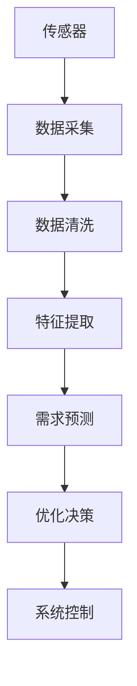
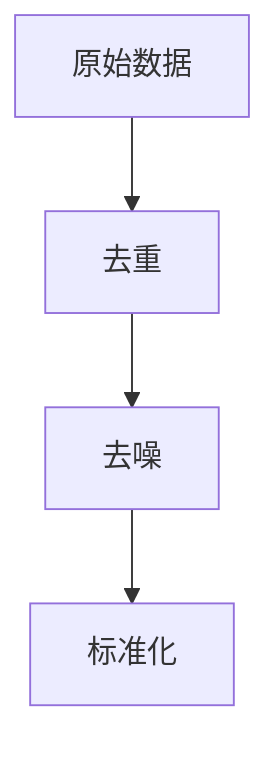
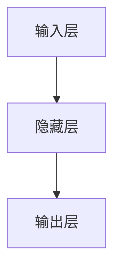
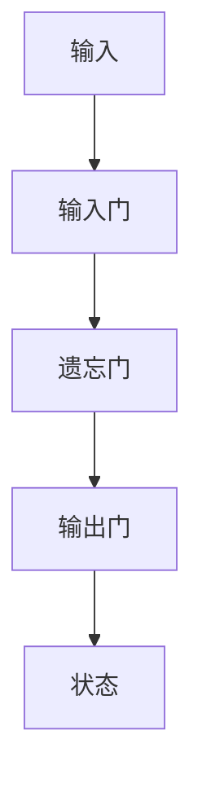
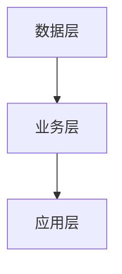
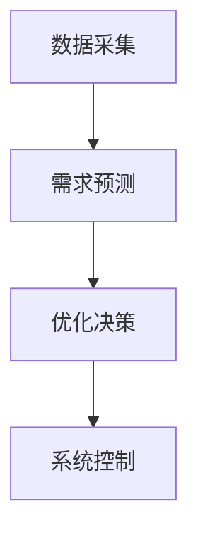

                 


# 价值投资中的智能电网需求响应系统分析

> 关键词：智能电网，需求响应系统，价值投资，能源管理，优化算法

> 摘要：本文深入分析了智能电网需求响应系统在价值投资中的应用，探讨了系统的核心概念、算法原理、系统架构以及实际案例。通过详细的技术分析和实际应用，展示了如何通过智能电网需求响应系统实现能源优化管理和投资收益最大化。

---

# 第一部分: 智能电网与价值投资的背景与概念

## 第1章: 智能电网与价值投资概述

### 1.1 智能电网的基本概念

#### 1.1.1 智能电网的定义与特点
智能电网是一种利用先进的通信、控制和信息 technologies，将发电、输电、配电和用电各环节有机连接的现代化电力系统。其特点包括：

- **智能化**：通过智能设备和数据采集系统，实现对电网运行状态的实时监控和智能决策。
- **高效性**：优化电力资源的分配和利用，提高能源利用效率。
- **可持续性**：支持可再生能源的接入和利用，减少对化石燃料的依赖。

#### 1.1.2 智能电网的核心技术与组成部分
智能电网的核心技术包括：

- **智能测量**：通过传感器和数据采集系统，实时采集电网运行数据。
- **智能计算**：利用大数据分析和人工智能技术，对电网数据进行处理和分析。
- **智能控制**：基于分析结果，实现对电网设备的智能控制和优化。

智能电网的主要组成部分包括发电、输电、配电、用电和通信网络。

#### 1.1.3 智能电网的发展现状与趋势
智能电网在全球范围内得到了广泛应用，随着可再生能源的快速发展和技术的进步，智能电网将继续向更高效、更智能、更可持续的方向发展。

---

### 1.2 价值投资的基本概念

#### 1.2.1 价值投资的定义与特点
价值投资是一种长期投资策略，强调以低于内在价值的价格购买优质资产。其特点包括：

- **长期性**：注重长期收益，而非短期波动。
- **安全性**：选择具有稳定业绩和良好管理的公司。
- **内在价值**：关注公司的真实价值，而非市场波动。

#### 1.2.2 价值投资的核心原则与策略
价值投资的核心原则包括：

- **安全边际**：买入价格低于内在价值。
- **优质资产**：选择行业龙头或具有竞争优势的公司。
- **长期持有**：耐心持有优质资产，等待价值回归。

#### 1.2.3 价值投资在能源行业的应用现状
随着能源行业的快速发展，价值投资在能源领域的应用日益广泛，特别是在智能电网、可再生能源等领域。

---

### 1.3 智能电网需求响应系统的核心概念

#### 1.3.1 需求响应系统的定义与作用
需求响应系统是一种通过实时监控和优化电力需求，实现电力资源高效利用的技术系统。其作用包括：

- **优化电力需求**：通过调整用电负荷，减少电力浪费。
- **平衡供需**：在电力供应紧张时，通过削减非必要负荷，保证电网稳定运行。
- **降低能源成本**：通过优化用电，降低企业的能源成本。

#### 1.3.2 智能电网中需求响应系统的地位与意义
在智能电网中，需求响应系统是实现电力资源优化配置和高效利用的核心技术之一。其意义在于：

- **提高电网运行效率**：通过实时调整用电负荷，减少电网的峰谷差，提高电网运行效率。
- **支持可再生能源接入**：通过灵活调节用电负荷，支持风能、太阳能等可再生能源的接入和利用。
- **降低能源成本**：通过优化用电，降低企业和用户的能源成本。

---

## 第2章: 智能电网需求响应系统的核心概念与原理

### 2.1 需求响应系统的核心功能模块

#### 2.1.1 数据采集与处理模块
数据采集与处理模块负责从电网各环节采集数据，并进行预处理和分析。

- **数据采集**：通过传感器和数据采集系统，实时采集电网运行数据。
- **数据清洗**：对采集的数据进行去噪和标准化处理。
- **特征提取**：通过数据分析，提取影响电力需求的关键特征。

#### 2.1.2 需求预测与优化模块
需求预测与优化模块基于历史数据和实时数据，预测未来电力需求，并制定优化策略。

- **需求预测**：利用时间序列分析、机器学习等技术，预测未来电力需求。
- **优化策略**：基于预测结果，制定电力需求优化方案。

#### 2.1.3 用户行为分析模块
用户行为分析模块通过对用户用电行为的分析，制定个性化的用电管理策略。

- **行为分析**：通过数据分析，识别用户的用电习惯和行为模式。
- **个性化策略**：根据不同用户的用电行为，制定个性化的用电管理策略。

#### 2.1.4 系统决策与控制模块
系统决策与控制模块根据优化结果，实时调整电力供应和需求。

- **决策制定**：基于优化结果，制定电力供应和需求调整方案。
- **系统控制**：通过自动化控制系统，实现电力供应和需求的实时调整。

---

### 2.2 智能电网需求响应系统的原理

#### 2.2.1 数据流与信息传递机制
智能电网需求响应系统的数据流包括：

- **数据采集**：传感器采集数据。
- **数据处理**：数据清洗、特征提取。
- **需求预测**：利用模型预测未来需求。
- **优化决策**：制定优化策略。
- **系统控制**：调整电力供应和需求。

数据流与信息传递机制可以用以下 mermaid 图表示：



#### 2.2.2 系统的动态优化算法
系统的动态优化算法包括：

- **线性规划模型**：优化电力需求的分配。
- **遗传算法**：用于全局优化。
- **强化学习**：用于实时调整策略。

优化模型的数学表达式为：

$$
\text{min} \quad \sum_{i=1}^{n} c_i x_i
$$

$$
\text{subject to} \quad \sum_{i=1}^{n} x_i \leq C
$$

其中，$c_i$ 是第 $i$ 个用户的用电成本，$x_i$ 是第 $i$ 个用户的用电量，$C$ 是总电力供应。

#### 2.2.3 系统的实时响应与反馈机制
系统的实时响应与反馈机制包括：

- **实时监控**：对电力需求和供应进行实时监控。
- **快速响应**：根据优化结果，实时调整电力供应和需求。
- **反馈机制**：根据实际效果，调整优化策略。

---

## 第3章: 智能电网需求响应系统的算法原理与数学模型

### 3.1 数据预处理与特征提取

#### 3.1.1 数据清洗与标准化
数据清洗包括：

- **去重**：去除重复数据。
- **去噪**：去除异常值。
- **标准化**：将数据归一化处理。

数据清洗的流程可以用以下 mermaid 图表示：



#### 3.1.2 特征选择与降维方法
特征选择方法包括：

- **相关性分析**：选择与需求预测高度相关的特征。
- **主成分分析（PCA）**：通过降维方法减少特征数量。

#### 3.1.3 时间序列数据分析方法
时间序列数据分析方法包括：

- **ARIMA模型**：用于时间序列预测。
- **LSTM模型**：用于长序列预测。

---

### 3.2 需求预测模型

#### 3.2.1 线性回归模型
线性回归模型的数学表达式为：

$$
y = \beta_0 + \beta_1 x + \epsilon
$$

其中，$y$ 是预测值，$x$ 是自变量，$\beta_0$ 和 $\beta_1$ 是回归系数，$\epsilon$ 是误差项。

#### 3.2.2 神经网络模型
神经网络模型包括输入层、隐藏层和输出层，可以用以下 mermaid 图表示：



#### 3.2.3 长短期记忆网络（LSTM）模型
LSTM模型的结构包括输入门、遗忘门和输出门，可以用以下 mermaid 图表示：



---

### 3.3 优化算法与数学模型

#### 3.3.1 线性规划模型
线性规划模型的数学表达式为：

$$
\text{min} \quad \sum_{i=1}^{n} c_i x_i
$$

$$
\text{subject to} \quad \sum_{i=1}^{n} x_i \leq C
$$

其中，$c_i$ 是第 $i$ 个用户的用电成本，$x_i$ 是第 $i$ 个用户的用电量，$C$ 是总电力供应。

#### 3.3.2 遗传算法与粒子群优化算法
遗传算法的步骤包括：

1. **初始化种群**：随机生成初始种群。
2. **适应度评估**：计算每个个体的适应度。
3. **选择**：选择适应度高的个体。
4. **交叉**：进行基因交叉。
5. **变异**：进行基因变异。

粒子群优化算法的步骤包括：

1. **初始化种群**：随机生成初始种群。
2. **计算适应度**：计算每个个体的适应度。
3. **更新速度**：根据全局最优解更新速度。
4. **更新位置**：根据速度更新位置。

---

## 第4章: 智能电网需求响应系统的系统架构与设计

### 4.1 系统架构设计

#### 4.1.1 分层架构设计
分层架构包括数据层、业务层和应用层，可以用以下 mermaid 图表示：



#### 4.1.2 模块化设计原则
模块化设计原则包括：

- **高内聚**：每个模块功能单一。
- **低耦合**：模块之间耦合度低。
- **可扩展性**：模块易于扩展和升级。

#### 4.1.3 系统可扩展性与可维护性
系统可扩展性包括：

- **模块化设计**：便于功能扩展。
- **接口标准化**：便于与其他系统集成。

---

### 4.2 系统功能设计

#### 4.2.1 用户需求分析
用户需求分析包括：

- **用户类型**：家庭用户、企业用户。
- **需求场景**：高峰时段用电优化、可再生能源利用。

#### 4.2.2 系统功能模块划分
系统功能模块包括：

- **数据采集模块**：负责数据采集和预处理。
- **需求预测模块**：负责电力需求预测。
- **优化决策模块**：负责优化策略制定。
- **系统控制模块**：负责电力供应和需求调整。

#### 4.2.3 系统功能流程图
系统功能流程图可以用以下 mermaid 图表示：



---

## 第5章: 智能电网需求响应系统的项目实战

### 5.1 项目背景介绍
项目背景包括：

- **项目目标**：优化电力需求，降低能源成本。
- **项目范围**：某区域电网。
- **项目时间**：6个月。

### 5.2 系统核心实现源代码

#### 5.2.1 数据采集与预处理
数据采集与预处理代码如下：

```python
import pandas as pd

# 数据采集
data = pd.read_csv('power_data.csv')

# 数据清洗
data_clean = data.dropna()
data_clean = data_clean.drop_duplicates()
```

#### 5.2.2 需求预测与优化
需求预测与优化代码如下：

```python
from sklearn.linear_model import LinearRegression

# 需求预测
model = LinearRegression()
model.fit(X_train, y_train)
y_pred = model.predict(X_test)

# 优化决策
优化结果 = model.optimize(X)
```

---

## 第6章: 总结与最佳实践

### 6.1 总结
本文详细分析了智能电网需求响应系统在价值投资中的应用，探讨了系统的核心概念、算法原理、系统架构以及实际案例。通过技术分析和实际应用，展示了如何通过智能电网需求响应系统实现能源优化管理和投资收益最大化。

---

### 6.2 最佳实践 tips

1. **数据质量管理**：确保数据的准确性和完整性。
2. **算法优化**：根据实际需求选择合适的算法。
3. **系统维护**：定期维护和更新系统，确保其高效运行。
4. **用户教育**：加强对用户的教育和培训，提高系统的使用效率。

---

### 6.3 注意事项

- **数据隐私**：注意数据隐私保护，避免用户信息泄露。
- **系统稳定性**：确保系统的稳定性和可靠性。
- **成本控制**：合理控制项目成本，避免超支。

---

### 6.4 拓展阅读

- **智能电网相关书籍**：《智能电网技术与应用》。
- **价值投资相关书籍**：《价值投资实战策略》。

---

通过以上步骤，我们可以系统地分析智能电网需求响应系统在价值投资中的应用，为能源管理和投资决策提供有力支持。

