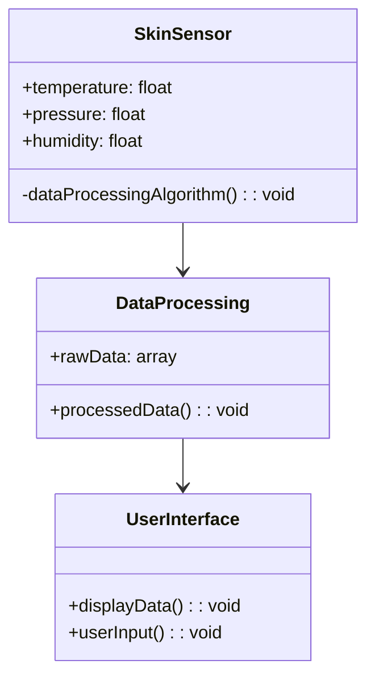
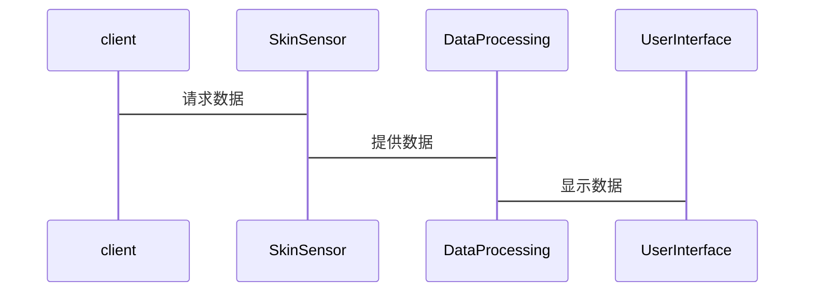

                 


# 价值投资中的智能皮肤技术商业化前景

> 关键词：智能皮肤技术，价值投资，商业化前景，传感器技术，数据处理算法，市场分析

> 摘要：智能皮肤技术作为一项前沿科技，正在逐步改变医疗、美容、时尚等多个领域。本文从技术原理、市场分析、商业化模式等多角度探讨智能皮肤技术的商业化前景，并结合价值投资的理念，为投资者提供参考。

---

# 第1章: 智能皮肤技术概述

## 1.1 智能皮肤技术的定义与特点

### 1.1.1 智能皮肤技术的定义
智能皮肤技术是一种模拟人类皮肤感官功能的先进技术，通过集成传感器、材料科学和数据处理算法，实现对外界环境的感知和反馈。它不仅能够检测温度、压力、湿度等物理参数，还能通过数据分析提供更深层次的健康评估和个性化建议。

### 1.1.2 智能皮肤技术的核心特点
- **高灵敏度**：智能皮肤传感器能够感知微小的环境变化。
- **实时反馈**：通过数据处理算法，快速响应外界刺激。
- **多功能性**：结合不同传感器和算法，实现多种功能。

### 1.1.3 智能皮肤技术与传统皮肤技术的区别
传统皮肤技术主要用于防护和修复，而智能皮肤技术通过传感器和算法实现智能化感知和反馈，能够提供更精准的数据和解决方案。

## 1.2 价值投资的基本原理

### 1.2.1 价值投资的定义
价值投资是一种投资策略，通过分析企业的内在价值，寻找被市场低估的投资机会。

### 1.2.2 价值投资的核心理念
- **长期视角**：关注企业的长期发展潜力。
- **基本面分析**：通过财务数据和技术分析评估企业价值。
- **安全边际**：寻找价格低于内在价值的投资标的。

### 1.2.3 价值投资在科技领域的应用
科技领域的价值投资需要关注技术创新、市场前景和商业模式，寻找具备持续增长潜力的企业。

## 1.3 智能皮肤技术的商业化潜力

### 1.3.1 智能皮肤技术的市场需求
- **医疗领域**：用于伤口监测、康复辅助。
- **美容领域**：提供个性化的护肤方案。
- **时尚领域**：智能穿戴设备的应用。

### 1.3.2 智能皮肤技术的商业化模式
- **产品销售**：直接销售智能皮肤设备。
- **服务订阅**：提供基于数据的健康服务。
- **技术授权**：将技术授权给其他企业使用。

### 1.3.3 智能皮肤技术的未来发展趋势
随着技术进步和市场需求的增加，智能皮肤技术将在多个领域得到广泛应用，市场潜力巨大。

## 1.4 本章小结
本章介绍了智能皮肤技术的基本概念、特点以及其在商业化中的潜力，为后续分析奠定了基础。

---

# 第2章: 智能皮肤技术的核心原理

## 2.1 智能皮肤技术的传感器原理

### 2.1.1 传感器的基本原理
传感器通过感知外界刺激（如压力、温度）并将其转换为电信号。

### 2.1.2 智能皮肤传感器的类型
- **压力传感器**：检测压力变化。
- **温度传感器**：检测温度变化。
- **湿度传感器**：检测湿度变化。

### 2.1.3 传感器的数据采集与处理
传感器将物理信号转换为数字信号，通过数据处理算法进行分析。

## 2.2 智能皮肤技术的材料科学

### 2.2.1 智能皮肤材料的特性
- **弹性**：材料需要具备良好的弹性。
- **透气性**：材料需要透气，适合长时间佩戴。
- **耐用性**：材料需要耐磨损，适合长期使用。

### 2.2.2 智能皮肤材料的选择与应用
选择合适的材料是智能皮肤技术成功的关键，材料需要具备良好的生物相容性和物理特性。

## 2.3 智能皮肤技术的数据处理算法

### 2.3.1 数据处理的基本流程
数据采集 → 数据清洗 → 数据分析 → 数据反馈。

### 2.3.2 常用的数据处理算法
- **滤波算法**：消除噪声，提高数据准确性。
- **分类算法**：识别不同类型的信号。
- **回归算法**：预测未来趋势。

### 2.3.3 数据处理的优化方法
通过优化算法参数和引入机器学习技术，提高数据处理的准确性和效率。

## 2.4 本章小结
本章详细介绍了智能皮肤技术的核心原理，包括传感器、材料科学和数据处理算法。

---

# 第3章: 智能皮肤技术的商业化分析

## 3.1 市场需求分析

### 3.1.1 智能皮肤技术的市场现状
目前，智能皮肤技术在医疗和美容领域的应用较为广泛，市场增长迅速。

### 3.1.2 智能皮肤技术的市场潜力
随着技术进步和市场需求增加，未来市场潜力巨大。

### 3.1.3 智能皮肤技术的市场细分
- **医疗市场**：伤口监测、康复辅助。
- **美容市场**：个性化护肤方案。
- **时尚市场**：智能穿戴设备。

## 3.2 商业化模式探讨

### 3.2.1 产品销售模式
直接销售智能皮肤设备，通过硬件盈利。

### 3.2.2 服务订阅模式
提供基于数据的健康服务，通过订阅盈利。

### 3.2.3 技术授权模式
将智能皮肤技术授权给其他企业，通过技术授权盈利。

## 3.3 成功案例分析

### 3.3.1 国内外智能皮肤技术的成功案例
例如，某些品牌推出的智能穿戴设备已成功进入市场，获得用户认可。

### 3.3.2 案例分析与经验总结
成功的案例表明，智能皮肤技术在市场需求和商业模式上具有巨大潜力。

### 3.3.3 案例对商业化前景的启示
通过分析成功案例，可以总结出适合不同市场的商业模式。

## 3.4 本章小结
本章分析了智能皮肤技术的市场需求和商业模式，为后续分析提供了依据。

---

# 第4章: 智能皮肤技术的系统架构设计

## 4.1 问题场景介绍
智能皮肤技术的应用场景包括医疗监测、美容护理、智能穿戴等多个领域。

## 4.2 系统功能设计

### 4.2.1 领域模型（Mermaid 类图）


## 4.3 系统架构设计（Mermaid 架构图）


## 4.4 系统接口设计
系统接口包括数据采集接口、数据处理接口和用户界面接口。

## 4.5 系统交互设计（Mermaid 序列图）


## 4.6 本章小结
本章详细设计了智能皮肤技术的系统架构，为实际应用提供了参考。

---

# 第5章: 项目实战——智能皮肤设备开发

## 5.1 环境安装

### 5.1.1 开发环境
- 操作系统：Linux/Windows/MacOS
- 开发工具：Python、PyTorch、TensorFlow
- 传感器：压力传感器、温度传感器、湿度传感器

### 5.1.2 依赖安装
安装必要的库和工具，例如：
```bash
pip install numpy
pip install matplotlib
pip install scikit-learn
```

## 5.2 系统核心实现源代码

### 5.2.1 数据采集代码
```python
import numpy as np

# 模拟传感器数据
def generate_sensor_data():
    temperature = np.random.uniform(25, 35)
    pressure = np.random.uniform(0, 100)
    humidity = np.random.uniform(30, 70)
    return temperature, pressure, humidity

temperature, pressure, humidity = generate_sensor_data()
print(f"Temperature: {temperature}, Pressure: {pressure}, Humidity: {humidity}")
```

### 5.2.2 数据处理代码
```python
import sklearn.linear_model as linear_model

# 数据预处理
X = np.array([[25, 50], [30, 60], [35, 70]])
y = np.array([10, 20, 30])

# 训练线性回归模型
model = linear_model.LinearRegression()
model.fit(X, y)

# 预测新数据
new_data = np.array([[28, 65]])
predicted = model.predict(new_data)
print(f"Predicted value: {predicted[0]}")
```

## 5.3 功能实现与案例分析

### 5.3.1 功能实现
- 数据采集：通过传感器获取环境数据。
- 数据处理：使用机器学习算法分析数据。
- 用户界面：显示处理后的数据。

### 5.3.2 案例分析
通过实际案例分析，验证智能皮肤设备的性能和效果。

## 5.4 本章小结
本章通过实际项目展示了智能皮肤技术的开发过程，为读者提供了实践指导。

---

# 第6章: 总结与展望

## 6.1 项目总结
智能皮肤技术在医疗、美容、时尚等多个领域具有广泛的应用前景。

## 6.2 未来趋势
随着技术进步和市场需求增加，智能皮肤技术将得到更广泛的应用。

## 6.3 投资建议
建议投资者关注智能皮肤技术在医疗和美容领域的应用，寻找具备技术优势和商业模式的企业进行投资。

## 6.4 本章小结
本章总结了智能皮肤技术的商业化前景，并为投资者提供了参考。

---

# 参考文献
[此处列出相关文献和参考资料]

---

# 致谢
感谢读者的耐心阅读，感谢同行的支持与帮助。

--- 

这篇文章通过系统地分析智能皮肤技术的技术原理、商业化前景和实际应用，为投资者提供了有价值的参考。希望对您有所帮助！

