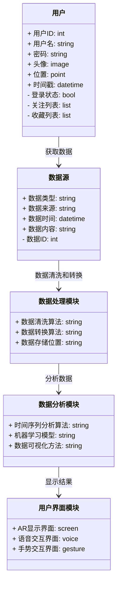
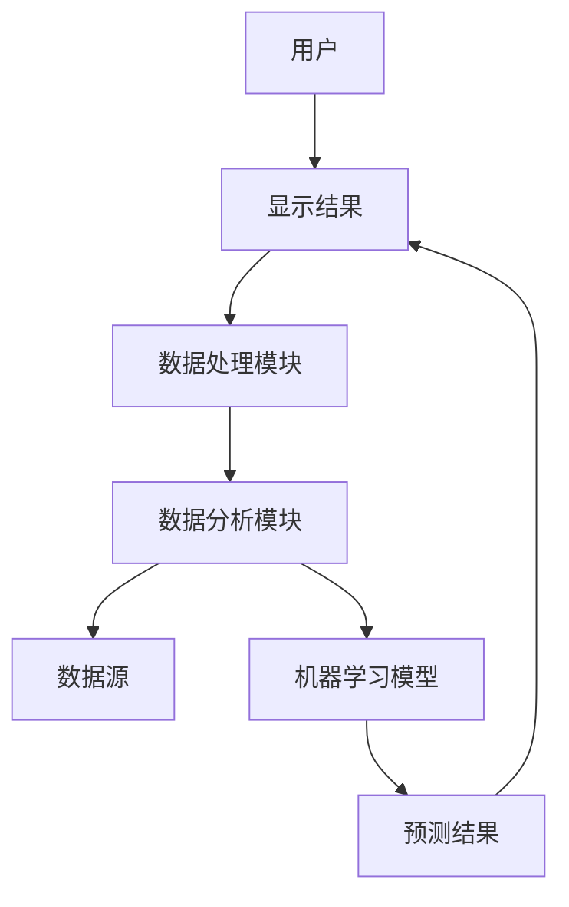
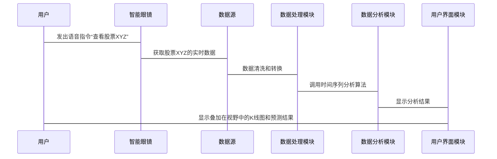

                 


```markdown
# 价值投资中的智能眼镜技术发展前景

> 关键词：智能眼镜、价值投资、AR技术、数据分析、投资决策

> 摘要：本文探讨了智能眼镜技术在价值投资中的应用前景，分析了智能眼镜的核心技术、算法原理以及系统架构，结合实际案例，详细阐述了智能眼镜在金融数据可视化、投资决策支持和交易执行中的潜在价值。

---

## 第一部分: 智能眼镜技术与价值投资的背景介绍

### 第1章: 智能眼镜技术的发展现状

#### 1.1 智能眼镜的基本概念

##### 1.1.1 智能眼镜的定义
智能眼镜是一种结合了增强现实（AR）技术、传感器技术和人工智能（AI）技术的 wearable device，能够通过透明显示屏、语音交互、手势识别等方式，为用户提供实时信息和智能化服务。

##### 1.1.2 智能眼镜的核心技术
- **增强现实（AR）技术**：通过在现实环境中叠加虚拟信息，帮助用户更直观地获取数据。
- **传感器技术**：包括加速度计、陀螺仪、距离传感器等，用于捕捉用户的环境和动作数据。
- **人工智能（AI）技术**：用于数据处理、模式识别和智能决策支持。

##### 1.1.3 智能眼镜的市场现状
近年来，智能眼镜市场迅速发展，主要应用于消费电子、医疗、教育、军事等领域。随着技术的进步，智能眼镜在金融领域的应用逐渐受到关注。

#### 1.2 价值投资的基本概念

##### 1.2.1 价值投资的定义
价值投资是一种投资策略，强调以低于内在价值的价格买入优质资产，长期持有，等待其价值回归。

##### 1.2.2 价值投资的核心理念
- 重视基本面分析，关注企业的财务状况、行业地位和竞争优势。
- 避免短期市场波动，追求长期稳定的收益。

##### 1.2.3 智能眼镜技术与价值投资的结合
智能眼镜可以通过实时数据可视化、语音交互等方式，辅助投资者进行基本面分析、市场趋势预测和投资决策。

---

### 第2章: 智能眼镜技术在价值投资中的应用前景

#### 2.1 智能眼镜技术在金融领域的潜力

##### 2.1.1 智能眼镜在金融数据可视化中的应用
- 通过AR技术，将股票、指数、行业分析等数据实时叠加在用户视野中，帮助投资者快速获取关键信息。
- 示例：用户通过智能眼镜查看某公司的财务报表，同时叠加行业对比数据和分析师评级。

##### 2.1.2 智能眼镜在投资决策支持中的作用
- 提供实时市场数据、新闻 alerts 和投资建议。
- 通过语音交互，投资者可以随时随地查询数据、分析报告和投资策略。

##### 2.1.3 智能眼镜在金融交易中的创新应用
- 实现手势识别，投资者可以通过手势快速下单、查看仓位和调整头寸。
- 结合AI技术，智能眼镜可以预测市场趋势并提供交易信号。

#### 2.2 智能眼镜技术与价值投资的结合方式

##### 2.2.1 数据采集与分析
- 智能眼镜可以采集用户的视觉、听觉和环境数据，结合AI算法进行分析，帮助投资者识别市场机会和风险。

##### 2.2.2 投资决策支持
- 通过实时数据分析和预测模型，智能眼镜可以为投资者提供个性化的投资建议和风险提示。

##### 2.2.3 交易执行与监控
- 智能眼镜可以实现语音指令下单，同时实时监控交易头寸和市场动态，帮助投资者优化交易策略。

---

## 第二部分: 智能眼镜技术的核心概念与联系

### 第3章: 智能眼镜技术的核心原理

#### 3.1 增强现实（AR）技术

##### 3.1.1 AR技术的基本原理
AR通过将虚拟信息叠加在真实环境中，用户可以通过智能眼镜的屏幕看到叠加的图形、文字和视频。

##### 3.1.2 AR技术在价值投资中的应用
- 用于实时显示股票价格、K线图和行业分析数据。
- 示例：用户在查看某公司新闻时，智能眼镜会在其视野中叠加该公司的财务数据和行业排名。

#### 3.2 传感器技术

##### 3.2.1 传感器的基本原理
传感器用于捕捉用户和环境的物理数据，如加速度、位置、温度等。

##### 3.2.2 传感器技术在价值投资中的应用
- 用于手势识别，投资者可以通过手势操作智能眼镜。
- 示例：投资者可以通过手势快速切换不同的数据视图或调出分析报告。

#### 3.3 人工智能（AI）技术

##### 3.3.1 AI技术的基本原理
AI通过机器学习、自然语言处理和计算机视觉等技术，帮助智能眼镜实现数据分析和智能决策。

##### 3.3.2 AI技术在价值投资中的应用
- 用于预测市场趋势和识别投资机会。
- 示例：智能眼镜通过AI算法分析历史数据，预测某只股票的未来走势。

---

### 第4章: 价值投资中的智能眼镜技术系统分析与架构设计

#### 4.1 系统分析

##### 4.1.1 问题场景介绍
- 投资者需要在移动场景中快速获取数据、分析信息并做出决策。
- 传统投资工具（如电脑、手机）在移动场景中使用不便，无法满足投资者的实时需求。

##### 4.1.2 项目介绍
- 开发一个基于智能眼镜的投资决策支持系统，帮助投资者实现随时随地的投资分析和决策。

##### 4.1.3 系统功能设计
- 数据采集与处理：实时获取市场数据、新闻和分析报告。
- 数据分析与预测：通过AI算法预测市场趋势和投资机会。
- 用户交互：通过语音和手势实现人机交互。

#### 4.2 系统架构设计

##### 4.2.1 领域模型设计（Mermaid类图）


##### 4.2.2 系统架构设计（Mermaid架构图）


##### 4.2.3 系统接口设计
- 用户接口：语音指令、手势识别、触控操作。
- 数据接口：实时市场数据接口、历史数据分析接口、新闻数据接口。
- 第三方服务接口：云存储、AI算法服务、数据可视化服务。

##### 4.2.4 系统交互设计（Mermaid序列图）


---

## 第三部分: 智能眼镜技术的算法原理

### 第5章: 时间序列分析算法

#### 5.1 时间序列分析的基本原理
时间序列分析是一种用于预测未来数据的方法，通过分析过去的数据模式，预测未来趋势。

##### 5.1.1 时间序列分析的数学模型
```latex
$$ARIMA(p, d, q) = 0 - \phi_1 ARIMA(p, d, q) = 0$$
```

##### 5.1.2 时间序列分析的应用
- 预测股票价格走势
- 分析市场波动率

#### 5.2 机器学习算法

##### 5.2.1 机器学习的基本原理
机器学习通过训练数据，建立模型进行预测或分类。

##### 5.2.2 常见机器学习算法在价值投资中的应用
- **LSTM**：用于时间序列预测
- **CNN**：用于图像识别和模式识别

##### 5.2.3 机器学习算法的实现
```python
import numpy as np
from tensorflow.keras.models import Sequential
from tensorflow.keras.layers import LSTM, Dense

# 示例：LSTM预测股票价格
model = Sequential()
model.add(LSTM(64, input_shape=(timesteps, features)))
model.add(Dense(1))
model.compile(loss='mean_squared_error', optimizer='adam')
model.fit(X_train, y_train, epochs=100, batch_size=32)
```

---

## 第四部分: 智能眼镜技术的项目实战

### 第6章: 项目实战

#### 6.1 环境安装
- 安装Python和相关库（如TensorFlow、Keras、Mermaid、LaTeX）
- 安装智能眼镜开发工具

#### 6.2 核心代码实现

##### 6.2.1 时间序列分析代码
```python
import numpy as np
import pandas as pd
from sklearn.metrics import mean_squared_error
from keras.models import Sequential
from keras.layers import LSTM, Dense

# 示例：使用LSTM预测股票价格
data = pd.read_csv('stock_data.csv')
train_data = data.iloc[:800, 1]
test_data = data.iloc[800:, 1]
```

##### 6.2.2 机器学习模型代码
```python
from sklearn.preprocessing import MinMaxScaler
import numpy as np

# 示例：使用LSTM预测股票价格
scaler = MinMaxScaler()
train_data_scaled = scaler.fit_transform(train_data.reshape(-1, 1))
test_data_scaled = scaler.transform(test_data.reshape(-1, 1))

X_train = train_data_scaled[:-1]
y_train = train_data_scaled[1:]
X_test = test_data_scaled[:-1]
y_test = test_data_scaled[1:]

# LSTM模型
model = Sequential()
model.add(LSTM(50, input_shape=(1, 1)))
model.add(Dense(1))
model.compile(loss='mean_squared_error', optimizer='adam')
model.fit(X_train, y_train, epochs=100, batch_size=32)
```

##### 6.2.3 系统交互设计
```python
# 示例：语音交互实现
import speech_recognition as sr

r = sr.Recognizer()
mic = sr.Microphone()

def recognize_speech():
    with mic as source:
        r.adjust_for_noise(source)
        audio = r.listen(source)
        return r.recognize_google(audio)
```

---

## 第五部分: 最佳实践与总结

### 第7章: 最佳实践与总结

#### 7.1 最佳实践
- 定期更新模型和数据源
- 优化系统交互体验
- 加强数据隐私保护

#### 7.2 小结
智能眼镜技术在价值投资中的应用前景广阔，通过实时数据可视化、智能决策支持和便捷的交互方式，投资者可以更高效地进行投资分析和决策。

#### 7.3 注意事项
- 数据的实时性和准确性是关键
- 系统的安全性和稳定性需要高度重视
- 投资者需要接受相应的技术培训

#### 7.4 拓展阅读
- 《智能眼镜技术与投资》
- 《时间序列分析在金融中的应用》
- 《机器学习在股票预测中的实践》

---

## 结语
随着智能眼镜技术的不断进步，其在价值投资中的应用将更加广泛和深入。通过实时数据的可视化、智能决策支持和便捷的交互方式，智能眼镜将为投资者提供更高效、更精准的投资工具，帮助他们在复杂多变的市场中把握机会、规避风险。

---

# END
```

