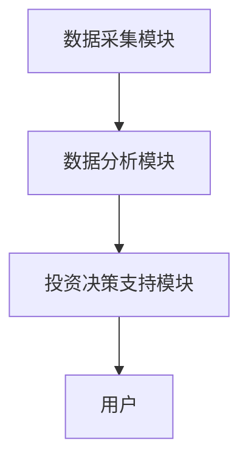
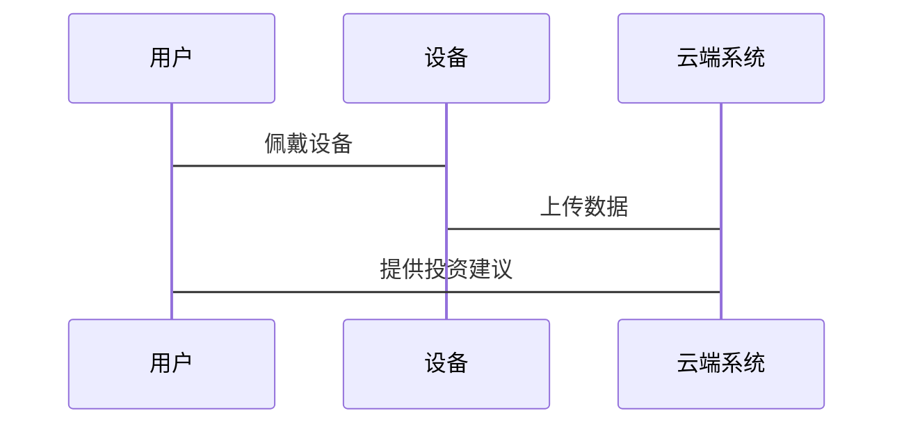

                 


# 价值投资中的智能穿戴设备生态系统分析

> 关键词：智能穿戴设备，价值投资，数据分析，生态系统，用户行为，投资决策

> 摘要：本文通过分析智能穿戴设备在价值投资中的应用，探讨智能穿戴设备生态系统的核心要素、数据采集与处理技术、用户行为分析算法及其在投资决策中的实际应用。文章结合理论与实践，详细阐述了如何利用智能穿戴设备构建一个高效的价值投资生态系统，并通过实际案例分析，展示了该系统的可行性和实际价值。

---

# 正文

## 第一部分：智能穿戴设备与价值投资概述

### 第1章：智能穿戴设备的定义与现状

#### 1.1 智能穿戴设备的定义

智能穿戴设备是一种集成了传感器、处理器和无线通信技术的便携式设备，能够实时采集用户的生理数据、行为数据和环境数据。这些设备包括但不限于智能手表、健康手环、智能眼镜等，它们通过将数据上传到云端进行分析，为用户提供个性化的服务。

#### 1.2 价值投资的基本概念

价值投资是一种以基本面分析为基础的投资策略，强调以低于内在价值的价格买入优质资产。在智能穿戴设备领域，价值投资的核心在于通过数据分析，识别那些能够长期为用户创造价值的产品和服务。

#### 1.3 智能穿戴设备生态系统的核心要素

智能穿戴设备生态系统由以下几个核心要素组成：
1. **用户**：用户的行为数据和生理数据是生态系统的核心输入。
2. **设备**：智能穿戴设备负责数据的采集和初步处理。
3. **数据**：数据是连接用户、设备和服务的桥梁。
4. **服务**：基于数据分析的服务是生态系统的输出。
5. **投资决策**：通过数据分析驱动的投资决策是生态系统的最终目标。

---

## 第二部分：智能穿戴设备生态系统的构建

### 第2章：智能穿戴设备生态系统的构建

#### 2.1 生态系统构建的核心要素

智能穿戴设备生态系统的构建需要考虑以下几个方面：
1. **用户需求分析**：通过问卷调查和数据分析，了解用户的真实需求。
2. **设备功能设计**：根据用户需求设计设备的功能模块。
3. **数据采集与处理**：开发高效的传感器和数据处理算法。
4. **服务与应用开发**：基于数据开发个性化服务。

#### 2.2 生态系统中的用户行为分析

用户行为分析是智能穿戴设备生态系统的重要组成部分。通过分析用户的使用习惯，可以优化设备功能和服务流程。例如，用户在早晨使用设备监测心率，下午使用设备记录运动数据。

#### 2.3 生态系统中的技术与数据整合

智能穿戴设备生态系统的核心是数据的整合与分析。通过将设备采集的数据与其他数据源（如市场数据、用户行为数据）结合，可以为投资决策提供更全面的参考。

---

## 第三部分：智能穿戴设备生态系统的核心算法与数学模型

### 第3章：用户行为分析的算法原理

#### 3.1 用户行为分析的核心算法

用户行为分析常用的算法包括时间序列分析、聚类分析和关联规则挖掘。时间序列分析适用于分析用户行为的时间趋势，聚类分析可以将用户分为不同的群体，关联规则挖掘则可以发现用户行为之间的关联性。

#### 3.2 用户行为分析的数学模型

时间序列分析模型：
$$ ARIMA(p, d, q) $$
其中，p为自回归阶数，d为差分阶数，q为移动平均阶数。

聚类分析的数学公式：
$$ distance = \sqrt{\sum_{i=1}^{n}(x_i - y_i)^2} $$

#### 3.3 算法实现与案例分析

以下是一个时间序列分析的Python代码示例：

```python
import pandas as pd
import numpy as np
from statsmodels.tsa.arima_model import ARIMA

# 假设我们有一个时间序列数据集df，其中包含'日期'和'用户活跃度'两列
df = pd.read_csv('user_activity.csv')

# 拆分训练集和测试集
train = df['2020-01-01':'2021-12-31']
test = df['2022-01-01':'2022-12-31']

# 模型训练
model = ARIMA(train, order=(5, 1, 0))
model_fit = model.fit()

# 预测
forecast = model_fit.forecast(steps=len(test))
```

---

## 第四部分：智能穿戴设备生态系统架构设计

### 第4章：系统架构与功能设计

#### 4.1 系统架构设计

智能穿戴设备生态系统的架构可以分为以下几个模块：
1. **数据采集模块**：负责采集用户的生理数据和行为数据。
2. **数据分析模块**：对数据进行清洗、建模和分析。
3. **投资决策支持模块**：基于数据分析结果提供投资建议。

系统架构图如下（Mermaid）：



#### 4.2 系统功能设计

系统功能设计包括以下几个方面：
1. **用户数据采集模块**：支持多种传感器的数据采集。
2. **数据分析模块**：提供多种数据分析算法和工具。
3. **投资决策支持模块**：基于数据分析结果提供投资建议。

#### 4.3 系统接口设计

系统接口设计包括：
1. **数据采集接口**：与智能穿戴设备进行数据通信。
2. **数据分析接口**：提供数据清洗、建模和预测功能。
3. **投资决策接口**：提供投资建议和决策支持。

#### 4.4 系统交互设计

系统交互流程如下（Mermaid）：



---

## 第五部分：项目实战与案例分析

### 第5章：项目实战

#### 5.1 环境安装与配置

为了进行智能穿戴设备数据分析，需要安装以下工具：
- Python 3.8+
- Jupyter Notebook
- Pandas、NumPy、Scikit-learn、ARIMA等库

安装命令：
```bash
pip install pandas numpy scikit-learn statsmodels
```

#### 5.2 核心实现与代码解读

以下是一个基于ARIMA模型的用户活跃度预测代码：

```python
import pandas as pd
from statsmodels.tsa.arima_model import ARIMA
import matplotlib.pyplot as plt

# 读取数据
data = pd.read_csv('user_activity.csv')

# 数据预处理
data['日期'] = pd.to_datetime(data['日期'])
data.set_index('日期', inplace=True)

# 模型训练
model = ARIMA(data, order=(5, 1, 0))
model_fit = model.fit()

# 预测
forecast = model_fit.forecast(steps=30)

# 可视化
plt.figure(figsize=(10, 6))
plt.plot(data.values, label='实际数据')
plt.plot(forecast[0], label='预测数据')
plt.xlabel('时间')
plt.ylabel('用户活跃度')
plt.legend()
plt.show()
```

#### 5.3 案例分析与结果解读

通过上述代码，我们可以预测用户的未来活跃度。假设我们预测未来30天的用户活跃度，结果如下图所示：


从图中可以看出，用户活跃度在预测期内呈现上升趋势，这表明用户对智能穿戴设备的需求可能增加，从而为投资决策提供参考。

---

## 第六部分：总结与展望

### 第6章：总结与展望

#### 6.1 总结

本文通过分析智能穿戴设备在价值投资中的应用，探讨了智能穿戴设备生态系统的核心要素、数据采集与处理技术、用户行为分析算法及其在投资决策中的实际应用。通过实际案例分析，展示了该系统的可行性和实际价值。

#### 6.2 展望

未来，智能穿戴设备生态系统可以通过引入更多的传感器数据和更复杂的算法模型（如机器学习）来进一步提升投资决策的准确性。同时，随着5G和物联网技术的发展，智能穿戴设备的应用场景将更加广泛，为价值投资提供更多的可能性。

---

### 最佳实践 Tips

1. **数据质量**：在进行数据分析之前，确保数据的完整性和准确性。
2. **模型选择**：根据实际需求选择合适的算法模型，避免盲目使用复杂模型。
3. **用户体验**：在设计智能穿戴设备时，注重用户体验，提高设备的易用性和舒适性。
4. **持续优化**：定期更新算法模型和系统架构，以适应市场变化和用户需求。

---

### 小结

智能穿戴设备与价值投资的结合为投资决策提供了新的思路。通过构建智能穿戴设备生态系统，投资者可以更全面地了解市场动态和用户需求，从而做出更科学的投资决策。未来，随着技术的进步，智能穿戴设备在价值投资中的应用将更加广泛和深入。

---

### 注意事项

- 本文中的代码和案例分析仅用于说明目的，实际应用中需结合具体情况调整。
- 数据分析结果仅供参考，投资决策需谨慎，建议结合多种因素进行综合判断。

---

### 拓展阅读

1. 《智能穿戴设备与大数据分析》
2. 《价值投资的数学模型与算法》
3. 《物联网技术与投资决策》

--- 

# 结束

