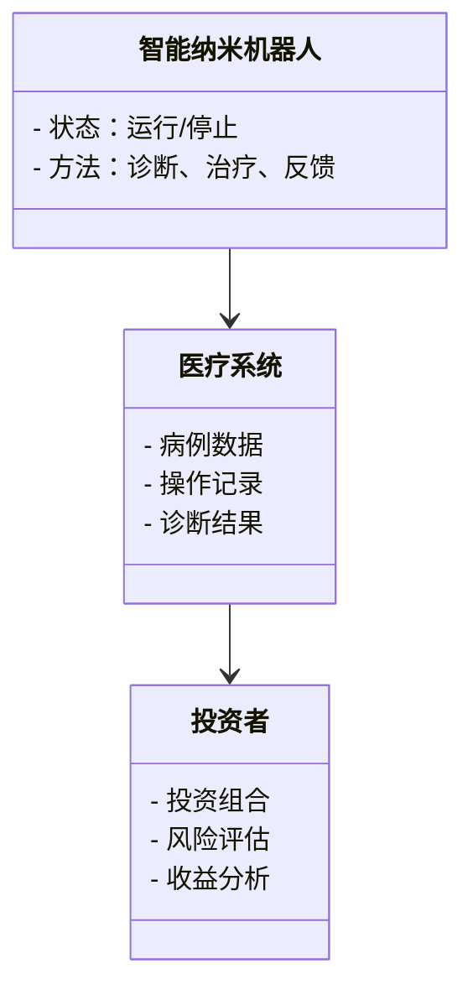

                 


# 价值投资中的智能纳米机器人医疗应用分析

## 关键词
- 价值投资
- 智能纳米机器人
- 医疗应用
- 人工智能
- 纳米技术

## 摘要
随着科技的飞速发展，智能纳米机器人在医疗领域的应用日益广泛。本文将探讨如何通过价值投资的方法，评估和选择在医疗领域具有潜力的智能纳米机器人技术。我们将从智能纳米机器人的技术原理、价值投资的数学模型、医疗数据分析的算法，到系统架构设计和项目实战，全面分析这一领域的投资机会和挑战。通过实际案例和代码实现，帮助读者理解如何将智能纳米机器人与价值投资相结合，为医疗行业带来革命性的变化。

---

## 第一章：背景介绍

### 1.1 智能纳米机器人与价值投资的核心概念
#### 1.1.1 价值投资的定义与历史发展
价值投资是一种以低于内在价值的价格购买优质资产的投资策略，其核心在于识别那些具有长期竞争优势和良好治理结构的企业。这种投资方法强调基本面分析，注重企业的盈利能力、财务健康和行业地位。

#### 1.1.2 智能纳米机器人的定义与技术特征
智能纳米机器人是指能够在微观尺度（纳米级别）执行特定任务的微型机器人，通常具备以下技术特征：
- **智能化**：能够感知环境并自主决策。
- **微型化**：尺寸通常在纳米级别。
- **多功能性**：可执行诊断、治疗等多种医疗任务。

#### 1.1.3 医疗领域的智能纳米机器人应用背景
智能纳米机器人在医疗领域的应用前景广阔，特别是在疾病诊断、精准治疗和术后康复等方面展现出巨大潜力。然而，其高昂的研发成本和复杂的技术壁垒也带来了较高的投资风险。

### 1.2 医疗领域中的价值投资机会
#### 1.2.1 医疗行业的投资现状与趋势
医疗行业作为朝阳产业，近年来吸引了大量资本。智能纳米机器人作为医疗技术的重要组成部分，正逐渐成为投资者关注的焦点。

#### 1.2.2 智能纳米机器人在医疗中的潜在价值
智能纳米机器人能够提高医疗效率、降低治疗成本，并为患者提供更加精准的医疗服务。这些优势使其成为医疗领域的重要投资方向。

#### 1.2.3 价值投资与技术创新的结合
通过价值投资的方法，投资者可以识别那些在智能纳米机器人技术上具备竞争优势的企业，并长期持有，以获取超额收益。

---

## 第二章：智能纳米机器人与价值投资的核心概念

### 2.1 智能纳米机器人的技术原理
#### 2.1.1 纳米机器人的基本结构与功能
智能纳米机器人通常由驱动单元、感知单元和控制单元组成。驱动单元负责机器人的运动，感知单元负责收集环境信息，控制单元负责处理数据并发出指令。

#### 2.1.2 医疗应用中的关键性能指标
- **精度**：纳米机器人在医疗操作中的精确度直接影响治疗效果。
- **稳定性**：机器人在复杂环境中的稳定运行能力。
- **可扩展性**：机器人是否能够适应不同的医疗应用场景。

### 2.2 价值投资的数学模型与分析方法
#### 2.2.1 价值投资的DCF模型
DCF（Discounted Cash Flow）模型通过预测企业的未来现金流，将其折现为现值，以评估企业的内在价值。

#### 2.2.2 智能纳米机器人企业的估值方法
对于智能纳米机器人企业，投资者需要考虑其技术壁垒、市场前景和财务状况。常用的估值方法包括市盈率、市净率和EV/EBITDA等。

#### 2.2.3 投资回报率与风险评估
智能纳米机器人项目的投资回报率受技术研发周期、市场接受度和政策环境等因素影响。投资者需要通过全面分析，评估项目的潜在风险和收益。

---

## 第三章：智能纳米机器人医疗应用的算法分析

### 3.1 医疗数据分析的机器学习算法
#### 3.1.1 支持向量机（SVM）在疾病诊断中的应用
支持向量机是一种监督学习算法，常用于分类问题。在医疗领域，SVM可用于疾病的早期诊断和患者分类。

#### 3.1.2 神经网络在医疗影像分析中的应用
深度学习算法，如卷积神经网络（CNN），在医疗影像分析中表现出色，能够帮助医生更准确地识别疾病。

### 3.2 价值投资的预测模型
#### 3.2.1 时间序列分析在股票预测中的应用
时间序列分析是一种用于预测未来数据的方法。通过分析历史股价数据，投资者可以预测未来的价格走势。

#### 3.2.2 随机森林在企业估值中的应用
随机森林是一种基于树的集成算法，常用于分类和回归问题。在企业估值中，随机森林可用于预测企业的未来表现。

---

## 第四章：智能纳米机器人医疗应用的系统架构设计

### 4.1 系统应用场景介绍
智能纳米机器人医疗系统通常应用于医院、诊所和科研机构。应用场景包括疾病诊断、精准治疗和术后康复。

### 4.2 系统功能设计
#### 4.2.1 领域模型类图


---

## 第五章：项目实战

### 5.1 环境安装与配置
#### 5.1.1 Python环境安装
使用Anaconda安装Python 3.8及以上版本。

#### 5.1.2 依赖库安装
安装必要的库，如numpy、pandas、scikit-learn和mermaid。

### 5.2 核心功能实现
#### 5.2.1 医疗数据分析
```python
import numpy as np
import pandas as pd
from sklearn.svm import SVC

# 加载数据
data = pd.read_csv('medical_data.csv')

# 数据预处理
X = data.drop('target', axis=1)
y = data['target']

# 训练模型
model = SVC()
model.fit(X, y)

# 预测
predictions = model.predict(X)
```

#### 5.2.2 价值投资模型实现
```python
import numpy as np
from sklearn.ensemble import RandomForestRegressor

# 加载数据
data = pd.read_csv('stock_data.csv')

# 数据预处理
X = data.drop('target', axis=1)
y = data['target']

# 训练模型
model = RandomForestRegressor()
model.fit(X, y)

# 预测
predictions = model.predict(X)
```

### 5.3 实际案例分析
以某智能纳米机器人公司为例，分析其财务数据和市场表现，评估其投资价值。

---

## 第六章：最佳实践与总结

### 6.1 小结
智能纳米机器人在医疗领域的应用潜力巨大，但其投资需要综合考虑技术、市场和财务等多方面因素。

### 6.2 注意事项
- **技术风险**：智能纳米机器人技术复杂，研发周期长。
- **政策风险**：医疗领域的政策变化可能影响投资回报。
- **市场风险**：市场竞争激烈，需要关注企业的核心竞争力。

### 6.3 拓展阅读
建议进一步阅读《智能医疗：技术创新与投资机会》和《价值投资实战指南》。

---

通过以上分析，我们可以看到，智能纳米机器人医疗应用与价值投资的结合为医疗行业带来了巨大的变革潜力。投资者需要结合技术、市场和财务等多方面因素，才能在这一领域获得长期稳定的收益。

