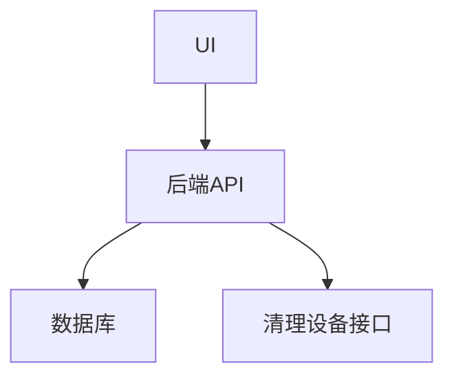

                 


# 价值投资中的海洋塑料污染清理技术前景

## 关键词：价值投资、海洋塑料污染、清理技术、经济模型、系统设计、投资前景、环境影响

## 摘要：  
本文探讨了海洋塑料污染清理技术的前景及其与价值投资的结合。通过对主要清理技术的分析，建立经济模型评估投资潜力，设计系统架构，并通过项目实战验证技术可行性。最后，结合市场与政策因素，提出投资建议，为投资者提供参考。

---

# 目录

1. [背景与概念](#背景与概念)
2. [技术分析](#技术分析)
3. [经济模型与投资潜力分析](#经济模型与投资潜力分析)
4. [系统设计与架构方案](#系统设计与架构方案)
5. [项目实战：化学分解技术案例](#项目实战化学分解技术案例)
6. [投资策略与建议](#投资策略与建议)
7. [总结](#总结)

---

## 第1章：背景与概念

### 1.1 海洋塑料污染的现状

- **现状概述**：海洋塑料污染已成为全球性问题，每年约有800万吨塑料进入海洋，威胁海洋生态平衡。
- **环境影响**：破坏海洋生态系统，影响渔业和旅游业，造成经济损失。
- **社会与经济影响**：健康风险、资源浪费和品牌形象受损。

### 1.2 价值投资的基本概念

- **定义**：寻找被市场低估的高价值股票，注重长期收益。
- **核心原则**：注重内在价值、安全边际和长期持有。
- **技术与投资的关联**：技术进步推动行业变革，价值投资需关注技术创新。

### 1.3 海洋塑料污染清理技术与价值投资的结合

- **技术与投资的关联**：技术创新推动市场变化，价值投资者应关注环保技术的潜力。
- **技术成熟度与市场潜力**：评估技术的商业化能力及其市场前景。
- **投资者角色**：投资者需关注技术创新和政策支持，寻找投资机会。

---

## 第2章：技术分析

### 2.1 物理收集技术

- **原理**：通过机械装置收集海洋塑料。
- **优缺点**：效率高但成本高，适合局部区域清理。

### 2.2 化学分解技术

- **原理**：使用化学反应分解塑料。
- **优缺点**：处理彻底但成本高，适合大规模应用。

### 2.3 生物降解技术

- **原理**：利用微生物分解塑料。
- **优缺点**：环保但周期长，适用于偏远地区。

### 2.4 技术优缺点对比

```mermaid
tablelify
| 技术类型 | 优点 | 缺点 |
|----------|------|------|
| 物理收集 | 成本低、效率高 | 适用范围小、维护成本高 |
| 化学分解 | 处理彻底 | 成本高、技术复杂 |
| 生物降解 | 环保 | 速度慢、技术不成熟 |
```

---

## 第3章：经济模型与投资潜力分析

### 3.1 投资回报模型

- **公式**：$$ ROI = (收益 - 成本) / 成本 $$
- **分析**：考虑技术成本、市场价和回收周期。
- **案例分析**：化学分解技术投资回报率高于物理收集。

### 3.2 市场潜力评估

- **市场规模**：预测未来十年市场规模，考虑政策支持和环保意识。
- **竞争优势**：分析技术壁垒和市场准入难度。

### 3.3 投资风险与机遇

- **风险**：技术失败、政策变化、市场竞争。
- **机遇**：环保需求增长、技术突破带来的收益。

---

## 第4章：系统设计与架构方案

### 4.1 系统功能设计

- **模块**：数据收集、处理、分析、可视化。
- **领域模型**：使用Mermaid类图展示系统各模块交互。

### 4.2 系统架构设计



### 4.3 系统交互设计

- **流程**：用户请求数据，后端处理并反馈结果。
- **序列图**：展示用户、后端和数据库的交互流程。

---

## 第5章：项目实战：化学分解技术案例

### 5.1 项目背景

- **目标**：清理特定海域塑料垃圾。
- **技术选型**：选择化学分解技术。

### 5.2 实现步骤

1. **环境影响分析**：评估技术对环境的影响。
2. **成本计算**：详细计算开发和运营成本。
3. **收益预测**：基于市场需求预测收益。

### 5.3 核心代码实现

```python
def calculate_profit(investment, cost_per_ton, revenue_per_ton, tons_processed):
    return investment + (revenue_per_ton - cost_per_ton) * tons_processed

# 示例计算
investment = 1000000
cost_per_ton = 100
revenue_per_ton = 200
tons_processed = 10000
profit = calculate_profit(investment, cost_per_ton, revenue_per_ton, tons_processed)
print(f"净利润: ${profit}")
```

### 5.4 实际案例分析

- **案例**：某公司化学分解技术的成功案例，详细分析其盈利模式和市场策略。

---

## 第6章：投资策略与建议

### 6.1 市场与政策分析

- **市场潜力**：环保技术需求增长，政策支持推动行业发展。
- **政策影响**：政府补贴、税收优惠和环保法规对企业的影响。

### 6.2 投资建议

- **技术选择**：优先考虑技术成熟、成本低的项目。
- **风险管理**：分散投资、关注政策变化和市场动态。

---

## 第7章：总结

本文探讨了海洋塑料污染清理技术的前景及其与价值投资的结合。通过技术分析、经济模型和系统设计，为投资者提供了参考。未来，随着技术进步和政策支持，海洋塑料污染清理行业将带来更多投资机会。

--- 

感谢您的阅读，希望本文能为您的投资决策提供有价值的参考。

