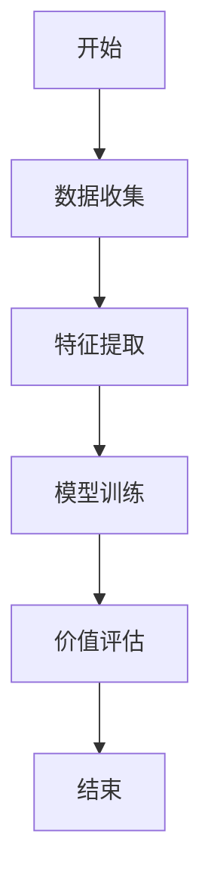
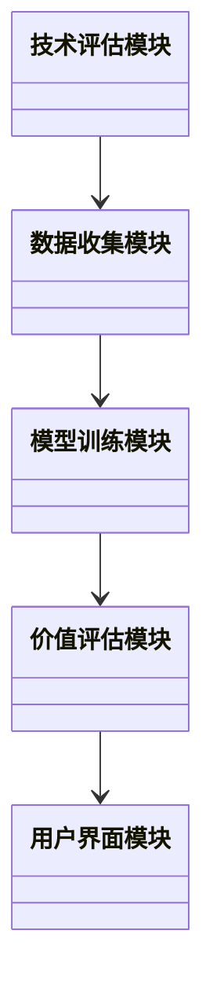
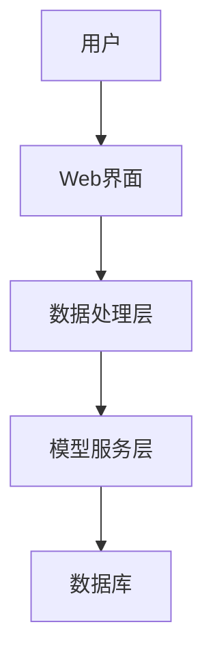

                 


# 价值投资中的海洋微塑料清理技术前景

---

## 关键词：价值投资、海洋微塑料、清理技术、环保科技、技术评估

---

## 摘要：  
本文探讨了在价值投资视角下，海洋微塑料清理技术的市场前景和投资潜力。通过分析技术原理、市场需求和投资策略，揭示了该领域的投资机会和挑战，为投资者提供科学决策依据。

---

## 第1章：引言  

### 1.1 本书的目的与意义  
本书旨在帮助投资者理解海洋微塑料清理技术的市场潜力，并通过价值投资的方法评估其投资价值。  

### 1.2 海洋微塑料问题的背景与重要性  
海洋微塑料污染已成为全球性环境问题，威胁海洋生态系统和人类健康， cleanup技术成为环保领域的焦点。  

### 1.3 价值投资与环保技术的结合  
价值投资关注企业的内在价值，环保技术的市场潜力为投资者提供了新的投资方向。  

---

## 第2章：海洋微塑料清理技术的背景与问题描述  

### 2.1 海洋微塑料的定义与现状  
微塑料指直径小于5毫米的塑料颗粒，广泛存在于海洋中，来源包括工业排放、垃圾处理等。  

### 2.2 微塑料对环境与生态的影响  
微塑料破坏海洋生态系统，影响生物多样性和食物链，威胁人类健康。  

### 2.3 清理技术的必要性与挑战  
现有技术如机械筛选、化学分解等各有优劣，但成本高、效率低，亟需创新解决方案。  

---

## 第3章：价值投资的基本概念与方法  

### 3.1 价值投资的核心理念  
价值投资关注企业的内在价值，寻找被市场低估的投资标的。  

### 3.2 价值投资的分析框架  
包括基本面分析、财务指标、行业趋势等，帮助投资者评估技术的市场潜力。  

### 3.3 环保技术领域的投资机会  
环保技术需求增长，微塑料 cleanup 技术具备市场潜力和政策支持。  

---

## 第4章：海洋微塑料清理技术的核心概念  

### 4.1 清理技术的分类与对比  
- 机械筛选：成本低，但效率有限。  
- 化学分解：高效但可能产生二次污染。  
- 生物降解：环保但技术成熟度低。  

### 4.2 技术的优劣势分析  
表格对比不同技术的成本、效率和环境影响。  

| 技术类型       | 成本 | 效率 | 环境影响 |
|----------------|------|------|----------|
| 机械筛选       | 低   | 低   | 较小     |
| 化学分解       | 中   | 高   | 可能高    |
| 生物降解       | 高   | 中   | 较小     |

### 4.3 技术与市场的关联性  
技术成熟度影响市场需求，市场反馈反过来推动技术改进。  

---

## 第5章：价值投资与技术前景的关联  

### 5.1 技术成熟度与投资价值的关系  
技术成熟度高、市场需求大的技术更具投资价值。  

### 5.2 市场需求与技术潜力的匹配  
环保政策和市场需求推动 cleanup 技术的投资潜力。  

### 5.3 技术壁垒与投资风险的平衡  
高技术壁垒降低竞争风险，但技术开发周期长，投资风险高。  

---

## 第6章：基于价值评估的清理技术预测模型  

### 6.1 算法原理概述  
使用机器学习模型预测技术的市场价值，结合技术属性和市场需求。  

### 6.2 算法流程图  


### 6.3 数学模型与公式  

#### 线性回归模型  
$$ y = \beta_0 + \beta_1x + \epsilon $$  
其中，y为技术价值，x为市场需求，β为系数。  

#### 分类模型  
$$ P(y=1|x) = \frac{e^{\beta x}}{1 + e^{\beta x}} $$  
用于预测技术的市场可行性。  

---

## 第7章：系统分析与架构设计  

### 7.1 问题场景介绍  
构建一个价值评估系统，帮助投资者评估 cleanup 技术的市场潜力。  

### 7.2 系统功能设计（领域模型 Mermaid 类图）  


### 7.3 系统架构设计  


---

## 第8章：项目实战  

### 8.1 环境安装  
安装Python、机器学习库（如Scikit-learn）。  

### 8.2 核心实现代码  
```python
import pandas as pd
from sklearn.linear_model import LinearRegression

# 数据预处理
data = pd.read_csv('data.csv')
X = data[['demand', 'cost']]
y = data['value']

# 模型训练
model = LinearRegression()
model.fit(X, y)

# 预测
new_data = pd.DataFrame({'demand': [100], 'cost': [50]})
predicted_value = model.predict(new_data)
print(predicted_value)
```

### 8.3 案例分析  
分析某企业的技术评估，展示模型的应用和结果解读。  

---

## 第9章：结论与展望  

### 9.1 结论  
海洋微塑料 cleanup 技术具备投资潜力，但需关注技术成熟度和市场需求。  

### 9.2 展望  
未来研究可结合更多因素，如政策支持和技术进步，优化价值评估模型。  

---

## 附录：术语表与数据来源  

### 术语表  
- 价值投资：寻找被低估的投资标的。  
- 微塑料：直径小于5毫米的塑料颗粒。  

### 数据来源  
- 数据来自公开环保报告和市场调研。  

---

通过以上结构，文章系统地分析了价值投资与海洋微塑料 cleanup 技术的结合，为投资者提供了科学的决策参考。

