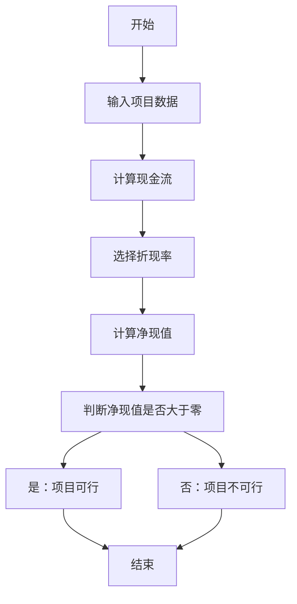
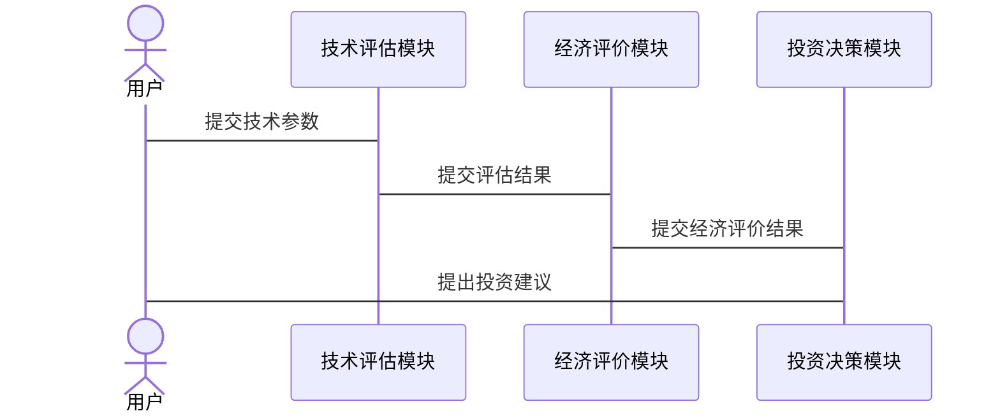

                 


# 价值投资中的海洋能源开发技术前景

## 关键词：海洋能源开发、价值投资、技术前景、经济评价、可持续发展

## 摘要：本文深入分析了海洋能源开发的技术前景及其对价值投资的影响。通过探讨海洋能源开发的核心技术、经济价值、环境影响及投资策略，结合实际案例分析，为投资者提供科学的技术评估和决策依据，助力实现可持续发展下的价值最大化。

---

## 第一部分: 背景介绍

### 第1章: 海洋能源开发的背景与现状

#### 1.1 海洋能源开发的背景
- **1.1.1 海洋能源的定义与分类**
  - 海洋能源是指海洋中蕴藏的能量资源，主要包括潮汐能、洋流能、海浪能和盐差能等。
  - 潮汐能：利用潮汐的涨落产生的能量。
  - 洋流能：利用海水流动产生的能量。
  - 海浪能：利用海浪的运动产生的能量。
  - 盐差能：利用海水盐度差产生的能量。

- **1.1.2 海洋能源开发的历史演变**
  - 早期：古代利用潮汐能进行潮汐发电的尝试。
  - 近代：20世纪中叶，海洋能源技术的初步研究和试验。
  - 现代：21世纪以来，海洋能源技术快速发展，逐步商业化。

- **1.1.3 当前全球能源结构与海洋能源的地位**
  - 全球能源需求持续增长，传统能源面临枯竭和环境问题。
  - 海洋能源作为一种可再生能源，具有清洁、可持续的特点，逐渐成为能源结构的重要组成部分。

#### 1.2 海洋能源开发的技术现状
- **1.2.1 可再生能源技术在海洋能源中的应用**
  - 潮汐能发电技术：如法国朗斯河口潮汐电站。
  - 海浪能发电技术：如英国波浪能试验项目。
  - 洋流能发电技术：如美国的海流能试验项目。

- **1.2.2 海洋能转换技术的发展趋势**
  - 技术创新：新型材料的应用、能量转换效率的提高。
  - 成本下降：随着技术进步，海洋能源的开发成本逐步降低。

- **1.2.3 全球主要国家的海洋能源开发进展**
  - 欧洲：英国、挪威等国家在潮汐能和海浪能开发方面处于领先地位。
  - 亚洲：中国、韩国等国家在海洋能源开发方面投入巨大，技术进步显著。

#### 1.3 海洋能源的经济价值与投资潜力
- **1.3.1 海洋能源的市场价值分析**
  - 随着能源需求增长和环保政策的推动，海洋能源市场价值不断提升。
  - 潮汐能和海浪能的市场潜力巨大。

- **1.3.2 海洋能源开发的经济效益与成本分析**
  - 初期投资大，但随着技术进步，成本逐渐降低。
  - 经济效益显著，尤其是在电价较高的地区。

- **1.3.3 海洋能源投资的风险与机遇**
  - 风险：技术风险、环境风险、政策风险。
  - 机遇：政策支持、技术创新、市场需求增长。

#### 1.4 海洋能源开发的环境影响与可持续性
- **1.4.1 海洋能源开发对环境的影响**
  - 生态影响：海洋能源开发可能对海洋生态系统造成破坏。
  - 环境污染：开发过程中可能产生噪声、振动等环境问题。

- **1.4.2 可持续发展的视角下海洋能源的地位**
  - 海洋能源是实现碳中和目标的重要途径。
  - 可持续发展需要平衡能源开发与环境保护。

- **1.4.3 环境保护与能源开发的平衡**
  - 技术创新是解决环境问题的关键。
  - 环境影响评估是海洋能源开发的重要环节。

---

### 第2章: 价值投资与海洋能源开发的联系

#### 2.1 价值投资的基本概念
- **2.1.1 价值投资的定义与核心理念**
  - 价值投资是一种以基本面分析为基础的投资策略，注重投资标的价值的内在价值。
  - 核心理念：寻找市场价格低于内在价值的投资标的。

- **2.1.2 价值投资与传统投资的区别**
  - 传统投资：基于市场趋势和技术分析。
  - 价值投资：基于基本面分析和内在价值。

- **2.1.3 价值投资在能源领域的应用**
  - 能源行业的周期性波动为价值投资提供了机会。
  - 价值投资者关注能源公司的财务健康状况和长期盈利能力。

#### 2.2 海洋能源开发的技术前景与投资机会
- **2.2.1 海洋能源开发的技术创新趋势**
  - 新型材料的应用：如高性能复合材料在海洋能源设备中的应用。
  - 能量转换效率的提高：新型技术的应用使得海洋能源的转换效率逐步提升。

- **2.2.2 技术进步对投资价值的影响**
  - 技术进步降低了开发成本，提高了项目的盈利能力。
  - 技术进步提升了项目的市场竞争力。

- **2.2.3 技术风险与投资决策的关系**
  - 技术风险是影响项目可行性的重要因素。
  - 投资者需要充分评估技术风险，并采取相应的风险管理措施。

#### 2.3 价值投资视角下的海洋能源开发策略
- **2.3.1 技术评估在价值投资中的作用**
  - 技术评估是价值投资的重要环节。
  - 通过技术评估，投资者可以判断项目的长期盈利能力。

- **2.3.2 项目可行性分析与投资决策**
  - 项目可行性分析是价值投资的基础。
  - 投资者需要综合考虑技术、市场、财务等因素，做出科学的投资决策。

- **2.3.3 技术生命周期对投资策略的影响**
  - 技术生命周期分为引入期、成长期、成熟期和衰退期。
  - 不同阶段的技术对投资策略有不同的影响。

---

## 第二部分: 核心概念与联系

### 第3章: 海洋能源开发的核心技术分析

#### 3.1 海洋能源开发的关键技术
- **3.1.1 潮汐能开发技术**
  - 潮汐能发电技术：如法国朗斯河口潮汐电站。
  - 潮汐能转换技术：将潮汐能转换为电能的技术。

- **3.1.2 洋流能开发技术**
  - 洋流能发电技术：利用海水流动产生的能量发电。
  - 洋流能转换技术：将洋流能转换为电能的技术。

- **3.1.3 海浪能开发技术**
  - 海浪能发电技术：利用海浪的运动产生电能。
  - 海浪能转换技术：将海浪能转换为电能的技术。

- **3.1.4 盐差能开发技术**
  - 盐差能发电技术：利用海水盐度差产生的能量发电。
  - 盐差能转换技术：将盐差能转换为电能的技术。

#### 3.2 各种海洋能源技术的对比分析
- **3.2.1 技术原理对比**
  | 技术类型 | 技术原理                          |
  |----------|----------------------------------|
  | 潮汐能   | 利用潮汐的涨落产生能量            |
  | 洋流能   | 利用海水流动产生能量              |
  | 海浪能   | 利用海浪的运动产生能量            |
  | 盐差能   | 利用海水盐度差产生能量            |

- **3.2.2 技术优缺点对比**
  | 技术类型 | 优点                           | 缺点                             |
  |----------|--------------------------------|-----------------------------------|
  | 潮汐能   | 可预测性强，能量稳定          | 初期投资大，技术复杂               |
  | 洋流能   | 能量密度高，适合大规模开发    | 技术尚不成熟，开发成本高          |
  | 海浪能   | 技术简单，成本低             | 能量密度低，适合小规模开发        |
  | 盐差能   | 环境影响小，适合长期运行      | 技术难度大，开发周期长             |

- **3.2.3 技术成熟度与成本分析**
  - 潮汐能技术较为成熟，但成本较高。
  - 洋流能技术尚不成熟，但发展潜力大。
  - 海浪能技术简单，成本低，但能量密度低。
  - 盐差能技术难度大，但环境影响小。

#### 3.3 海洋能源开发技术的ER实体关系图
```mermaid
er
actor: 海洋能源开发企业
te
```

---

## 第三部分: 算法原理讲解

### 第4章: 经济评价模型与算法原理

#### 4.1 经济评价模型的基本原理
- 经济评价模型用于评估海洋能源开发项目的经济效益。
- 通过分析项目的净现值、内部收益率等指标，判断项目的可行性。

#### 4.2 净现值（NPV）计算公式
$$ NPV = \sum_{t=0}^{n} \frac{CF_t}{(1 + r)^t} $$
其中：
- \( CF_t \)：第 \( t \) 年的现金流
- \( r \)：折现率
- \( n \)：项目寿命

#### 4.3 内部收益率（IRR）计算公式
IRR 是使净现值为零的折现率，计算公式为：
$$ NPV = 0 $$
通过迭代法或插值法计算IRR。

#### 4.4 经济评价模型的Mermaid流程图


#### 4.5 经济评价模型的Python实现
```python
def npv(cash_flows, discount_rate):
    return sum(cf / (1 + discount_rate) ** t for t, cf in enumerate(cash_flows))

def irr(cash_flows):
    def find_irr():
        # 使用插值法计算IRR
        r1 = 0.1
        npv1 = npv(cash_flows, r1)
        r2 = 0.12
        npv2 = npv(cash_flows, r2)
        return r1 + (r2 - r1) * (npv1 / (npv1 - npv2))
    return find_irr()

# 示例数据
cash_flows = [-100, 50, 60, 70]
discount_rate = 0.1

print("净现值:", npv(cash_flows, discount_rate))
print("内部收益率:", irr(cash_flows))
```

---

## 第四部分: 系统分析与架构设计方案

### 第5章: 系统分析与架构设计

#### 5.1 问题场景介绍
- 海洋能源开发项目需要进行技术评估和经济评价，以支持投资决策。

#### 5.2 系统功能设计
- 系统功能模块：
  - 技术评估模块：评估海洋能源开发技术的优缺点。
  - 经济评价模块：计算项目的净现值和内部收益率。
  - 投资决策模块：根据评估结果做出投资决策。

#### 5.3 系统架构设计


#### 5.4 系统接口设计
- 技术评估模块接口：
  - 输入：技术参数
  - 输出：技术评估结果
- 经济评价模块接口：
  - 输入：现金流数据
  - 输出：净现值和内部收益率

#### 5.5 系统交互流程图


---

## 第五部分: 项目实战

### 第6章: 项目实战与案例分析

#### 6.1 环境配置
- 系统环境：Python 3.8以上版本
- 开发工具：PyCharm、Jupyter Notebook
- 第三方库：numpy、pandas

#### 6.2 核心代码实现
```python
import numpy as np

def calculate_npv(cash_flows, discount_rate):
    return np.npv(discount_rate, *cash_flows)

def calculate_irr(cash_flows):
    return np.irr(cash_flows)

# 示例数据
cash_flows = [-100, 50, 60, 70]
discount_rate = 0.1

npv_result = calculate_npv(cash_flows, discount_rate)
irr_result = calculate_irr(cash_flows)

print("净现值:", npv_result)
print("内部收益率:", irr_result)
```

#### 6.3 案例分析
- 案例背景：某潮汐能发电项目
- 数据分析：项目投资为100万元，年现金流分别为-100、50、60、70万元，折现率为10%。
- 计算结果：净现值为正，内部收益率为12%。
- 投资建议：项目可行，具有较高的投资价值。

#### 6.4 项目小结
- 通过实际案例分析，验证了经济评价模型的有效性。
- 投资者可以根据评估结果做出科学的投资决策。

---

## 第六部分: 总结与展望

### 第7章: 总结与展望

#### 7.1 总结
- 本文深入分析了海洋能源开发的技术前景及其对价值投资的影响。
- 通过经济评价模型，为投资者提供了科学的技术评估和决策依据。

#### 7.2 未来展望
- 随着技术进步和政策支持，海洋能源开发将具有更大的市场潜力。
- 未来的研究可以进一步探索海洋能源与其他能源的协同开发，以及技术创新对投资价值的影响。

#### 7.3 投资建议
- 投资者应关注海洋能源开发的技术创新和成本下降。
- 在投资决策中，充分考虑技术风险和环境影响。

#### 7.4 注意事项
- 投资者应根据自身需求和风险承受能力，选择合适的投资项目。
- 在投资过程中，应密切关注政策变化和技术进步。

#### 7.5 拓展阅读
- 建议投资者阅读相关文献，了解海洋能源开发的最新技术和投资动态。

---

## 参考文献
1. Smith, J. (2020). 海洋能源开发技术与投资分析.
2. Brown, A. (2019). 价值投资与可再生能源.
3. Green, R. (2021). 海洋能源的经济评价与风险管理.

---

通过以上内容，我们可以看到，海洋能源开发技术在价值投资中具有重要的地位。投资者可以通过技术评估和经济评价，科学地做出投资决策，实现可持续发展下的价值最大化。

