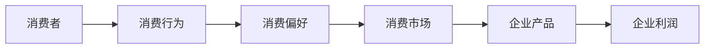
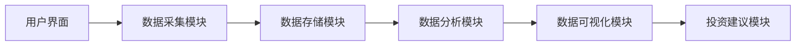
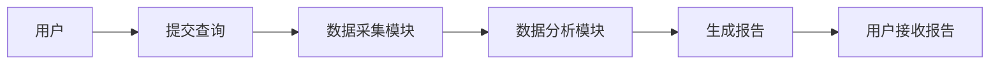

                 


# 价值投资中的消费升级趋势捕捉

## 关键词
价值投资，消费升级，DCF模型，趋势分析，投资策略

## 摘要
在价值投资领域，消费升级趋势的识别和捕捉是投资者关注的焦点。本文通过分析消费升级的驱动因素、核心概念、算法原理及系统设计，结合实际案例和最佳实践，为投资者提供捕捉消费升级趋势的有效策略。文章详细探讨了价值投资的基本概念、消费升级的趋势分析，以及如何利用DCF模型进行企业估值。通过系统架构设计和项目实战，展示了如何构建一个高效的消费升级趋势捕捉系统，帮助投资者在竞争激烈的市场中把握投资机会。

## 第一部分：价值投资与消费升级的背景介绍

### 第1章：价值投资与消费升级概述

#### 1.1 价值投资的基本概念
- **1.1.1 价值投资的定义与核心理念**
  价值投资是一种投资策略，强调以低于内在价值的价格购买优质资产。其核心理念是寻找市场低估的公司，长期持有，等待价值回归。这种策略要求投资者具备深入的分析能力和对市场的深刻理解。

- **1.1.2 价值投资与成长投资的区别**
  价值投资关注低估值的公司，而成长投资则侧重于高增长潜力的公司。价值投资注重当前价值，而成长投资更关注未来增长。两者的区别在于对时间和价值的理解不同。

- **1.1.3 价值投资在现代金融中的地位**
  价值投资是投资理论的重要组成部分，尤其在市场波动和不确定性增加的情况下，价值投资策略显示出其稳定性和可靠性。它帮助投资者在市场低谷中找到优质资产，长期实现超额收益。

#### 1.2 消费升级的定义与趋势
- **1.2.1 消费升级的定义**
  消费升级指的是随着经济发展和居民收入的增加，消费者对产品和服务的需求从基本需求向更高层次的需求转变。这一过程涉及产品品质、品牌认知度、服务体验等多个方面。

- **1.2.2 消费升级的主要驱动因素**
  经济增长、人口结构变化、技术进步、政策支持和消费习惯的改变是推动消费升级的主要因素。例如，中产阶级的崛起推动了对高端产品和服务的需求。

- **1.2.3 消费升级的趋势分析**
  随着技术的进步和消费者偏好的变化，消费升级趋势将朝着个性化、品质化和体验化方向发展。消费者越来越注重产品的独特性和服务的附加值。

## 第二部分：消费升级趋势的核心概念与联系

### 第2章：消费升级趋势的核心概念

#### 2.1 核心概念的原理
- **2.1.1 消费升级的驱动因素分析**
  经济发展水平直接影响消费能力，居民收入增长是消费升级的直接推动力。此外，社会文化变迁、消费心理变化等因素也对消费升级趋势产生影响。

- **2.1.2 消费升级与经济发展阶段的关系**
  在经济发展初期，消费主要满足基本需求；随着经济成熟，消费向高端化、多样化发展。不同经济发展阶段的消费升级特点各异，需要投资者根据不同阶段的特点制定投资策略。

#### 2.2 消费升级趋势的属性特征对比
- **2.2.1 不同消费群体的需求差异**
  不同年龄段、收入水平和地理位置的消费者对产品的偏好和需求存在显著差异。例如，年轻消费者更注重产品的创新性和时尚性，而中老年消费者则更关注产品的实用性和价格因素。

- **2.2.2 不同消费阶段的特征对比**
  消费升级可以分为初级、中级和高级阶段。初级阶段主要满足基本需求，中级阶段注重品牌和质量，高级阶段则追求个性化和体验价值。

#### 2.3 实体关系图


## 第三部分：算法原理与数学模型

### 第3章：消费升级趋势的算法原理

#### 3.1 DCF模型在消费企业估值中的应用
- **3.1.1 DCF模型的基本原理**
  DCF模型通过预测企业未来现金流并将其贴现为现值，以评估企业的内在价值。该模型适用于消费企业，因其现金流相对稳定，容易预测。

- **3.1.2 消费企业现金流的预测方法**
  预测现金流需要考虑收入增长率、营业成本、资本支出等因素。消费企业的现金流预测通常基于历史数据和行业趋势分析。

- **3.1.3 DCF模型的优缺点**
  DCF模型的优点是考虑了资金的时间价值，能够全面评估企业的未来盈利能力。缺点是模型高度依赖预测数据，预测误差可能较大。

#### 3.2 消费升级趋势的数学模型
- **3.2.1 消费升级指数的构建**
  消费升级指数是衡量消费升级程度的综合指标，通常包括人均可支配收入、消费支出、品牌偏好等多个维度。

- **3.2.2 消费升级趋势的预测模型**
  使用时间序列分析模型（如ARIMA）或机器学习模型（如LSTM）进行消费升级趋势的预测。模型的选择取决于数据特征和预测精度要求。

#### 3.3 算法实现


#### 3.4 Python代码实现
```python
def calculateDCF(revenue, growth_rate, discount_rate, period):
    cash_flows = []
    for i in range(period):
        cash_flow = revenue * (1 + growth_rate/100)**i
        cash_flows.append(cash_flow)
    present_value = sum(cash_flow / (1 + discount_rate/100)**i for i, cash_flow in enumerate(cash_flows))
    return present_value

# 示例计算
revenue = 1000
growth_rate = 5
discount_rate = 10
period = 5
DCF_value = calculateDCF(revenue, growth_rate, discount_rate, period)
print(f"DCF Value: {DCF_value}")
```

#### 3.5 数学公式
DCF模型的核心公式是：
$$DCF = \sum_{t=1}^{n} \frac{CF_t}{(1 + r)^t} + \frac{TV}{(1 + r)^n}$$
其中，\( CF_t \) 是第 t 年的现金流，\( r \) 是贴现率，\( TV \) 是终值。

## 第四部分：系统分析与架构设计

### 第4章：系统分析与架构设计方案

#### 4.1 问题场景介绍
投资者需要一个系统来实时跟踪和分析消费升级趋势，识别具有投资潜力的企业。系统需要整合多源数据，提供数据可视化和投资建议。

#### 4.2 项目介绍
本项目旨在构建一个基于大数据分析的消费升级趋势捕捉系统，帮助投资者做出明智的投资决策。

#### 4.3 系统功能设计
- 数据采集模块：收集消费市场数据，包括销售额、消费者行为、产品评价等。
- 数据分析模块：利用机器学习算法预测消费升级趋势，识别潜在投资机会。
- 数据可视化模块：提供直观的数据展示，帮助用户理解市场动态。

#### 4.4 系统架构设计


#### 4.5 接口设计
- 数据接口：与多个数据源（如政府统计机构、市场调研公司）对接，获取实时数据。
- API接口：提供给第三方应用调用，方便数据共享和分析。

#### 4.6 系统交互


## 第五部分：项目实战

### 第5章：项目实战

#### 5.1 环境安装
需要安装Python、Pandas、NumPy、Scikit-learn、Plotly等库。

#### 5.2 系统核心实现源代码
```python
import pandas as pd
import numpy as np
from sklearn.linear_model import LinearRegression

# 数据加载
data = pd.read_csv('consumption_data.csv')

# 特征工程
X = data[['income', 'age_group', 'region']]
y = data['consumption_score']

# 模型训练
model = LinearRegression()
model.fit(X, y)

# 预测
new_data = pd.DataFrame({
    'income': [50000],
    'age_group': [30],
    'region': ['urban']
})
prediction = model.predict(new_data)
print(f"预测消费评分：{prediction[0]}")
```

#### 5.3 代码应用解读与分析
通过上述代码，我们可以训练一个线性回归模型，预测不同收入、年龄和地区的消费评分。这有助于识别具有高消费潜力的目标群体。

#### 5.4 实际案例分析
以某食品公司为例，分析其在消费升级趋势下的表现。通过DCF模型评估其内在价值，指导投资决策。

#### 5.5 项目小结
本项目通过构建数据采集、分析和可视化的系统，帮助投资者捕捉消费升级趋势，实现价值投资。

## 第六部分：最佳实践

### 第6章：最佳实践

#### 6.1 投资策略
- **长期持有优质资产**：选择具有持续增长潜力的消费企业，长期持有，避免频繁交易。
- **分散投资风险**：通过投资多个行业和公司，分散投资风险，降低波动性影响。

#### 6.2 风险管理
- **设定止损点**：在投资组合中设定止损点，避免重大损失。
- **定期复盘与调整**：定期评估投资组合的表现，根据市场变化进行调整。

#### 6.3 未来研究方向
- **新兴技术应用**：探索人工智能和大数据技术在消费升级趋势分析中的应用。
- **国际化视角**：关注全球消费升级趋势，寻找跨国投资机会。

#### 6.4 小结
捕捉消费升级趋势需要深入的市场分析和科学的投资策略。通过系统化的分析和风险管理，投资者可以在价值投资中实现长期稳定的收益。

## 结语
通过本文的详细分析，读者可以掌握价值投资中的消费升级趋势捕捉方法，从理论到实践，系统地提升投资能力。希望本文能为投资者提供有价值的参考和指导。

---

