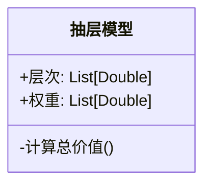
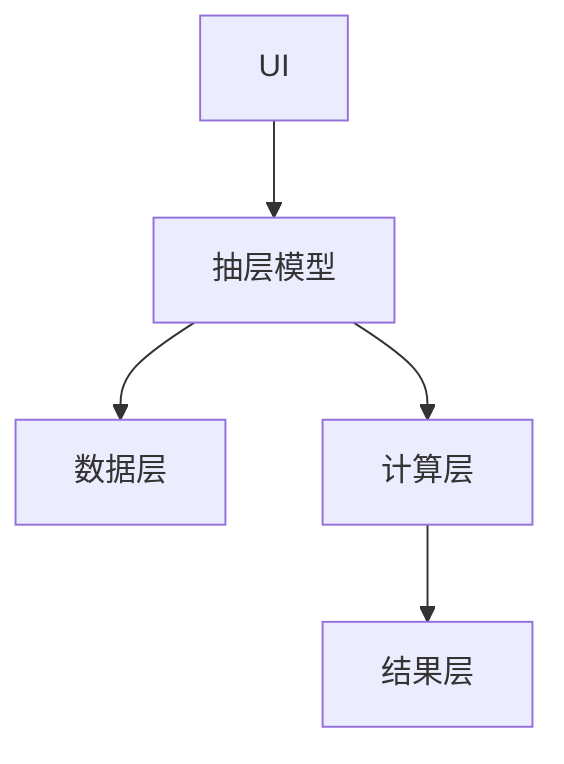
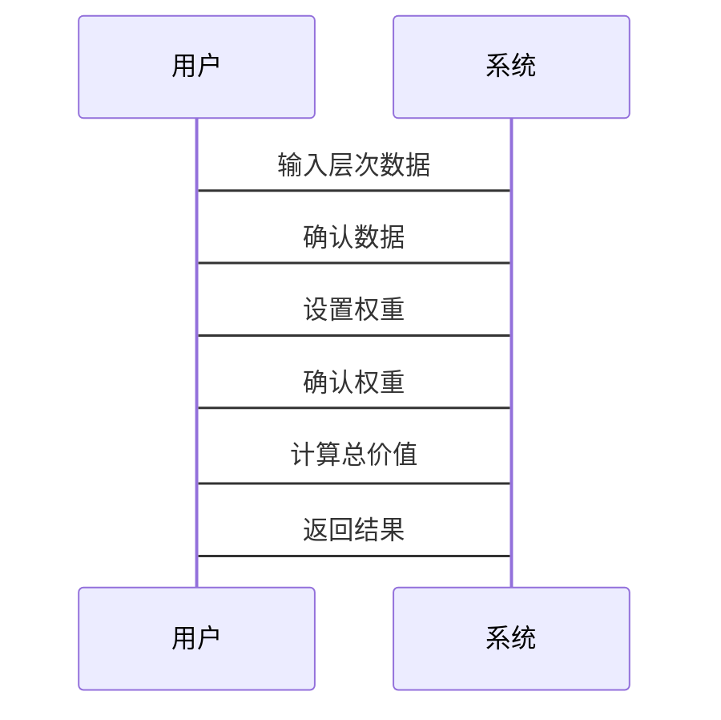

                 


# 价值投资中的深海开发技术前景

## 关键词：
- 价值投资
- 深海开发
-抽层模型
-抽层分析
-抽层架构
-抽层设计
-抽层实现

## 摘要：
本文章探讨了如何将价值投资的理念应用于深海开发技术领域，分析了深海开发中的抽层模型设计和抽层分析方法。通过抽层架构的设计，展示了如何优化深海项目的开发流程，提升投资效率。文章详细介绍了抽层模型的构建、抽层分析的数学方法，以及在实际项目中的应用案例，为读者提供了系统化的抽层设计方法。

---

## 1. 背景介绍

### 1.1 价值投资的定义和基本概念
价值投资是一种投资策略，强调以低于内在价值的价格购买优质资产。其核心在于深入分析企业的基本面，寻找市场低估的投资机会，注重长期回报而非短期波动。这种方法通过识别市场的非理性定价，利用价格与价值的差异来实现超额收益。

### 1.2 深海开发技术的基本概念
深海开发涉及在深海水域进行资源勘探和开发活动，包括海底矿产、天然气水合物等的开采。该领域面临高技术门槛和高风险，需要克服极端环境条件，如高压、低温和复杂的地质结构。技术挑战包括设备可靠性、资源评估精度和开发成本控制。

### 1.3 价值投资与深海开发的结合
将价值投资应用于深海开发，需识别技术领先、资源丰富的项目，同时评估市场对这些项目的估值是否合理。通过抽层分析，投资者可以系统地评估项目的风险和潜在回报，制定合理的投资策略。这种结合为深海开发提供了更高效的融资和项目管理方法。

---

## 2. 核心概念与联系

### 2.1 抽层模型的核心原理
抽层模型是一种系统分析工具，用于分解复杂系统为多个层次，每个层次代表不同的系统组件或功能模块。在价值投资中，抽层模型帮助分析深海项目的各个组成部分，如资源评估、技术可行性、市场前景等。

### 2.2 深海开发技术的抽层分析
在深海开发中，抽层分析用于评估项目的各个阶段。例如，在资源勘探阶段，模型可以分析地质数据的准确性；在设备设计阶段，评估技术的可靠性和成本效益。

### 2.3 抽层模型与价值投资的联系
抽层模型为价值投资提供了一种结构化的分析方法，帮助投资者系统地评估项目的各个方面，识别潜在风险和机会。通过抽层分析，投资者可以更准确地评估项目的内在价值，做出更明智的投资决策。

### 2.4 抽层模型的对比分析
以下是抽层模型与传统分析方法的对比：

| 对比维度 | 抽层模型 | 传统分析方法 |
|----------|----------|--------------|
| 分析深度 | 分层详细分析 | 一般性分析 |
| 结构化程度 | 高 | 较低 |
| 可视化 | 支持图表展示 | 文本描述为主 |

### 2.5 抽层模型的ER图
以下是抽层模型的ER图：

```mermaid
erd
 项目
   one (项目负责人: 人员)
   one (项目阶段: 阶段)
   one (项目资源: 资源)
```

---

## 3. 抽层模型的算法原理

### 3.1 抽层模型的数学模型
抽层模型的核心公式是：

$$ V = \sum_{i=1}^{n} w_i \times v_i $$

其中，\( V \) 是项目总价值，\( w_i \) 是第 \( i \) 个层次的权重，\( v_i \) 是该层次的评估值。

### 3.2 抽层模型的Python代码实现
以下是抽层模型的Python代码示例：

```python
def calculate_value(layers, weights):
    total_value = 0
    for i in range(len(layers)):
        total_value += weights[i] * layers[i]
    return total_value

# 示例应用
layers = [85, 70, 90]  # 各层评估值
weights = [0.3, 0.4, 0.3]  # 各层权重
project_value = calculate_value(layers, weights)
print(f"项目总价值: {project_value}")
```

### 3.3 抽层模型的案例分析
假设某深海项目分为三个层次：资源评估（权重0.3）、技术可行性（权重0.4）、市场前景（权重0.3）。各层次的评估值分别为85、70、90。计算总价值：

$$ V = 0.3 \times 85 + 0.4 \times 70 + 0.3 \times 90 = 25.5 + 28 + 27 = 80.5 $$

---

## 4. 抽层模型的系统分析与架构设计

### 4.1 问题场景
在深海开发中，抽层模型用于评估项目的可行性。例如，评估某深海矿产项目的技术可行性、资源储量和市场前景。

### 4.2 抽层模型的系统功能设计
以下是抽层模型的系统功能模块：



### 4.3 抽层模型的系统架构设计
以下是抽层模型的系统架构图：



### 4.4 抽层模型的系统接口设计
系统接口包括数据输入接口、权重设置接口和结果输出接口。

### 4.5 抽层模型的系统交互设计
以下是抽层模型的交互流程图：



---

## 5. 抽层模型的项目实战

### 5.1 环境安装
需要安装Python和相关库，如NumPy和Matplotlib。

### 5.2 核心代码实现
以下是抽层模型的核心代码：

```python
import numpy as np

def calculate_hierarchical_value(layers, weights):
    return np.dot(layers, weights)

# 示例应用
layers = np.array([85, 70, 90])
weights = np.array([0.3, 0.4, 0.3])
project_value = calculate_hierarchical_value(layers, weights)
print(f"项目总价值: {project_value}")
```

### 5.3 案例分析
以某深海矿产项目为例，评估其抽层价值：

- 层次：资源储量、技术可行性和市场前景
- 评估值：85、70、90
- 权重：0.3、0.4、0.3

计算结果为80.5，表明项目具有较高的投资价值。

### 5.4 项目小结
通过抽层模型，投资者可以系统地评估深海开发项目的各层次价值，做出更明智的投资决策。

---

## 6. 抽层模型的最佳实践与总结

### 6.1 投资注意事项
- 分散投资以降低风险
- 关注项目各层次的评估结果
- 定期重新评估项目价值

### 6.2 投资小结
抽层模型为价值投资者提供了一种系统化的分析工具，帮助识别高价值、低风险的深海开发项目。

### 6.3 未来展望
随着技术进步，抽层模型将在深海开发中发挥更大作用，推动资源开发的效率和可持续性。

### 6.4 拓展阅读
- 书籍推荐：《价值投资实战策略》
- 网站推荐：抽层模型工具和资源分享平台

---

通过本文的详细分析，读者可以掌握抽层模型在价值投资中的应用，为深海开发项目的评估提供科学依据，做出更明智的投资决策。

