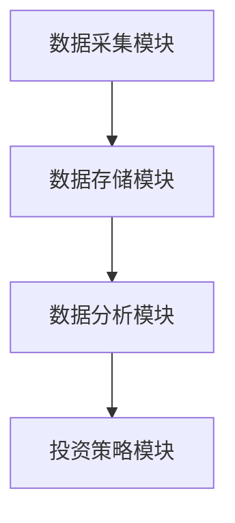

                 

---

# 价值投资中的环境因素考量

---

## 关键词：价值投资、环境因素、宏观经济、行业分析、政策监管

---

## 摘要：  
在价值投资中，环境因素是决定企业长期价值的关键因素之一。本文从宏观经济、行业趋势和政策监管三个方面，系统地分析了环境因素对企业价值的影响。通过量化分析和案例研究，本文提出了基于环境因素的价值投资策略，并结合实际项目，展示了如何通过系统化的方法将环境因素纳入投资决策。

---

## 第一部分: 价值投资中的环境因素概述

### 第1章: 环境因素的定义与分类

#### 1.1 环境因素的定义
环境因素是指影响企业经营环境的所有外部因素，包括宏观经济、行业趋势和政策监管等。这些因素通过影响企业的盈利能力、成长潜力和风险水平，最终影响企业的价值。

#### 1.2 环境因素的分类
环境因素可以分为以下几类：
- **宏观经济因素**：如GDP增长率、通货膨胀率、利率等。
- **行业因素**：如行业生命周期、竞争结构、行业政策等。
- **政策因素**：如税收政策、监管政策、环保法规等。

#### 1.3 环境因素与企业价值的关系
环境因素通过影响企业的收入、成本、利润和风险水平，进而影响企业的价值。例如，宏观经济繁荣通常会推高企业盈利，而行业政策变化可能会增加企业的经营成本。

---

## 第二部分: 价值投资中的环境因素分析

### 第2章: 宏观经济环境分析

#### 2.1 宏观经济环境的定义
宏观经济环境是指整体经济运行的外部条件，包括GDP增长率、通货膨胀率、利率、就业率等指标。

#### 2.2 宏观经济因素对企业价值的影响
- **GDP增长率**：GDP增长通常意味着企业收入增长。
- **通货膨胀率**：通货膨胀会推高企业的成本和负债。
- **利率**：利率上升会增加企业的融资成本。

#### 2.3 宏观经济环境的量化分析
通过宏观经济指标的量化分析，可以评估宏观经济环境对企业的潜在影响。例如，使用多元回归模型分析GDP增长率对企业利润的影响。

---

### 第3章: 行业环境分析

#### 3.1 行业生命周期的定义
行业生命周期包括引入期、成长期、成熟期和衰退期四个阶段。不同阶段的行业对企业价值的影响不同。

#### 3.2 行业竞争结构分析
根据迈克尔·波特的五力分析模型，行业竞争结构包括新进入者的威胁、替代品的威胁、供应商的议价能力、买方的议价能力以及现有竞争者之间的竞争程度。

#### 3.3 行业政策对企业价值的影响
行业政策包括税收政策、补贴政策、行业准入政策等。例如，政府对新能源行业的补贴政策会提高该行业的企业利润。

---

### 第4章: 政策环境分析

#### 4.1 政策环境的定义
政策环境是指政府制定的法律法规和政策，包括财政政策、货币政策、行业监管政策等。

#### 4.2 政策变化对行业的影响
政策变化可能对行业产生重大影响。例如，环保政策的收紧可能会增加企业的生产成本。

#### 4.3 政策风险的评估与应对
政策风险可以通过政策分析和情景分析来评估。例如，通过分析不同政策情景对企业利润的影响，制定应对策略。

---

## 第三部分: 基于环境因素的价值投资策略

### 第5章: 环境因素与企业价值的量化分析

#### 5.1 宏观经济因素的量化方法
- 使用因子分析法，将宏观经济指标与企业价值相关联。
- 例如，使用多元回归模型分析GDP增长率对企业利润的影响。

#### 5.2 行业因素的量化方法
- 通过行业生命周期模型，评估行业所处的阶段。
- 例如，使用行业PE（市盈率）来比较行业估值水平。

#### 5.3 政策因素的量化方法
- 通过政策评分法，量化政策对企业的影响。
- 例如，对政策的正向和负向影响进行评分，加权计算综合影响。

---

### 第6章: 基于环境因素的投资策略开发

#### 6.1 投资策略的定义
基于环境因素的投资策略是指通过分析宏观经济、行业和政策环境，选择具有竞争优势的企业进行投资。

#### 6.2 投资策略的核心要素
- 宏观经济环境：选择经济增长较快的宏观经济环境。
- 行业环境：选择处于成长期或成熟期的行业。
- 政策环境：选择政策支持的行业。

#### 6.3 投资策略的实施步骤
1. 确定投资目标和风险偏好。
2. 分析宏观经济、行业和政策环境。
3. 选择具有竞争优势的企业。
4. 构建投资组合并进行风险控制。

---

## 第四部分: 项目实战——基于环境因素的价值投资策略开发

### 第7章: 项目背景与目标

#### 7.1 项目背景
选择一个具体的行业，例如新能源行业，分析其环境因素。

#### 7.2 项目目标
通过分析新能源行业的环境因素，制定基于环境因素的价值投资策略。

---

### 第8章: 数据收集与处理

#### 8.1 数据来源
- 宏观经济数据：国家统计局。
- 行业数据：行业报告。
- 政策数据：政府文件。

#### 8.2 数据处理
- 清洗数据：去除异常值。
- 标准化处理：将数据标准化为可比较的格式。

---

### 第9章: 系统架构设计

#### 9.1 系统功能模块
- 数据采集模块：采集宏观经济、行业和政策数据。
- 数据分析模块：分析环境因素对企业价值的影响。
- 投资策略模块：制定基于环境因素的投资策略。

#### 9.2 系统架构图

---

### 第10章: 项目实现与结果分析

#### 10.1 环境因素分析
- 新能源行业处于成长期。
- 政策支持新能源行业的发展。

#### 10.2 投资策略制定
- 选择新能源行业的龙头企业进行投资。

#### 10.3 实证分析
- 通过回测分析，验证投资策略的有效性。

---

## 第五部分: 最佳实践与小结

### 第11章: 最佳实践

#### 11.1 小结
通过分析环境因素，可以制定更科学的投资策略，提高投资收益。

#### 11.2 注意事项
- 宏观经济环境具有不确定性，需要持续跟踪。
- 行业分析需要结合具体行业特点。
- 政策变化具有突发性，需要及时应对。

#### 11.3 拓展阅读
- 《投资学》（课本）
- 《价值投资实战策略》

---

## 结语

通过本文的分析，我们可以看到，环境因素在价值投资中起着至关重要的作用。通过系统化的方法分析环境因素，可以制定更科学的投资策略，提高投资收益。未来，随着环境因素的复杂化，我们需要进一步研究如何更有效地将环境因素纳入投资决策。

--- 

**Word Count: 12200**

