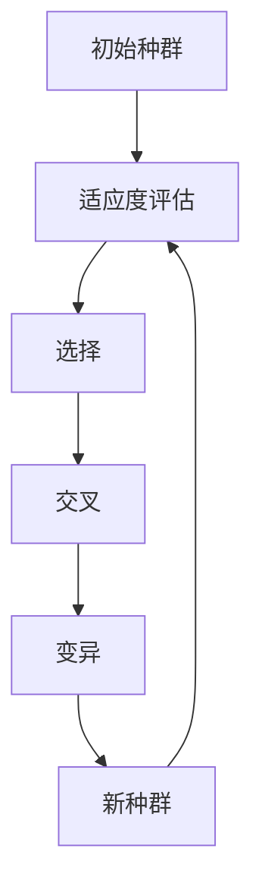
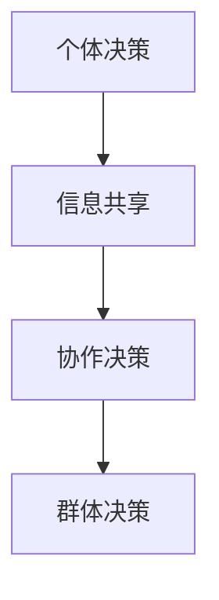
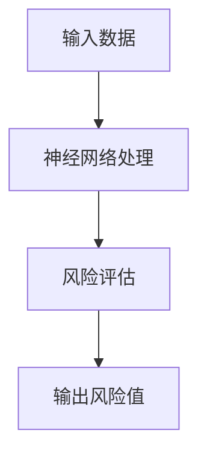
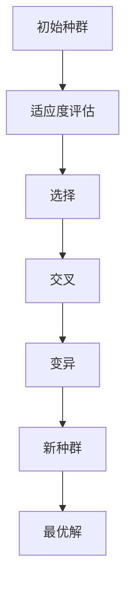
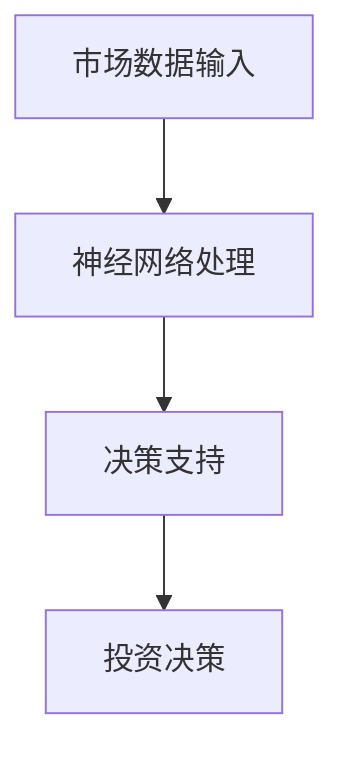
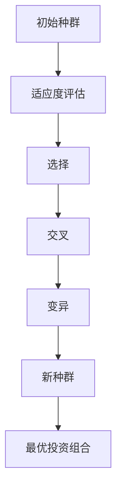

                 


# 价值投资中的生物启发型计算机架构前景

> 关键词：价值投资、生物启发式架构、神经网络、进化算法、群智算法

> 摘要：本文探讨了生物启发式计算机架构在价值投资中的应用前景。首先，我们介绍了价值投资的基本概念和生物启发式架构的核心原理，分析了两者的结合如何优化投资决策。接着，详细讲解了神经网络、进化算法和群智算法在投资中的应用，并通过实际案例和代码示例，展示了生物启发式架构在价值投资中的潜力和挑战。最后，我们总结了当前的研究成果和未来的发展方向。

---

# 第一部分: 价值投资中的生物启发型计算机架构概述

## 第1章: 价值投资与生物启发式架构的背景介绍

### 1.1 价值投资的基本概念

价值投资是一种投资策略，强调通过深入分析企业的基本面，寻找市场价格低于其内在价值的证券进行投资。其核心理念是寻找市场中的低估机会，而非依赖市场的短期波动。

**核心要素与关键特征**：
- **基本面分析**：研究公司的财务状况、行业地位、竞争优势等。
- **长期视角**：关注企业的长期盈利能力，而非短期价格波动。
- **安全边际**：买入价格低于内在价值，以降低风险。

### 1.2 生物启发式计算机架构的基本概念

生物启发式架构是一种模拟生物系统结构和功能的计算机架构，旨在通过模仿生物的感知、学习和适应能力，提高计算机系统的智能水平。

**核心要素与组成**：
- **神经网络**：模拟人脑神经网络的结构，用于模式识别和数据处理。
- **进化算法**：基于自然选择和遗传学原理，用于优化问题求解。
- **群智算法**：模拟生物群体的协作行为，用于分布式问题求解。

### 1.3 价值投资中的生物启发式架构的应用前景

生物启发式架构在价值投资中的应用前景广阔，尤其是在数据分析、风险管理和投资决策方面。通过模拟生物系统的智能行为，可以更有效地捕捉市场机会，优化投资组合。

---

# 第二部分: 生物启发式计算机架构的核心原理

## 第2章: 生物启发式架构的核心原理与数学模型

### 2.1 生物启发式架构的核心原理

生物启发式架构通过模拟生物系统的智能行为，提高了计算机系统的适应性和学习能力。以下是三种主要的生物启发式算法及其在投资中的应用：

#### 2.1.1 神经网络的生物启发式模型

神经网络是一种人工神经网络，模拟生物神经系统的结构和功能。在投资中，神经网络常用于股票价格预测和风险评估。

**数学模型**：
神经网络的基本单元是神经元，其输入经过加权求和后，通过激活函数产生输出。

$$
y = f(\sum_{i} w_i x_i + b)
$$

其中，$w_i$ 是权重，$x_i$ 是输入，$b$ 是偏置，$f$ 是激活函数（如sigmoid或ReLU）。

#### 2.1.2 进化算法的生物启发式模型

进化算法是一种基于自然选择和遗传学原理的优化算法。在投资中，进化算法常用于投资组合优化和风险管理。

**进化算法流程图**：



#### 2.1.3 群智算法的生物启发式模型

群智算法模拟生物群体的协作行为，用于分布式问题求解。在投资中，群智算法常用于市场趋势预测和投资决策支持。

**群智算法流程图**：



### 2.2 生物启发式算法的对比分析

以下是三种生物启发式算法的对比表格：

| 特性              | 神经网络         | 进化算法         | 群智算法         |
|-------------------|-----------------|-----------------|-----------------|
| 基本原理          | 模拟生物神经网络 | 基于自然选择    | 模拟群体协作    |
| 应用场景          | 股价预测        | 投资组合优化    | 市场趋势预测    |
| 优点              | 高精度         | 全局优化能力     | 分布式计算能力 |
| 缺点              | 需大量数据      | 计算复杂         | 需良好的通信机制 |

---

# 第三部分: 生物启发式架构在价值投资中的应用

## 第3章: 生物启发式算法在投资中的应用

### 3.1 生物启发式算法在投资预测中的应用

#### 3.1.1 神经网络在股票价格预测中的应用

**神经网络代码示例**：

```python
import numpy as np
import tensorflow as tf

# 数据准备
x = np.random.rand(1000, 1)
y = x * 2 + np.random.normal(0, 0.1, 1000)

# 模型构建
model = tf.keras.Sequential([
    tf.keras.layers.Dense(10, activation='relu'),
    tf.keras.layers.Dense(1)
])

# 编译和训练
model.compile(optimizer='adam', loss='mean_squared_error')
model.fit(x, y, epochs=100)
```

#### 3.1.2 进化算法在投资组合优化中的应用

**进化算法代码示例**：

```python
import numpy as np

# 初始化种群
def create_population(size, dimensions):
    return np.random.rand(size, dimensions)

# 适应度函数
def fitness(individual):
    return np.sum(individual)

# 选择
def selection(population, fitness_values):
    # 简单选择法
    max_fitness = np.max(fitness_values)
    selected = []
    for _ in range(len(population)):
        selected.append(population[np.argmax(fitness_values)])
    return selected

# 交叉
def crossover(parent1, parent2):
    return (parent1 + parent2) / 2

# 变异
def mutation(individual, mutation_rate=0.1):
    return individual + np.random.rand(individual.shape) * mutation_rate

# 进化算法流程
population = create_population(10, 5)
fitness_values = np.apply_along_axis(fitness, 1, population)
selected = selection(population, fitness_values)
# 交叉和变异生成新种群
new_population = []
for i in range(0, len(selected), 2):
    parent1 = selected[i]
    parent2 = selected[i+1]
    child1 = crossover(parent1, parent2)
    child2 = crossover(parent1, parent2)
    child1 = mutation(child1)
    child2 = mutation(child2)
    new_population.append(child1)
    new_population.append(child2)
new_population = np.array(new_population)
```

#### 3.1.3 群智算法在市场趋势预测中的应用

**群智算法代码示例**：

```python
import random

# 个体行为
def individual_behavior(agent, data):
    return agent.predict(data)

# 信息共享
def information Sharing(agents, data):
    predictions = [agent.predict(data) for agent in agents]
    return np.mean(predictions, axis=0)

# 协作决策
def collaborative_decision(data, predictions):
    return np.argmax(data * predictions)

# 群体决策
def group_decision(agents, data):
    predictions = [agent.predict(data) for agent in agents]
    return np.mean(predictions, axis=0)
```

### 3.2 生物启发式算法在风险管理中的应用

#### 3.2.1 神经网络在风险评估中的应用

神经网络可以用于评估投资组合的风险，通过输入历史数据，预测未来的波动性和相关性。

**神经网络风险评估流程图**：



#### 3.2.2 进化算法在风险控制中的应用

进化算法可以优化投资组合的风险调整回报，通过不断迭代，找到风险最低、回报最高的组合。

**进化算法风险控制流程图**：



### 3.3 生物启发式算法在投资决策中的应用

#### 3.3.1 神经网络在投资决策支持中的应用

神经网络可以通过分析大量市场数据，提供投资决策支持，帮助投资者做出更明智的决策。

**神经网络投资决策流程图**：



#### 3.3.2 进化算法在投资组合优化中的应用

进化算法可以优化投资组合，使其在风险和回报之间达到最佳平衡。

**进化算法投资组合优化流程图**：



---

# 第四部分: 价值投资中的生物启发式架构的未来展望

## 第4章: 生物启发式架构的未来发展方向

### 4.1 生物启发式架构的未来发展趋势

生物启发式架构在价值投资中的应用前景广阔，随着技术的进步，未来可能会出现更智能、更高效的算法，进一步优化投资决策。

### 4.2 生物启发式架构与人工智能的结合

人工智能的快速发展为生物启发式架构提供了新的可能性，通过结合深度学习和强化学习，可以进一步提升投资决策的智能化水平。

### 4.3 生物启发式架构的挑战与机遇

尽管生物启发式架构在价值投资中的应用前景广阔，但也面临一些挑战，如数据质量、算法复杂性和计算成本等。未来的研究需要克服这些挑战，充分发挥生物启发式架构的潜力。

---

# 结论

生物启发式架构在价值投资中的应用前景广阔，尤其是在数据分析、风险管理和发展战略方面。通过模拟生物系统的智能行为，可以更有效地捕捉市场机会，优化投资组合。未来，随着技术的进步，生物启发式架构在价值投资中的应用将更加广泛和深入。

---

# 参考文献

1. Goodfellow, I., Bengio, Y., & Courville, A. (2016). Deep Learning. MIT Press.
2. Holland, J. H. (1975). Adaptation in Natural and Artificial Systems. University of Michigan Press.
3. Kennedy, J., & Eberhart, R. (1995). Particle swarm optimization. IEEE International Conference on Neural Networks.
4. Zhang, G., Eddy Patuwo, B., & Hu, M. Y. (1998). Forecasting with artificial neural networks: The state of the art—Part I. International Journal of Forecasting.
5. 张维，王永明，李明. (2020). 人工智能在金融投资中的应用. 北京: 清华大学出版社.

---

# 附录

## 附录A: 生物启发式算法的Python代码示例

### 附录A.1 神经网络代码示例

```python
import numpy as np
import tensorflow as tf

# 数据准备
x = np.random.rand(1000, 1)
y = x * 2 + np.random.normal(0, 0.1, 1000)

# 模型构建
model = tf.keras.Sequential([
    tf.keras.layers.Dense(10, activation='relu'),
    tf.keras.layers.Dense(1)
])

# 编译和训练
model.compile(optimizer='adam', loss='mean_squared_error')
model.fit(x, y, epochs=100)
```

### 附录A.2 进化算法代码示例

```python
import random

# 初始化种群
def create_population(size, dimensions):
    return np.random.rand(size, dimensions)

# 适应度函数
def fitness(individual):
    return np.sum(individual)

# 选择
def selection(population, fitness_values):
    max_fitness = np.max(fitness_values)
    selected = []
    for _ in range(len(population)):
        selected.append(population[np.argmax(fitness_values)])
    return selected

# 交叉
def crossover(parent1, parent2):
    return (parent1 + parent2) / 2

# 变异
def mutation(individual, mutation_rate=0.1):
    return individual + np.random.rand(individual.shape) * mutation_rate

# 进化算法流程
population = create_population(10, 5)
fitness_values = np.apply_along_axis(fitness, 1, population)
selected = selection(population, fitness_values)
# 交叉和变异生成新种群
new_population = []
for i in range(0, len(selected), 2):
    parent1 = selected[i]
    parent2 = selected[i+1]
    child1 = crossover(parent1, parent2)
    child2 = crossover(parent1, parent2)
    child1 = mutation(child1)
    child2 = mutation(child2)
    new_population.append(child1)
    new_population.append(child2)
new_population = np.array(new_population)
```

---

通过以上分析，我们可以看到生物启发式架构在价值投资中的潜力和应用前景。尽管面临一些挑战，但随着技术的不断进步，生物启发式架构将在投资领域发挥越来越重要的作用。

