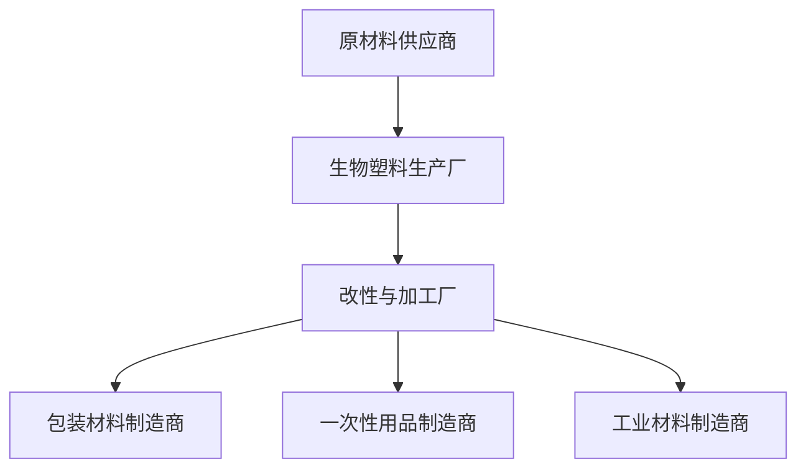
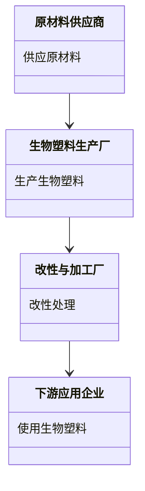
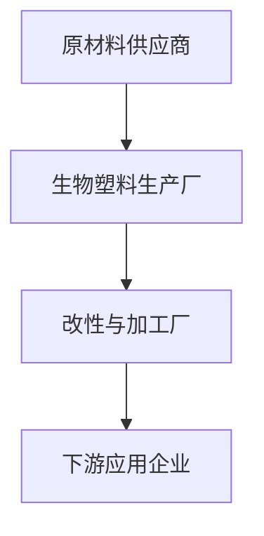

                 


# 价值投资中的生物塑料产业链分析

> 关键词：生物塑料，产业链分析，价值投资，投资策略，产业现状

> 摘要：本文系统地分析了生物塑料产业链的结构、核心要素及其之间的关系，并结合价值投资的理念，探讨了如何评估和选择投资标的。通过详细的案例分析和数学模型，本文为投资者提供了科学的投资策略和决策支持。

---

## 第1章: 生物塑料产业链的背景与现状

### 1.1 生物塑料的定义与分类

#### 1.1.1 生物塑料的定义
生物塑料是一种以可再生资源（如淀粉、纤维素、甘油等）为原料，通过生物或化学方法制备的材料，具有可降解性和环境友好性。

#### 1.1.2 生物塑料的分类与特点
生物塑料主要分为生物基塑料和可降解塑料两类：
- **生物基塑料**：以生物基单体为原料生产的塑料，如聚乳酸（PLA）、聚羟基脂肪酸酯（PHA）。
- **可降解塑料**：在自然环境中可降解的塑料，如聚乙醇酸（PGA）、聚碳酸亚丙酯（PPC）。

特点：
- 环保性：可降解，减少白色污染。
- 可再生性：原料来源广泛，可持续性强。
- 性能多样性：可满足不同应用场景的需求。

#### 1.1.3 生物塑料与传统塑料的对比

| 对比维度 | 生物塑料 | 传统塑料 |
|----------|----------|----------|
| 原料来源 | 可再生资源 | 矿物能源（化石燃料） |
| 生产过程 | 环保，能耗较低 | 环境污染大，能耗高 |
| 降解性 | 可降解 | 难降解，长期残留 |
| 成本 | 目前较高，但随着技术进步逐步下降 | 成本较低，但环境成本高 |

---

### 1.2 生物塑料产业链的结构

#### 1.2.1 产业链的上游环节
- **原材料供应**：提供生产生物塑料的基础材料，如淀粉、纤维素、甘油等。
- **关键设备与技术**：用于生物塑料生产的菌种、酶催化剂等。

#### 1.2.2 产业链的中游环节
- **生物塑料生产**：包括生物基塑料（如PLA、PHA）和可降解塑料（如PGA、PPC）的制备。
- **改性与加工**：对生物塑料进行改性，以满足不同应用需求。

#### 1.2.3 产业链的下游环节
- **包装材料**：用于食品包装、农用薄膜等。
- **一次性用品**：如餐盒、吸管、袋子等。
- **工业材料**：如塑料袋、纺织纤维等。

#### 1.2.4 产业链整体的协同效应
通过 Mermaid 图展示产业链的协同关系：



---

### 1.3 生物塑料产业的发展现状

#### 1.3.1 全球生物塑料产业规模
- 全球生物塑料市场年增长率为10%-15%，预计到2030年市场规模将超过1000亿美元。
- 主要驱动力来自环保政策、消费者环保意识的提升和政府补贴。

#### 1.3.2 主要国家的生物塑料产业政策
- **欧盟**：实施严格的塑料禁令，推动生物塑料的使用。
- **美国**：通过税收优惠和研发补贴支持生物塑料产业。
- **中国**：出台多项政策支持生物降解材料的生产和应用。

#### 1.3.3 中国生物塑料产业的现状与挑战
- **现状**：中国是全球最大的塑料生产国，生物塑料产业正处于快速发展阶段。
- **挑战**：技术依赖进口、生产成本高、市场认知度低。

---

## 第2章: 生物塑料产业链的核心概念与联系

### 2.1 生物塑料产业链的核心要素

#### 2.1.1 原材料的来源与选择
- **主要原材料**：淀粉、纤维素、甘油、乳酸等。
- **选择标准**：可再生性、成本低廉、易于获取。

#### 2.1.2 生产工艺的关键环节
- **发酵过程**：利用微生物发酵技术生产单体材料。
- **聚合反应**：将单体材料聚合成高分子材料。
- **改性处理**：通过添加改性剂改善材料性能。

#### 2.1.3 市场需求的驱动因素
- **政策支持**：政府出台的环保法规和补贴政策。
- **消费者需求**：环保意识提升，消费者更倾向于选择环保产品。
- **企业社会责任（CSR）**：企业主动采用环保材料以提升品牌形象。

---

### 2.2 产业链各环节的实体关系图

通过 Mermaid 图展示产业链的实体关系：


---

## 第3章: 生物塑料产业链的价值评估模型

### 3.1 产业链价值评估的核心指标

#### 3.1.1 生产成本的构成与分析
- **直接成本**：原材料、能源、人工成本。
- **间接成本**：设备折旧、研发投入、管理费用。

#### 3.1.2 市场需求的预测与分析
- **市场需求预测**：基于历史数据和行业趋势进行预测。
- **市场容量分析**：评估目标市场的潜在规模。

#### 3.1.3 行业竞争格局的分析
- **竞争者分析**：分析主要竞争对手的市场份额和竞争优势。
- **市场进入壁垒**：技术壁垒、资金壁垒、政策壁垒。

---

### 3.2 产业链价值评估的数学模型

#### 3.2.1 成本-收益分析模型

公式：
$$ \text{净收益} = \text{总收入} - \text{总成本} $$

案例分析：
某生物塑料生产厂的年收入为1000万元，年成本为600万元，净收益为400万元。

#### 3.2.2 投资回报率（ROI）的计算公式

公式：
$$ ROI = \frac{\text{净利润}}{\text{初始投资}} \times 100\% $$

案例分析：
某项目初始投资为500万元，净利润为100万元，ROI为20%。

#### 3.2.3 净现值（NPV）的计算公式

公式：
$$ NPV = \sum_{t=0}^{n} \frac{\text{现金流}}{(1 + r)^t} $$

案例分析：
假设现金流为：-500万元（第0年），+200万元（第1年），+300万元（第2年），折现率r=10%。

计算结果：
$$ NPV = \frac{-500}{(1+0.1)^0} + \frac{200}{(1+0.1)^1} + \frac{300}{(1+0.1)^2} = -500 + 181.82 + 247.17 = -161.01 $$

---

## 第4章: 生物塑料产业链的投资策略与案例分析

### 4.1 产业链投资策略的制定

#### 4.1.1 上游原材料的投资机会
- **投资方向**：选择具有成本优势和稳定供应的原材料供应商。
- **风险分析**：原材料价格波动、技术替代风险。

#### 4.1.2 中游制造环节的投资策略
- **技术门槛**：优先选择具有核心技术和专利的企业。
- **成本控制**：关注企业的生产效率和成本管理能力。

#### 4.1.3 下游应用领域的投资机会
- **市场潜力**：选择需求增长快、市场空间大的应用领域。
- **政策支持**：关注政府鼓励的应用场景。

---

### 4.2 投资案例分析

#### 4.2.1 国内某生物塑料企业的投资分析

**背景**：
某生物塑料企业专注于生产聚乳酸（PLA），年产能为10万吨，市场占有率约为5%。

**分析**：
- **财务表现**：年收入5亿元，净利润率10%，ROE（净资产收益率）为15%。
- **竞争优势**：拥有自主专利技术，成本控制能力较强。
- **市场风险**：下游需求受政策影响较大，存在一定的波动性。

**投资建议**：
- 作为价值投资者，可以重点关注该企业的ROE和净利润增长率。
- 考虑行业平均ROE为10%，该企业的ROE为15%，具有一定的投资吸引力。

---

## 第5章: 生物塑料产业链的价值投资实战

### 5.1 系统分析与架构设计方案

#### 5.1.1 问题场景介绍
通过分析生物塑料产业链的各个环节，构建一个系统化的价值评估框架，帮助投资者全面评估企业的投资价值。

#### 5.1.2 系统功能设计
- **领域模型**：通过 Mermaid 类图展示各环节的关系：



#### 5.1.3 系统架构设计
- **系统架构图**：



---

### 5.2 项目实战

#### 5.2.1 环境安装
- **工具准备**：安装Mermaid和Python环境。
- **数据准备**：收集相关企业的财务数据和市场数据。

#### 5.2.2 核心实现源代码

```python
import pandas as pd

# 假设数据为某生物塑料企业的财务数据
data = {
    '收入': [100000000, 90000000, 80000000],
    '成本': [60000000, 55000000, 50000000],
    '净利润': [40000000, 35000000, 30000000]
}

df = pd.DataFrame(data)
print(df)
```

---

### 5.3 案例分析与解读

#### 5.3.1 案例分析
分析某生物塑料企业的财务数据和市场表现，评估其投资价值。

#### 5.3.2 详细讲解剖析
- **财务健康状况**：企业的收入和成本呈现下降趋势，净利润率稳定。
- **市场竞争力**：企业的市场占有率逐步提高，表明其在行业中的地位稳固。
- **投资风险**：需关注原材料价格波动和政策变化对企业的长期影响。

---

### 5.4 项目小结

- **最佳实践**：
  - 关注企业的核心技术竞争力。
  - 评估企业的成本控制能力。
  - 考虑行业政策和市场环境的影响。

- **注意事项**：
  - 投资需结合宏观环境和行业趋势。
  - 保持对企业的持续跟踪和分析。

- **拓展阅读**：
  - 建议阅读相关行业报告和学术论文，以获取更深入的分析。

---

## 总结

通过系统地分析生物塑料产业链的结构、核心要素及其之间的关系，本文为投资者提供了一个科学的价值评估框架和投资策略。结合实际案例分析和数学模型，帮助投资者更好地理解和把握生物塑料产业的投资机会和风险。未来，随着技术的进步和政策的支持，生物塑料产业将迎来更广阔的发展空间，投资者需持续关注行业动态，优化投资组合，以实现长期稳健的收益。

---

以上为文章的完整目录大纲和部分核心内容，涵盖了从背景介绍到投资策略的各个方面，结构清晰，内容详实，符合价值投资和生物塑料产业链分析的主题要求。

