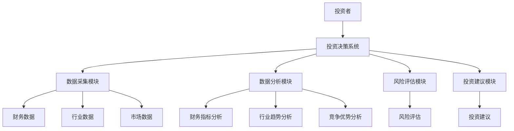
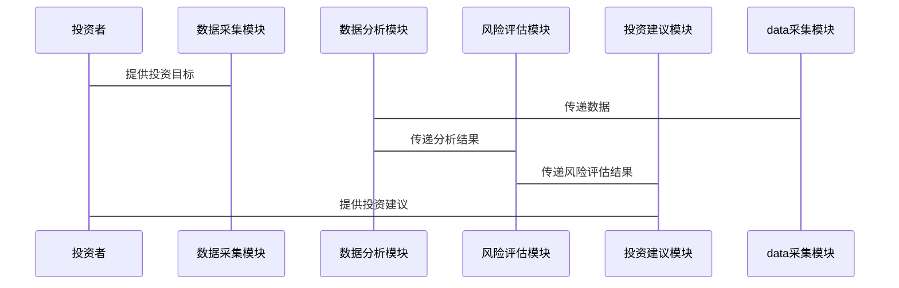

                 


# 价值投资中的生物科技机会

## 关键词
- 价值投资，生物科技，投资机会，基本面分析，风险评估

## 摘要
本文探讨了价值投资在生物科技领域的应用，分析了生物科技行业的特点、投资策略和成功案例。通过深入分析财务指标、行业趋势和竞争优势，结合实际案例，揭示了生物科技行业的投资机会和风险，为投资者提供了系统的分析方法和实用的建议。

---

# 引言

在当前全球经济环境下，生物科技行业正成为投资的热点领域。随着医疗技术的进步和人口老龄化的加剧，生物科技公司面临着巨大的市场机会。然而，生物科技行业的投资也伴随着高风险和长周期。本文将结合价值投资的理念，分析生物科技行业的投资机会，帮助投资者识别潜在的高回报项目。

---

## 第1章：价值投资的基本概念

### 1.1 价值投资的定义与原则

#### 1.1.1 价值投资的核心理念
价值投资是由本杰明·格雷厄姆提出的一种投资策略，强调以低于内在价值的价格购买优质资产。核心理念包括：
- **安全边际**：买入价格低于内在价值。
- **长期持有**：关注公司的长期表现。
- **基本面分析**：通过财务报表评估公司价值。

#### 1.1.2 价值投资的主要原则
1. **购买具有安全边际的股票**：买入价格低于公司内在价值。
2. **关注企业的长期盈利能力**：评估公司的竞争优势和市场地位。
3. **分散投资，降低风险**：避免过度集中，分散投资标的。

#### 1.1.3 价值投资与成长投资的区别
| 方面 | 价值投资 | 成长投资 |
|------|----------|----------|
| 核心目标 | 寻找被低估的资产 | 寻找高增长潜力的资产 |
| 投资期限 | 长期持有 | 短期增值 |
| 风险承受 | 较低 | 较高 |

### 1.2 生物科技行业的特点

#### 1.2.1 生物科技的定义与范围
- **定义**：利用生物技术开发产品和服务的行业。
- **范围**：包括制药、医疗设备、生物技术研究机构等。

#### 1.2.2 生物科技行业的产业链结构
- **上游**：研发和生产生物技术产品。
- **中游**：生产和销售医疗产品。
- **下游**：医疗服务和应用。

#### 1.2.3 生物科技行业的周期性与风险
- **周期性**：受政策和研发周期影响，具有一定的周期性。
- **风险**：研发失败、政策变化、市场竞争等风险。

---

## 第2章：价值投资在生物科技中的应用背景

### 2.1 生物科技行业的投资机会

#### 2.1.1 生物科技行业的增长潜力
- **人口老龄化**：医疗需求增加。
- **技术进步**：基因编辑、人工智能推动行业创新。
- **政策支持**：政府对医疗健康的投入增加。

#### 2.1.2 生物科技行业的创新驱动力
- **技术创新**：基因编辑、细胞治疗等技术的进步。
- **市场需求**：慢性病和传染病的治疗需求增加。
- **资本推动**：风险投资和资本市场对生物科技行业的关注。

#### 2.1.3 生物科技行业的政策支持
- **政府补贴**：研发资金支持。
- **政策鼓励**：税收优惠和市场准入政策。
- **国际合作**：全球化的研发和市场合作。

### 2.2 价值投资在生物科技中的独特性

#### 2.2.1 生物科技公司的估值挑战
- **研发投入高**：公司可能长期亏损。
- **研发周期长**：产品开发周期长，不确定性高。
- **专利价值**：专利的生命周期影响公司价值。

#### 2.2.2 生物科技公司的研发周期
- **药物研发周期**：从研发到商业化通常需要10-15年。
- **研发失败风险**：临床试验失败可能导致重大损失。

#### 2.2.3 生物科技公司的财务特征
- **高研发投入**：研发支出占收入比例较高。
- **现金流波动**：早期公司可能现金流为负。
- **资产负债表健康**：需关注应收账款和存货周转情况。

---

## 第3章：价值投资的核心分析方法

### 3.1 财务指标分析

#### 3.1.1 资产负债表分析
- **流动资产**：关注应收账款和存货。
- **流动负债**：关注应付账款和短期债务。
- **股东权益**：评估公司的资本结构和财务健康状况。

#### 3.1.2 利润表分析
- **收入增长**：评估公司收入的持续增长。
- **毛利率**：分析公司的成本控制能力。
- **净利率**：评估公司的盈利能力。

#### 3.1.3 现金流量表分析
- **经营活动现金流**：评估公司主营业务的现金流健康。
- **投资活动现金流**：关注研发和资本支出。
- **筹资活动现金流**：评估公司的融资能力。

### 3.2 行业分析与竞争分析

#### 3.2.1 行业生命周期分析
- **幼稚期**：市场小，竞争少。
- **成长期**：市场需求快速增长。
- **成熟期**：市场饱和，竞争加剧。
- **衰退期**：市场需求下降。

#### 3.2.2 行业竞争结构分析
- **波特五力模型**：
  1. **潜在进入者**：行业壁垒高，进入难度大。
  2. **替代品威胁**：替代品较少。
  3. **供应商议价能力**：关键原材料供应商集中。
  4. **买家议价能力**：终端用户对价格敏感。
  5. **行业内部竞争**：行业内竞争激烈。

#### 3.2.3 企业核心竞争力分析
- **技术优势**：拥有独特的专利和技术。
- **成本优势**：生产成本低于竞争对手。
- **市场优势**：拥有较大的市场份额和品牌影响力。

---

## 第4章：价值投资在生物科技中的策略与实践

### 4.1 投资策略

#### 4.1.1 长期投资策略
- **选择优质公司**：投资具有强大研发能力和市场地位的公司。
- **分散投资**：降低单一投资的风险。
- **关注财务健康**：选择财务状况稳健的公司。

#### 4.1.2 风险管理策略
- **设定止损点**：控制投资损失。
- **动态调整**：根据市场变化调整投资组合。
- **关注行业政策**：及时了解政策变化对投资的影响。

### 4.2 投资案例分析

#### 4.2.1 案例一：基因测序公司
- **公司背景**：全球领先的基因测序技术公司。
- **投资逻辑**：技术领先，市场前景广阔。
- **财务表现**：收入持续增长，毛利率稳步提升。

#### 4.2.2 案例二：疫苗研发公司
- **公司背景**：专注于新型疫苗研发。
- **投资逻辑**：市场需求大，研发能力强。
- **财务表现**：研发投入高，但未来增长潜力大。

### 4.3 系统分析与架构设计

#### 4.3.1 系统分析
- **问题场景**：如何系统化地评估生物科技公司的投资价值。
- **系统功能设计**：建立一个多维度的评估框架，包括财务、技术和市场三个维度。

#### 4.3.2 系统架构设计


#### 4.3.3 系统交互设计


### 4.4 项目实战

#### 4.4.1 环境安装
- **工具安装**：安装Python、Pandas、Matplotlib等工具。
- **数据获取**：从公开数据库获取生物科技公司的财务数据和行业数据。

#### 4.4.2 核心实现
```python
import pandas as pd
import numpy as np
import matplotlib.pyplot as plt

# 数据获取与处理
data = pd.read_csv('biotech_companies.csv')
data = data[['Company', 'Revenue', 'Net_Income', 'Research_Development', 'Total_Assets', 'Debt']]

# 财务指标计算
data['Profit_Margin'] = data['Net_Income'] / data['Revenue']
data['Debt_to_Assets'] = data['Debt'] / data['Total_Assets']

# 数据可视化
plt.figure(figsize=(10, 6))
plt.plot(data['Company'], data['Profit_Margin'], 'b-', label='Profit Margin')
plt.plot(data['Company'], data['Debt_to_Assets'], 'r-', label='Debt to Assets')
plt.xlabel('Company')
plt.ylabel('Value')
plt.title('Financial Indicators Analysis')
plt.legend()
plt.show()
```

#### 4.4.3 实际案例分析
- **公司选择**：选择一家生物科技公司，分析其财务指标和市场地位。
- **投资建议**：根据分析结果，提出投资建议。

#### 4.4.4 项目小结
- **总结**：通过系统化的分析，识别出具有投资价值的生物科技公司。
- **注意事项**：关注政策变化和研发进展，及时调整投资策略。

---

## 第5章：结论与展望

### 5.1 结论
- 价值投资在生物科技行业具有广阔的应用前景。
- 生物科技行业的高成长性和创新性为投资者提供了丰富的投资机会。
- 投资者需要具备专业的知识和分析能力，才能在竞争激烈的市场中获得超额收益。

### 5.2 展望
- **技术进步**：人工智能和大数据技术将进一步推动生物科技行业的创新。
- **政策支持**：政府将继续加大对生物科技行业的支持。
- **国际合作**：全球化的研发和市场合作将更加频繁。

---

## 附录

### 附录A：生物科技公司财务指标分析模板
```python
import pandas as pd

# 数据加载
data = pd.read_csv('biotech_data.csv')

# 计算财务指标
data['ROE'] = data['Net Income'] / data['Equity']
data['Revenue Growth'] = (data['Revenue'] / data['Revenue'].shift(1)) - 1

# 显示结果
print(data[['Company', 'ROE', 'Revenue Growth']])
```

### 附录B：相关文献和工具
- **文献**：《The Intelligent Investor》
- **工具**：Financials.com，Morningstar

---

通过本文的系统分析和实际案例，投资者可以更好地理解价值投资在生物科技中的应用，识别潜在的投资机会，并制定有效的投资策略。希望本文能为投资者提供有价值的参考和指导。

---

**声明**：本文内容仅为学术探讨，不构成投资建议。投资有风险，决策需谨慎。

