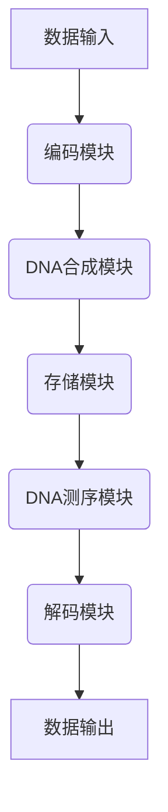

                 


# 价值投资中的生物计算DNA存储技术前景

---

## 关键词

- 价值投资
- 生物计算
- DNA存储技术
- 数据驱动决策
- 信息存储

---

## 摘要

本文探讨了生物计算中的DNA存储技术在价值投资领域的前景。通过分析DNA存储技术的核心原理、优势及其在投资分析中的应用，展示了其如何改变数据存储和分析方式，进而提升投资决策的效率和准确性。文章结合数学模型和实际案例，详细讲解了DNA存储技术在价值投资中的潜力和应用前景。

---

# 第1章：生物计算与DNA存储技术概述

## 1.1 生物计算的基本概念

### 1.1.1 生物计算的定义与特点

生物计算是一种新兴的计算范式，利用生物分子（如DNA、RNA）进行信息处理和存储。与传统电子计算不同，生物计算利用生物分子的特性进行数据操作，具有并行性高、存储密度大、能耗低等优势。

### 1.1.2 DNA存储技术的核心原理

DNA存储技术是生物计算的重要组成部分，通过将数据编码到DNA分子中进行存储。DNA由腺嘌呤（A）、胸腺嘧啶（T）、胞嘧啶（C）、鸟嘌呤（G）四种碱基组成，其序列可以表示二进制数据。数据的存储和检索依赖于DNA的合成和测序技术。

### 1.1.3 生物计算与传统计算的对比

| 特性       | 生物计算            | 传统计算        |
|------------|--------------------|-----------------|
| 并行性      | 高                 | 低              |
| 存储密度    | 极高               | 较低            |
| 能耗        | 低                 | 较高            |
| 数据处理方式 | 分子层面处理        | 电子信号处理    |

---

## 1.2 DNA存储技术的背景与现状

### 1.2.1 DNA存储技术的发展历程

DNA存储技术起源于20世纪90年代，随着基因测序技术的发展，其应用范围逐渐扩大。近年来，随着大数据时代的到来，DNA存储技术因其高存储密度和持久性，成为研究热点。

### 1.2.2 当前DNA存储技术的瓶颈与挑战

- **技术瓶颈**：DNA合成和测序成本高、速度慢。
- **数据纠错**：DNA存储容易受到分子噪声的影响，导致数据丢失或错误。
- **数据安全性**：生物分子易受环境影响，存储数据的安全性较低。

### 1.2.3 生物计算在数据存储领域的潜力

随着数据量的爆炸式增长，传统存储技术面临容量和能耗的双重压力。生物计算通过DNA存储技术提供了一种高效、可持续的存储解决方案，为价值投资中的数据分析提供了新的思路。

---

# 第2章：DNA存储技术的核心概念与原理

## 2.1 DNA存储的基本原理

### 2.1.1 DNA的双螺旋结构与信息存储

DNA的双螺旋结构由互补的两条链组成，每个碱基对可以编码2 bits的信息。通过将数据转化为DNA序列，可以实现信息的长期存储。

### 2.1.2 生物分子的存储特性

DNA分子具有高稳定性和长期保存能力，适合存储大量数据。此外，DNA存储可以通过合成特定序列来实现数据的快速检索。

### 2.1.3 DNA存储的编码与解码过程

编码过程将数据转换为DNA序列，解码过程通过测序技术恢复原始数据。编码需要考虑数据纠错和冗余设计，以提高存储的可靠性。

---

## 2.2 DNA存储的关键技术

### 2.2.1 DNA合成与测序技术

DNA合成技术是将数据编码到DNA分子中的关键步骤，测序技术则用于恢复原始数据。这两种技术的效率和成本直接影响DNA存储的可行性。

### 2.2.2 DNA存储的纠错编码算法

为了应对DNA存储中的分子噪声，需要设计高效的纠错编码算法，如低密度奇偶校验码（LDPC）。

### 2.2.3 数据加密与安全存储

数据加密是确保DNA存储安全性的必要步骤，通过加密算法保护敏感数据不被未经授权的访问。

---

# 第3章：生物计算与价值投资的结合

## 3.1 价值投资的核心要素

### 3.1.1 价值投资的基本原理

价值投资是一种通过分析公司基本面，寻找被市场低估的投资标的。其核心在于准确、全面的数据分析。

### 3.1.2 数据驱动投资决策的重要性

数据驱动决策能够帮助投资者发现市场机会，识别潜在风险，优化投资组合。

### 3.1.3 传统投资分析的局限性

传统投资分析依赖人工数据处理，效率低、误差高。DNA存储技术能够提升数据处理效率，降低数据存储成本。

---

## 3.2 生物计算在投资分析中的应用

### 3.2.1 数据存储与分析的效率提升

通过DNA存储技术，投资者可以高效存储和快速检索大量历史数据，提升投资分析的效率。

### 3.2.2 生物计算在风险评估中的作用

DNA存储技术可以支持实时数据处理，帮助投资者快速识别市场风险，优化投资策略。

### 3.2.3 数据挖掘与预测模型的优化

生物计算通过高效的数据存储和分析，支持复杂的数据挖掘和预测模型，提升投资决策的准确性。

---

# 第4章：DNA存储技术的数学模型与算法

## 4.1 DNA存储的数学模型

### 4.1.1 信息编码的数学表达

数据的二进制表示可以通过DNA序列进行编码，例如，将二进制数据转换为碱基对序列。

$$
\text{DNA序列} = \{A, T, C, G\}^*
$$

### 4.1.2 数据存储的容量计算

DNA存储的容量计算涉及分子数量、序列长度和每个碱基对的信息量等因素。

$$
\text{存储容量} = N \times \log_2(4) \text{ bits}
$$

其中，\(N\) 是碱基对的数量。

### 4.1.3 错误纠正码的数学原理

纠错码的设计基于概率论和信息论，确保在一定错误率下数据的正确恢复。

---

## 4.2 DNA存储算法的实现

### 4.2.1 哈夫曼编码与DNA存储

哈夫曼编码是一种无损压缩算法，可以减少数据存储的空间需求。其在DNA存储中的应用可以通过优化编码长度来降低存储成本。

### 4.2.2 基因组组装算法

基因组组装算法用于将随机片段的DNA测序数据拼接成完整的基因组，类似于数据恢复过程。

### 4.2.3 数据加密算法的优化

优化加密算法可以提高DNA存储的安全性，防止数据泄露。

---

# 第5章：生物计算系统的架构与设计

## 5.1 系统架构设计

### 5.1.1 系统功能设计

生物计算系统需要具备数据存储、数据检索、数据处理等功能。

### 5.1.2 系统架构图

使用mermaid绘制系统架构图，展示各个模块之间的关系。



### 5.1.3 系统接口设计

系统接口需要支持数据输入、编码、合成、测序、解码和输出等操作。

### 5.1.4 系统交互流程

使用mermaid绘制系统交互流程图，展示用户与系统之间的交互过程。

---

## 5.2 系统功能实现

### 5.2.1 数据编码与解码

编写Python代码实现数据的哈夫曼编码与解码，展示DNA存储的核心过程。

```python
import heapq

def huffman_encode(data):
    # 创建频率字典
    frequency = {}
    for char in data:
        frequency[char] = frequency.get(char, 0) + 1
    heap = []
    for char, freq in frequency.items():
        heapq.heappush(heap, (freq, char))
    while len(heap) > 1:
        # 提取最小两个频率
        freq1, char1 = heapq.heappop(heap)
        freq2, char2 = heapq.heappop(heap)
        # 合并两个频率树
        merged = freq1 + freq2
        # 将新树压入堆
        heapq.heappush(heap, (merged, char1 + char2))
    return heap[0][1]

def huffman_decode(encoded_data, mapping):
    # 解码过程，根据编码树进行解码
    pass
```

---

## 5.3 系统优化与测试

### 5.3.1 系统性能测试

通过实验测试系统的数据存储和检索速度，验证其性能优势。

### 5.3.2 系统优化策略

优化DNA合成和测序过程，降低存储成本和时间。

---

## 总结与展望

生物计算中的DNA存储技术为价值投资提供了新的数据存储和分析方式。随着技术的不断发展，DNA存储技术将在投资分析中发挥越来越重要的作用，推动价值投资进入一个高效、精准的新时代。

---

通过以上内容，文章详细探讨了DNA存储技术在价值投资中的应用，结合理论分析和实际案例，展示了其在数据存储和投资决策中的潜力和优势。未来，随着技术的进一步发展，生物计算将在金融领域发挥更大的作用。

