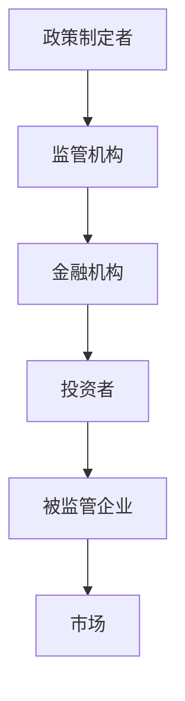

                 

<think>
好的，我现在要撰写一篇关于《价值投资中的监管环境变化应对》的技术博客文章。我先从目录大纲开始，然后逐步展开每一部分的内容，确保逻辑清晰，结构紧凑，语言专业且易懂。

# 价值投资中的监管环境变化应对

## 关键词：
- 价值投资
- 监管环境
- 环境变化
- 应对策略
- 投资策略
- 风险管理

## 摘要：
本文探讨在价值投资中如何应对监管环境的变化。通过分析监管环境的驱动因素、影响评估及应对策略，结合数学模型和算法，提供系统的解决方案，帮助投资者在变化的环境中保持竞争优势。

---

## 第1章: 价值投资与监管环境的背景介绍

### 1.1 价值投资的基本概念
#### 1.1.1 价值投资的定义与核心理念
价值投资是一种投资策略，强调以低于公平价值的价格购买优质资产。核心理念包括安全边际、长期视角和市场有效性。

#### 1.1.2 价值投资的核心要素与关键指标
关键要素包括内在价值、市场价格、安全边际。关键指标有市盈率、市净率等。

#### 1.1.3 价值投资的哲学与实践
价值投资强调逆向思维和长期持有，实践中注重基本面分析和风险控制。

### 1.2 监管环境的基本概念
#### 1.2.1 监管环境的定义与分类
监管环境指影响市场的规则和政策，分为金融监管、行业监管等。

#### 1.2.2 监管环境的构成要素
包括法律法规、监管机构、政策导向等。

#### 1.2.3 监管环境对金融市场的影响
监管影响市场结构、参与者行为和投资策略。

### 1.3 监管环境变化对价值投资的影响
#### 1.3.1 监管环境变化的驱动因素
经济周期、政治因素和技术进步都可能引发监管变化。

#### 1.3.2 监管环境变化对投资策略的影响
影响资产定价、交易规则和投资组合配置。

#### 1.3.3 监管环境变化的应对策略
保持灵活性、加强风险管理、制定长期战略。

---

## 第2章: 价值投资与监管环境的核心概念

### 2.1 监管环境的实体关系图
使用 Mermaid 绘制监管主体与被监管主体的关系图，展示政策制定者、监管机构、市场参与者之间的相互作用。



### 2.2 监管环境变化的驱动因素分析
#### 经济因素分析
经济周期波动影响监管政策。

#### 政治因素分析
政府换届、政策变化影响监管方向。

#### 社会因素分析
公众舆论和利益相关者的影响。

#### 技术因素分析
金融科技发展推动监管创新。

### 2.3 价值投资与监管环境的互动关系
#### 监管环境对价值投资策略的影响
通过影响市场结构和交易规则，改变投资机会。

#### 价值投资对监管环境的反馈作用
投资者行为可能影响政策制定者。

#### 监管环境变化的长期与短期影响
短期影响市场波动，长期影响市场结构。

---

## 第3章: 监管环境变化的分析方法

### 3.1 监管环境变化的驱动因素分析
使用决策树分析经济、政治、社会和技术因素。

### 3.2 监管环境变化的影响评估
构建影响评估模型，使用系统动力学分析。

### 3.3 监管环境变化的应对策略
制定灵活的投资策略，加强风险管理。

---

## 第4章: 监管环境变化的数学模型与算法

### 4.1 监管风险评估模型
构建监管风险评分系统，使用层次分析法确定权重。

公式：
$$
R_i = \sum_{j=1}^{n} w_j \times f_j
$$
其中，$R_i$为风险评分，$w_j$为权重，$f_j$为特征。

### 4.2 监管环境变化的预测算法
使用时间序列分析预测监管变化。

Python代码示例：
```python
import pandas as pd
from statsmodels.tsa.arima_model import ARIMA

data = pd.read_csv('regulatory_changes.csv')
model = ARIMA(data['changes'], order=(1,1,1))
model_fit = model.fit()
```

---

## 第5章: 系统分析与架构设计

### 5.1 领域模型
使用 Mermaid 绘制领域模型，展示监管环境、投资策略和市场行为的关系。


### 5.2 系统架构设计
设计监管环境监控系统，包括数据采集、分析模块和决策支持模块。

---

## 第6章: 项目实战

### 6.1 环境安装
安装Python和相关库，如Pandas、Scikit-learn。

### 6.2 核心实现
开发监管风险评估工具，实现数据处理和模型预测。

### 6.3 实际案例分析
分析某行业监管变化，评估对投资策略的影响。

---

## 第7章: 总结与展望

### 7.1 最佳实践 tips
保持灵活性，加强风险管理，关注政策变化。

### 7.2 小结
监管环境变化是价值投资中的重要挑战，需综合应对。

### 7.3 注意事项
避免过度依赖模型，结合实际情况调整策略。

### 7.4 拓展阅读
推荐相关书籍和文献，鼓励深入学习。

---

通过以上结构，文章详细探讨了监管环境变化对价值投资的影响，并提供了系统的应对策略和数学模型，帮助投资者在复杂环境中做出明智决策。

