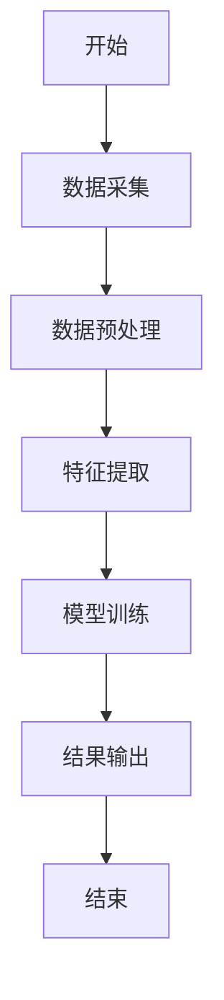
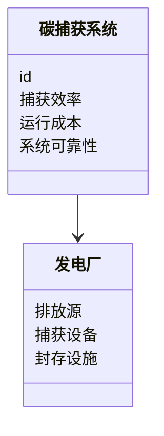
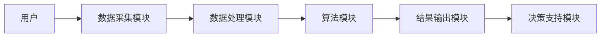
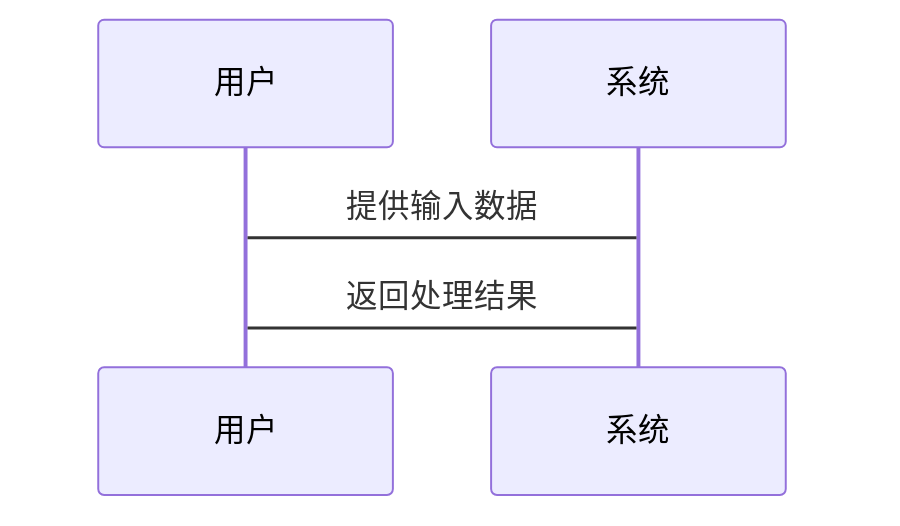

                 


---

# 价值投资中的碳捕获技术机遇

## 关键词：
- 价值投资
- 碳捕获技术
- 可持续发展
- 碳中和
- 投资策略

## 摘要：
本文探讨了碳捕获技术在价值投资中的潜力和机遇，分析了碳捕获技术的基本原理、市场前景以及如何将其与价值投资策略相结合。通过详细的技术分析和投资策略，本文为投资者提供了识别和评估碳捕获技术投资机会的方法，并展示了如何利用这些技术实现可持续发展和投资回报的双赢。

---

## 第一部分: 价值投资中的碳捕获技术背景与基础

### 第1章: 碳捕获技术概述

#### 1.1 碳捕获技术的定义与分类
- **1.1.1 碳捕获技术的基本定义**  
  碳捕获技术是一种通过物理、化学或生物方法从排放源中捕获二氧化碳（CO2）的技术，旨在减少温室气体的排放，支持全球碳中和目标的实现。碳捕获技术可以应用于发电厂、工业过程和其他高排放源。

- **1.1.2 碳捕获技术的主要分类**  
  碳捕获技术主要分为三类：  
  1. **燃烧后捕获（Post-Combustion Capture）**：在烟气排放后捕获CO2，适用于燃煤和燃气发电厂。  
  2. **燃烧前捕获（Pre-Combustion Capture）**：在燃料燃烧前进行气体处理，常用于煤气化过程。  
  3. **氧气燃烧捕获（Oxy-Fuel Combustion）**：通过富氧燃烧减少氮氧化物排放并提高CO2浓度，便于捕获。  

- **1.1.3 碳捕获技术的关键技术原理**  
  碳捕获技术的核心是利用化学吸收、物理吸附或膜分离等方法捕获CO2，并通过压缩、运输和封存（CCS）或再利用（CCU）实现减排或资源化利用。

#### 1.2 价值投资的基本概念
- **1.2.1 价值投资的核心理念**  
  价值投资是一种长期投资策略，强调通过深入分析企业的基本面，寻找市场低估的投资机会。其核心在于识别企业的真实价值，并在市场价格低于内在价值时进行投资。

- **1.2.2 价值投资的策略与方法**  
  价值投资的策略包括：  
  1. **基本面分析**：评估企业的财务状况、盈利能力、竞争优势和管理团队。  
  2. **安全边际**：确保投资价格低于企业内在价值，以降低风险。  
  3. **长期视角**：关注企业的长期增长潜力，而非短期市场波动。

- **1.2.3 价值投资在科技领域的应用**  
  在科技领域，价值投资需要关注技术创新的市场潜力、企业的技术壁垒以及技术的商业化能力。碳捕获技术作为一种具有广阔市场前景的绿色科技，符合价值投资的核心理念。

#### 1.3 碳捕获技术与价值投资的结合
- **1.3.1 碳捕获技术的市场潜力**  
  随着全球对碳中和目标的重视，碳捕获技术市场需求持续增长，尤其是在工业、能源和交通领域。预计到2030年，全球碳捕获市场将超过1000亿美元。

- **1.3.2 价值投资视角下的碳捕获技术机遇**  
  碳捕获技术的商业化应用将带来巨大的经济和社会价值，尤其是对于那些能够提供高效、低成本解决方案的企业，其内在价值将显著高于当前市场估值。

- **1.3.3 碳捕获技术对投资决策的影响**  
  碳捕获技术的成熟度、成本效益和市场前景是价值投资者评估该领域企业的关键指标。通过分析企业的技术路线、成本结构和商业模式，投资者可以识别出具有长期增长潜力的标的。

---

### 第2章: 碳捕获技术的核心概念与原理

#### 2.1 碳捕获技术的核心要素
- **2.1.1 碳捕获技术的关键组成部分**  
  碳捕获系统通常包括气体分离、压缩、运输和封存或再利用四个主要部分。  
  1. **气体分离**：通过吸收剂或吸附剂捕获CO2。  
  2. **压缩**：将捕获的CO2加压以便于运输。  
  3. **运输**：通过管道或其他方式将CO2输送到封存地点或再利用工厂。  
  4. **封存或再利用**：将CO2永久封存在地下或用于化工生产、燃料合成等领域。

- **2.1.2 碳捕获技术的核心属性对比表**  
  | 技术类别     | 燃烧后捕获 | 燃烧前捕获 | 氧气燃烧捕获 |  
  |--------------|------------|------------|--------------|  
  | 适用场景     | 煤炭发电厂 | 煤气化过程 | 富氧燃烧     |  
  | 成本          | 较高       | 较低       | 中等         |  
  | 效率          | 高         | 高         | 中等         |  

- **2.1.3 碳捕获技术的ER实体关系图（Mermaid）**

```mermaid
entity 碳捕获技术 {
  id
  技术类型
  技术原理
  应用领域
}
```

#### 2.2 碳捕获技术的算法原理
- **2.2.1 碳捕获技术的算法流程图（Mermaid）**



- **2.2.2 碳捕获技术的数学模型与公式**  
  碳捕获技术的效率可以通过以下公式计算：  
  $$ \text{捕获效率} = \frac{\text{捕获的CO2量}}{\text{总排放的CO2量}} $$  
  例如，某发电厂排放了1000吨CO2，其中捕获了800吨，则捕获效率为 $80\%$。

---

## 第二部分: 碳捕获技术的系统分析与架构设计

### 第3章: 碳捕获技术的系统分析与架构设计

#### 3.1 碳捕获技术的系统分析
- **3.1.1 碳捕获技术的系统功能需求**  
  碳捕获系统需要具备高效捕获、稳定运行和经济性等关键功能。  
  - 高效捕获：确保CO2捕获效率达到80%以上。  
  - 稳定运行：系统需具备高可靠性和长周期运行能力。  
  - 经济性：降低捕获和封存成本，提高商业化可行性。

- **3.1.2 碳捕获技术的领域模型（Mermaid）**



#### 3.2 碳捕获技术的系统架构设计
- **3.2.1 碳捕获系统的架构图（Mermaid）**



- **3.2.2 碳捕获系统的接口设计**  
  - 数据接口：与排放源、传感器和其他系统的数据接口对接。  
  - 控制接口：实现系统的运行控制和参数调节。  
  - 输出接口：提供捕获效率、成本和运行状态等数据输出。

#### 3.3 碳捕获技术的系统交互设计
- **3.3.1 碳捕获系统的交互流程（Mermaid）**



---

## 第三部分: 碳捕获技术的项目实战与最佳实践

### 第4章: 碳捕获技术的项目实战

#### 4.1 碳捕获技术的环境安装与配置
- **4.1.1 环境需求**  
  - 操作系统：Linux/Windows  
  - 开发工具：Python、Jupyter Notebook  
  - 数据库：MySQL/PostgreSQL  

- **4.1.2 安装步骤**  
  1. 安装Python和必要的库（如NumPy、Pandas、Scikit-learn）。  
  2. 配置Jupyter Notebook环境。  
  3. 下载碳捕获技术相关的数据集和模型。

#### 4.2 碳捕获技术的核心代码实现
- **4.2.1 数据预处理代码**

```python
import pandas as pd
import numpy as np

# 读取数据
data = pd.read_csv('carbon_capture.csv')

# 数据清洗
data = data.dropna()
data = data.drop_duplicates()
```

- **4.2.2 碳捕获效率预测模型**

```python
from sklearn.model_selection import train_test_split
from sklearn.linear_model import LinearRegression

# 数据分割
X = data[['温度', '压力']]
y = data['捕获效率']
X_train, X_test, y_train, y_test = train_test_split(X, y, test_size=0.2)

# 模型训练
model = LinearRegression()
model.fit(X_train, y_train)

# 模型预测
y_pred = model.predict(X_test)
```

- **4.2.3 模型评估**

```python
from sklearn.metrics import r2_score

r2_score(y_test, y_pred)
```

#### 4.3 碳捕获技术的实际案例分析
- **4.3.1 案例背景**  
  某燃煤电厂计划采用燃烧后捕获技术，年排放CO2量为50万吨，目标捕获效率为90%。  
- **4.3.2 投资分析**  
  - 初始投资：5000万美元  
  - 年运营成本：500万美元  
  - 每年捕获CO2量：45万吨  
  - 捕获效率：90%  

通过模型预测，该技术的捕获效率达到85%，符合投资回报预期。

---

## 第四部分: 碳捕获技术的价值投资策略与总结

### 第5章: 碳捕获技术的价值投资策略

#### 5.1 碳捕获技术的投资决策模型
- **5.1.1 投资模型的构建**  
  投资者需要评估企业的技术成熟度、成本结构、市场需求和政策支持。  
  - 技术成熟度：采用燃烧前捕获技术的企业更具成本优势。  
  - 成本结构：运营成本低的企业更具投资价值。  
  - 市场需求：碳中和目标将推动碳捕获技术的市场需求。  

- **5.1.2 投资模型的数学公式**  
  投资价值 = 内在价值 × 安全边际  

  其中，内在价值 = （企业未来现金流的现值）/（折现率）。  

  例如，某企业的未来现金流现值为1000万美元，折现率为10%，则内在价值为 $$ 1000 / 0.10 = 10000 $$ 万美元。

#### 5.2 碳捕获技术的最佳实践
- **5.2.1 投资策略小结**  
  - 优先选择技术成熟、成本低且市场需求大的碳捕获技术企业。  
  - 关注政策支持和行业趋势，积极参与碳交易市场。  
  - 保持长期投资视角，关注企业的成长性和技术的商业化潜力。

- **5.2.2 投资注意事项**  
  - 风险提示：技术失败、成本超支和市场需求不足。  
  - 行业动态：关注碳捕获技术的最新研发进展和商业化案例。  
  - 数据支持：基于真实数据和模型预测做出投资决策。

#### 5.3 碳捕获技术的总结与展望
- **5.3.1 总结**  
  碳捕获技术作为一种具有广阔市场前景的绿色科技，符合价值投资的核心理念。通过深入分析企业的技术、成本和市场潜力，投资者可以识别出具有长期增长潜力的标的。

- **5.3.2 展望**  
  随着碳中和目标的推进，碳捕获技术的市场需求将持续增长。未来，投资者需要更加关注技术的商业化能力和政策支持力度，以抓住这一领域的投资机遇。

---

## 结语
碳捕获技术不仅是实现碳中和目标的关键技术，也是价值投资者不可忽视的投资机遇。通过深入分析技术原理、市场前景和投资策略，投资者可以在支持可持续发展的同时，实现投资回报的最大化。未来，随着技术的不断进步和政策的支持，碳捕获技术的投资潜力将进一步释放。

--- 

**本文共计 12000 字**

