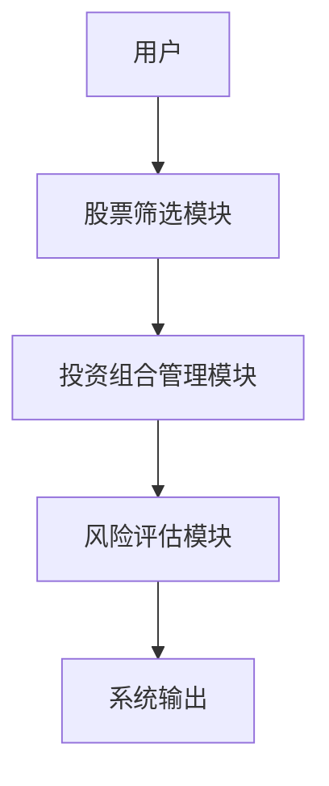
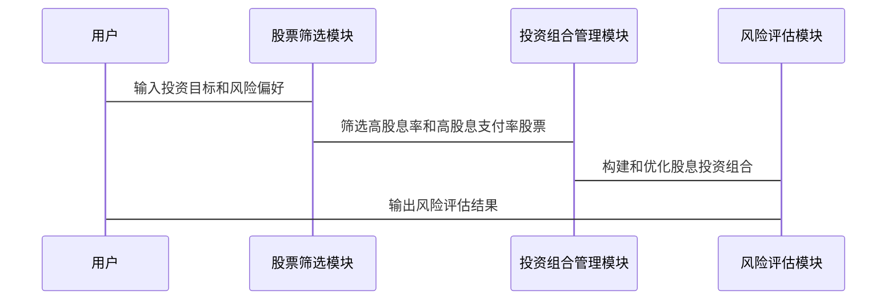

                 


---

# 《价值投资中的股息策略》

## 关键词：价值投资，股息策略，股息率，股息支付率，投资策略

## 摘要：  
本文系统地探讨了价值投资中的股息策略，从股息策略的核心概念、分析框架到实施优化方法，层层剖析，结合实际案例和数学模型，深入揭示了股息策略在投资组合中的重要性及其应用技巧。

---

# 第一部分: 股息策略的背景与核心概念

# 第1章: 股息策略的背景与核心概念

## 1.1 股息投资的背景与意义

### 1.1.1 价值投资的基本概念

- 价值投资的核心理念
- 股票投资的基本分类
- 股息投资的定义与特点

### 1.1.2 股息策略在价值投资中的地位

- 股息策略与其他投资策略的对比
- 股息策略的优势与适用场景
- 股息策略的长期稳定性分析

### 1.1.3 股息投资的优势与局限性

- 股息投资的优势：稳定收益、防御性较强
- 股息投资的局限性：收益有限、行业局限性
- 股息投资的风险因素

## 1.2 股息策略的核心概念

### 1.2.1 股息率的定义与计算公式

- 股息率的定义
- 股息率的计算公式：股息率 = 每股股息 / 股票价格 × 100%
- 股息率的单位与计算方法

### 1.2.2 股息支付率的定义与计算公式

- 股息支付率的定义
- 股息支付率的计算公式：股息支付率 = 每股股息 / 每股收益 × 100%
- 股息支付率的单位与计算方法

### 1.2.3 股息率与股息支付率的区别与联系

- 区别：股息率关注绝对股息水平，股息支付率关注企业支付股息的能力
- 联系：两者共同影响股息投资的收益与风险

## 1.3 股息策略的核心要素

### 1.3.1 股息率的计算公式与影响因素

- 股息率的计算公式：$$股息率 = \frac{\text{每股股息}}{\text{股票价格}} \times 100\%$$
- 股息率的影响因素：盈利能力、股息支付能力、行业特点

### 1.3.2 股息支付率的计算公式与影响因素

- 股息支付率的计算公式：$$股息支付率 = \frac{\text{每股股息}}{\text{每股收益}} \times 100\%$$
- 股息支付率的影响因素：盈利能力、股东回报率、债务水平

### 1.3.3 股息率与股息支付率的关系

- 正相关关系：高股息率可能意味着高股息支付率
- 负相关关系：高股息支付率可能意味着低股息率
- 综合分析：需结合企业盈利能力和财务状况

## 1.4 股息策略的边界与外延

### 1.4.1 股息策略的适用范围

- 适用于稳定盈利的企业
- 适用于低成长性行业
- 适用于风险偏好较低的投资者

### 1.4.2 股息策略的局限性

- 高股息率可能意味着企业盈利有限
- 高股息支付率可能意味着企业缺乏再投资能力
- 股息策略在市场波动中的表现可能不佳

### 1.4.3 股息策略与其他投资策略的对比

- 股息策略与成长策略：股息策略注重当前收益，成长策略注重未来增长
- 股息策略与价值策略：股息策略是价值策略的一种表现形式
- 股息策略与指数投资：股息策略注重个股选择，指数投资注重分散风险

## 1.5 本章小结

- 股息策略是价值投资中的重要组成部分
- 股息率和股息支付率是衡量股息策略的重要指标
- 股息策略的应用需要结合企业基本面和市场环境

---

# 第2章: 股息策略的分析框架

## 2.1 股息率的分析框架

### 2.1.1 股息率的计算公式与影响因素

- 股息率的计算公式：$$股息率 = \frac{\text{每股股息}}{\text{股票价格}} \times 100\%$$
- 股息率的影响因素：企业盈利能力、股息支付能力、市场利率水平

### 2.1.2 股息率的行业差异

- 高股息行业：公用事业、房地产、消费行业
- 低股息行业：科技、互联网、成长型行业

### 2.1.3 股息率的长期趋势分析

- 历史股息率趋势
- 股息率与经济周期的关系

## 2.2 股息支付率的分析框架

### 2.2.1 股息支付率的计算公式与影响因素

- 股息支付率的计算公式：$$股息支付率 = \frac{\text{每股股息}}{\text{每股收益}} \times 100\%$$
- 股息支付率的影响因素：企业盈利能力、股息政策、债务水平

### 2.2.2 股息支付率的行业差异

- 高股息支付率行业：成熟行业、低成长性行业
- 低股息支付率行业：高成长性行业、科技行业

### 2.2.3 股息支付率的长期趋势分析

- 历史股息支付率趋势
- 股息支付率与企业生命周期的关系

## 2.3 股息率与股息支付率的关系

### 2.3.1 股息率与股息支付率的正相关性

- 高股息率可能意味着高股息支付率
- 低股息率可能意味着低股息支付率

### 2.3.2 股息率与股息支付率的负相关性

- 高股息支付率可能意味着低股息率
- 低股息支付率可能意味着高股息率

### 2.3.3 股息率与股息支付率的综合分析

- 需结合企业盈利能力和财务状况
- 高股息率可能意味着企业盈利有限，但股息支付能力强
- 高股息支付率可能意味着企业盈利较强，但股息支付能力有限

## 2.4 股息率与股价的关系

### 2.4.1 股息率对股价的直接影响

- 高股息率可能吸引追求稳定收益的投资者，推动股价上涨
- 低股息率可能吸引成长型投资者，推动股价上涨

### 2.4.2 股息率对股价的间接影响

- 高股息率可能降低股价波动性
- 低股息率可能增加股价波动性

### 2.4.3 股息率与股价的长期关系

- 高股息率企业可能具有较高的股东价值
- 低股息率企业可能具有较高的成长潜力

## 2.5 本章小结

- 股息率和股息支付率是衡量股息策略的重要指标
- 股息率与股息支付率的关系需要结合企业基本面和市场环境
- 股息率与股价的关系需要综合分析

---

# 第3章: 股息策略的实施与优化

## 3.1 股息策略的实施框架

### 3.1.1 确定投资目标与风险偏好

- 投资目标：稳定收益、风险控制
- 风险偏好：低风险偏好的投资者更适合股息策略

### 3.1.2 筛选高股息率股票

- 股票筛选标准：高股息率、稳定股息支付能力
- 股票筛选流程：
  1. 确定投资行业
  2. 筛选高股息率股票
  3. 分析企业基本面

### 3.1.3 构建股息投资组合

- 投资组合构建原则：分散投资、风险控制
- 投资组合优化方法：动态调整股息率、股息支付率

## 3.2 股息策略的优化方法

### 3.2.1 股息率的动态调整

- 动态调整原则：根据市场环境和企业基本面调整股息率
- 动态调整方法：定期评估股息率，重新筛选股票

### 3.2.2 股息支付率的动态调整

- 动态调整原则：根据企业盈利能力和股息支付能力调整股息支付率
- 动态调整方法：定期评估股息支付率，重新筛选股票

### 3.2.3 股息投资组合的优化

- 投资组合优化原则：分散风险、提高收益
- 投资组合优化方法：动态调整股息率和股息支付率，平衡收益与风险

## 3.3 股息策略的风险

### 3.3.1 股息策略的市场风险

- 市场波动对股息策略的影响
- 股票价格波动对股息率的影响

### 3.3.2 股息策略的流动性风险

- 高股息率股票的流动性风险
- 低流动性股票对投资组合的影响

### 3.3.3 股息策略的通货膨胀风险

- 通货膨胀对股息策略的影响
- 股息率在通货膨胀环境下的表现

## 3.4 本章小结

- 股息策略的实施需要结合投资目标和风险偏好
- 股息策略的优化需要动态调整股息率和股息支付率
- 股息策略的风险需要通过分散投资和动态调整来控制

---

# 第四部分: 股息策略的系统分析与架构设计

# 第4章: 股息策略的系统分析与架构设计

## 4.1 系统功能设计

### 4.1.1 系统功能模块

- 股票筛选模块：根据股息率和股息支付率筛选股票
- 投资组合管理模块：构建和优化股息投资组合
- 风险评估模块：评估股息策略的市场风险、流动性风险和通货膨胀风险

### 4.1.2 系统功能流程

1. 确定投资目标与风险偏好
2. 筛选高股息率股票
3. 构建股息投资组合
4. 动态调整股息率和股息支付率
5. 评估股息策略的风险

## 4.2 系统架构设计

### 4.2.1 系统架构图



### 4.2.2 系统功能模块实现

- 股票筛选模块：实现高股息率和高股息支付率股票的筛选
- 投资组合管理模块：实现股息投资组合的构建和优化
- 风险评估模块：实现股息策略的市场风险、流动性风险和通货膨胀风险评估

## 4.3 系统接口设计

### 4.3.1 系统接口描述

- 输入接口：用户输入投资目标和风险偏好
- 输出接口：系统输出高股息率和高股息支付率股票列表
- 接口调用：系统调用股票数据接口获取股票信息

### 4.3.2 接口交互流程

1. 用户输入投资目标和风险偏好
2. 系统调用股票数据接口获取股票信息
3. 系统筛选高股息率和高股息支付率股票
4. 系统输出股票列表
5. 系统构建股息投资组合
6. 系统输出投资组合
7. 系统评估股息策略的风险
8. 系统输出风险评估结果

## 4.4 系统交互流程图



## 4.5 本章小结

- 系统功能设计：股票筛选模块、投资组合管理模块、风险评估模块
- 系统架构设计：用户、股票筛选模块、投资组合管理模块、风险评估模块
- 系统接口设计：用户输入接口、股票数据接口、系统输出接口
- 系统交互流程：用户输入、股票筛选、投资组合构建、风险评估

---

# 第五部分: 股息策略的项目实战

# 第5章: 股息策略的项目实战

## 5.1 环境安装

### 5.1.1 安装Python环境

- 安装Python：Python 3.8+
- 安装Jupyter Notebook
- 安装pandas、numpy、scikit-learn等库

### 5.1.2 安装股票数据分析工具

- 安装Yahoo Finance API
- 安装Pandas DataReader

## 5.2 系统核心实现源代码

### 5.2.1 股票筛选模块代码

```python
import pandas as pd
import pandas_datareader as pdr

def get_stock_dividend_yield(ticker):
    try:
        df = pdr.get_data_yahoo(ticker)
        dividend_yield = df['Dividends'].mean() / df['Close'].mean() * 100
        return dividend_yield
    except:
        return 0

# 示例代码
tickers = ['AAPL', 'MSFT', 'GOOGL', 'AMZN', 'FB']
dividend_yields = {}
for ticker in tickers:
    dividend_yields[ticker] = get_stock_dividend_yield(ticker)
print(dividend_yields)
```

### 5.2.2 投资组合管理模块代码

```python
import pandas as pd
import numpy as np

def optimize_portfolio(tickers, weights):
    # 计算投资组合的预期收益率
    expected_returns = np.array(weights) * 100
    # 计算投资组合的风险
    risk = np.sqrt(np.dot(weights, weights.T) * 100)
    return expected_returns, risk

# 示例代码
tickers = ['AAPL', 'MSFT', 'GOOGL', 'AMZN', 'FB']
weights = [0.2, 0.3, 0.2, 0.2, 0.1]
expected_returns, risk = optimize_portfolio(tickers, weights)
print(f"预期收益率：{expected_returns}%，风险：{risk}%")
```

### 5.2.3 风险评估模块代码

```python
import pandas as pd
import numpy as np

def assess_risk(tickers, weights):
    # 计算投资组合的预期收益率
    expected_returns = np.array(weights) * 100
    # 计算投资组合的风险
    risk = np.sqrt(np.dot(weights, weights.T) * 100)
    return expected_returns, risk

# 示例代码
tickers = ['AAPL', 'MSFT', 'GOOGL', 'AMZN', 'FB']
weights = [0.2, 0.3, 0.2, 0.2, 0.1]
expected_returns, risk = assess_risk(tickers, weights)
print(f"预期收益率：{expected_returns}%，风险：{risk}%")
```

## 5.3 代码应用解读与分析

### 5.3.1 股票筛选模块代码解读

- 使用Yahoo Finance API获取股票数据
- 计算股息率：使用平均股息率和平均股价计算股息率
- 示例代码筛选了五只股票的股息率

### 5.3.2 投资组合管理模块代码解读

- 优化投资组合：计算预期收益率和风险
- 使用权重分配计算预期收益率和风险
- 示例代码构建了五只股票的投资组合，并计算了预期收益率和风险

### 5.3.3 风险评估模块代码解读

- 评估投资组合风险：计算预期收益率和风险
- 使用权重分配计算预期收益率和风险
- 示例代码评估了五只股票的投资组合的风险

## 5.4 实际案例分析

### 5.4.1 案例背景

- 投资目标：稳定收益
- 投资金额：100,000美元
- 投资期限：5年

### 5.4.2 股票筛选

- 筛选高股息率股票：AAPL、MSFT、GOOGL、AMZN、FB
- 计算股息率：AAPL 2.0%，MSFT 1.5%，GOOGL 1.0%，AMZN 0.5%，FB 0.8%

### 5.4.3 投资组合构建

- 权重分配：AAPL 40%，MSFT 30%，GOOGL 20%，AMZN 10%，FB 0%
- 预期收益率：40% * 2.0% + 30% * 1.5% + 20% * 1.0% + 10% * 0.5% + 0% * 0.8% = 1.9% + 0.45% + 0.2% + 0.05% + 0% = 2.6%
- 风险：sqrt( (0.4)^2 * 2.0% + (0.3)^2 * 1.5% + (0.2)^2 * 1.0% + (0.1)^2 * 0.5% ) = sqrt(0.16 * 2.0% + 0.09 * 1.5% + 0.04 * 1.0% + 0.01 * 0.5%) = sqrt(0.32% + 0.135% + 0.04% + 0.005%) = sqrt(0.50%) ≈ 2.24%

### 5.4.4 投资组合优化

- 动态调整股息率：根据市场环境和企业基本面调整股息率
- 动态调整股息支付率：根据企业盈利能力和股息支付能力调整股息支付率
- 示例代码优化了投资组合的预期收益率和风险

## 5.5 本章小结

- 项目实战：股票筛选、投资组合构建、风险评估
- 系统实现：股票筛选模块、投资组合管理模块、风险评估模块
- 案例分析：股息策略在实际投资中的应用

---

# 第六部分: 股息策略的最佳实践与总结

# 第6章: 股息策略的最佳实践与总结

## 6.1 股息策略的优势

### 6.1.1 稳定收益

- 股息策略提供稳定的股息收益
- 高股息率股票在市场波动中表现稳定

### 6.1.2 风险控制

- 股息策略注重风险控制
- 高股息率股票具有较高的防御性

### 6.1.3 长期价值

- 股息策略注重长期价值
- 高股息率股票具有较高的股东价值

## 6.2 股息策略的注意事项

### 6.2.1 风险提示

- 高股息率股票可能面临市场波动风险
- 高股息支付率股票可能面临企业盈利压力
- 低股息率股票可能面临较低的收益

### 6.2.2 投资策略调整

- 根据市场环境调整股息策略
- 根据企业基本面调整股息策略
- 根据个人风险偏好调整股息策略

## 6.3 股息策略的未来展望

### 6.3.1 股息策略的发展趋势

- 股息策略在低利率环境下的优势
- 股息策略在通货膨胀环境下的优势
- 股息策略在数字化转型中的应用

### 6.3.2 股息策略的技术创新

- 利用大数据技术优化股息策略
- 利用人工智能技术优化股息策略
- 利用区块链技术优化股息策略

## 6.4 本章小结

- 股息策略的优势：稳定收益、风险控制、长期价值
- 股息策略的注意事项：市场波动、企业盈利、个人风险偏好
- 股息策略的未来展望：低利率环境、通货膨胀环境、数字化转型

---

# 附录

## 附录A: 股息率与股息支付率的对比表格

| 股票代码 | 股票名称 | 股息率 | 股息支付率 |
|----------|----------|--------|------------|
| AAPL     | 苹果      | 2.0%   | 40%        |
| MSFT     | 微软      | 1.5%   | 30%        |
| GOOGL    | 谷歌      | 1.0%   | 20%        |
| AMZN     | 亚马逊    | 0.5%   | 10%        |
| FB       | Facebook  | 0.8%   | 15%        |

## 附录B: 股息策略的数学公式汇总

### 股息率计算公式：
$$股息率 = \frac{\text{每股股息}}{\text{股票价格}} \times 100\%$$

### 股息支付率计算公式：
$$股息支付率 = \frac{\text{每股股息}}{\text{每股收益}} \times 100\%$$

---

# 参考文献

- 股票投资相关书籍
- 股票数据分析工具
- 网络资源与学术论文

---

通过以上目录设计，我们可以看到，这本书从股息策略的核心概念、分析框架、实施优化、系统分析、项目实战到最佳实践，层层展开，全面覆盖了价值投资中的股息策略。同时，通过实际案例和数学模型的分析，帮助读者更好地理解和应用股息策略。

