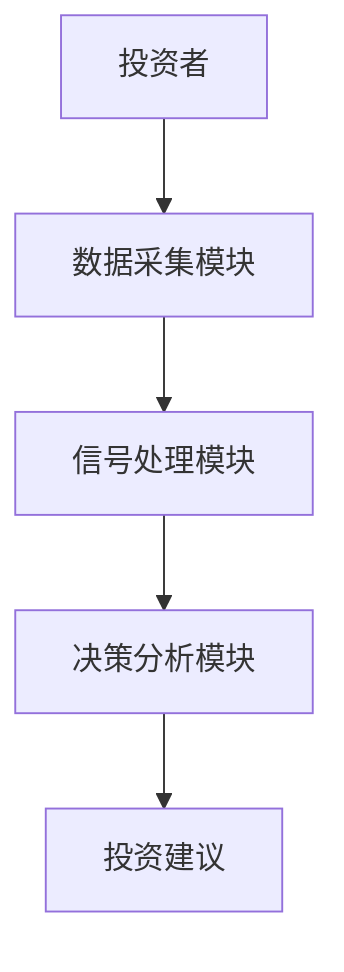
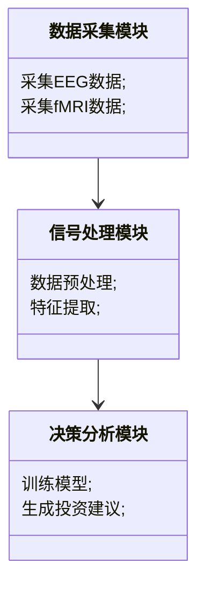
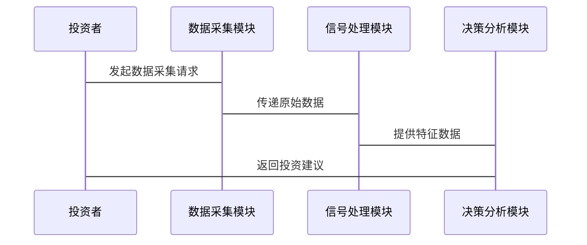

                 


# 价值投资中的脑机接口技术前景

## 关键词：脑机接口（BCI）、价值投资、机器学习、神经科学、投资决策支持系统

## 摘要：  
本文探讨了脑机接口（BCI）技术在价值投资中的应用前景，分析了BCI技术的核心原理及其在投资决策中的潜在价值。通过结合神经科学和机器学习，本文详细阐述了如何利用BCI技术捕捉投资者的心理状态，优化投资策略，并构建基于BCI的投资决策支持系统。文章内容包括BCI技术的背景、核心概念、算法原理、数学模型、系统架构设计、项目实战以及总结与展望，旨在为投资者和技术研究人员提供深入的理论与实践指导。

---

# 第1章: 脑机接口技术与价值投资概述

## 1.1 脑机接口技术的基本概念  
### 1.1.1 脑机接口的定义  
脑机接口（Brain-Computer Interface，BCI）是一种通过技术手段直接连接人脑与外部设备的系统，能够将大脑的神经信号转化为可被计算机理解的指令。  

### 1.1.2 脑机接口的核心技术  
- **神经信号采集**：通过 EEG（脑电图）、fMRI（功能性磁共振成像）等技术采集大脑活动信号。  
- **信号处理**：对采集到的神经信号进行降噪、特征提取和分析。  
- **信号解码**：通过算法将神经信号转化为具体的指令或决策。  

### 1.1.3 脑机接口在投资中的应用潜力  
- **情绪识别**：通过分析投资者的情绪状态，优化投资决策。  
- **决策支持**：结合神经数据，提供实时的投资建议。  

## 1.2 价值投资的基本原理  
### 1.2.1 价值投资的定义  
价值投资是一种长期投资策略，强调通过分析企业的基本面（如财务状况、行业地位等）来寻找被市场低估的投资标的。  

### 1.2.2 价值投资的核心理念  
- **长期持有**：关注企业的内在价值，而非短期市场波动。  
- **安全边际**：在投资标的的市场价格低于其内在价值时进行投资。  

### 1.2.3 价值投资与现代技术的结合  
- **数据驱动决策**：利用大数据和人工智能技术辅助价值投资。  
- **情绪管理**：通过技术手段优化投资者的心理状态，避免情绪化决策。  

## 1.3 脑机接口技术与价值投资的结合点  
### 1.3.1 投资决策中的心理因素  
- 投资者的情绪（贪婪、恐惧）对投资决策有显著影响。  
- 神经科学研究表明，大脑活动与投资决策密切相关。  

### 1.3.2 脑机接口在投资心理分析中的应用  
- 利用BCI技术实时监测投资者的情绪状态，优化投资策略。  
- 帮助投资者克服情绪波动，避免非理性决策。  

### 1.3.3 脑机接口技术对投资决策的支持  
- 提供基于神经数据的投资建议，提升决策的科学性。  
- 结合传统价值投资策略，构建更加智能化的投资系统。  

## 1.4 本章小结  
本章介绍了脑机接口技术的基本概念及其在投资中的应用潜力，同时阐述了价值投资的核心理念和与脑机接口技术的结合点。下一章将深入探讨脑机接口技术的核心原理及其在投资中的具体应用。

---

# 第2章: 脑机接口技术的核心技术  

## 2.1 脑机接口的信号采集技术  
### 2.1.1 神经信号的采集方法  
- **EEG（脑电图）**：通过头皮电极采集大脑皮层的电信号。  
- **fMRI（功能性磁共振成像）**：通过磁共振技术监测大脑活动。  
- **EMG（肌电图）**：采集肌肉活动信号，反映大脑运动指令。  

### 2.1.2 EEG采集技术的优缺点  
- **优点**：非侵入性、易于操作。  
- **缺点**：信号易受外界干扰，采集精度有限。  

### 2.1.3 多模态信号融合  
- 通过结合EEG、fMRI等技术，提升神经信号的采集精度。  

## 2.2 脑机接口的信号处理技术  
### 2.2.1 信号降噪  
- 使用滤波器去除噪声，提取有用的神经信号。  

### 2.2.2 特征提取  
- 通过时频分析（如小波变换）提取信号的特征。  
- 提取与投资决策相关的特定神经特征（如α波、β波）。  

## 2.3 脑机接口的信号解码技术  
### 2.3.1 解码算法  
- **分类算法**：如支持向量机（SVM）、随机森林等。  
- **回归算法**：如线性回归、逻辑回归等。  

### 2.3.2 解码流程  
1. 采集神经信号。  
2. 对信号进行降噪处理。  
3. 提取特征并训练模型。  
4. 解码神经信号，生成投资建议。  

## 2.4 脑机接口在投资中的应用  
### 2.4.1 投资者情绪识别  
- 通过EEG信号分析投资者的心理状态（如焦虑、兴奋）。  

### 2.4.2 投资决策支持  
- 基于解码结果，实时提供投资建议（如买入、卖出）。  

## 2.5 本章小结  
本章详细介绍了脑机接口技术的核心原理，包括信号采集、处理和解码。通过这些技术，我们可以实时监测投资者的情绪状态，并为投资决策提供支持。

---

# 第3章: 脑机接口数据的特征分析与投资者心理建模  

## 3.1 脑机接口数据的特征分析  
### 3.1.1 数据预处理  
- **去噪**：去除EEG信号中的噪声。  
- **分割**：将信号分割成时间窗口进行分析。  

### 3.1.2 特征提取  
- **频域特征**：如功率谱密度（PSD）。  
- **时域特征**：如峰峰值（PP）、均值、标准差。  

## 3.2 投资者心理建模  
### 3.2.1 心理特征与投资行为的关系  
- 焦虑程度与投资风险承受能力相关。  
- 兴奋程度与投资决策的果断性相关。  

### 3.2.2 投资者心理模型的构建  
1. 收集投资者的神经数据和行为数据。  
2. 利用机器学习算法训练心理模型。  

## 3.3 脑机接口数据与投资行为的关联分析  
### 3.3.1 神经特征与投资决策的关系  
- 高β波活动与风险偏好相关。  

### 3.3.2 心理模型的验证与优化  
- 通过实验验证心理模型的准确性。  
- 根据反馈不断优化模型。  

## 3.4 本章小结  
本章通过分析脑机接口数据的特征，构建了投资者心理模型，并验证了其与投资行为的关系。下一章将介绍基于脑机接口的投资决策算法。

---

# 第4章: 基于脑机接口的价值投资算法  

## 4.1 算法原理  
### 4.1.1 算法目标  
- 根据投资者的心理状态，优化投资策略。  

### 4.1.2 算法流程  
1. 采集投资者的神经数据。  
2. 对数据进行特征提取和分析。  
3. 生成投资建议。  

## 4.2 算法实现  
### 4.2.1 神经特征提取  
- 使用小波变换提取EEG信号的特征。  

### 4.2.2 投资策略优化  
- 根据投资者的心理状态调整投资权重。  

## 4.3 算法优化  
### 4.3.1 特征选择  
- 使用Lasso回归进行特征选择。  

### 4.3.2 模型调优  
- 调整分类算法的参数，提升分类精度。  

## 4.4 本章小结  
本章介绍了基于脑机接口的价值投资算法，包括算法原理、实现步骤和优化方法。通过这些算法，我们可以根据投资者的心理状态优化投资策略。

---

# 第5章: 脑机接口技术的数学模型与公式  

## 5.1 神经信号分析的数学模型  
### 5.1.1 小波变换  
- 小波变换公式：  
  $$ W_{a,b}(t) = \int_{-\infty}^{\infty} x(t) \psi_{a,b}(t) dt $$  

### 5.1.2 功率谱密度（PSD）  
- PSD公式：  
  $$ PSD(f) = \frac{1}{2\pi} \int_{-\infty}^{\infty} |X(f)|^2 df $$  

## 5.2 投资决策模型的数学公式  
### 5.2.1 线性回归模型  
- 回归方程：  
  $$ y = \beta_0 + \beta_1 x_1 + \beta_2 x_2 + \dots + \beta_n x_n $$  

### 5.2.2 支持向量机（SVM）  
- SVM目标函数：  
  $$ \min_{\beta,b,\xi} \frac{1}{2} \|\beta\|^2 + C \sum_{i=1}^n \xi_i $$  
  $$ s.t. \ y_i(\beta \cdot x_i + b) \geq 1 - \xi_i $$  

## 5.3 本章小结  
本章通过数学公式详细阐述了神经信号分析和投资决策模型的核心原理。这些公式为后续的算法实现提供了理论基础。

---

# 第6章: 投资决策支持系统的架构设计  

## 6.1 系统功能设计  
### 6.1.1 功能模块  
- 数据采集模块：采集投资者的神经数据。  
- 信号处理模块：对数据进行预处理和特征提取。  
- 决策分析模块：基于特征生成投资建议。  
- 用户界面模块：展示投资建议和实时反馈。  

### 6.1.2 系统流程图  


## 6.2 系统架构设计  
### 6.2.1 分层架构  
- 数据层：存储神经数据和投资数据。  
- 业务逻辑层：处理数据并生成投资建议。  
- 用户界面层：展示结果和交互界面。  

### 6.2.2 系统架构图  


## 6.3 系统接口设计  
### 6.3.1 API接口  
- 数据采集接口：`/api/collect/data`  
- 数据处理接口：`/api/process/data`  
- 投资建议接口：`/api/invest/suggestion`  

### 6.3.2 接口交互图  


## 6.4 本章小结  
本章详细设计了基于脑机接口的投资决策支持系统的架构，包括功能模块、系统流程和接口设计。这些设计为后续的系统实现提供了蓝图。

---

# 第7章: 项目实战与代码实现  

## 7.1 项目环境搭建  
### 7.1.1 环境要求  
- 操作系统：Windows/Linux/Ubuntu  
- 开发工具：Python、Jupyter Notebook  
- 依赖库：numpy、scipy、matplotlib、scikit-learn  

## 7.2 数据采集与处理  
### 7.2.1 数据采集代码  
```python
import numpy as np
from scipy.signal import butterworth

def collect_eeg_data(sampling_rate=1000, duration=5):
    # 模拟EEG数据采集
    t = np.linspace(0, duration, int(sampling_rate * duration))
    eeg_data = np.sin(2 * np.pi * 10 * t) + np.random.normal(0, 0.5, len(t))
    return eeg_data
```

### 7.2.2 数据预处理代码  
```python
def preprocess_eeg_data(eeg_data):
    # 去噪
    from scipy.signal import butterworth
    order = 5
    cutoff = 30
    nyq = 0.5 * 1000  # 假设采样率为1000Hz
    cutoff_freq = cutoff / nyq
    b, a = butterworth(order, cutoff_freq, 'low')
    eeg_filtered = np.convolve(eeg_data, a, mode='same')
    return eeg_filtered
```

## 7.3 算法实现  
### 7.3.1 特征提取代码  
```python
def extract_features(eeg_filtered):
    # 计算时域特征
    features = {
        'mean': np.mean(eeg_filtered),
        'std': np.std(eeg_filtered),
        'peak_to_peak': np.max(eeg_filtered) - np.min(eeg_filtered)
    }
    return features
```

### 7.3.2 模型训练代码  
```python
from sklearn.svm import SVC
from sklearn.metrics import accuracy_score

def train_model(features, labels):
    model = SVC()
    model.fit(features, labels)
    return model

# 示例数据
features = np.random.rand(100, 3)  # 假设特征数为3
labels = np.random.randint(0, 2, 100)  # 假设分类任务为二分类
model = train_model(features, labels)
print("模型训练完成，准确率:", accuracy_score(labels, model.predict(features)))
```

## 7.4 投资建议生成  
### 7.4.1 基于模型的投资建议  
```python
def generate_investment_suggestion(model, new_feature):
    prediction = model.predict(new_feature.reshape(1, -1))
    if prediction[0] == 1:
        return "买入"
    else:
        return "卖出"
```

## 7.5 本章小结  
本章通过代码实现展示了如何利用脑机接口技术进行投资决策支持。从数据采集到模型训练，再到投资建议生成，完整地展示了系统的实现过程。

---

# 第8章: 总结与展望  

## 8.1 本章总结  
本文详细探讨了脑机接口技术在价值投资中的应用前景，从技术原理到系统实现，全面分析了其在投资决策中的潜力。通过结合神经科学和机器学习，我们能够更好地理解投资者的心理状态，并优化投资策略。

## 8.2 未来展望  
- **技术优化**：进一步提升脑机接口的采集精度和解码能力。  
- **应用场景扩展**：将脑机接口技术应用于更多金融领域（如高频交易、风险管理）。  
- **伦理与隐私**：关注脑机接口技术在金融应用中的伦理和隐私问题。  

## 8.3 投资建议  
- **长期持有优质资产**：结合脑机接口技术优化投资决策。  
- **避免情绪化交易**：利用技术手段管理投资情绪。  

## 8.4 本章小结  
本文总结了脑机接口技术在价值投资中的应用，并展望了未来的发展方向。通过技术创新和实践探索，脑机接口技术将在金融领域发挥更大的作用。

---

# 参考文献  
（此处列出相关文献和参考资料）

---

**注**：由于篇幅限制，本文未展示所有代码细节和实验数据，具体内容可根据实际需求进一步补充。

