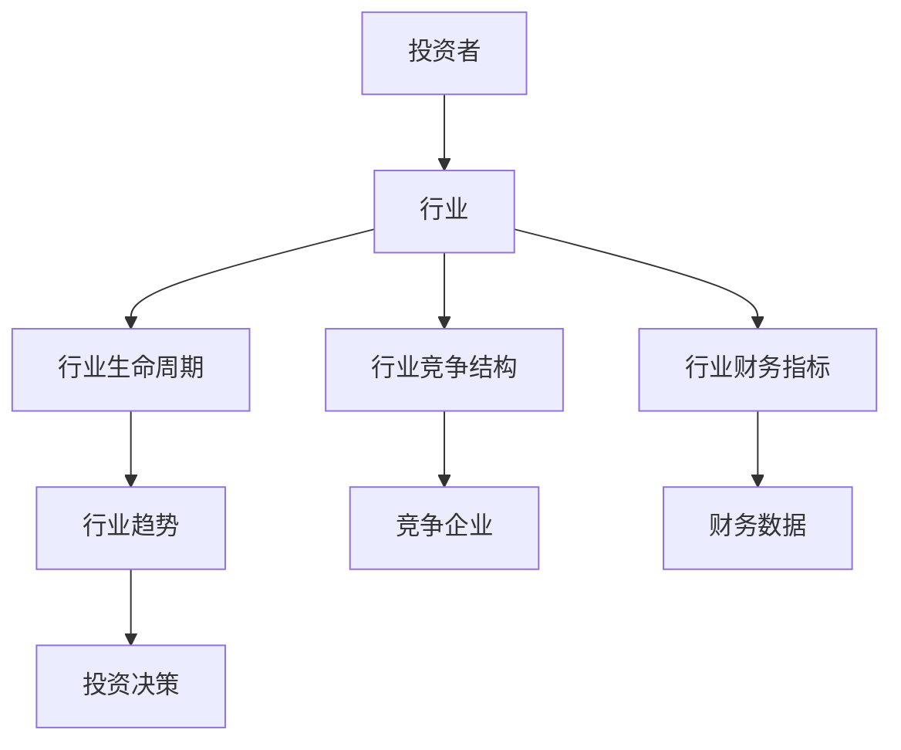
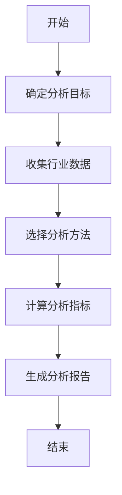
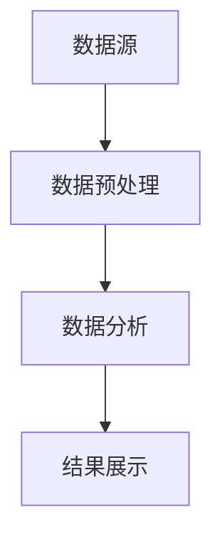
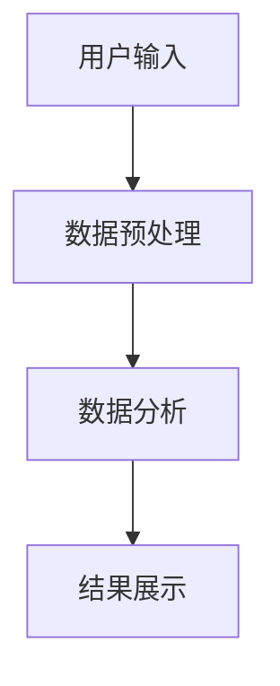

                 


# 价值投资中的行业分析方法

## 关键词：价值投资、行业分析、投资策略、行业趋势、财务指标

## 摘要：  
本文详细探讨了价值投资中的行业分析方法，从行业生命周期、竞争结构到财务指标，逐步分析了如何通过行业分析来制定有效的投资策略。文章结合了理论与实践，通过具体案例分析和数学模型，帮助投资者系统地理解行业分析的核心概念、算法原理和系统架构设计。

---

# 第1章 价值投资与行业分析概述

## 1.1 价值投资的基本概念

### 1.1.1 价值投资的定义与核心理念
价值投资是一种以低于内在价值的价格买入优质资产的投资策略，其核心理念是通过深入分析企业的基本面，寻找市场低估的投资机会。行业分析作为价值投资的重要组成部分，帮助投资者评估行业的整体健康状况和潜在投资机会。

### 1.1.2 行业分析在价值投资中的重要性
行业分析是价值投资的关键步骤，它帮助投资者识别行业周期性风险、竞争格局变化以及未来发展趋势。通过行业分析，投资者可以更准确地评估企业的内在价值，从而做出更明智的投资决策。

### 1.1.3 行业分析的基本框架与工具
行业分析的基本框架包括行业生命周期分析、行业竞争结构分析和行业财务指标分析。常用的工具包括波特五力模型、SWOT分析和行业趋势分析等。

---

## 1.2 价值投资中的行业分析方法

### 1.2.1 行业分析的核心要素
行业分析的核心要素包括行业生命周期、行业竞争结构、行业财务指标和行业趋势。这些要素相互关联，共同构成了行业分析的框架。

### 1.2.2 行业分析的步骤与流程
行业分析的步骤包括：
1. 确定行业范围；
2. 收集行业数据；
3. 分析行业生命周期；
4. 评估行业竞争结构；
5. 计算行业财务指标；
6. 预测行业发展趋势；
7. 制定投资策略。

### 1.2.3 行业分析的常见误区与注意事项
常见误区包括过度关注短期波动、忽视行业周期性、忽略宏观环境影响等。注意事项包括保持数据的准确性、结合宏观环境分析、持续跟踪行业动态等。

---

## 1.3 行业分析的框架与工具

### 1.3.1 行业生命周期分析
行业生命周期包括导入期、成长期、成熟期和衰退期。不同阶段的行业具有不同的投资价值和风险特征。

### 1.3.2 行业竞争结构分析（波特五力模型）
波特五力模型包括新进入者的威胁、替代品的威胁、供应商的议价能力、购买者的议价能力和行业内竞争者的竞争程度。

### 1.3.3 行业财务指标分析
行业财务指标包括市盈率（P/E）、市净率（P/B）、ROE（净资产收益率）和资本回报率（ROIC）等。

### 1.3.4 行业趋势分析与预测
行业趋势分析包括技术进步、政策变化、消费者需求变化等因素对行业的影响。预测方法包括定量分析和定性分析。

---

## 1.4 本章小结

---

# 第2章 行业分析的核心概念与联系

## 2.1 行业分析的核心概念

### 2.1.1 行业生命周期的定义与特征
行业生命周期的定义是行业从诞生到衰退的全过程。其特征包括：
- 导入期：低增长、高风险；
- 成长期：高增长、高收益；
- 成熟期：稳定增长、低风险；
- 衰退期：增长放缓、高风险。

### 2.1.2 行业竞争结构的定义与特征
行业竞争结构的定义是行业内竞争的态势和力量分布。其特征包括：
- 竞争者数量多寡；
- 进入壁垒高低；
- 产品差异化程度。

### 2.1.3 行业财务指标的定义与特征
行业财务指标的定义是衡量行业整体盈利能力、成长能力和财务健康状况的指标。其特征包括：
- 盈利能力指标：ROE、净利润率；
- 成长能力指标：收入增长率；
- 偿债能力指标：资产负债率。

---

## 2.2 核心概念之间的关系

### 2.2.1 行业生命周期与竞争结构的关系
行业生命周期的不同阶段会影响行业的竞争结构。例如，在导入期，行业可能面临较高的进入壁垒，而在成熟期，竞争可能趋于稳定。

### 2.2.2 行业财务指标与行业趋势的关系
行业财务指标的变化可以反映行业趋势的变化。例如，行业的ROE下降可能意味着行业进入衰退期。

### 2.2.3 行业趋势与投资策略的关系
行业趋势的变化直接影响投资策略。例如，在行业处于成长期时，投资者可以积极布局；在行业衰退期，投资者需要谨慎选择。

---

## 2.3 行业分析的ER实体关系图



---

## 2.4 本章小结

---

# 第3章 行业分析的算法原理与数学模型

## 3.1 行业分析的算法原理

### 3.1.1 行业评分模型的构建
行业评分模型是基于行业财务指标和行业趋势构建的评分系统。其算法原理包括：
1. 确定评分指标（如ROE、收入增长率等）；
2. 给每个指标分配权重；
3. 计算各行业的综合评分。

### 3.1.2 行业趋势预测的算法选择
行业趋势预测的算法选择包括时间序列分析（如ARIMA）和机器学习算法（如LSTM）。

### 3.1.3 行业竞争分析的算法选择
行业竞争分析的算法选择包括聚类分析和主成分分析（PCA）。

---

## 3.2 行业分析的数学模型

### 3.2.1 行业评分模型的数学公式
$$ \text{行业评分} = \sum (\text{指标权重}_i \times \text{指标值}_i) $$

### 3.2.2 行业趋势预测的数学公式
$$ y_{t+1} = \alpha y_t + \beta y_{t-1} + \epsilon $$

其中，$\alpha$ 和 $\beta$ 是模型参数，$\epsilon$ 是误差项。

### 3.2.3 行业竞争分析的数学公式
$$ \text{竞争强度} = \sum (\text{指标权重}_i \times \text{指标值}_i) $$

---

## 3.3 行业分析的算法流程图



---

## 3.4 行业分析的Python实现

### 3.4.1 行业评分模型的Python代码

```python
import pandas as pd

# 假设df是行业数据，包含ROE、收入增长率等指标
# 为每个指标分配权重
weights = {'ROE': 0.4, '收入增长率': 0.3, '净利润率': 0.3}

# 计算行业评分
df['行业评分'] = df[weights.keys()].apply(lambda x: sum(w * x for w in weights.values()))
```

### 3.4.2 行业趋势预测的Python代码

```python
from statsmodels.tsa.arima_model import ARIMA

# 假设data是行业趋势数据
model = ARIMA(data, order=(1, 1, 1))
model_fit = model.fit()
forecast = model_fit.forecast(steps=5)
print(forecast)
```

---

## 3.5 本章小结

---

# 第4章 行业分析的系统分析与架构设计

## 4.1 问题场景介绍
行业分析系统旨在帮助投资者快速、准确地分析行业状况，支持投资决策。

## 4.2 系统功能设计

### 4.2.1 数据收集模块
数据收集模块负责收集行业数据，包括行业财务数据、市场数据和宏观经济数据。

### 4.2.2 数据分析模块
数据分析模块包括行业生命周期分析、行业竞争分析和行业趋势分析。

### 4.2.3 结果展示模块
结果展示模块以图表和报告的形式展示分析结果。

---

## 4.3 系统架构设计



---

## 4.4 系统接口设计
系统接口包括数据接口、分析接口和结果接口。

---

## 4.5 系统交互流程图



---

## 4.6 本章小结

---

# 第5章 行业分析的项目实战

## 5.1 环境配置
安装必要的Python库，如Pandas、Matplotlib和Statsmodels。

## 5.2 系统核心实现

### 5.2.1 行业评分模型实现

```python
import pandas as pd
import numpy as np

# 假设df是行业数据
weights = {'ROE': 0.4, '收入增长率': 0.3, '净利润率': 0.3}

df['行业评分'] = df[weights.keys()].apply(lambda x: sum(w * x for w in weights.values()))
```

### 5.2.2 行业趋势预测实现

```python
from statsmodels.tsa.arima_model import ARIMA

data = [1, 2, 3, 4, 5, 6, 7, 8, 9, 10]
model = ARIMA(data, order=(1, 1, 1))
model_fit = model.fit()
forecast = model_fit.forecast(steps=5)
print(forecast)
```

---

## 5.3 案例分析与解读

### 5.3.1 案例环境
假设分析的是某行业的财务数据和市场数据。

### 5.3.2 案例分析

1. 数据收集与预处理；
2. 行业生命周期分析；
3. 行业竞争结构分析；
4. 行业趋势预测；
5. 投资策略制定。

### 5.3.3 投资建议
基于分析结果，提出具体的投资建议，如买入、持有或卖出。

---

## 5.4 本章小结

---

# 第6章 最佳实践与总结

## 6.1 最佳实践 tips
- 定期更新行业分析数据；
- 结合宏观环境分析行业趋势；
- 多指标综合分析行业状况。

## 6.2 小结
行业分析是价值投资的重要组成部分，通过对行业生命周期、竞争结构和财务指标的深入分析，投资者可以制定更有效的投资策略。

## 6.3 注意事项
- 数据来源的可靠性；
- 分析方法的适用性；
- 投资决策的及时性。

## 6.4 拓展阅读
推荐阅读《价值投资入门》和《行业分析实战指南》。

---

# 结语

通过本文的系统分析和实践，读者可以掌握价值投资中的行业分析方法，并在实际投资中灵活运用这些方法。

