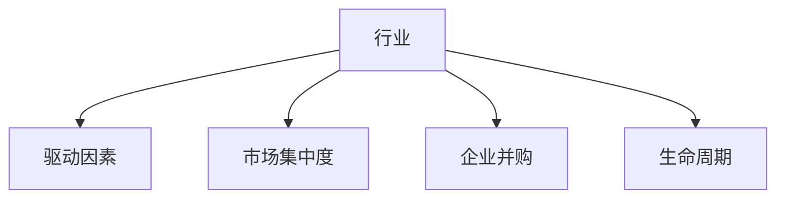
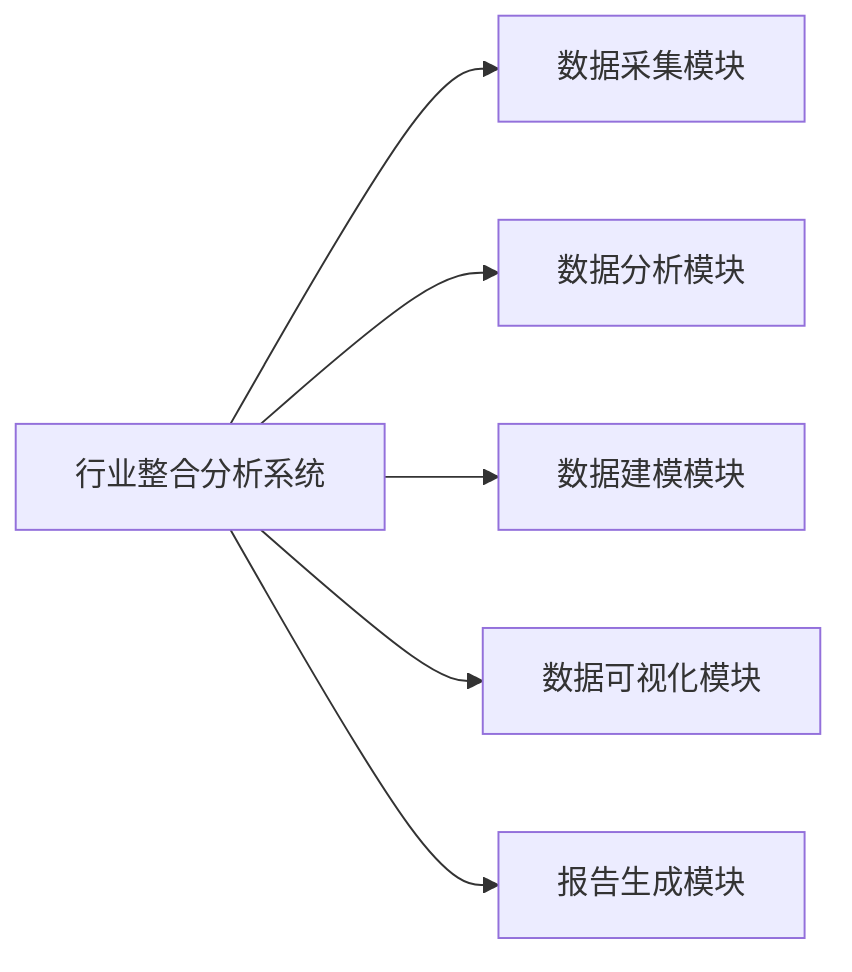

                 


# 《价值投资中的行业整合趋势分析》

---

## 关键词：
- 价值投资
- 行业整合
- 趋势分析
- 数据分析
- 投资策略

---

## 摘要：
本文将深入探讨价值投资中的行业整合趋势分析，从行业整合的背景、核心概念到具体分析方法和系统架构设计，逐步分析如何通过行业整合趋势识别投资机会。文章结合理论与实践，通过数据分析、数学建模和系统设计，为投资者提供一套系统化的行业整合趋势分析框架，帮助投资者在价值投资中做出更明智的决策。

---

## 目录大纲：

---

## 第一部分：价值投资与行业整合概述

### 第1章：价值投资与行业整合的背景介绍

#### 1.1 价值投资的核心概念
- 1.1.1 价值投资的定义与起源
  - 价值投资的起源与核心理念
  - 价值投资与成长投资的区别
  - 价值投资在现代投资学中的地位
- 1.1.2 行业整合的定义与内涵
  - 行业整合的定义
  - 行业整合的特征与表现
  - 行业整合的驱动因素
- 1.1.3 价值投资与行业整合的关联性
  - 行业整合对价值投资的影响
  - 价值投资者如何识别行业整合机会

#### 1.2 价值投资中的行业整合趋势分析
- 1.2.1 行业整合的背景与驱动因素
  - 市场竞争加剧
  - 行业集中度提升的必然性
  - 经济周期对行业整合的影响
- 1.2.2 行业整合对投资决策的影响
  - 行业整合对估值的影响
  - 行业整合对投资策略的影响
  - 行业整合对风险控制的影响
- 1.2.3 价值投资中的行业整合趋势分析框架
  - 数据驱动的行业整合分析框架
  - 行业整合趋势的多维度评估指标

---

### 第2章：行业整合趋势的核心概念与联系

#### 2.1 行业整合趋势的核心概念
- 2.1.1 行业整合的驱动因素
  - 市场竞争压力
  - 企业战略调整
  - 宏观经济环境
- 2.1.2 行业整合的模式与路径
  - 并购重组
  - 股权整合
  - 资源整合
- 2.1.3 行业整合的周期性与波动性
  - 行业整合的周期性特征
  - 经济波动对行业整合的影响
  - 政策环境对行业整合的影响

#### 2.2 行业整合趋势的核心要素分析
- 2.2.1 市场集中度分析
  - 市场集中度的定义与计算
  - 市场集中度与行业整合的关系
  - 市场集中度的动态变化
- 2.2.2 企业并购与重组分析
  - 企业并购的动因
  - 并购的类型与特征
  - 并购对行业整合的影响
- 2.2.3 行业生命周期分析
  - 行业生命周期的定义与阶段划分
  - 行业生命周期与整合趋势的关系
  - 不同阶段的整合特征与投资策略

#### 2.3 行业整合趋势的ER实体关系图


---

### 第3章：价值投资中的行业整合趋势分析方法

#### 3.1 数据分析方法
- 3.1.1 数据收集与处理
  - 数据来源与采集方法
  - 数据清洗与预处理
  - 数据标准化与特征提取
- 3.1.2 数据分析工具与技术
  - 数据分析工具的选择
  - 数据可视化技术的应用
  - 数据挖掘与机器学习算法的结合
- 3.1.3 数据可视化与报告
  - 可视化图表的选择与设计
  - 数据驱动的行业整合趋势报告撰写
  - 可视化结果的解读与投资决策

#### 3.2 行业整合趋势的数学模型与公式
- 3.2.1 市场集中度指数计算
  $$CR_n = \sum_{i=1}^{n} s_i$$
  其中，$CR_n$ 表示前n大企业的市场份额之和，$s_i$ 表示第i大企业的市场份额。
- 3.2.2 企业并购预测模型
  $$P = \alpha + \beta \times M + \gamma \times F + \epsilon$$
  其中，$P$ 表示并购概率，$M$ 表示市场集中度，$F$ 表示行业整合的驱动因素，$\epsilon$ 表示误差项。

---

## 第二部分：行业整合趋势的系统分析与架构设计

### 第4章：系统分析与架构设计方案

#### 4.1 问题场景介绍
- 行业整合趋势分析的复杂性
- 价值投资中行业整合分析的难点
- 系统化分析的必要性

#### 4.2 系统功能设计
- 4.2.1 领域模型设计
  - 行业整合分析的领域模型
  - 实体关系图（ER图）的设计
  - 数据流与业务流程分析

#### 4.3 系统架构设计
- 4.3.1 系统架构图


- 4.3.2 系统接口设计
  - 数据接口规范
  - API设计与调用
  - 数据交互协议

- 4.3.3 系统交互设计
  ```mermaid
  sequenceDiagram
      participant U[用户] 
      participant D[数据采集模块]
      participant A[数据分析模块]
      participant M[数据建模模块]
      participant V[数据可视化模块]
      participant R[报告生成模块]
      U -> D: 提供数据源
      D -> A: 数据传输
      A -> M: 分析结果
      M -> V: 可视化请求
      V -> R: 生成报告
      R -> U: 提交报告
  ```

---

## 第三部分：行业整合趋势分析的项目实战

### 第5章：项目实战与案例分析

#### 5.1 环境安装与数据准备
- 5.1.1 环境配置
  - 安装Python与相关库（Pandas、Matplotlib、Scikit-learn）
  - 数据库连接与配置
- 5.1.2 数据收集
  - 数据来源：公开行业报告、企业财务数据、并购案例数据
  - 数据清洗与预处理
  - 数据存储与管理

#### 5.2 核心实现
- 5.2.1 数据分析与建模
  ```python
  import pandas as pd
  import matplotlib.pyplot as plt

  # 示例代码：计算市场集中度指数
  def calculate_market_concentration(data, n):
      market_concentration = data.nlargest(n, 'market_share').sum()
      return market_concentration

  # 示例代码：企业并购预测模型
  from sklearn.linear_model import LinearRegression

  model = LinearRegression()
  model.fit(X_train, y_train)
  ```

- 5.2.2 可视化与报告生成
  ```python
  import seaborn as sns
  sns.set_palette("husl")
  plt.figure(figsize=(10, 6))
  sns.regplot(x="market_concentration", y="merger_probability", data=data)
  plt.title("市场集中度与企业并购概率关系图")
  plt.show()
  ```

#### 5.3 实际案例分析与解读
- 5.3.1 案例背景介绍
  - 某行业的整合趋势分析
  - 数据分析结果展示
  - 投资策略建议
- 5.3.2 数据分析结果解读
  - 市场集中度指数的计算结果
  - 并购概率预测模型的准确性分析
  - 行业整合趋势的可视化结果
- 5.3.3 投资策略建议
  - 基于数据分析的行业整合趋势投资策略
  - 价值投资中的行业整合机会捕捉
  - 风险控制与投资组合优化

#### 5.4 项目小结
- 项目实施的关键步骤总结
- 数据分析与建模的难点与解决方案
- 投资策略的实际应用与效果评估

---

## 第四部分：总结与展望

### 第6章：总结与展望

#### 6.1 核心观点总结
- 价值投资中行业整合趋势分析的重要性
- 数据分析与建模在行业整合趋势分析中的应用
- 投资策略中的行业整合趋势分析框架

#### 6.2 未来研究方向
- 数据分析技术的进一步应用
- 行业整合趋势的多维度分析模型
- 人工智能与大数据在行业整合分析中的潜力

#### 6.3 投资建议与注意事项
- 行业整合趋势分析的投资策略建议
- 投资中的风险控制建议
- 价值投资中的长期视角与耐心投资

#### 6.4 拓展阅读
- 推荐的行业整合趋势分析的经典文献
- 数据分析与机器学习领域的推荐阅读资料
- 价值投资相关的经典书籍推荐

---

通过以上目录大纲，读者可以系统地学习价值投资中的行业整合趋势分析的理论与实践，掌握从数据分析、模型构建到投资策略制定的全过程。

