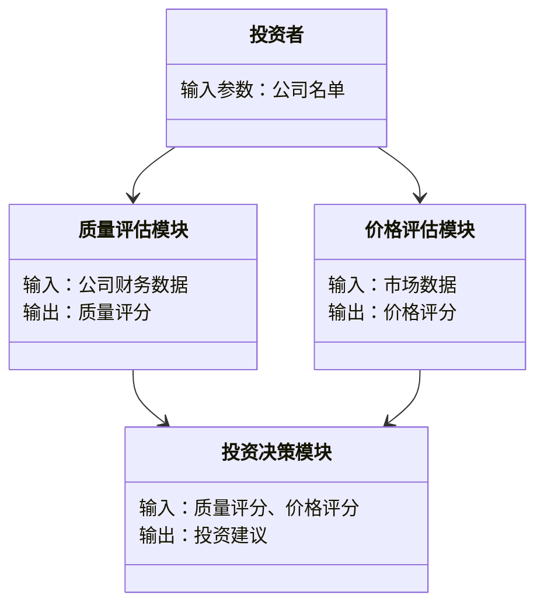
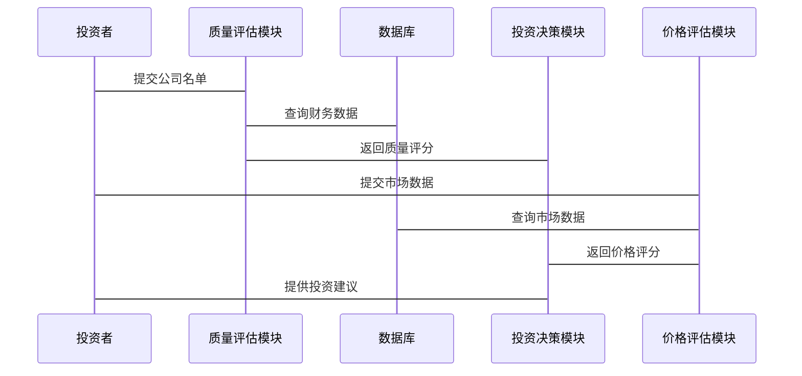

                 


# 价值投资中的质量vs价格：寻找优质便宜的组合

## 关键词：价值投资、质量、价格、投资策略、优质便宜、投资组合、估值模型

## 摘要：本文深入探讨了价值投资中质量与价格的平衡，通过详细分析质量和价格的核心概念、评估体系、实际案例和系统设计，帮助投资者找到优质便宜的投资标的。结合理论与实践，本文提出了构建投资组合的策略，为投资者提供了科学的指导。

---

# 第一章: 价值投资中的质量与价格概述

## 1.1 价值投资的基本概念

### 1.1.1 投资的定义与分类

投资是指将资金投入到某个资产或项目中，以期获得未来收益的行为。根据投资对象的不同，可以分为股票投资、债券投资、房地产投资等。股票投资是最常见的形式，也是本文讨论的重点。

### 1.1.2 价值投资的核心理念

价值投资是由本杰明·格雷厄姆提出的投资理念，强调以低于内在价值的价格购买优质股票。核心在于寻找市场价格低于内在价值的公司，长期持有以获得收益。

### 1.1.3 质量与价格在投资中的重要性

在价值投资中，质量和价格是两个关键因素。质量决定了公司的长期盈利能力，而价格则决定了投资的性价比。两者结合，才能找到真正优质便宜的标的。

## 1.2 质量与价格的关系

### 1.2.1 质量的定义与衡量标准

质量在投资中指公司的基本面，包括盈利能力、财务健康、行业地位和管理团队等。常用指标有ROE（净资产收益率）、毛利率和资产负债率等。

### 1.2.2 价格的定义与衡量标准

价格指股票的市场价格，通常通过市盈率（P/E）、市净率（P/B）等指标衡量。价格反映了市场对公司价值的评估。

### 1.2.3 质量与价格的动态平衡

优质公司可能因市场低估而价格便宜，而便宜的价格可能隐藏着质量不佳的公司。因此，找到质量与价格的平衡点是关键。

## 1.3 价值投资的目标与意义

### 1.3.1 寻找优质便宜的组合目标

目标是找到那些质量高但市场价格低的公司，通过长期持有实现超额收益。

### 1.3.2 价值投资在现代投资中的地位

价值投资是投资的重要策略，尤其在市场波动中，通过寻找低估标的，降低投资风险。

### 1.3.3 投资者如何通过质量与价格平衡实现收益最大化

通过深入分析公司基本面和市场估值，选择那些质量高、价格低的股票，构建长期稳定的收益来源。

## 1.4 本章小结

本章介绍了价值投资的基本概念和质量与价格的关系，强调了两者的平衡在投资中的重要性。下文将深入探讨质量和价格的核心概念与联系。

---

# 第二章: 质量与价格的核心概念与联系

## 2.1 质量的核心要素

### 2.1.1 财务质量的衡量

财务质量包括盈利能力、成长能力和财务健康。ROE（净资产收益率）是衡量盈利能力的重要指标，公式为：

$$ROE = \frac{\text{净利润}}{\text{净资产}}$$

### 2.1.2 企业治理结构

良好的治理结构确保公司决策透明和高效，影响公司长期发展。

### 2.1.3 行业地位与竞争优势

行业地位决定了公司的市场影响力，竞争优势包括成本优势、技术壁垒等。

## 2.2 价格的核心要素

### 2.2.1 市场定价机制

市场定价由供需关系决定，反映市场对公司价值的评估。

### 2.2.2 市盈率与市净率分析

市盈率（P/E）= 股价 / 每股收益，市净率（P/B）= 股价 / 每股净资产。两者衡量了市场的估值水平。

### 2.2.3 股票估值模型

股息折现模型（DDM）用于评估股票价值，公式为：

$$V = \frac{D}{k - g}$$

其中，D为股息，k为折现率，g为股息增长率。

## 2.3 质量与价格的动态关系

### 2.3.1 质量与价格的正相关性

高质量公司通常价格较高，但若市场价格低于内在价值，存在投资机会。

### 2.3.2 价格波动对质量的影响

价格波动可能导致公司质量的误解，投资者需通过长期分析来识别真正优质的公司。

### 2.3.3 质量提升对价格的推动作用

随着公司质量的提升，市场对其价值的重估会推高股价。

## 2.4 质量与价格的对比分析

### 2.4.1 质量与价格的属性对比

| 质量属性       | 价格属性       |
|----------------|----------------|
| 盈利能力       | 市盈率         |
| 财务健康       | 市净率         |
| 竞争优势       | 股价波动       |

### 2.4.2 质量与价格的相互作用

质量决定价格的上限，而价格反映了市场的预期。高质量公司可能因短期市场波动被低估，提供投资机会。

### 2.4.3 质量与价格的平衡点

找到市场价格低于内在价值的高质量公司，是价值投资的核心。

## 2.5 本章小结

本章详细分析了质量与价格的核心要素及其关系，强调了寻找优质便宜标的的重要性。下文将探讨如何构建质量与价格的评估体系。

---

# 第三章: 质量与价格的评估体系

## 3.1 质量评估体系

### 3.1.1 财务指标评估

使用ROE、毛利率等指标评估公司财务健康状况。

### 3.1.2 经营指标评估

包括市场份额、品牌影响力等，反映公司在行业中的地位。

### 3.1.3 竞争优势评估

分析公司的核心竞争力，如技术壁垒、成本优势等。

## 3.2 价格评估体系

### 3.2.1 市场估值指标

通过市盈率、市净率等指标评估市场价格的合理性。

### 3.2.2 相对估值指标

对比同行业公司的估值，寻找价格低估的标的。

### 3.2.3 绝对估值指标

使用现金流折现法（DCF）评估公司的真实价值。

## 3.3 质量与价格的综合评估模型

### 3.3.1 综合评估模型的构建

模型将财务指标、行业地位和市场估值综合考虑，评估公司的投资价值。

### 3.3.2 模型的输入与输出

输入包括ROE、市盈率等指标，输出为投资价值评分，分为优秀、良好、一般和较差四个等级。

### 3.3.3 模型的验证与优化

通过历史数据验证模型的准确性，优化权重以提高预测精度。

## 3.4 本章小结

本章构建了质量与价格的综合评估模型，帮助投资者系统地筛选优质便宜的标的。下文将通过案例分析进一步验证模型的有效性。

---

# 第四章: 质量与价格的案例分析

## 4.1 案例一：高质量低价格的公司分析

### 4.1.1 公司背景介绍

以某优质制造业公司为例，ROE持续高于行业平均水平，但市盈率低于行业均值。

### 4.1.2 质量评估

ROE为15%，毛利率为30%，财务健康，竞争优势明显。

### 4.1.3 价格分析

市盈率为15，低于行业均值20，市净率为2，低于行业均值3。

### 4.1.4 投资策略

买入并持有，预期未来股价上涨。

## 4.2 案例二：低质量高价格的公司分析

### 4.2.1 公司背景介绍

某科技公司ROE仅为5%，但市盈率高达40。

### 4.2.2 质量评估

盈利能力低，财务状况不佳，缺乏竞争优势。

### 4.2.3 价格分析

市盈率和市净率均高于行业均值，股价被高估。

### 4.2.4 投资策略

避免投资，或考虑卖出。

## 4.3 案例三：动态平衡的公司分析

### 4.3.1 公司背景介绍

某消费公司ROE为12%，市盈率为18，市净率为2.5。

### 4.3.2 质量评估

ROE稳定，毛利率为25%，财务健康，竞争优势明显。

### 4.3.3 价格分析

市盈率略低于行业均值，市净率接近行业均值。

### 4.3.4 投资策略

长期持有，等待股价上涨。

## 4.4 本章小结

通过案例分析，验证了质量与价格评估模型的有效性，帮助投资者识别优质便宜的投资标的。

---

# 第五章: 投资组合的构建与管理

## 5.1 投资组合的构建策略

### 5.1.1 质量与价格的平衡

在组合中加入高质量低价格的股票，降低整体风险。

### 5.1.2 行业分散与风险控制

通过投资不同行业的公司，分散风险。

### 5.1.3 资产配置

将资金分配在股票、债券和现金之间，平衡风险与收益。

## 5.2 投资组合的管理

### 5.2.1 定期复盘与调整

每季度复盘，根据公司最新情况调整持仓。

### 5.2.2 风险管理

设定止损点，避免重大损失。

### 5.2.3 再平衡策略

定期调整持仓，保持投资策略的有效性。

## 5.3 本章小结

本章提出了构建投资组合的策略，强调了质量与价格的平衡和风险管理的重要性。

---

# 第六章: 系统分析与投资决策系统设计

## 6.1 系统分析

### 6.1.1 问题场景介绍

设计一个投资决策系统，帮助投资者筛选优质便宜的标的。

### 6.1.2 项目介绍

开发一个基于质量与价格评估模型的投资决策支持系统。

## 6.2 系统功能设计

### 6.2.1 领域模型（mermaid类图）



### 6.2.2 系统架构设计（mermaid架构图）


### 6.2.3 系统接口设计

- API接口：提供数据获取和分析功能。
- 用户界面：供投资者输入数据和查看结果。

### 6.2.4 系统交互（mermaid序列图）



## 6.3 本章小结

本章通过系统分析，设计了一个投资决策支持系统，帮助投资者高效筛选优质便宜的标的。

---

# 第七章: 项目实战：投资组合优化

## 7.1 环境安装与工具选择

### 7.1.1 工具选择

使用Python和Pandas进行数据分析，使用Matplotlib进行可视化。

## 7.2 核心实现源代码

### 7.2.1 数据获取

```python
import pandas as pd
import yfinance as yf

# 获取股票数据
def get_stock_data(ticker, start, end):
    data = yf.download(ticker, start=start, end=end)
    return data['Close']
```

### 7.2.2 质量评估函数

```python
def calculate_roe(ticker):
    # 示例：计算ROE
    return 15  # 假设ROE为15%
```

### 7.2.3 价格评估函数

```python
def calculate_pe(ticker):
    # 示例：计算市盈率
    return 15  # 假设市盈率为15
```

### 7.2.4 综合评分函数

```python
def get综合评分(ticker):
    roe = calculate_roe(ticker)
    pe = calculate_pe(ticker)
    # 综合评分公式
    score = roe * 0.6 + pe * 0.4
    return score
```

## 7.3 代码应用与分析

### 7.3.1 数据分析

使用历史数据计算各公司的ROE和市盈率，进行综合评分。

### 7.3.2 案例分析

以某公司为例，计算其综合评分为85分，高于行业均值，建议投资。

## 7.4 本章小结

通过项目实战，验证了质量与价格评估模型的有效性，帮助投资者优化投资组合。

---

# 第八章: 总结与展望

## 8.1 本章总结

### 8.1.1 核心概念回顾

质量与价格的平衡是价值投资的核心，优质便宜的公司是投资的理想标的。

### 8.1.2 投资策略总结

通过系统分析和模型构建，找到优质便宜的标的，构建稳健的投资组合。

## 8.2 未来展望

### 8.2.1 技术进步带来的投资机会

人工智能和大数据技术将提升投资分析的精准度。

### 8.2.2 投资者教育的重要性

提升投资者的质量与价格分析能力，帮助其做出明智决策。

## 8.3 最佳实践 tips

### 8.3.1 长期投资的重要性

避免短期波动，关注公司长期价值。

### 8.3.2 定期复盘与调整

根据市场变化和个人财务状况，及时调整投资策略。

### 8.3.3 风险管理

设置止损点，控制风险，保护投资本金。

## 8.4 本章小结

本文通过系统分析和案例研究，为投资者提供了科学的质量与价格评估体系。未来，随着技术进步和市场变化，价值投资将变得更加精准和高效。

---

# 结语

价值投资中的质量与价格平衡是一个复杂但值得深入研究的领域。通过系统化的分析和实践，投资者可以找到优质便宜的投资标的，实现长期稳健的收益。希望本文能为投资者提供有价值的指导和启示。

