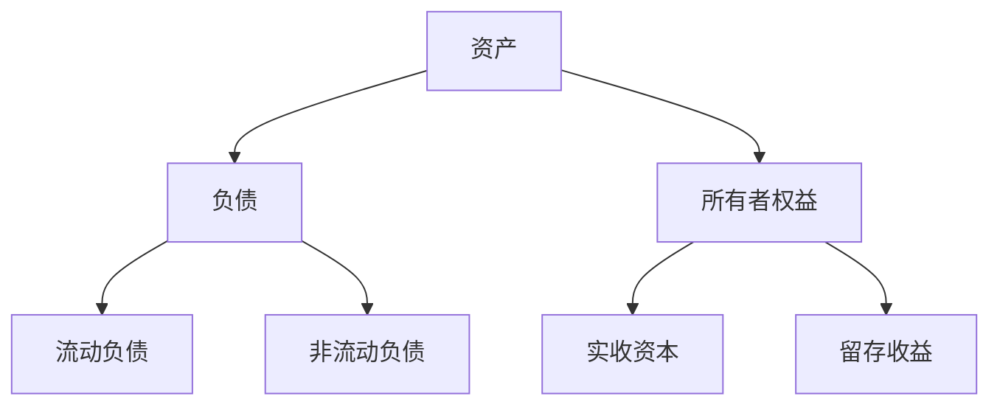
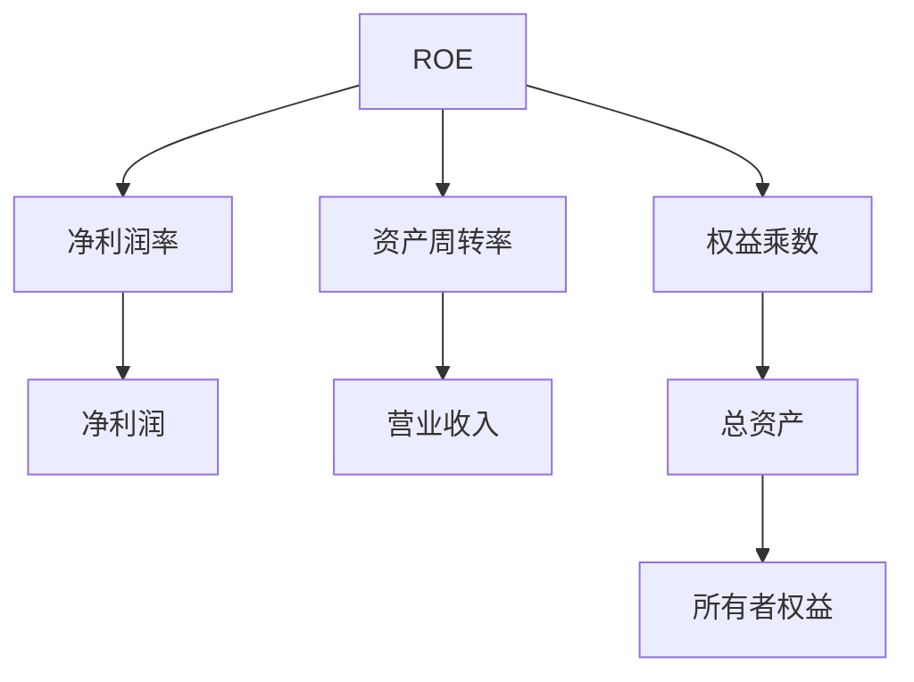

                 


# 价值投资中的资产负债表分析

> 关键词：价值投资、资产负债表、财务分析、杜邦分析、ROE、财务报表

> 摘要：本文深入探讨了价值投资中资产负债表分析的核心方法和实际应用。通过分析资产负债表的关键指标，揭示企业在财务健康、偿债能力、资本结构等方面的表现，帮助投资者做出更明智的投资决策。文章结合实际案例，详细讲解了如何通过资产负债表分析评估企业价值，识别潜在风险，并提供了一套系统化的分析框架。

---

## 第1章: 资产负债表的基本概念与重要性

### 1.1 资产负债表的定义与结构

资产负债表是企业财务报表的核心组成部分，反映了企业在某一特定时点的资产、负债和所有者权益的状况。其基本结构如下：

$$\text{资产} = \text{负债} + \text{所有者权益}$$

#### 图1.1 资产负债表结构图



---

### 1.2 资产负债表的核心要素

#### 1.2.1 资产的定义与分类

资产是企业拥有或控制的资源，预期能够为企业带来经济利益。资产可分为流动资产和非流动资产：

- **流动资产**：可在一年内变现或耗用的资产，包括现金、应收账款、存货等。
- **非流动资产**：无法在一年内变现的资产，包括固定资产、无形资产、长期股权投资等。

#### 1.2.2 负债的定义与分类

负债是企业由于过去的交易或事项而产生的、需要在未来某个时点偿还的债务。负债可分为流动负债和非流动负债：

- **流动负债**：预计在一年内偿还的债务，包括应付账款、短期借款、应交税费等。
- **非流动负债**：预计在一年以上偿还的债务，包括长期借款、债券发行等。

#### 1.2.3 所有者权益的定义与分类

所有者权益是企业资产扣除负债后归属于所有者的部分，包括实收资本、留存收益等。

---

## 第2章: 资产负债表分析的核心方法

### 2.1 财务比率分析法

#### 2.1.1 流动比率分析

流动比率是衡量企业短期偿债能力的重要指标：

$$\text{流动比率} = \frac{\text{流动资产}}{\text{流动负债}}$$

#### 2.1.2 速动比率分析

速动比率进一步剔除存货的影响，更能反映企业的即时偿债能力：

$$\text{速动比率} = \frac{\text{速动资产}}{\text{流动负债}}$$
其中，速动资产 = 流动资产 - 存货。

#### 2.1.3 资产负债率分析

资产负债率衡量了企业负债在资产中的比重：

$$\text{资产负债率} = \frac{\text{总负债}}{\text{总资产}} \times 100\%$$

#### 2.1.4 产权比率分析

产权比率反映了企业股东权益对债权人权益的保障程度：

$$\text{产权比率} = \frac{\text{总负债}}{\text{所有者权益}}$$

#### 2.1.5 利息保障倍数分析

利息保障倍数衡量了企业偿付利息的能力：

$$\text{利息保障倍数} = \frac{\text{息税前利润}}{\text{利息支出}}$$

---

### 2.2 杜邦分析法

杜邦分析法是一种系统地分解和分析企业财务状况的方法，通常用于评估企业的净资产收益率（ROE）。

#### 2.2.1 杜邦分析法的定义

杜邦分析法将ROE分解为三个关键因素：

$$\text{ROE} = \text{净利润率} \times \text{资产周转率} \times \text{权益乘数}$$

#### 2.2.2 杜邦分析法的步骤

1. 计算净利润率：$\text{净利润率} = \frac{\text{净利润}}{\text{营业收入}}$
2. 计算资产周转率：$\text{资产周转率} = \frac{\text{营业收入}}{\text{总资产}}$
3. 计算权益乘数：$\text{权益乘数} = \frac{\text{总资产}}{\text{所有者权益}}$

#### 图2.1 杜邦分析法流程图



---

## 第3章: 资产负债表分析中的常见问题与解决方案

### 3.1 财务报表粉饰与识别

#### 3.1.1 财务报表粉饰的常见手法

1. **虚增资产**：通过虚增存货或固定资产。
2. **虚减负债**：通过隐藏应付账款或虚减长期借款。
3. **虚增利润**：通过提前确认收入或延迟确认费用。

#### 3.1.2 财务报表粉饰的识别方法

1. **横向比较法**：对比不同会计期间的财务数据。
2. **纵向比较法**：对比行业平均水平。
3. **检查异常波动**：关注资产、负债、利润等关键指标的异常变化。

---

## 第4章: 项目实战——资产负债表分析的代码实现

### 4.1 环境安装与数据获取

使用Python进行资产负债表分析，需安装以下库：

```bash
pip install pandas numpy matplotlib
```

### 4.2 代码实现

#### 4.2.1 数据读取与预处理

```python
import pandas as pd

# 读取资产负债表数据
balance_sheet = pd.read_csv('balance_sheet.csv')

# 计算流动比率
current_assets = balance_sheet['流动资产'].sum()
current_liabilities = balance_sheet['流动负债'].sum()
current_ratio = current_assets / current_liabilities

print(f"流动比率 = {current_ratio:.2f}")
```

#### 4.2.2 杜邦分析法实现

```python
# 计算ROE
net_profit = balance_sheet['净利润'].sum()
equity = balance_sheet['所有者权益'].sum()
roe = (net_profit / equity) * 100
print(f"ROE = {roe:.2f}%")

# 计算净利润率
net_profit_margin = (net_profit / balance_sheet['营业收入'].sum()) * 100
print(f"净利润率 = {net_profit_margin:.2f}%")

# 计算资产周转率
asset_turnover = (balance_sheet['营业收入'].sum()) / balance_sheet['总资产'].sum()
print(f"资产周转率 = {asset_turnover:.2f}")
```

---

## 第5章: 最佳实践与小结

### 5.1 小结

通过资产负债表分析，投资者可以全面了解企业的财务状况，评估其偿债能力、资本结构和盈利能力。杜邦分析法和财务比率分析法是常用的工具。

### 5.2 注意事项

1. **数据可靠性**：确保数据来源可靠，避免虚假数据。
2. **行业差异**：不同行业的财务指标标准不同，需结合行业背景分析。
3. **动态分析**：关注财务指标的变化趋势，而非单一时点的数值。

### 5.3 拓展阅读

- 《财务报表分析与股票估值》
- 《价值投资实战手册》
- 《杜邦分析法的深度应用》

---

通过以上内容，读者可以系统地掌握资产负债表分析的核心方法，并在实际投资中灵活运用这些工具和技巧。

