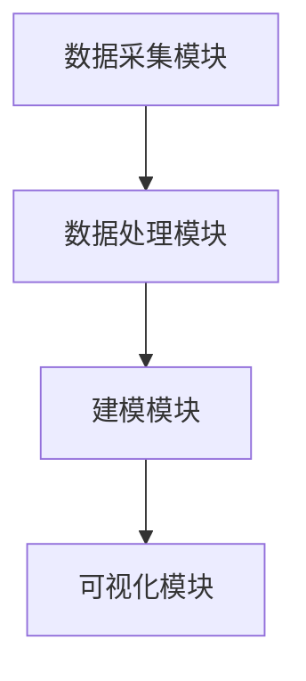

                 


# 价值投资中的超级计算机发展趋势

## 关键词
价值投资、超级计算机、金融数据分析、算法优化、机器学习

## 摘要
价值投资是一种以基本面分析为基础的投资策略，而超级计算机在这一领域发挥着越来越重要的作用。本文将探讨超级计算机如何提升价值投资的效率和准确性，分析其发展趋势，并通过具体案例展示其在金融数据分析和算法优化中的应用。

---

## 第一部分: 超级计算机与价值投资的背景与基础

### 第1章: 超级计算机与价值投资概述

#### 1.1 超级计算机的定义与特点
超级计算机是指在计算能力、数据处理速度和内存容量上远超普通计算机的高端计算设备。其特点包括：
- **高计算能力**：能够处理海量数据和复杂算法。
- **并行计算**：支持多任务同时处理，提高效率。
- **高速存储**：数据访问速度快，适合实时数据分析。

#### 1.2 价值投资的基本概念
价值投资是一种通过分析企业的基本面（如财务状况、行业地位、管理团队等）来评估其内在价值，并在市场低估时买入、高估时卖出的投资策略。其核心在于寻找被市场忽视的低估资产。

#### 1.3 超级计算机在金融领域的应用背景
随着金融市场数据的爆炸性增长，传统的数据分析方法已难以满足需求。超级计算机的引入为金融领域的高效数据分析提供了可能，特别是在高频交易、风险管理等领域。

---

### 第2章: 超级计算机与价值投资的核心概念

#### 2.1 超级计算机在价值投资中的核心作用
- **数据处理与分析**：超级计算机能够快速处理海量的历史和实时数据，提取有价值的信息。
- **算法优化与模型构建**：利用超级计算机的计算能力，优化复杂算法，构建高精度的金融模型。
- **风险控制与决策支持**：通过超级计算机的实时分析，帮助投资者做出更明智的决策。

#### 2.2 价值投资中的技术要素
- **数据来源与处理**：包括股票价格、财务报表、市场新闻等多源数据的清洗和预处理。
- **算法模型与优化**：使用机器学习算法（如支持向量机、随机森林）进行预测和优化。
- **系统架构与性能**：设计高效的分布式系统架构，确保数据处理和分析的实时性。

---

### 第3章: 超级计算机与价值投资的核心概念联系

#### 3.1 超级计算机在价值投资中的核心原理
超级计算机通过并行计算和高效的数据处理能力，支持复杂金融模型的构建和优化。例如，使用深度学习模型分析市场情绪，辅助价值评估。

#### 3.2 价值投资中的技术要素对比
- **数据处理**：传统方法依赖人工筛选，而超级计算机能够自动处理和清洗数据，提高效率。
- **算法优化**：传统方法依赖简单回归分析，而超级计算机支持复杂的机器学习算法，提升预测精度。
- **系统性能**：传统系统难以处理实时数据，而超级计算机支持分布式计算，确保数据处理的实时性。

---

## 第4章: 超级计算机在价值投资中的算法原理

### 4.1 算法原理概述
以支持向量机（SVM）为例，其核心思想是通过找到一个超平面，将数据点分为两类，用于分类或回归分析。

#### 4.2 算法实现的详细步骤
1. **数据预处理**：清洗数据，处理缺失值和异常值。
2. **特征提取**：选择关键的财务指标和市场数据作为特征。
3. **模型训练**：使用SVM算法训练模型，调整参数以优化性能。
4. **模型评估**：通过回测和交叉验证评估模型的准确性和稳定性。
5. **模型优化**：调整算法参数，提高预测精度。

#### 4.3 算法的数学模型与公式
支持向量回归的数学模型如下：

$$ y = w \cdot x + b $$

其中，$w$ 是权重向量，$x$ 是输入向量，$b$ 是偏置项。

---

## 第5章: 系统架构与设计方案

### 5.1 系统架构设计
设计一个分布式金融数据分析系统，包括数据采集、处理、建模和可视化模块。

#### 5.2 系统架构图


---

## 第6章: 项目实战与案例分析

### 6.1 项目环境搭建
#### 6.1.1 系统环境配置
安装Linux操作系统，配置分布式计算框架（如Spark）。

#### 6.1.2 数据来源与获取
使用Yahoo Finance API获取历史股票数据。

#### 6.1.3 工具安装
安装Python、NumPy、Pandas、Scikit-learn等工具。

---

### 6.2 核心代码实现

#### 6.2.1 数据预处理代码
```python
import pandas as pd
import numpy as np

# 读取数据
data = pd.read_csv('stock_data.csv')

# 处理缺失值
data = data.dropna()

# 标准化处理
from sklearn.preprocessing import StandardScaler
scaler = StandardScaler()
data_scaled = scaler.fit_transform(data)
```

#### 6.2.2 特征提取与建模
```python
from sklearn.svm import SVR
from sklearn.model_selection import train_test_split

# 划分训练集和测试集
X_train, X_test, y_train, y_test = train_test_split(data_scaled, target_data, test_size=0.2)

# 训练模型
model = SVR(kernel='rbf', C=1e3, gamma=0.1)
model.fit(X_train, y_train)

# 预测与评估
y_pred = model.predict(X_test)
print('均方误差:', np.mean((y_pred - y_test)**2))
```

---

### 6.3 案例分析
以预测某股票价格为例，通过回测分析模型的准确性和稳定性，评估其在价值投资中的应用效果。

---

## 总结与展望

### 最佳实践 tips
- 数据清洗是关键，确保数据质量。
- 模型调优需要反复试验，找到最佳参数组合。
- 系统架构设计要充分考虑扩展性和实时性。

### 小结
超级计算机在价值投资中的应用前景广阔，通过高效的数据处理和算法优化，能够显著提升投资决策的效率和准确性。

### 注意事项
- 数据隐私和安全问题需要高度重视。
- 模型的有效性依赖于数据的质量和市场的变化。
- 系统的维护和更新需要持续投入。

### 拓展阅读
- 《Python机器学习实战》
- 《金融数据分析与算法优化》
- 《分布式系统设计与实现》

通过超级计算机的应用，价值投资正在进入一个新时代，未来随着技术的不断进步，其在金融领域的应用将更加广泛和深入。

