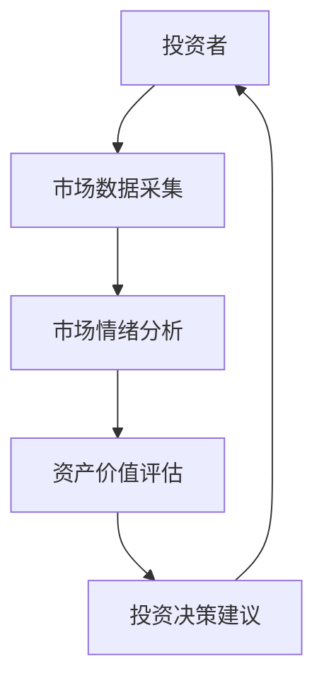

                 

# 价值投资中的逆向思维：当别人恐惧时贪婪

## 关键词：价值投资、逆向思维、市场情绪、风险管理、投资策略

## 摘要：  
本文深入探讨了逆向思维在价值投资中的应用，特别是在市场恐慌时如何发现投资机会。通过分析市场情绪、行为偏差和逆向指标，本文为投资者提供了一套系统化的投资策略，帮助他们在市场低迷时做出明智的决策。文章结合数学模型和实际案例，详细阐述了逆向思维的核心原理、系统架构和实战应用，为投资者提供了理论与实践相结合的深度指导。

---

## 第一章：引言

### 1.1 价值投资与逆向思维的定义  
- 价值投资：一种以基本面分析为基础，寻找市场价格低于其内在价值的资产的投资策略。  
- 逆向思维：与市场主流观点相反的思维方式，强调在市场恐慌时寻找机会，在市场狂热时保持冷静。  

### 1.2 逆向思维在投资中的重要性  
- 逆向思维可以帮助投资者避免随波逐流的非理性决策，抓住市场错估带来的机会。  
- 在市场恐慌时，恐慌情绪可能导致资产价格被低估，为逆向投资者提供了买入机会。  

### 1.3 本文的核心观点  
- 逆向思维是价值投资的核心策略之一。  
- 当市场情绪处于极端恐慌时，投资者应保持冷静，利用恐慌带来的价格优势。  
- 本文将从理论、数学模型和实战角度，全面解析逆向思维在价值投资中的应用。  

---

## 第二章：逆向思维的核心概念与原理

### 2.1 市场情绪与行为偏差  
- **市场情绪**：投资者的心理状态和行为对市场价格的影响。  
- **行为偏差**：投资者在决策中常见的非理性行为，如羊群效应、从众心理等。  

#### 2.1.1 市场情绪的波动性  
- 市场情绪通常呈现周期性波动，从乐观到悲观，再从悲观到乐观循环往复。  
- 在市场恐慌时，投资者往往做出非理性决策，导致资产价格偏离其内在价值。  

#### 2.1.2 行为偏差的典型案例  
- 羊群效应：投资者盲目跟随市场潮流，导致资产价格泡沫。  
- 从众心理：投资者倾向于相信市场共识，忽视独立思考。  

### 2.2 逆向思维的核心机制  
- **价格与价值的背离**：当市场价格低于内在价值时，逆向投资者可以买入。  
- **市场恐慌的利用**：恐慌情绪导致市场低估某些资产的价值，为逆向投资者提供机会。  

#### 2.2.1 逆向思维的数学模型  
- **恐慌指数（VIX指数）**：衡量市场波动性和恐慌程度的指标。  
- **价值低估公式**：  
  $$ \text{内在价值} > \text{市场价格} $$  

---

## 第三章：逆向思维的数学模型与分析

### 3.1 市场情绪的量化分析  
- **恐慌指数（VIX）**：用于量化市场波动性和恐慌程度。  
- **市场情绪与资产价格的关系**：  
  - 当市场恐慌时，VIX指数上升，资产价格可能被低估。  
  - 当市场乐观时，VIX指数下降，资产价格可能被高估。  

#### 3.1.1 恐慌指数的计算公式  
- VIX指数是基于期权波动率的加权平均值，反映了市场参与者对价格波动的预期。  

### 3.2 逆向思维的数学模型  
- **价值低估公式**：  
  $$ \text{安全边际} = \frac{\text{内在价值} - \text{市场价格}}{\text{市场价格}} $$  
- **安全边际越大，投资机会越好**。  

#### 3.2.1 案例分析  
- 案例一：2008年金融危机期间，许多优质资产价格被低估，安全边际显著，为逆向投资者提供了买入机会。  

---

## 第四章：逆向思维的系统分析与架构设计

### 4.1 投资决策系统的构建  
- **系统目标**：构建一套基于逆向思维的投资决策系统，帮助投资者在市场恐慌时抓住机会。  
- **系统功能**：  
  1. 监测市场情绪，识别恐慌时期。  
  2. 评估资产的内在价值，判断是否低估。  
  3. 提供投资建议，指导买入或卖出决策。  

#### 4.1.1 系统架构图  

---

## 第五章：项目实战

### 5.1 识别市场恐慌的步骤  
- **第一步**：监测市场情绪，关注恐慌指数（VIX）的变化。  
- **第二步**：分析资产价格与内在价值的偏离程度。  
- **第三步**：评估市场恐慌的持续性和影响程度。  

#### 5.1.1 案例分析  
- 案例一：2020年新冠疫情爆发期间，市场恐慌情绪达到高峰，许多资产价格被低估，逆向投资者可以买入优质资产。  

### 5.2 构建投资组合  
- **策略一**：分散投资，降低风险。  
- **策略二**：关注具有强大基本面的资产，如优质股票、债券等。  

#### 5.2.1 投资组合优化公式  
- 使用现代投资组合理论（MPT）优化投资组合，降低风险。  
  $$ \text{风险} = \sqrt{w^T \Sigma w} $$  
  其中，\( w \) 是权重向量，\( \Sigma \) 是协方差矩阵。  

### 5.3 风险管理  
- **止损策略**：设定止损点，避免亏损过大。  
- **分散投资**：通过多样化投资降低特定资产的风险。  

---

## 第六章：总结与展望

### 6.1 逆向思维的应用总结  
- 逆向思维是价值投资的重要策略之一，尤其在市场恐慌时具有独特优势。  
- 投资者应结合市场情绪、资产价值和风险管理，制定科学的投资策略。  

### 6.2 未来展望  
- 随着人工智能和大数据技术的发展，逆向思维的应用将更加精准和高效。  
- 投资者应不断学习和适应市场变化，提升自己的逆向思维能力。  

---

## 参考文献  
1. 约翰·邓普勒：《投资学原理》  
2. 巴菲特：《巴菲特致股东的信》  
3. 罗伯特·席勒：《非理性繁荣》

