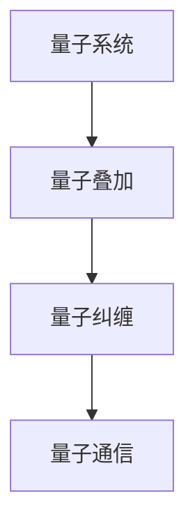
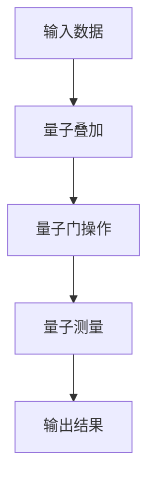
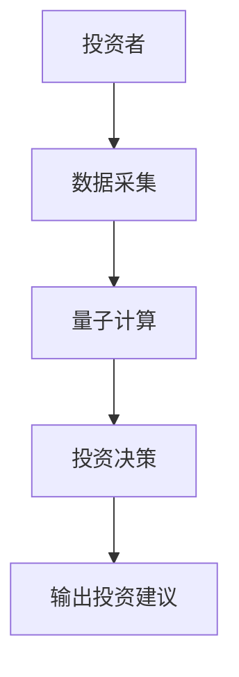
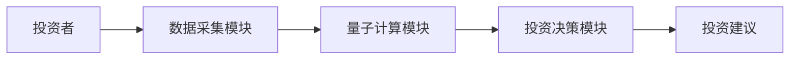

                 


```markdown
# 价值投资中的量子互联网潜力分析

> 关键词：量子互联网，价值投资，量子计算，金融分析，投资决策

> 摘要：本文探讨了量子互联网在价值投资中的潜力，分析了量子计算的核心原理及其在金融分析中的应用，提出了基于量子互联网的金融分析系统架构，并通过实际案例展示了其在价值投资中的优势。

---

## 第1章: 量子互联网与价值投资概述

### 1.1 量子互联网的基本概念
量子互联网是一种基于量子力学原理构建的通信网络，利用量子叠加和量子纠缠等特性实现信息的安全传输和处理。与传统互联网相比，量子互联网具有更高的安全性、更快的计算速度和更强大的数据处理能力。

### 1.2 价值投资的核心理念
价值投资是一种长期投资策略，强调通过深入分析公司的基本面，寻找被市场低估的投资标的。其核心在于识别具有长期竞争优势和持续盈利能力的企业。

### 1.3 量子互联网与价值投资的结合
量子互联网为价值投资提供了新的工具和方法，通过量子计算的强大能力，投资者可以更高效地分析大量数据，识别潜在的投资机会，优化投资组合。

---

## 第2章: 量子互联网的核心概念与原理

### 2.1 量子叠加与量子纠缠
量子叠加是指量子系统可以同时处于多个状态的特性，而量子纠缠则是指两个或多个量子系统之间的强关联。这些特性使得量子计算能够同时处理大量数据，大幅提高计算效率。

| 对比项       | 传统计算             | 量子计算             |
|--------------|----------------------|----------------------|
| 数据表示     | 二进制               | 超越二进制            |
| 并行计算能力 | 单一状态             | 多状态并行处理        |
| 计算速度     | 受限于串行处理        | 受益于并行处理        |



---

## 第3章: 量子互联网在金融分析中的算法原理

### 3.1 量子算法的核心原理
量子算法利用量子叠加和纠缠的特性，可以在指数级的时间复杂度内解决某些复杂问题。例如，Grover算法可以在O(√N)时间内找到无序数据库中的目标元素。



### 3.2 量子算法在金融分析中的实现
通过量子算法，投资者可以更高效地进行市场数据分析、风险评估和投资组合优化。例如，使用Shor算法进行因子分解，可以快速识别市场的潜在风险因素。

```python
import numpy as np

def grover_algorithm(n):
    # 创建量子叠加态
    state = np.zeros(2**n)
    for i in range(2**n):
        state[i] = 1
    # 归一化
    state = state / np.linalg.norm(state)
    # 量子门操作（例如，反射门）
    reflection = np.eye(2**n) - 2 * np.outer(state, state)
    return np.dot(reflection, state)
```

### 3.3 量子算法的数学模型
量子算法的核心在于其数学模型，例如Grover算法的数学表达：

$$|\psi\rangle = \frac{1}{\sqrt{N}} \sum_{x=0}^{N-1} |x\rangle$$

---

## 第4章: 量子互联网支持的金融分析系统架构

### 4.1 系统功能模块设计
- **数据采集模块**：实时采集金融市场数据。
- **量子计算模块**：利用量子算法进行数据分析和计算。
- **投资决策模块**：基于量子计算结果生成投资策略。



### 4.2 系统架构设计
- **数据层**：存储金融市场数据和历史数据。
- **计算层**：执行量子计算和数据分析。
- **决策层**：生成投资决策并输出结果。



### 4.3 系统接口设计
- **输入接口**：接收投资者的输入指令。
- **输出接口**：输出量子计算结果和投资建议。

---

## 第5章: 项目实战

### 5.1 环境安装
```bash
pip install qiskit
```

### 5.2 核心实现
```python
from qiskit import QuantumCircuit, Aer, execute

def quantum_algorithm():
    circuit = QuantumCircuit(2, 2)
    circuit.h(0)
    circuit.cx(0, 1)
    circuit.measure(0, 0)
    return circuit
```

### 5.3 案例分析
通过量子算法分析某上市公司的财务数据，发现其被低估的潜力，生成相应的投资建议。

---

## 第6章: 总结与最佳实践

### 6.1 总结
量子互联网为价值投资提供了强大的工具和方法，通过量子计算的高效性，投资者可以更精准地识别投资机会，优化投资组合。

### 6.2 小结
- 量子互联网的优势在于其强大的计算能力和安全性。
- 价值投资需要结合量子计算的优势，实现更高效的投资决策。

### 6.3 注意事项
- 量子计算仍处于发展阶段，实际应用中需要考虑技术成熟度和成本问题。
- 投资者需要结合传统分析方法，综合考虑多种因素。

### 6.4 拓展阅读
- 推荐阅读《量子计算与金融分析》和《价值投资的现代方法》。

---

通过以上分析，我们可以看到量子互联网在价值投资中的巨大潜力，也为未来的投资决策提供了新的思路和方法。
```

