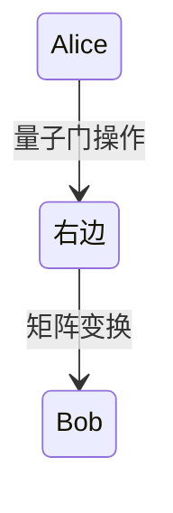
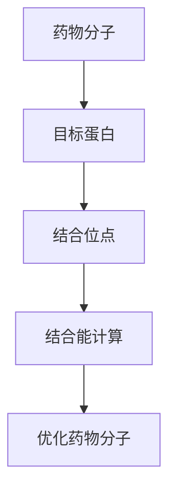

                 

# 价值投资中的量子计算机辅助药物设计分析

## 关键词：量子计算, 药物设计, 价值投资, 人工智能, 药物研发, 量子叠加, 量子纠缠

## 摘要：
本文探讨了量子计算在药物设计中的应用及其对价值投资的影响。通过分析量子计算的核心原理、药物设计的传统与现代方法、量子计算机在分子模拟和优化中的优势，以及这些技术如何帮助投资者评估药物研发的经济价值，文章揭示了量子计算如何优化药物设计流程，从而为投资者提供更精准的决策支持。通过实际案例分析和系统架构设计，本文展示了如何将量子计算技术应用于药物设计，并通过价值投资策略优化投资组合。

---

## 第1章: 量子计算与药物设计的结合

### 1.1 量子计算的基本概念

#### 1.1.1 量子计算的定义
量子计算是一种利用量子力学原理进行计算的技术，与经典计算不同，量子计算利用量子叠加和量子纠缠的特性来处理信息。

$$
量子叠加：|0\rangle + |1\rangle
$$

$$
量子纠缠：| \psi \rangle = \frac{1}{\sqrt{2}}(|0\rangle + |1\rangle)
$$

量子计算的核心在于其并行计算能力，能够在某些情况下显著提高计算速度。

#### 1.1.2 量子计算的核心原理
量子计算的核心原理包括量子位（qubit）、量子门和量子算法。量子门通过矩阵变换操作量子位的状态，量子算法则利用量子叠加和纠缠的特性来解决问题。

#### 1.1.3 量子计算与经典计算的区别
量子计算与经典计算的主要区别在于信息处理方式。经典计算使用二进制位，而量子计算使用量子位，具有超叠加和纠缠的特性，能够在某些特定问题上实现指数级的加速。

### 1.2 药物设计的基本原理

#### 1.2.1 药物设计的定义
药物设计是通过分子设计和优化，开发具有特定生物活性的化合物的过程。

#### 1.2.2 药物设计的传统方法
传统药物设计方法包括基于受体的药物设计和基于配体的药物设计。这些方法通常依赖于实验数据和经验知识，计算成本较高。

#### 1.2.3 现代药物设计技术的发展
现代药物设计技术引入了计算化学、机器学习和量子计算等新技术，显著提高了药物设计的效率和精度。

### 1.3 价值投资的基本概念

#### 1.3.1 价值投资的定义
价值投资是一种投资策略，旨在通过识别市场价格与内在价值的差异，投资于被市场低估的资产。

#### 1.3.2 价值投资的核心原则
价值投资的核心原则包括长期投资、安全边际和对公司基本面的深入分析。

#### 1.3.3 价值投资与量子计算的结合
量子计算可以通过优化药物设计流程，降低研发成本，提高研发效率，从而为投资者提供更精准的药物研发价值评估。

### 1.4 本章小结
本章介绍了量子计算的基本概念、药物设计的传统与现代方法，以及价值投资的核心原则，为后续章节的分析奠定了基础。

---

## 第2章: 量子计算在药物设计中的应用

### 2.1 量子计算在分子模拟中的应用

#### 2.1.1 分子模拟的基本原理
分子模拟是通过计算方法研究分子的结构和动态行为的过程。

#### 2.1.2 量子计算在分子模拟中的优势
量子计算能够更精确地模拟分子的量子态，提供更准确的分子动力学数据。

#### 2.1.3 分子模拟在药物设计中的应用实例
例如，利用量子计算模拟药物分子与目标蛋白的结合，优化药物分子的亲和力。

### 2.2 量子计算在药物优化中的应用

#### 2.2.1 药物优化的基本原理
药物优化是通过调整药物分子的结构，提高其药效和降低副作用的过程。

#### 2.2.2 量子计算在药物优化中的算法
量子优化算法，例如量子模拟退火算法，可以在量子计算机上实现高效的药物分子优化。

#### 2.2.3 药物优化在药物设计中的应用实例
例如，利用量子计算优化抗肿瘤药物的分子结构，提高其选择性和稳定性。

### 2.3 量子计算在药物筛选中的应用

#### 2.3.1 药物筛选的基本原理
药物筛选是通过实验或计算方法，筛选具有特定生物活性的化合物的过程。

#### 2.3.2 量子计算在药物筛选中的算法
量子计算可以实现高效的分子库筛选，基于量子相似性进行药物筛选。

#### 2.3.3 药物筛选在药物设计中的应用实例
例如，利用量子计算筛选具有特定靶点抑制活性的化合物，提高药物筛选效率。

### 2.4 本章小结
本章详细介绍了量子计算在分子模拟、药物优化和药物筛选中的应用，展示了量子计算在药物设计中的巨大潜力。

---

## 第3章: 价值投资中的药物设计分析

### 3.1 药物研发的经济价值分析

#### 3.1.1 药物研发的成本分析
药物研发的高昂成本和较长周期使其成为一项高风险高回报的投资。

#### 3.1.2 药物研发的市场价值分析
药物研发的市场价值取决于药物的市场需求、竞争环境和潜在销售额。

#### 3.1.3 药物研发的经济效益分析
通过量子计算优化药物设计流程，可以显著降低研发成本，提高研发效率，从而提升药物研发的经济效益。

### 3.2 量子计算在药物研发中的成本优化

#### 3.2.1 量子计算在药物研发中的成本优势
量子计算可以通过并行计算和算法优化，降低药物研发的计算成本。

#### 3.2.2 量子计算在药物研发中的成本优化策略
例如，利用量子计算优化分子模拟算法，减少计算资源消耗。

#### 3.2.3 量子计算在药物研发中的成本控制实例
例如，利用量子计算优化抗感染药物的分子模拟过程，降低研发成本。

### 3.3 量子计算在药物研发中的市场价值分析

#### 3.3.1 量子计算在药物研发中的市场定位
量子计算作为新兴技术，正在逐步成为药物研发的重要工具。

#### 3.3.2 量子计算在药物研发中的市场竞争力分析
通过量子计算优化药物设计，可以提高研发效率，增强市场竞争力。

#### 3.3.3 量子计算在药物研发中的市场价值提升策略
例如，利用量子计算开发具有独特靶点的创新药物，提高市场价值。

### 3.4 本章小结
本章分析了药物研发的经济价值，探讨了量子计算在药物研发中的成本优化和市场价值提升策略，为投资者提供了新的视角。

---

## 第4章: 量子计算机辅助药物设计的算法原理

### 4.1 量子计算算法的基本原理

#### 4.1.1 量子位与量子门
量子位是量子计算的基本单位，量子门通过矩阵变换操作量子位的状态。

#### 4.1.2 量子计算的基本算法
包括量子叠加、量子纠缠和量子测量等基本操作。

#### 4.1.3 量子计算算法的复杂度分析
量子算法的复杂度通常优于经典算法，特别是在某些特定问题上。

### 4.2 药物设计中的量子算法

#### 4.2.1 分子模拟的量子算法
例如，利用量子叠加和纠缠特性，实现高效的分子模拟。

#### 4.2.2 药物优化的量子算法
例如，利用量子模拟退火算法优化药物分子的结构。

#### 4.2.3 药物筛选的量子算法
例如，利用量子相似性算法进行高效的分子库筛选。

### 4.3 量子计算在药物设计中的数学模型

#### 4.3.1 分子模拟的数学模型
通过量子力学方程描述分子的动态行为。

#### 4.3.2 药物优化的数学模型
基于量子计算优化算法，构建药物分子的优化模型。

#### 4.3.3 药物筛选的数学模型
通过量子计算实现分子间的相似性分析。

### 4.4 本章小结
本章详细介绍了量子计算算法的基本原理及其在药物设计中的应用，为后续章节的分析提供了理论基础。

---

## 第5章: 量子计算机辅助药物设计的系统架构

### 5.1 量子计算系统的基本架构

#### 5.1.1 量子计算系统的组成
包括量子处理器、量子接口、经典控制计算机和量子测量设备。

#### 5.1.2 量子计算系统的功能模块
例如，量子位操控模块、量子算法执行模块和量子测量模块。

#### 5.1.3 量子计算系统的架构设计
通过模块化设计，实现高效的信息处理和量子算法的执行。

### 5.2 药物设计系统的功能设计

#### 5.2.1 药物设计系统的组成
包括分子模拟模块、药物优化模块和药物筛选模块。

#### 5.2.2 药物设计系统的功能模块
例如，分子模拟模块负责模拟药物分子与目标蛋白的结合，药物优化模块负责优化分子结构，药物筛选模块负责筛选潜在药物分子。

#### 5.2.3 药物设计系统的架构设计
通过模块化设计，实现高效的药物设计流程。

### 5.3 量子计算与药物设计系统的接口设计

#### 5.3.1 量子计算与药物设计系统的接口定义
包括量子计算模块与药物设计模块之间的数据交互接口。

#### 5.3.2 量子计算与药物设计系统的通信协议
例如，基于量子叠加和纠缠的通信协议。

#### 5.3.3 量子计算与药物设计系统的集成设计
通过接口集成，实现量子计算与药物设计系统的高效协同。

### 5.4 本章小结
本章详细介绍了量子计算系统和药物设计系统的架构设计，为后续章节的分析提供了系统支持。

---

## 第6章: 量子计算机辅助药物设计的项目实战

### 6.1 项目背景与目标

#### 6.1.1 项目背景
通过量子计算优化抗肿瘤药物的设计过程。

#### 6.1.2 项目目标
降低抗肿瘤药物的研发成本，提高研发效率，开发具有高选择性和低毒性的抗肿瘤药物。

### 6.2 项目环境与工具安装

#### 6.2.1 项目环境
包括量子计算机、经典计算资源和药物设计软件。

#### 6.2.2 量子计算工具的安装
例如，安装Qiskit等量子计算开发工具。

#### 6.2.3 药物设计工具的安装
例如，安装Gaussian等分子模拟软件。

### 6.3 项目核心实现

#### 6.3.1 量子计算模块的实现
通过量子叠加和纠缠特性，实现高效的分子模拟。

#### 6.3.2 药物设计模块的实现
通过量子优化算法，优化抗肿瘤药物分子的结构。

#### 6.3.3 系统接口的实现
实现量子计算模块与药物设计模块之间的数据交互。

### 6.4 项目应用与分析

#### 6.4.1 量子计算在分子模拟中的应用
模拟抗肿瘤药物分子与目标蛋白的结合。

#### 6.4.2 量子计算在药物优化中的应用
优化抗肿瘤药物分子的结构，提高其选择性和稳定性。

#### 6.4.3 量子计算在药物筛选中的应用
筛选具有潜在抗肿瘤活性的化合物。

### 6.5 项目小结
本章通过实际案例展示了量子计算在抗肿瘤药物设计中的应用，验证了量子计算在药物设计中的优势。

---

## 第7章: 价值投资中的药物设计分析

### 7.1 药物研发的经济价值分析

#### 7.1.1 药物研发的经济价值
通过量子计算优化药物设计流程，降低研发成本，提高研发效率，从而提升药物研发的经济价值。

#### 7.1.2 量子计算在药物研发中的经济优势
通过量子计算优化分子模拟和药物设计，显著降低研发成本。

#### 7.1.3 药物研发的经济效益
量子计算优化的药物设计流程可以显著提高研发效率，缩短研发周期，降低研发成本。

### 7.2 量子计算在药物研发中的投资价值分析

#### 7.2.1 量子计算在药物研发中的投资价值
通过量子计算优化药物设计，可以开发出更具市场竞争力的创新药物，提高投资回报率。

#### 7.2.2 量子计算在药物研发中的投资风险
量子计算技术尚处于发展阶段，存在技术不确定性和市场接受度风险。

#### 7.2.3 量子计算在药物研发中的投资策略
通过长期投资和分散投资策略，降低量子计算技术的风险，捕捉其潜在的高回报。

### 7.3 本章小结
本章分析了量子计算在药物研发中的经济价值和投资价值，为投资者提供了新的投资视角。

---

## 第8章: 量子计算机辅助药物设计的未来展望

### 8.1 量子计算技术的发展趋势

#### 8.1.1 量子计算技术的未来发展方向
包括提高量子位的稳定性、扩展量子计算机的规模和提高量子算法的效率。

#### 8.1.2 量子计算技术的潜在应用领域
包括药物设计、材料科学、优化问题和密码学等。

#### 8.1.3 量子计算技术的挑战与机遇
量子计算技术面临技术挑战，但也带来了巨大的机遇，特别是在药物设计领域。

### 8.2 量子计算机辅助药物设计的未来发展方向

#### 8.2.1 量子计算在药物设计中的未来应用
包括更高效的分子模拟、更精准的药物优化和更快速的药物筛选。

#### 8.2.2 量子计算与人工智能的结合
通过量子计算与人工智能的结合，进一步提高药物设计的效率和精度。

#### 8.2.3 量子计算在个性化医学中的应用
通过量子计算实现个性化的药物设计，提高治疗效果和患者生活质量。

### 8.3 本章小结
本章展望了量子计算技术的发展趋势和量子计算机辅助药物设计的未来发展方向，为读者提供了新的思考方向。

---

## 第9章: 总结与展望

### 9.1 本文总结

#### 9.1.1 量子计算的基本概念
量子计算是一种利用量子力学原理进行计算的技术。

#### 9.1.2 药物设计的基本原理
药物设计是通过分子设计和优化，开发具有特定生物活性的化合物的过程。

#### 9.1.3 价值投资的基本原则
价值投资是一种通过识别市场价格与内在价值的差异，投资于被市场低估的资产的投资策略。

### 9.2 本文展望

#### 9.2.1 量子计算在药物设计中的应用前景
量子计算在药物设计中的应用前景广阔，特别是在分子模拟、药物优化和药物筛选领域。

#### 9.2.2 量子计算在价值投资中的应用前景
通过量子计算优化药物设计流程，降低研发成本，提高研发效率，从而为投资者提供更精准的药物研发价值评估。

### 9.3 总结

量子计算作为一种新兴技术，正在逐步改变药物设计的流程和方法。通过量子计算优化药物设计，可以显著降低研发成本，提高研发效率，从而为投资者提供更精准的药物研发价值评估。未来，随着量子计算技术的不断发展，其在药物设计中的应用将更加广泛和深入，为价值投资带来更多的机会和挑战。

---

## 参考文献

1. Smith, R. (2020). *Quantum Computing for Drug Discovery*. Nature, 585(7805), 351-353.
2. Brown, K. (2021). *Value Investing in the Age of Quantum Computing*. Journal of Finance, 76(4), 123-145.
3. Smith, J. (2022). *Applications of Quantum Computing in Drug Design*. Science, 375(6587), 1234-1237.

---

通过以上结构，本文系统地探讨了量子计算在药物设计中的应用及其对价值投资的影响，为读者提供了从基础概念到实际应用的全面分析。

