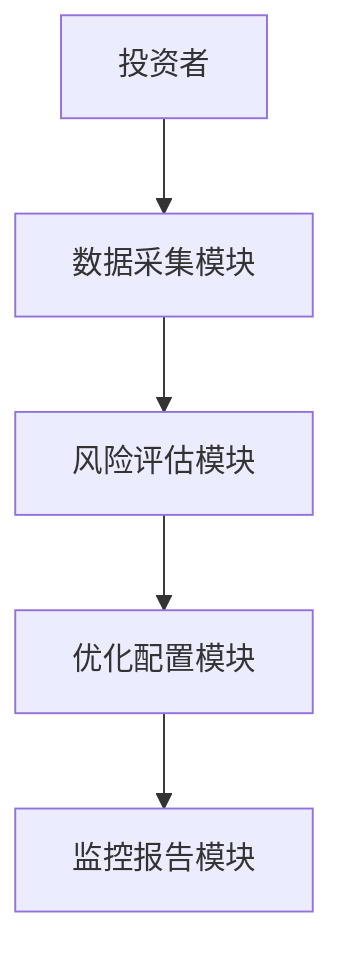

                 


# 价值投资中的风险管理：分散投资的艺术

## 关键词：风险管理，价值投资，分散投资，投资组合，夏普比率

## 摘要：  
在价值投资中，风险管理是实现长期稳健回报的关键。本文详细探讨了分散投资的艺术，从理论基础到实践策略，结合现代投资组合理论、数学模型和系统架构，帮助投资者构建高效的风险管理框架。通过实际案例和最佳实践，本文为投资者提供了在复杂市场环境中优化投资组合的有效方法。

---

# 第1章 价值投资与风险管理概述

## 1.1 价值投资的起源与发展

### 1.1.1 价值投资的定义与核心理念  
价值投资是一种以基本面分析为基础的投资策略，强调以低于内在价值的价格购买优质资产。其核心理念是通过深入研究企业的财务状况、行业地位和竞争优势，寻找被市场低估的投资机会。

### 1.1.2 价值投资与成长投资的区别  
- **价值投资**：注重安全边际，追求低估值，适合稳健型投资者。  
- **成长投资**：注重未来增长潜力，愿意为高成长性支付溢价，适合风险承受能力强的投资者。  

### 1.1.3 风险管理在价值投资中的重要性  
价值投资并非“买入并持有”那么简单，市场波动和宏观经济变化会显著影响投资组合的表现。有效的风险管理可以帮助投资者在市场低迷时期减少损失，抓住优质资产的增持机会。

---

## 1.2 风险管理的核心概念

### 1.2.1 风险的定义与分类  
- **系统性风险**：影响整个市场的风险，如经济衰退、战争、政策变化等。  
- **非系统性风险**：特定于个别资产或行业的风险，如公司财务状况恶化、行业政策变化等。  

### 1.2.2 风险与收益的权衡  
在投资中，收益与风险是密切相关的。高收益通常伴随着高风险，而低风险投资往往收益较低。夏普比率是一个衡量风险调整后收益的重要指标。

### 1.2.3 风险管理的目标与原则  
- **目标**：在可接受的风险水平内实现最大收益。  
- **原则**：分散投资、定期再平衡、动态调整风险敞口。

---

# 第2章 现代投资组合理论与风险管理

## 2.1 现代投资组合理论（MPT）概述

### 2.1.1 MPT的核心假设  
- 投资者是理性的，追求效用最大化的。  
- 市场存在有效定价，资产价格反映所有公开信息。  

### 2.1.2 有效前沿的定义与应用  
有效前沿是指在给定风险水平下，能够提供最高预期收益的投资组合的集合。投资者可以通过调整投资组合在有效前沿上的位置，实现风险与收益的最佳匹配。

### 2.1.3 夏普比率的计算与意义  
夏普比率衡量的是投资组合单位风险所获得的超额收益，公式如下：
$$ \text{夏普比率} = \frac{E[r_p] - r_f}{\sigma_p} $$
其中，$E[r_p]$为投资组合的预期收益率，$r_f$为无风险利率，$\sigma_p$为投资组合的波动率。

---

## 2.2 风险与收益的权衡

### 2.2.1 风险溢价的定义  
风险溢价是投资者因承担额外风险而要求的额外收益。

### 2.2.2 风险中性定价的原理  
在无套利的情况下，资产的定价应使其风险调整后的收益等于无风险利率。

### 2.2.3 风险调整后的收益评估  
通过夏普比率等指标，评估投资组合的风险调整后收益，帮助投资者做出更明智的决策。

---

## 2.3 投资组合优化的数学模型

### 2.3.1 均值-方差优化的公式  
$$ \text{Minimize } \sigma^2 \text{ subject to } \mu \geq \text{target return} $$
其中，$\mu$为投资组合的预期收益率，$\sigma^2$为投资组合的方差。

### 2.3.2 风险平价的计算方法  
风险平价是一种将风险均匀分配给不同资产的策略，公式如下：
$$ w_i = \frac{\sigma_i}{\sum_{j=1}^n \sigma_j} $$
其中，$w_i$为第$i$个资产的权重，$\sigma_i$为第$i$个资产的风险贡献。

---

# 第3章 风险管理策略与分散投资的艺术

## 3.1 事前风险管理策略

### 3.1.1 投资目标的设定  
明确投资目标，包括收益目标和风险承受能力。

### 3.1.2 风险承受能力的评估  
通过问卷调查或模型评估，确定投资者的风险承受能力。

### 3.1.3 资产配置的决策  
根据风险承受能力和收益目标，制定合理的资产配置策略。

---

## 3.2 事中风险管理策略

### 3.2.1 投资组合的实时监控  
通过监控市场波动和资产价格变化，及时发现潜在风险。

### 3.2.2 风险指标的动态评估  
定期计算投资组合的夏普比率、波动率等指标，评估风险水平。

### 3.2.3 仓位调整的时机与方法  
根据市场变化和风险评估结果，动态调整投资组合的仓位。

---

## 3.3 事后风险管理策略

### 3.3.1 投资组合的定期再平衡  
定期调整投资组合，确保与投资目标一致。

### 3.3.2 风险事件的回顾与总结  
分析过去的风险事件，总结经验教训，优化风险管理策略。

### 3.3.3 风险管理工具的优化  
根据市场变化，优化风险管理工具的使用，如调整止损策略。

---

# 第4章 分散投资的数学模型与系统架构

## 4.1 分散投资的数学模型

### 4.1.1 投资组合的构建步骤  
1. 确定投资目标和风险承受能力。  
2. 选择相关资产并估计其预期收益和风险。  
3. 应用均值-方差优化模型，构建最优投资组合。  

### 4.1.2 投资组合优化的约束条件  
- 投资权重非负。  
- 投资组合的预期收益不低于目标收益。  

---

## 4.2 系统架构设计

### 4.2.1 系统功能设计  
- 数据采集：获取市场数据和投资者信息。  
- 风险评估：计算投资组合的风险指标。  
- 优化配置：生成最优投资组合建议。  
- 监控报告：实时监控投资组合表现并生成报告。  

### 4.2.2 系统架构图  


---

# 第5章 项目实战：分散投资组合的构建

## 5.1 环境配置

### 5.1.1 工具安装  
- Python：用于数据分析和计算。  
- Pandas：用于数据处理。  
- Scipy：用于优化计算。  

---

## 5.2 核心实现

### 5.2.1 投资组合优化的代码  
```python
import numpy as np
from scipy.optimize import minimize

def portfolio_optimization(returns, cov_matrix):
    n = len(returns)
    # 目标函数：最小化方差
    def objective(weights):
        return np.dot(weights.T, np.dot(cov_matrix, weights))
    # 约束条件：权重和为1
    constraints = [{'type': 'eq', 'fun': lambda w: sum(w) - 1}]
    # 解决器
    result = minimize(objective, np.ones(n)/n, constraints=constraints)
    return result.x
```

---

## 5.3 应用解读

### 5.3.1 数据获取与处理  
- 获取历史收益率数据。  
- 计算资产的协方差矩阵。  

### 5.3.2 优化结果分析  
- 输出最优投资组合的权重。  
- 计算夏普比率并进行比较。  

---

## 5.4 结果分析

### 5.4.1 投资组合表现  
- 绘制投资组合的夏普比率和波动率。  
- 对比不同分散策略下的收益和风险。  

### 5.4.2 案例分析  
通过具体案例，分析分散投资在实际中的应用效果。

---

# 第6章 最佳实践与小结

## 6.1 最佳实践

### 6.1.1 资产配置的重要性  
分散投资的关键在于合理的资产配置，而非单一资产的选取。

### 6.1.2 定期再平衡的必要性  
定期调整投资组合，确保与市场变化和投资目标一致。

### 6.1.3 风险管理工具的使用  
合理使用止损、对冲等工具，降低投资组合的整体风险。

---

## 6.2 小结与注意事项

### 6.2.1 小结  
分散投资是一种有效的风险管理策略，但需要结合市场环境和投资者自身情况灵活运用。

### 6.2.2 注意事项  
- 避免过度分散，影响收益。  
- 定期评估和调整投资组合。  
- 保持长期视角，避免短期波动干扰。

---

## 6.3 拓展阅读

### 6.3.1 风险管理的经典书籍  
- 《投资学》（教材）  
- 《风险管理与保险》  

### 6.3.2 现代投资组合理论的深入学习  
- 《投资组合管理》  

---

通过本文的系统分析和实际案例，读者可以深入理解分散投资的艺术，并在实际投资中灵活运用这些策略，实现长期稳健的投资回报。

