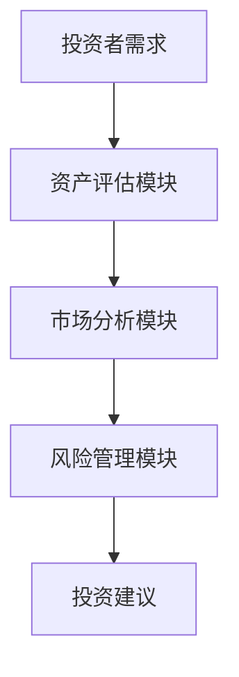

                 


# 价值投资在固定收益市场的应用

> 关键词：价值投资，固定收益市场，安全边际，债券定价，风险管理

> 摘要：本文系统地探讨了价值投资在固定收益市场中的应用。通过分析价值投资的核心理念、固定收益市场的特点以及两者结合的策略，本文为投资者提供了从理论到实践的完整指导。结合数学模型、算法设计和实际案例，本文深入剖析了如何在固定收益市场中运用价值投资理念，实现稳健投资收益。

---

## 第1章: 价值投资与固定收益市场的概述

### 1.1 价值投资的核心概念

#### 1.1.1 价值投资的定义与起源
价值投资是一种以基本面分析为核心的长期投资策略，起源于20世纪初。其核心理念是寻找市场低估的资产，通过长期持有实现超额收益。  
- **定义**: 价值投资强调资产的内在价值，认为市场价格会在长期内回归其内在价值。
- **起源**: 由本杰明·格雷厄姆和戴维·多德提出，奠定了现代价值投资的理论基础。

#### 1.1.2 固定收益市场的基本概念
固定收益市场是指以债券、国债等固定收益证券为标的的投资市场。  
- **特点**:  
  - 收益稳定，风险相对较低。  
  - 债券价格与市场利率呈负相关关系。  
  - 债券的期限决定了其价格波动性和流动性。  

#### 1.1.3 价值投资在固定收益市场的适用性  
价值投资的核心理念可以应用于固定收益市场，通过分析债券的内在价值和市场价格差异，寻找投资机会。  

### 1.2 价值投资的核心理念

#### 1.2.1 安全边际的定义与重要性
- **安全边际**: 安全边际 = 市场价格 / 内在价值，是价值投资的核心指标。  
- **重要性**: 安全边际越高，投资风险越小，潜在收益越大。  

#### 1.2.2 长期投资与复利效应
- **长期投资**: 通过长期持有优质资产，避免短期市场波动的干扰。  
- **复利效应**: 坚持长期投资，复利效应将显著放大投资收益。  

#### 1.2.3 市场先生与投资者心态
- **市场先生**: 格雷厄姆提出的概念，指市场情绪波动对资产价格的影响。  
- **投资者心态**: 投资者应以理性应对市场先生的波动，避免情绪化决策。  

### 1.3 固定收益市场的特点

#### 1.3.1 债券的分类与基本属性
- **分类**: 按发行主体可分为政府债券、企业债券等；按期限可分为短期、中期、长期债券。  
- **基本属性**: 利息、本金、期限和风险是债券的核心要素。  

#### 1.3.2 利息、本金、期限与风险的关系
- **利息**: 债券的票面利率决定了每年支付的利息。  
- **本金**: 债券到期后发行人必须偿还的本金。  
- **期限**: 债券的期限决定了其价格波动性和流动性。  
- **风险**: 包括信用风险（债券发行人违约的风险）和利率风险（市场利率变化导致债券价格波动的风险）。  

#### 1.3.3 债券价格与市场利率的逆相关性
- **逆相关关系**: 当市场利率上升时，债券价格下跌；反之，市场利率下降时，债券价格上涨。  

---

## 第2章: 价值投资的核心概念与固定收益市场的联系

### 2.1 价值投资的核心概念

#### 2.1.1 安全边际的数学模型
$$ 安全边际 = \frac{市场价格}{内在价值} $$  
- **内在价值**: 债券的内在价值是基于其未来现金流的现值。  

#### 2.1.2 股东权益与资产重估
- **股东权益**: 企业的净资产价值，是评估企业内在价值的重要指标。  
- **资产重估**: 通过分析企业的资产质量和盈利能力，重新评估其内在价值。  

#### 2.1.3 质量与深度的分析框架
- **质量**: 债券发行人的信用评级和财务状况。  
- **深度**: 市场中优质债券的供给情况。  

### 2.2 固定收益市场的核心要素

#### 2.2.1 债券的信用评级体系
- **信用评级**: 由评级机构对债券发行人的信用状况进行评估，分为投资级和投机级。  
- **重要性**: 信用评级是评估债券信用风险的重要指标。  

#### 2.2.2 利率曲线与经济周期的关系
- **利率曲线**: 描述不同期限债券收益率的曲线，反映市场对未来利率走势的预期。  
- **经济周期**: 利率曲线的形态（上升、下降、平坦）与经济周期密切相关。  

#### 2.2.3 债券流动性与市场深度的分析
- **流动性**: 债券在市场中的交易活跃程度，影响其买卖价差和交易成本。  
- **市场深度**: 市场上债券的供给量和交易量，影响债券的价格波动性和流动性。  

### 2.3 价值投资与固定收益市场的结合

#### 2.3.1 质量优先的投资策略
- **策略**: 优先选择信用评级高、财务状况稳定的债券发行人。  

#### 2.3.2 估值与市场情绪的对比分析
- **估值**: 通过计算债券的内在价值，对比市场价格，寻找低估机会。  
- **市场情绪**: 通过分析市场情绪波动，寻找市场低估或高估的债券。  

#### 2.3.3 风险控制与收益预期的平衡
- **风险控制**: 通过分散投资和设置止损点，降低投资风险。  
- **收益预期**: 在风险可控的前提下，追求超额收益。  

---

## 第3章: 价值投资在固定收益市场的核心算法与数学模型

### 3.1 安全边际的计算模型

#### 3.1.1 安全边际的定义公式
$$ 安全边际 = \frac{市场价格}{内在价值} $$  

### 3.2 资产重估的数学模型

#### 3.2.1 资产重估的基本公式
$$ 内在价值 = \sum_{t=1}^{n} \frac{CF_t}{(1 + r)^t} $$  
- **CF_t**: 第t期的现金流。  
- **r**: 折现率。  

### 3.3 债券定价的算法

#### 3.3.1 债券定价的基本公式
$$ 债券价格 = \sum_{t=1}^{n} \frac{C}{(1 + r)^t} + \frac{F}{(1 + r)^n} $$  
- **C**: 每期的利息支付。  
- **F**: 债券的面值。  
- **r**: 当前市场利率。  

---

## 第4章: 固定收益市场的系统分析与架构设计

### 4.1 问题场景介绍

#### 4.1.1 投资者需求分析
- 投资者希望在固定收益市场中实现稳健的收益，同时控制风险。  

#### 4.1.2 市场环境分析
- 当前市场利率处于低位，债券收益率具有吸引力。  

#### 4.1.3 投资目标设定
- 寻找信用评级高、安全性好、收益率合理的债券品种。  

### 4.2 系统功能设计

#### 4.2.1 资产评估模块
- 功能: 计算债券的内在价值和市场价格，评估安全边际。  

#### 4.2.2 市场分析模块
- 功能: 分析市场利率走势和信用评级变化，提供投资建议。  

#### 4.2.3 风险管理模块
- 功能: 监控投资组合的风险，设置止损点和分散投资策略。  

### 4.3 系统架构设计

#### 4.3.1 分层架构图
```
顶层架构:
    └── 投资者需求
    └── 市场环境
    └── 投资目标

底层架构:
    ├── 资产评估模块
    ├── 市场分析模块
    └── 风险管理模块
```

#### 4.3.2 模块交互流程图


---

## 第5章: 价值投资在固定收益市场的实战案例分析

### 5.1 实际案例分析

#### 5.1.1 某债券的投资决策过程
- **案例背景**: 假设某公司发行的债券，面值100元，票面利率5%，剩余期限5年，当前市场价格95元。  
- **内在价值计算**: 假设折现率为4%，则内在价值为100元。  
- **安全边际计算**: 安全边际 = 95 / 100 = 0.95，低于1，说明市场价格高于内在价值，不值得投资。  

#### 5.1.2 案例分析的步骤与结果
- **步骤**:  
  1. 计算债券的内在价值。  
  2. 比较市场价格和内在价值，评估安全边际。  
  3. 结合市场环境和信用评级，做出投资决策。  
- **结果**: 由于安全边际较低，建议不投资该债券。  

### 5.2 投资组合管理

#### 5.2.1 投资组合构建
- **策略**: 选择信用评级高、安全边际高的债券，分散投资以降低风险。  

#### 5.2.2 风险管理
- **策略**: 定期评估投资组合的风险，动态调整持仓结构。  

---

## 总结

通过本文的系统分析，我们深入探讨了价值投资在固定收益市场中的应用。从理论到实践，从模型到案例，本文为投资者提供了全面的指导。未来，随着市场的变化和技术的进步，价值投资在固定收益市场中的应用将更加广泛和深入。

---

* 本文是《价值投资在固定收益市场的应用》的目录大纲，具体实施内容请参考后续文章。

