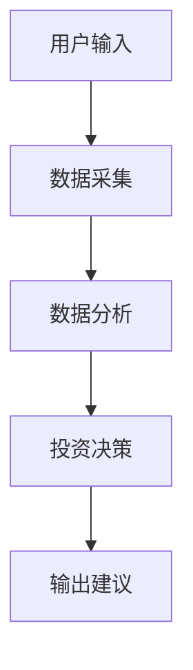

                 

# 价值投资在大宗商品市场的应用

## 关键词：价值投资、大宗商品市场、投资策略、风险管理、市场分析

## 摘要：价值投资是一种以基本面分析为基础的投资策略，通过识别市场中被低估的投资标的，长期持有以实现资本增值。本文探讨了价值投资在大宗商品市场中的应用，分析了大宗商品市场的特点、价值投资的核心理念、策略与方法，并结合实际案例进行详细解析。通过系统架构设计和项目实战，展示了如何在大宗商品市场中应用价值投资策略，帮助投资者制定科学的投资决策。

---

## 第二章: 价值投资的核心概念

### 2.1 价值投资的核心原理

#### 2.1.1 市场有效性的分析

价值投资的前提是市场并非总是有效。有效市场假说认为资产价格反映所有可获得的信息，但在现实中，市场常常存在短期波动和非理性行为，导致价格偏离其内在价值。价值投资者寻找这些价格被低估的资产，长期持有，等待市场重新发现其真实价值。

#### 2.1.2 安全边际的概念

安全边际是指资产的内在价值与其市场价格之间的差额。价值投资者通过分析企业的财务状况、行业地位和竞争优势，确定其内在价值，然后寻找市场价格低于内在价值的投资标的。安全边际越大，投资的风险越小。

#### 2.1.3 股东价值最大化的原则

价值投资强调通过持有优质资产，长期为股东创造价值。投资者应选择那些能够持续创造经济价值的企业，而不是短期炒作概念或投机性较强的资产。

---

### 2.2 价值投资的关键要素

#### 2.2.1 财务分析的重要性

财务分析是价值投资的核心内容之一。投资者需要分析企业的财务报表，包括收入表、资产负债表和现金流量表，评估企业的盈利能力、偿债能力和发展潜力。

#### 2.2.2 行业分析的必要性

行业分析帮助投资者了解企业的经营环境，包括行业增长潜力、竞争格局和政策影响。选择一个具有持续增长潜力的行业是成功投资的关键。

#### 2.2.3 管理层评估的作用

管理层是企业经营的核心，价值投资者需要评估管理层的诚信、能力和战略眼光。一个优秀的管理层能够带领企业不断创造价值。

---

### 2.3 价值投资与大宗商品市场的联系

#### 2.3.1 大宗商品市场的周期性

大宗商品价格受供需关系、宏观经济政策和全球市场的影响，具有明显的周期性。价值投资者需要识别价格波动周期，抓住低估的机会。

#### 2.3.2 价值投资在大宗商品市场的应用案例

以原油为例，价值投资者可能会关注那些拥有丰富储量和高效生产能力的石油公司，分析其内在价值，并在价格被低估时进行投资。

#### 2.3.3 价值投资与大宗商品价格波动的关系

尽管大宗商品价格受短期波动影响较大，但长期来看，价格会回归其内在价值。价值投资者需要耐心持有，等待市场回归。

---

### 2.4 本章小结

本章介绍了价值投资的核心原理，包括市场有效性、安全边际和股东价值最大化原则。同时，分析了价值投资与大宗商品市场的联系，强调了财务分析、行业分析和管理层评估的重要性。价值投资在大宗商品市场中需要耐心和长期视角，寻找价格低估的机会。

---

## 第三章: 价值投资在大宗商品市场的策略与方法

### 3.1 大宗商品市场的基本面分析

#### 3.1.1 供需关系的分析

供需关系是影响大宗商品价格的主要因素。投资者需要分析全球产量、消费量和库存水平，预测未来价格走势。

#### 3.1.2 行业政策的影响

政府政策，如贸易政策、环保法规和能源政策，对大宗商品市场有重要影响。投资者需要关注政策变化，及时调整投资策略。

#### 3.1.3 宏观经济指标的作用

宏观经济指标，如GDP增长率、通货膨胀率和利率，直接影响大宗商品需求和价格。投资者需要结合宏观经济分析，制定投资策略。

---

### 3.2 价值投资在大宗商品市场的应用策略

#### 3.2.1 基于价值的买入策略

投资者在市场价格低于内在价值时买入，并在价格回归时卖出。例如，在黄金价格因市场恐慌而下跌时，买入黄金作为避险资产。

#### 3.2.2 基于价值的卖出策略

当市场价格高于内在价值时，价值投资者会选择卖出。例如，当原油价格因市场炒作上涨，但实际需求并未增加时，投资者选择卖出。

#### 3.2.3 价值投资与风险管理的结合

价值投资注重长期持有，但投资者也需要管理短期波动带来的风险。可以通过分散投资、对冲策略和止损机制来降低风险。

---

### 3.3 大宗商品市场的技术分析

#### 3.3.1 技术分析的基本概念

技术分析通过分析历史价格和成交量，预测未来价格走势。常用的技术指标包括移动平均线、相对强弱指数（RSI）和MACD。

#### 3.3.2 常用的技术指标分析

- **移动平均线（MA）**：用于识别价格趋势，短期和长期均线的交叉点可能暗示买卖信号。
- **相对强弱指数（RSI）**：用于判断超买或超卖状态，RSI低于30可能暗示买入机会。
- **MACD**：通过两条均线和柱状图判断趋势和动能。

#### 3.3.3 技术分析与价值投资的结合

价值投资者可以结合技术分析，识别价格波动中的低估机会。例如，在价格跌破长期均线时，如果基本面良好，可能是买入机会。

---

### 3.4 本章小结

本章详细介绍了价值投资在大宗商品市场的策略与方法，包括基本面分析、技术分析和风险管理。价值投资者需要结合长期视角和短期波动，制定科学的投资策略。

---

## 第四章: 价值投资在大宗商品市场的系统架构与实现

### 4.1 系统架构的总体设计

#### 4.1.1 系统目标的设定

系统旨在帮助投资者分析大宗商品市场的价值投资机会，提供数据支持和决策建议。

#### 4.1.2 系统功能模块的划分

- **数据采集模块**：收集大宗商品价格、财务数据和宏观经济指标。
- **数据分析模块**：进行基本面分析和技术分析，评估内在价值。
- **投资决策模块**：根据分析结果，制定买入、卖出策略。

#### 4.1.3 系统架构的流程图

---

### 4.2 系统功能设计

#### 4.2.1 数据采集模块的设计

数据采集模块负责从多种来源收集大宗商品价格、企业财务数据和宏观经济指标。可以使用API接口或爬虫技术。

#### 4.2.2 数据分析模块的设计

数据分析模块包括基本面分析和算法分析。基本面分析评估企业的内在价值，技术分析识别价格波动信号。

#### 4.2.3 投资决策模块的设计

投资决策模块根据分析结果，制定买入、卖出或持有策略。结合风险控制，提供最优投资建议。

---

### 4.3 系统接口设计

#### 4.3.1 数据接口的设计

数据接口用于与其他系统或数据库交互，获取实时数据和历史数据。

#### 4.3.2 用户接口的设计

用户界面友好，提供数据分析结果和投资建议的可视化展示。

#### 4.3.3 系统监控接口的设计

监控接口实时跟踪系统运行状态，确保数据更新和分析正常进行。

---

### 4.4 系统交互设计

#### 4.4.1 用户与系统的交互流程

用户输入投资目标和参数，系统进行数据处理和分析，输出投资建议。

#### 4.4.2 数据流的交互过程

数据从采集到分析，再到决策模块，形成数据流，确保系统高效运行。

#### 4.4.3 系统反馈机制的设计

系统根据市场变化和用户反馈，动态调整分析模型和投资策略。

---

### 4.5 本章小结

本章设计了一个价值投资系统的架构，包括数据采集、分析和决策模块。通过系统架构设计，帮助投资者高效分析市场，制定投资策略。

---

## 第五章: 价值投资在大宗商品市场的项目实战

### 5.1 项目背景与目标

#### 5.1.1 项目背景介绍

选择黄金作为投资标的，分析其价格波动和内在价值。

#### 5.1.2 项目目标设定

通过价值投资策略，寻找黄金市场的低估机会，实现资本增值。

#### 5.1.3 项目范围界定

收集黄金价格数据、宏观经济指标和行业政策，分析其内在价值。

---

### 5.2 项目实施过程

#### 5.2.1 数据收集与处理

使用API接口获取黄金价格数据和宏观经济指标，清洗和整理数据。

#### 5.2.2 模型建立与验证

建立价值评估模型，分析黄金的内在价值，对比市场价格，寻找低估机会。

#### 5.2.3 投资策略的制定与实施

根据分析结果，制定买入策略，并在价格回归时卖出。

---

### 5.3 项目成果与分析

#### 5.3.1 成果展示

通过模型分析，发现黄金在某段时间内价格被低估，建议买入。

#### 5.3.2 成果分析

投资策略在实际操作中表现良好，实现了资本增值。

#### 5.3.3 成果对价值投资的影响

证明了价值投资策略在大宗商品市场中的有效性，为后续研究提供了参考。

---

### 5.4 项目小结

本章通过实际案例，展示了价值投资策略在大宗商品市场的应用过程和成果，验证了策略的有效性。

---

## 第六章: 价值投资在大宗商品市场的最佳实践与注意事项

### 6.1 最佳实践

#### 6.1.1 投资策略的选择与优化

根据市场变化，动态调整投资策略，优化组合。

#### 6.1.2 风险管理的技巧

设置止损点，分散投资，降低风险。

---

### 6.2 小结

总结全文，强调价值投资在大宗商品市场的长期视角和科学分析的重要性。

### 6.3 注意事项

投资者需要关注市场变化，保持谨慎，避免盲目跟风。

### 6.4 拓展阅读

推荐相关书籍和文献，帮助读者深入理解价值投资和大宗商品市场。

---

## 本文总结

价值投资在大宗商品市场中具有重要的应用价值。通过系统架构设计和实际案例分析，本文为投资者提供了科学的投资策略和方法。希望读者能够通过本文，掌握价值投资的核心理念，并在实际投资中灵活运用。

--- 

以上是《价值投资在大宗商品市场的应用》的完整目录和部分章节内容。如需进一步扩展或补充，请随时告知。

