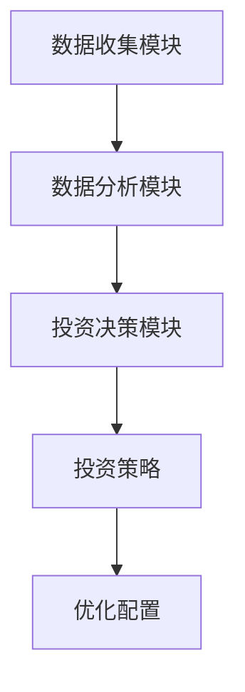
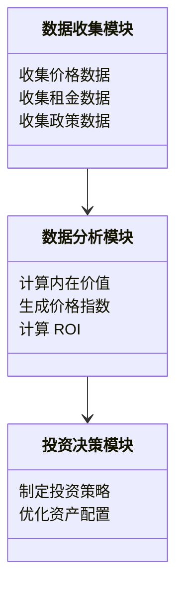

                 

# 价值投资在房地产市场的应用

> 关键词：价值投资、房地产市场、数学模型、系统架构、投资策略

> 摘要：本文系统地探讨了价值投资在房地产市场中的应用，从基本原理到数学模型，再到系统架构设计和项目实战，全面分析了如何利用价值投资策略在房地产市场中实现稳健收益。文章结合实际案例，详细讲解了房地产价值评估的核心算法和系统实现，为投资者提供了实用的指导和参考。

---

## 第一部分: 价值投资的基本原理

### 第1章: 价值投资的核心概念

#### 1.1 价值投资的定义与特点
- **1.1.1 价值投资的定义**  
  价值投资是一种投资策略，强调以低于资产内在价值的价格购买资产。其核心在于寻找市场低估的标的，长期持有，等待其价值回归。

- **1.1.2 价值投资的核心特点**  
  价值投资注重基本面分析，强调安全边际、长期持有和分散投资。其成功的关键在于识别市场非理性波动带来的投资机会。

- **1.1.3 价值投资与投机的区别**  
  投机者关注短期价格波动，依赖市场情绪；而价值投资者关注资产的内在价值，注重长期收益。

#### 1.2 价值投资的方法论
- **1.2.1 质因分析法**  
  质因分析法是价值投资的核心方法之一，强调从质量和数量两个维度评估资产的价值。

- **1.2.2 股票估值的三要素**  
  股票估值的三要素包括盈利能力、成长性和估值水平。这些要素共同决定了股票的内在价值。

- **1.2.3 长期持有与分散投资**  
  价值投资强调长期持有优质资产，同时通过分散投资降低风险。

### 第2章: 房地产市场的特点与价值投资的结合

#### 2.1 房地产市场的基本特征
- **2.1.1 房地产市场的周期性**  
  房地产市场具有明显的周期性，从衰退到复苏，再到繁荣和衰退，循环往复。

- **2.1.2 房地产市场的区域性**  
  房地产市场的表现受地理位置影响显著，不同地区的市场周期和价格波动差异较大。

- **2.1.3 房地产市场的政策影响**  
  政策调控（如利率、首付比例、限购政策）对房地产市场的影响深远。

#### 2.2 价值投资在房地产市场的应用
- **2.2.1 房地产价值投资的定义**  
  房地产价值投资是指通过分析房地产的内在价值，寻找市场价格低于内在价值的投资机会。

- **2.2.2 房地产价值投资的核心要素**  
  包括地理位置、房屋质量、租金收益、市场供需、政策环境等。

- **2.2.3 房地产价值投资与股票投资的异同**  
  房地产投资更注重实物资产的属性，而股票投资更关注企业的经营状况。

---

## 第二部分: 房地产价值评估的数学模型

### 第3章: 房地产价值评估的数学模型

#### 3.1 现金流折现模型
- **3.1.1 现金流折现模型的定义**  
  现金流折现模型（DCF模型）是通过预测未来现金流，按适当的折现率计算其现值，以确定资产的内在价值。

- **3.1.2 现金流折现模型的公式推导**  
  $$ V = \frac{CF_1}{(1+r)^1} + \frac{CF_2}{(1+r)^2} + \cdots + \frac{CF_n}{(1+r)^n} $$
  其中，\( V \) 为资产的内在价值，\( CF_i \) 为第 \( i \) 年的现金流，\( r \) 为折现率。

- **3.1.3 现金流折现模型的实现步骤**  
  1. 预测未来现金流；  
  2. 确定合理的折现率；  
  3. 计算未来现金流的现值；  
  4. 求和得到内在价值。

#### 3.2 房地产价格指数模型
- **3.2.1 房地产价格指数模型的定义**  
  房地产价格指数模型通过比较当前价格与历史价格，衡量市场价格的高低。

- **3.2.2 房地产价格指数模型的公式推导**  
  $$ P = P_0 \times (1 + \text{通货膨胀率})^t $$
  其中，\( P \) 为当前价格，\( P_0 \) 为基期价格，\( t \) 为时间，通货膨胀率反映市场整体价格水平的变化。

- **3.2.3 房地产价格指数模型的实现步骤**  
  1. 收集历史价格数据；  
  2. 计算通货膨胀率；  
  3. 预测未来价格。

#### 3.3 房地产投资回报率模型
- **3.3.1 投资回报率的定义**  
  投资回报率（ROI）是衡量投资收益的重要指标，反映投资的盈利能力。

- **3.3.2 投资回报率的计算公式**  
  $$ ROI = \frac{\text{净收益}}{\text{初始投资}} \times 100\% $$

- **3.3.3 投资回报率的实际应用**  
  通过 ROI 模型，投资者可以评估不同房地产项目的风险和收益，选择最优的投资方案。

---

## 第三部分: 房地产投资的系统分析与架构设计

### 第4章: 房地产投资的系统分析

#### 4.1 系统分析的基本概念
- **4.1.1 系统分析的定义**  
  系统分析是对房地产投资过程进行全面分析，识别关键因素，优化投资策略。

- **4.1.2 系统分析的目标**  
  提高投资决策的科学性和准确性，降低投资风险。

- **4.1.3 系统分析的步骤**  
  1. 明确分析目标；  
  2. 收集数据；  
  3. 建立模型；  
  4. 验证与优化。

#### 4.2 房地产投资系统的构成
- **4.2.1 数据收集模块**  
  数据收集模块负责获取房地产市场的相关数据，包括价格、租金、供需、政策等。

- **4.2.2 数据分析模块**  
  数据分析模块利用数学模型（如 DCF 模型、价格指数模型）对数据进行处理，评估房地产的内在价值。

- **4.2.3 投资决策模块**  
  投资决策模块根据分析结果，制定投资策略，优化资产配置。

---

### 4.3 房地产投资系统的架构设计

#### 4.3.1 系统架构设计

#### 4.3.2 系统功能设计

---

## 第四部分: 项目实战

### 第5章: 项目实战

#### 5.1 项目背景
以某城市房地产市场为例，分析其房地产市场的价值投资机会。

#### 5.2 数据收集与处理
1. 收集该城市的房价数据、租金数据、政策数据。
2. 使用 DCF 模型评估房地产的内在价值。

#### 5.3 投资决策
1. 根据分析结果，选择低估的房地产项目进行投资。
2. 制定长期持有和分散投资的策略。

---

## 第五部分: 最佳实践与总结

### 第6章: 最佳实践

#### 6.1 小结
价值投资在房地产市场的应用需要结合市场特点和数学模型，通过系统分析和实战项目，投资者可以更好地识别低估资产，实现稳健收益。

#### 6.2 注意事项
1. 价值投资需要长期持有，耐心等待价值回归。
2. 投资者需关注政策变化，及时调整投资策略。
3. 数据分析需结合实际情况，避免过于依赖模型。

#### 6.3 拓展阅读
推荐阅读《价值投资实战策略》和《房地产投资分析》等相关书籍，深入理解价值投资的核心思想。

---

通过本文的系统分析，读者可以全面了解价值投资在房地产市场中的应用，掌握核心算法和系统设计，为实际投资提供有力指导。

