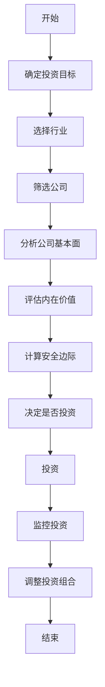

                 


# 价值投资在新兴市场的应用

> 关键词：价值投资、新兴市场、股票分析、风险管理、财务模型、投资策略

> 摘要：本文探讨了价值投资在新兴市场的应用，从理论基础到实际操作，详细分析了如何在新兴市场中识别低估股票，构建投资组合，并进行风险管理。通过数学模型和算法，结合实际案例，为投资者提供了一套系统化的投资方法。

---

## 第一部分：价值投资在新兴市场的背景与基础

### 第1章：价值投资的核心概念与背景介绍

#### 1.1 价值投资的基本原理

##### 1.1.1 价值投资的定义与核心要素

价值投资是一种以企业内在价值为核心的投资策略，强调以低于内在价值的价格买入优质股票并长期持有。其核心要素包括：

- **内在价值**：企业未来现金流的现值，通常通过现金流折现模型（DCF）计算。
- **安全边际**：买入价格与内在价值的差距，提供保护以避免短期市场波动带来的损失。
- **竞争优势**：企业具备的长期竞争优势，如成本优势、品牌影响力等。
- **管理层质量**：管理层的诚信与能力是企业长期发展的关键。

##### 1.1.2 价值投资与新兴市场的结合

新兴市场通常具有较高的增长潜力，但市场效率较低，存在较多的低估股票。价值投资在新兴市场的应用需要考虑以下特点：

- **高增长潜力**：新兴市场的GDP增速通常高于发达市场，为企业提供了更大的发展空间。
- **波动性高**：新兴市场受政策、经济周期等因素影响较大，股票价格波动剧烈。
- **信息不对称**：新兴市场的信息透明度较低，投资者需要通过深入研究来挖掘低估股票。

##### 1.1.3 价值投资的哲学基础

价值投资的哲学基础来源于格雷厄姆和多德的理论，强调安全边际和长期视角。在新兴市场中，这种哲学尤为重要，因为市场波动性和不确定性较高，投资者需要保持耐心，避免被短期市场情绪左右。

#### 1.2 新兴市场的特点与挑战

##### 1.2.1 新兴市场的定义与范围

新兴市场通常指那些经济正在快速发展但尚未完全工业化的国家，包括中国、印度、巴西等。这些市场的特点是：

- **经济结构转型**：从劳动密集型产业向高科技和服务业转型。
- **政策环境复杂**：新兴市场的政策变化较大，可能对企业经营产生重大影响。
- **市场规模扩大**：随着经济的增长，市场规模逐步扩大，但市场效率较低。

##### 1.2.2 新兴市场的增长潜力与风险

新兴市场的增长潜力主要体现在以下几个方面：

- **人口红利**：新兴市场的人口基数较大，年轻人口比例高，消费市场潜力大。
- **产业升级**：新兴市场的企业通过技术创新和产业升级，具备较强的竞争力。
- **政策支持**：政府通常会出台政策支持经济发展，尤其是在基础设施建设和新兴产业领域。

然而，新兴市场也面临较高的投资风险，包括：

- **经济波动**：新兴市场容易受到全球经济波动的影响，如美元升值、大宗商品价格波动等。
- **政治风险**：新兴市场的政治环境不稳定，政策变化可能对企业产生重大影响。
- **市场流动性风险**：新兴市场的流动性较低，可能导致股票价格波动剧烈。

##### 1.2.3 新兴市场与发达市场的对比分析

与发达市场相比，新兴市场具有以下特点：

- **市场效率**：新兴市场的信息透明度较低，市场效率较低，存在较多的低估股票。
- **行业分布**：新兴市场通常集中于制造业和资源行业，而发达市场则更多集中于高科技和服务业。
- **估值水平**：新兴市场的估值水平通常较低，尤其是在市场低迷时期，存在较多的低估股票。

#### 1.3 价值投资在新兴市场的可行性

##### 1.3.1 新兴市场的独特投资机会

新兴市场的独特投资机会主要体现在以下几个方面：

- **低估股票**：由于市场效率较低，新兴市场中存在较多的低估股票，这些股票的内在价值高于市场价。
- **成长空间**：新兴市场的经济增长潜力大，企业具有较大的成长空间。
- **多样化行业**：新兴市场涵盖多个行业，投资者可以通过分散投资来降低风险。

##### 1.3.2 价值投资在新兴市场的适用性

价值投资在新兴市场的适用性主要体现在以下几个方面：

- **寻找低估股票**：新兴市场中存在较多的低估股票，适合价值投资者挖掘。
- **长期视角**：新兴市场的波动性较高，但长期增长潜力大，适合长期投资者。
- **竞争优势**：新兴市场中的企业通常具有一定的竞争优势，如成本优势和本地化优势。

##### 1.3.3 新兴市场中的价值投资策略

在新兴市场中，价值投资者可以采取以下策略：

- **寻找低估股票**：通过基本面分析，寻找那些估值低于内在价值的股票。
- **关注竞争优势**：选择具有竞争优势的企业，如成本领先型企业和差异化竞争企业。
- **分散投资**：通过分散投资来降低风险，避免过度集中于某一个行业或地区。

---

### 第2章：价值投资的核心概念与联系

#### 2.1 价值投资的原理与模型

##### 2.1.1 股票的内在价值计算

股票的内在价值是未来现金流的现值，通常通过现金流折现模型（DCF）计算。DCF模型的基本公式为：

$$
\text{内在价值} = \sum_{t=1}^{n} \frac{\text{现金流}_t}{(1 + r)^t} + \frac{\text{终值}}{(1 + r)^n}
$$

其中，\( r \) 是折现率，\( n \) 是永续年金的期限。

##### 2.1.2 股东权益与企业价值的关系

股东权益是企业价值的重要组成部分，企业价值通常包括股东权益、债权和其他权益。企业价值与股东权益的关系可以用以下公式表示：

$$
\text{企业价值} = \text{股东权益} + \text{债权} + \text{其他权益}
$$

##### 2.1.3 现金流折现模型（DCF模型）

现金流折现模型是价值投资中常用的模型，用于估算企业的内在价值。以下是DCF模型的步骤：

1. **预测未来现金流**：根据企业的财务数据和行业趋势，预测未来几年的现金流。
2. **选择合适的折现率**：通常使用企业的加权平均资本成本（WACC）作为折现率。
3. **计算未来现金流的现值**：将预测的未来现金流按折现率折现，求和得到现值。
4. **估算终值**：通常假设企业在未来某个时间点达到稳定增长，使用永续年金公式计算终值。
5. **计算内在价值**：将未来现金流的现值和终值加总，得到企业的内在价值。

##### 2.1.4 市盈率与市净率的分析

市盈率（P/E）和市净率（P/B）是常用的估值指标。市盈率的计算公式为：

$$
\text{市盈率} = \frac{\text{股价}}{\text{每股收益}}
$$

市净率的计算公式为：

$$
\text{市净率} = \frac{\text{股价}}{\text{每股净资产}}
$$

通过对比市盈率和市净率与行业平均水平，可以判断股票是否被低估。

#### 2.2 核心概念的对比分析

##### 2.2.1 股价与内在价值的对比

股价是市场的反映，而内在价值是企业的实际价值。以下是股价与内在价值的对比：

- **股价波动性**：股价受市场情绪影响，波动较大。
- **内在价值稳定性**：内在价值相对稳定，除非企业的基本面发生重大变化。
- **投资机会**：当股价低于内在价值时，是买入的好机会。

##### 2.2.2 市盈率与市净率的对比

市盈率和市净率是两种常用的估值指标，各有优缺点：

- **市盈率**：适用于盈利稳定的公司，但不适合亏损公司。
- **市净率**：适用于净资产较多的公司，如银行和制造业。

##### 2.2.3 股息率与投资回报的关联

股息率是股票的股息与股价的比率，计算公式为：

$$
\text{股息率} = \frac{\text{股息}}{\text{股价}} \times 100\%
$$

股息率高的股票通常具有较高的投资回报，但需要结合公司的盈利能力和股息支付能力综合分析。

#### 2.3 实体关系图与流程图

##### 2.3.1 价值投资的实体关系图（ER图）

以下是价值投资的实体关系图（ER图）：

```mermaid
erdDiagram
    投资者 "Investor" {
        id
        名称 "Name"
        资金 "Funds"
    }
    企业 "Company" {
        id
        名称 "Name"
        股票代码 "Stock Code"
        内在价值 "Intrinsic Value"
        市场价格 "Market Price"
        股息率 "Dividend Yield"
    }
    关系 "Relationship" {
        投资者 -> 企业 "持有" "Holds"
    }
```

##### 2.3.2 价值投资的流程图（Mermaid）

以下是价值投资的流程图：



---

### 第3章：价值投资的算法原理

#### 3.1 现金流折现模型（DCF）

现金流折现模型是价值投资中常用的算法，以下是其算法原理：

1. **预测未来现金流**：根据企业的历史财务数据和行业趋势，预测未来几年的现金流。
2. **选择合适的折现率**：通常使用企业的加权平均资本成本（WACC）作为折现率。
3. **计算未来现金流的现值**：将预测的未来现金流按折现率折现，求和得到现值。
4. **估算终值**：假设企业在未来某个时间点达到稳定增长，使用永续年金公式计算终值。
5. **计算内在价值**：将未来现金流的现值和终值加总，得到企业的内在价值。

##### 3.1.1 现金流折现模型的数学公式

现金流折现模型的数学公式如下：

$$
\text{内在价值} = \sum_{t=1}^{n} \frac{\text{现金流}_t}{(1 + r)^t} + \frac{\text{终值}}{(1 + r)^n}
$$

其中，\( r \) 是折现率，\( n \) 是永续年金的期限。

##### 3.1.2 现金流折现模型的实现步骤

以下是现金流折现模型的实现步骤：

1. **收集企业财务数据**：包括收入、利润、现金流等。
2. **预测未来现金流**：根据企业的历史数据和行业趋势，预测未来几年的现金流。
3. **选择合适的折现率**：通常使用WACC作为折现率。
4. **计算未来现金流的现值**：将预测的未来现金流按折现率折现，求和得到现值。
5. **估算终值**：假设企业在未来某个时间点达到稳定增长，使用永续年金公式计算终值。
6. **计算内在价值**：将未来现金流的现值和终值加总，得到企业的内在价值。

##### 3.1.3 现金流折现模型的优缺点

现金流折现模型的优点：

- **准确性**：DCF模型能够准确反映企业的内在价值。
- **全面性**：考虑了企业的未来现金流和终值。

现金流折现模型的缺点：

- **复杂性**：模型的计算过程较为复杂，需要较多的假设。
- **主观性**：预测未来现金流和选择折现率需要较多的主观判断。

---

### 第4章：价值投资在新兴市场的应用

#### 4.1 新兴市场中的价值投资策略

##### 4.1.1 寻找低估股票

在新兴市场中，寻找低估股票是价值投资的核心策略之一。以下是寻找低估股票的方法：

1. **基本面分析**：通过分析企业的财务数据，寻找那些估值低于内在价值的股票。
2. **行业分析**：选择具有较高增长潜力的行业，如科技、消费和制造业。
3. **竞争优势分析**：选择具有竞争优势的企业，如成本领先型企业和差异化竞争企业。

##### 4.1.2 风险管理

在新兴市场中，风险管理尤为重要。以下是风险管理的方法：

1. **分散投资**：通过分散投资来降低风险，避免过度集中于某一个行业或地区。
2. **设置止损点**：在股价下跌到一定程度时，及时止损，避免更大的损失。
3. **定期调整投资组合**：根据市场变化和企业基本面的变化，定期调整投资组合。

##### 4.1.3 长期视角

在新兴市场中，长期视角是价值投资的重要原则之一。以下是长期视角的应用：

1. **耐心等待**：新兴市场的波动性较高，需要耐心等待合适的买入机会。
2. **长期持有**：价值投资强调长期持有，避免频繁交易。
3. **持续学习**：新兴市场的环境变化较快，需要持续学习，更新投资策略。

#### 4.2 新兴市场中的价值投资案例

##### 4.2.1 案例分析

以下是新兴市场中的一个价值投资案例：

- **公司名称**：新兴科技公司
- **行业**：科技
- **财务数据**：收入稳步增长，净利润率较高，现金流充裕。
- **估值指标**：市盈率低于行业平均水平，市净率也低于行业平均水平。
- **竞争优势**：公司在技术研发和市场拓展方面具有明显优势。
- **投资决策**：基于DCF模型计算出的内在价值高于当前股价，具备安全边际。

##### 4.2.2 投资策略

在上述案例中，投资者可以采取以下投资策略：

1. **买入并持有**：以低估价格买入股票，长期持有，等待股价回归内在价值。
2. **分散投资**：将资金分散投资于多个具有竞争优势的企业，降低风险。
3. **定期调整**：根据市场变化和企业基本面的变化，定期调整投资组合。

---

### 第5章：价值投资在新兴市场的未来展望

#### 5.1 新兴市场的未来发展趋势

新兴市场的未来发展趋势主要体现在以下几个方面：

1. **技术创新**：新兴市场在科技领域的投资不断加大，技术创新将成为经济增长的重要驱动力。
2. **消费升级**：随着居民收入的提高，消费升级将成为新兴市场的重要趋势。
3. **政策支持**：政府通常会出台政策支持经济发展，尤其是在基础设施建设和新兴产业领域。

#### 5.2 价值投资在新兴市场的未来发展

价值投资在新兴市场的未来发展主要体现在以下几个方面：

1. **技术进步**：随着技术的进步，价值投资的分析工具和模型将更加精准和高效。
2. **市场成熟**：新兴市场的成熟将提高市场效率，减少信息不对称，为价值投资者提供更多机会。
3. **全球化**：随着全球化的深入，新兴市场与发达市场的联系将更加紧密，价值投资的策略将更加多元化。

#### 5.3 价值投资在新兴市场的挑战与机遇

价值投资在新兴市场的挑战与机遇主要体现在以下几个方面：

- **挑战**：新兴市场的波动性较高，政策风险较大，信息透明度较低。
- **机遇**：新兴市场的增长潜力大，低估股票较多，适合价值投资者挖掘。

---

## 总结

价值投资在新兴市场的应用需要结合新兴市场的特点和价值投资的核心理念，通过基本面分析、竞争优势分析和风险管理等方法，寻找低估股票，构建投资组合。未来，随着新兴市场的成熟和技术的进步，价值投资在新兴市场的应用将更加广泛和深入。投资者需要保持耐心和长期视角，持续学习和调整策略，以应对新兴市场的复杂性和不确定性。

