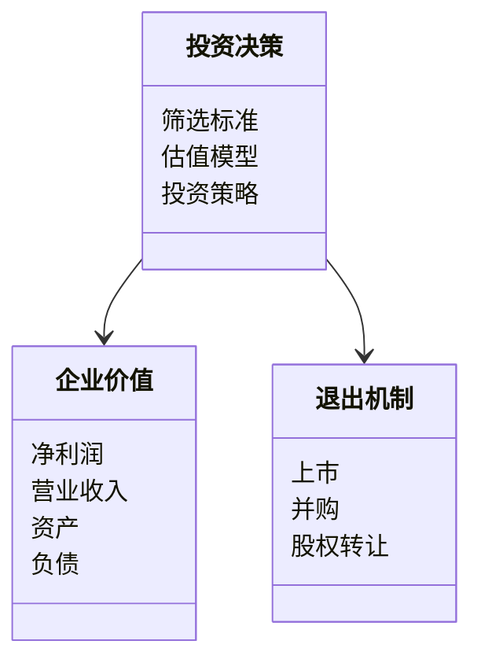
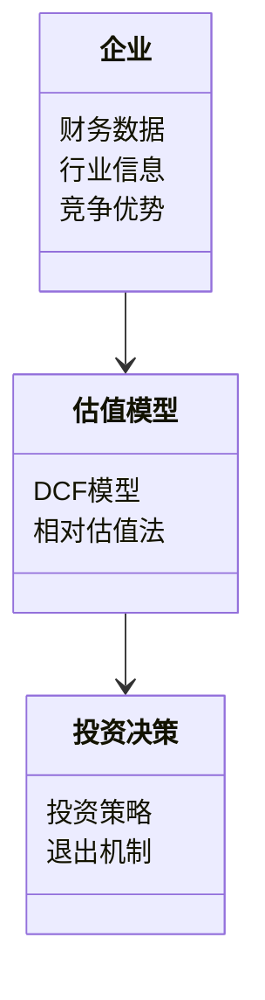

                 


# 《价值投资在私募股权中的应用》

---

## 关键词：
- 价值投资、私募股权、风险管理、数学模型、系统架构、案例分析

---

## 摘要：
本文系统地探讨了价值投资在私募股权中的应用，从核心概念到具体策略，再到实际案例，全面解析了如何将价值投资的理念融入私募股权投资的各个环节。文章首先介绍了价值投资和私募股权的基本概念，分析了它们的契合点和独特优势。接着，详细阐述了价值投资在私募股权中的核心理念与方法论，包括基本面分析、估值方法和竞争优势评估。然后，文章深入探讨了私募股权的运作机制，揭示了价值投资在其中的角色和作用。在具体应用部分，结合数学模型和系统架构，详细讲解了如何将价值投资策略转化为可操作的私募股权投资项目。最后，通过实际案例分析，验证了价值投资在私募股权中的有效性和风险控制能力。本文旨在为投资者和从业者提供理论与实践相结合的指导，帮助他们在私募股权领域更好地应用价值投资理念。

---

## 正文：

---

## 第一部分：价值投资与私募股权的背景介绍

### 第1章：价值投资的核心概念

#### 1.1 价值投资的定义与特点

价值投资是一种以基本面分析为基础的投资策略，其核心理念是通过寻找市场价格低于其内在价值的资产，长期持有，等待市场重新评估其价值。以下是价值投资的定义与特点：

**定义：**
价值投资强调以低于内在价值的价格买入优质资产，并长期持有。其核心在于寻找被市场低估的企业，通过长期持有实现收益。

**特点：**
1. **长期导向**：价值投资强调长期持有，避免频繁交易。
2. **基本面分析**：依赖对企业财务状况、行业地位和竞争优势的深入分析。
3. **安全边际**：买入价格应低于内在价值，以降低风险。
4. **逆向思维**：在市场恐慌时寻找机会，逆周期投资。

#### 1.2 私募股权的基本概念

**定义：**
私募股权是指通过非公开市场进行的企业所有权投资，通常涉及对目标企业的部分或全部股权收购。私募股权投资者通过改善企业经营、提升价值后退出，实现收益。

**特点：**
1. **高风险高回报**：私募股权投资周期长，风险高，但潜在回报也较高。
2. **专业管理**：私募股权基金通常由专业团队管理，注重企业价值的提升。
3. **流动性低**：私募股权的投资期限较长，流动性较低。

#### 1.3 价值投资在私募股权中的应用优势

**契合点：**
- 价值投资注重内在价值，与私募股权中对企业价值的评估高度契合。
- 两者都强调长期投资，注重企业基本面。

**独特优势：**
1. **精准估值**：价值投资通过深入分析企业财务和行业状况，能够准确评估企业的真实价值。
2. **风险控制**：通过安全边际和逆向思维，降低投资风险。
3. **长期收益**：私募股权的高回报与价值投资的长期持有策略相得益彰。

---

### 第2章：价值投资的核心理念与方法论

#### 2.1 价值投资的核心理念

**1. 内在价值与市场价值：**
- 内在价值是企业未来现金流的现值，是衡量企业真实价值的标准。
- 市场价值是市场价格，受市场情绪影响，可能偏离内在价值。

**2. 安全边际：**
- 安全边际 = 内在价值 - 市场价格。
- 通过买入价格低于内在价值的资产，降低投资风险。

**3. 长期投资与复利效应：**
- 长期持有优质资产，通过复利效应实现财富增长。

#### 2.2 价值投资的方法论

**1. 基本面分析法：**
- 通过对企业财务报表、行业地位、竞争优势等进行深入分析，评估企业内在价值。
- 关键指标：市盈率（P/E）、市净率（P/B）、股息率、ROE等。

**2. 相对估值法：**
- 通过比较同类资产的市场估值，确定目标资产的合理价格区间。

**3. 质量、估值、治理框架（QVM）：**
- **质量**：企业的财务健康状况、管理团队、行业地位。
- **估值**：市场价格与内在价值的偏离程度。
- **治理**：企业治理结构的透明度和规范性。

#### 2.3 私募股权中的价值投资策略

**1. 股权投资的三重过滤法：**
- 第一重：行业分析，筛选出有增长潜力的行业。
- 第二重：基本面分析，筛选出财务健康的企业。
- 第三重：估值分析，筛选出价格低于内在价值的企业。

**2. 企业生命周期与投资阶段匹配：**
- 初创期企业：风险高，适合高风险偏好投资者。
- 成长期企业：适合成长型私募股权基金。
- 成熟期企业：适合价值型私募股权基金。

**3. 行业分析与竞争优势评估：**
- 行业分析：市场规模、增长潜力、竞争格局。
- 竞争优势：企业核心竞争力、护城河。

---

### 第3章：私募股权的运作机制

#### 3.1 私募股权的定义与分类

**定义：**
私募股权是指通过非公开市场进行的企业所有权投资，通常涉及对目标企业的部分或全部股权收购。

**分类：**
1. **风险投资（Venture Capital）**：主要投资于初创期企业，以高增长为目标。
2. **成长资本（Growth Capital）**：投资于已进入成长期的企业，提供资本支持。
3. **收购资本（Buyout Capital）**：通过杠杆收购目标企业，进行价值重估。

#### 3.2 私募股权的运作模式

**1. 投资决策流程：**
- **初步筛选**：通过行业分析和财务指标筛选潜在目标。
- **尽职调查**：对企业财务、法律、市场等方面进行深入调查。
- **估值与定价**：确定目标企业的合理估值，并与卖方协商价格。
- **投资决策**：基于尽职调查和估值结果，决定是否投资。

**2. 投资组合管理：**
- **分散投资**：通过投资多个项目降低风险。
- **监控与支持**：定期跟踪被投企业经营状况，提供增值服务。

**3. 投资退出机制：**
- **上市退出**：通过IPO实现退出。
- **并购退出**：将目标企业出售给战略买家。
- **股权转让**：通过股权转让退出。

#### 3.3 价值投资在私募股权中的角色

**1. 投资决策中的价值评估：**
- 通过价值投资理念，对目标企业的内在价值进行精准评估，确保投资决策的科学性。

**2. 投资组合的风险控制：**
- 通过价值投资的安全边际原则，降低投资组合的整体风险。

**3. 与私募股权的协同效应：**
- 价值投资的长期持有策略与私募股权的高回报目标高度契合。

---

### 第4章：价值投资在私募股权中的应用策略

#### 4.1 价值投资在私募股权中的基本

---

**数学模型与代码实现：**

**DCF模型（Discounted Cash Flow Model）**

DCF模型用于评估企业的内在价值，计算企业未来现金流的现值。

公式：
$$ \text{内在价值} = \sum_{t=1}^{n} \frac{\text{现金流}_t}{(1 + r)^t} + \frac{\text{终值}}{(1 + r)^n} $$

其中，$r$为折现率，$n$为预测期数，$\text{现金流}_t$为第$t$年的现金流，$\text{终值}$为企业退出时的预期价值。

**代码实现：**

```python
def calculate_intrinsic_value(cash_flows, discount_rate, terminal_value, periods):
    intrinsic_value = 0
    for t in range(periods):
        if t < len(cash_flows):
            cash_flow = cash_flows[t]
        else:
            cash_flow = terminal_value / (1 + discount_rate) ** t
        intrinsic_value += cash_flow / (1 + discount_rate) ** t
    return intrinsic_value

# 示例数据
cash_flows = [100, 150, 200, 250]
terminal_value = 500
discount_rate = 0.1
periods = 4

intrinsic_value = calculate_intrinsic_value(cash_flows, discount_rate, terminal_value, periods)
print(f"内在价值为：{intrinsic_value}")
```

---

**系统架构与接口设计：**

**领域模型类图（Mermaid）：**



**系统架构图（Mermaid）：**


---

**案例分析：**

**案例：某科技公司私募股权投资项目**

**背景：**
某私募股权基金计划投资一家科技公司，目标是通过改善管理和技术升级提升企业价值。

**分析步骤：**
1. **行业分析**：科技行业增长潜力大，竞争激烈。
2. **基本面分析**：公司财务状况良好，净利润增长率为20%。
3. **估值分析**：使用DCF模型计算公司内在价值为10亿元，当前市场价格为8亿元。
4. **投资决策**：基于价值投资理念，决定投资。

**实施：**
- 投资金额：2亿元
- 投资期限：5年
- 退出机制：IPO退出

**结果：**
- 5年后公司成功上市，股价上涨至每股20元，投资收益翻倍。

---

## 第五部分：风险管理与价值投资的结合

### 第5章：私募股权中的风险管理

#### 5.1 私募股权的风险因素

1. **市场风险**：市场波动对私募股权价值的影响。
2. **流动性风险**：私募股权的流动性较低，可能影响资金周转。
3. **信用风险**：目标企业可能因经营不善导致投资损失。
4. **操作风险**：投资决策失误或管理不善可能导致亏损。

#### 5.2 价值投资的风险控制方法

1. **安全边际**：通过买入价格低于内在价值，降低市场波动带来的影响。
2. **分散投资**：通过投资多个项目，降低单一项目风险。
3. **长期持有**：避免短期市场波动的影响，实现长期收益。

---

## 第六部分：系统架构与实现

### 第6章：系统架构设计

#### 6.1 问题场景介绍

- **目标**：设计一个基于价值投资理念的私募股权投资项目管理系统。
- **需求**：实现企业价值评估、投资决策支持、风险控制等功能。

#### 6.2 系统功能设计

**领域模型类图（Mermaid）：**



**系统架构图（Mermaid）：**


#### 6.3 系统接口设计

- **输入接口**：企业财务数据、行业信息、市场数据。
- **输出接口**：企业内在价值、市场价值、投资建议、风险评估报告。

---

## 第七部分：项目实战

### 第7章：项目核心实现

#### 7.1 环境安装

- **工具**：Python、Jupyter Notebook、Mermaid、MySQL。
- **库**：pandas、numpy、scipy、matplotlib。

#### 7.2 核心代码实现

**DCF模型代码：**

```python
import numpy as np
import pandas as pd

def discounted_cash_flow(cash_flows, discount_rate, terminal_value, periods):
    intrinsic_value = 0
    for t in range(periods):
        if t < len(cash_flows):
            cash_flow = cash_flows[t]
        else:
            cash_flow = terminal_value / (1 + discount_rate) ** t
        intrinsic_value += cash_flow / (1 + discount_rate) ** t
    return intrinsic_value

# 示例数据
cash_flows = [100, 150, 200, 250]
terminal_value = 500
discount_rate = 0.1
periods = 4

intrinsic_value = discounted_cash_flow(cash_flows, discount_rate, terminal_value, periods)
print(f"内在价值为：{intrinsic_value}")
```

---

### 第8章：案例分析与总结

#### 8.1 案例分析

**案例：某科技公司私募股权投资项目**

- **目标**：通过价值投资理念，评估某科技公司的内在价值，制定投资策略。
- **分析步骤**：
  1. 行业分析：科技行业增长潜力大，竞争激烈。
  2. 基本面分析：公司财务状况良好，净利润增长率为20%。
  3. 估值分析：使用DCF模型计算公司内在价值为10亿元，当前市场价格为8亿元。
  4. 投资决策：基于价值投资理念，决定投资。
- **实施**：投资金额2亿元，投资期限5年，退出机制IPO退出。
- **结果**：5年后公司成功上市，股价上涨至每股20元，投资收益翻倍。

#### 8.2 总结

---

## 第九部分：最佳实践与未来发展

### 第9章：总结与展望

#### 9.1 总结

- 价值投资与私募股权的结合，能够有效提升投资决策的科学性和风险控制能力。
- 通过系统化的分析和模型构建，价值投资在私募股权中的应用更加高效和精准。

#### 9.2 未来展望

- **技术进步**：人工智能和大数据技术的应用，将进一步提升价值投资的精准度。
- **全球化**：全球市场的拓展，为价值投资提供了更多机会。
- **风险管理**：更加复杂的市场环境，要求投资者不断提升风险管理能力。

---

## 第十部分：注意事项与拓展阅读

### 第10章：注意事项与最佳实践

#### 10.1 注意事项

- **市场风险**：私募股权的市场风险较高，投资者需做好风险评估。
- **流动性风险**：私募股权的流动性较低，需合理规划资金使用。
- **操作风险**：投资决策失误可能导致重大损失，需谨慎评估。

#### 10.2 最佳实践

- **分散投资**：通过投资多个项目，降低单一项目风险。
- **长期持有**：避免短期市场波动的影响，实现长期收益。
- **持续学习**：关注市场动态和企业经营状况，及时调整投资策略。

---

## 第十一部分：参考文献与拓展阅读

### 第11章：参考文献与拓展阅读

- **参考文献**：
  1. Graham, Benjamin. *The Intelligent Investor*. New York: Harper
     芳社, 1972.
  2. Buffett, Warren. *The Essays of Warren Buffett: Lessons for
     Investors and Doers.

