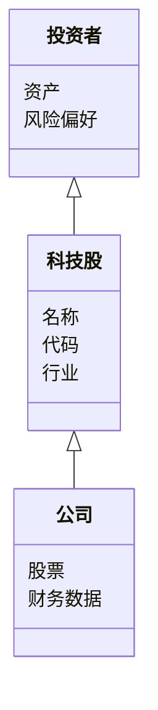

                 


# 价值投资在科技股中的应用

## 关键词：价值投资、科技股、DCF模型、内在价值、竞争优势

## 摘要：
本文深入探讨了价值投资在科技股中的应用，从价值投资的基本概念和科技股的特点入手，分析了内在价值评估、竞争优势分析、DCF模型等核心方法。通过实际案例和系统设计，展示了如何在科技股投资中应用这些方法，并提供了实战指导和最佳实践建议。

## 正文：

---

## 第1章: 价值投资的基本概念

### 1.1 价值投资的定义与核心理念

#### 1.1.1 价值投资的定义
价值投资是一种长期投资策略，强调以低于其内在价值的价格购买优质资产。其核心在于识别市场低估的公司，并长期持有，等待其价值回归。

#### 1.1.2 价值投资的核心理念
价值投资的核心理念包括：
1. **安全边际**：买入价格低于内在价值，确保安全空间。
2. **长期视角**：关注公司长期盈利能力，而非短期波动。
3. **优质公司**：选择具有竞争优势和良好治理的公司。

#### 1.1.3 价值投资与短期交易的对比
| 对比维度       | 价值投资                          | 短期交易                          |
|----------------|-----------------------------------|------------------------------------|
| 投资期限       | 长期                              | 短期                              |
| 投资目标       | 寻找低估公司                      | 利用价格波动获利                  |
| 风险承受能力   | 较低                              | 较高                              |
| 信息需求量     | 高                                | 中等                              |

### 1.2 科技股的特点与投资机会

#### 1.2.1 科技股的定义与分类
科技股是指涉及科技行业的公司股票，包括软件、硬件、互联网、人工智能等领域。

#### 1.2.2 科技股的投资机会
科技行业具有高增长潜力，创新能力强，能够带来超额收益。

#### 1.2.3 科技股的风险与挑战
科技股波动大，技术迭代快，竞争激烈，且研发投入高。

---

## 第2章: 价值投资与科技股的结合

### 2.1 价值投资在科技股中的应用背景

#### 2.1.1 价值投资与科技股的结合需求
科技股的高增长性和波动性使其成为价值投资的理想标的。

#### 2.1.2 科技股投资的特殊性
科技股需要关注技术壁垒、创新能力和市场地位。

#### 2.1.3 价值投资在科技股中的演进
从传统行业扩展到科技行业，价值投资方法逐步适应科技股的特点。

### 2.2 价值投资与科技股的核心联系

#### 2.2.1 价值投资的核心要素
- 内在价值
- 竞争优势
- 安全边际

#### 2.2.2 科技股的核心特征
- 技术壁垒
- 市场地位
- 创新能力

#### 2.2.3 价值投资与科技股的结合机制
通过内在价值评估和竞争优势分析，选择具有长期增长潜力的科技股。

---

## 第3章: 价值投资的内在价值评估

### 3.1 内在价值的定义与计算方法

#### 3.1.1 内在价值的定义
内在价值是公司未来现金流的现值，反映了其真实价值。

#### 3.1.2 内在价值的计算公式
$$ V = \frac{CF_1}{(1+r)^1} + \frac{CF_2}{(1+r)^2} + \ldots + \frac{CF_n}{(1+r)^n} + \frac{TV}{(1+r)^n} $$
其中，CF为现金流，r为折现率，TV为终值。

#### 3.1.3 内在价值的评估步骤
1. 预测未来现金流。
2. 确定合适的折现率。
3. 计算未来现金流的现值。
4. 加上终值，得到内在价值。

### 3.2 现金流贴现模型（DCF模型）

#### 3.2.1 DCF模型的定义与原理
DCF模型通过将未来现金流折现，计算公司内在价值。

#### 3.2.2 DCF模型的数学公式
$$ V = \sum_{t=1}^{n} \frac{CF_t}{(1+r)^t} + \frac{TV}{(1+r)^n} $$

#### 3.2.3 DCF模型在科技股中的应用
以某科技公司为例，预测未来5年的现金流，假设增长率和折现率，计算其内在价值。

---

## 第4章: 价值投资中的竞争优势分析

### 4.1 竞争优势的定义与分类

#### 4.1.1 竞争优势的定义
竞争优势是指公司在市场上相对于竞争对手的独特优势。

#### 4.1.2 竞争优势的分类
- 技术优势
- 成本优势
- 市场优势

### 4.2 科技股的竞争优势分析

#### 4.2.1 技术壁垒的定义与评估
技术壁垒是公司通过技术专利或其他方式建立的竞争优势。

#### 4.2.2 市场地位的定义与评估
市场地位反映了公司在市场中的影响力和占有率。

#### 4.2.3 创新能力的定义与评估
创新能力是公司持续发展的关键，体现在研发投入和新产品推出速度。

---

## 第5章: 科技股的评估与分析

### 5.1 科技股的财务指标分析

#### 5.1.1 财务指标的重要性
财务指标是评估公司财务健康状况的重要工具。

#### 5.1.2 主要财务指标
- 净利润
- 毛利率
- 研发投入占比

### 5.2 科技股的行业周期分析

#### 5.2.1 行业周期的定义
行业周期是指行业在不同经济阶段的表现。

#### 5.2.2 科技行业的周期特征
科技行业通常处于快速增长阶段，但也会受到经济波动影响。

---

## 第6章: 价值投资在科技股中的策略

### 6.1 价值投资的组合构建

#### 6.1.1 投资组合的重要性
投资组合分散风险，提高收益稳定性。

#### 6.1.2 科技股在组合中的配置
根据风险承受能力和收益目标，合理配置科技股比例。

### 6.2 价值投资的风险管理

#### 6.2.1 风险管理的重要性
有效管理风险是投资成功的关键。

#### 6.2.2 科技股的风险控制措施
- 设置止损点
- 定期评估持仓
- 保持分散投资

---

## 第7章: 系统分析与架构设计

### 7.1 系统功能设计

#### 7.1.1 领域模型设计
使用Mermaid类图展示公司、科技股、投资者之间的关系。



#### 7.1.2 系统架构设计
使用Mermaid架构图展示系统整体架构。


---

## 第8章: 项目实战

### 8.1 环境安装

#### 8.1.1 系统需求
- 操作系统：Windows/Mac/Linux
- 开发工具：Python, Jupyter Notebook
- 数据库：MySQL/SQLite

### 8.2 核心代码实现

#### 8.2.1 DCF模型的Python实现
```python
def calculate_intrinsic_value(cash_flows, discount_rate, terminal_value):
    intrinsic_value = 0
    for t in range(len(cash_flows)):
        intrinsic_value += cash_flows[t] / (1 + discount_rate)**t
    intrinsic_value += terminal_value / (1 + discount_rate)**len(cash_flows)
    return intrinsic_value

# 示例
cash_flows = [100, 150, 200, 250, 300]
discount_rate = 0.1
terminal_value = 1000
iv = calculate_intrinsic_value(cash_flows, discount_rate, terminal_value)
print(f"内在价值为: {iv:.2f}")
```

#### 8.2.2 竞争优势分析
```python
def assess_competitive_advantages(company_data):
    advantages = []
    for metric in company_data:
        if company_data[metric] > industry_average[metric]:
            advantages.append(metric)
    return advantages

# 示例
company_data = {
    '毛利率': 40,
    '研发投入占比': 10,
    '市场占有率': 30
}
industry_average = {
    '毛利率': 35,
    '研发投入占比': 8,
    '市场占有率': 25
}
advantages = assess_competitive_advantages(company_data)
print(f"竞争优势包括: {advantages}")
```

### 8.3 案例分析

#### 8.3.1 案例选择
选择某科技公司作为案例，分析其内在价值和竞争优势。

#### 8.3.2 分析过程
1. 收集公司过去5年的财务数据。
2. 预测未来5年的现金流。
3. 计算内在价值。
4. 分析竞争优势。

### 8.4 总结
通过案例分析，验证价值投资方法的有效性，并总结经验教训。

---

## 第9章: 最佳实践与注意事项

### 9.1 最佳实践

#### 9.1.1 持续学习与更新
科技行业发展迅速，投资者需要不断学习新知识。

#### 9.1.2 保持耐心
价值投资需要长期持有，耐心等待价值回归。

#### 9.1.3 灵活调整
根据市场变化和公司情况，灵活调整投资策略。

### 9.2 小结

### 9.3 注意事项

#### 9.3.1 避免过度乐观
科技股波动大，需避免过度乐观。

#### 9.3.2 重视风险管理
合理控制仓位，设置止损点。

#### 9.3.3 避免短期操作
价值投资需要长期视角，避免短期波动影响决策。

### 9.4 拓展阅读

#### 9.4.1 推荐书籍
- 《价值》——张磊
- 《投资之道》——塞思·克拉曼

#### 9.4.2 推荐博客与网站
- 希瑟网（Heishe.com）
- 知乎专栏（Zhihu.com）

---

## 结语

价值投资在科技股中的应用需要结合内在价值评估和竞争优势分析，选择具有长期增长潜力的公司。通过系统设计和实战分析，投资者可以更好地应用价值投资策略，实现长期稳健收益。

--- 

希望这篇文章能够为科技股投资者提供有价值的参考和指导。

