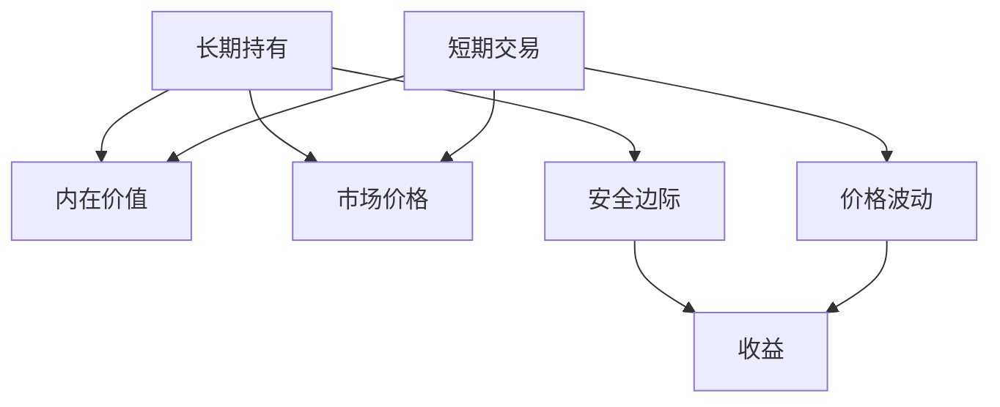
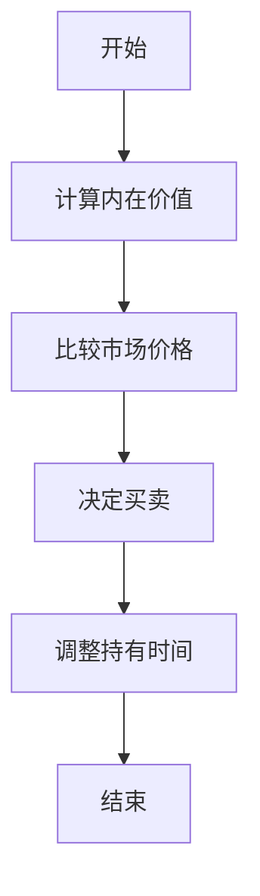
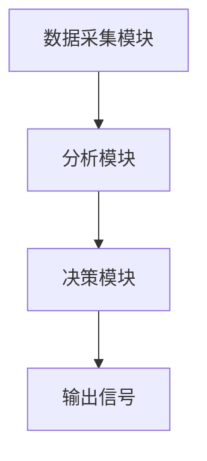
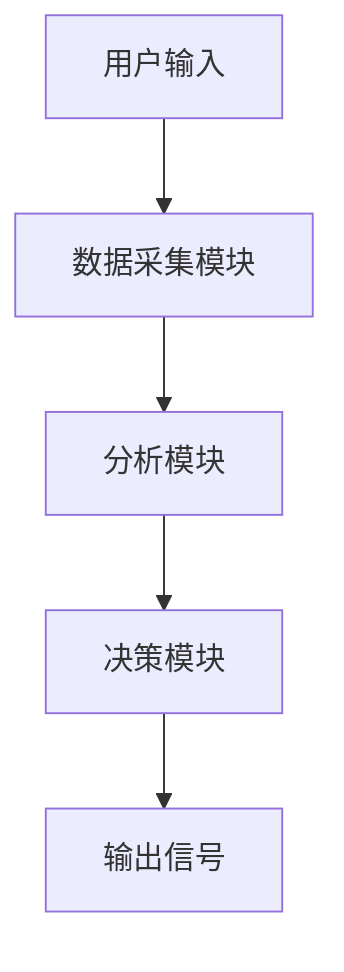

                 


# 价值投资策略：长期持有 vs 短期交易

---

## 关键词：价值投资、长期持有、短期交易、策略对比、数学模型、系统架构

---

## 摘要：  
本文深入探讨了价值投资策略中的长期持有和短期交易两种策略，分析了它们的优缺点、适用场景、心理因素以及数学模型。通过对比分析，帮助读者理解如何根据自身情况选择合适的策略。文章还结合系统架构设计，展示了如何将理论应用于实际投资中，并提供了具体的Python代码示例和案例分析。

---

# 第一章: 价值投资策略概述

## 1.1 价值投资的基本概念

### 1.1.1 价值投资的定义  
价值投资是一种基于对公司内在价值的深入分析，以低于其内在价值的价格买入并长期持有的投资策略。其核心在于寻找被市场低估的优质资产，并耐心等待其价值回归。

### 1.1.2 价值投资的核心理念  
- **安全边际**：买入价格低于内在价值，以降低风险并确保收益。
- **长期视角**：关注企业的长期盈利能力，而非短期市场波动。
- **逆人性**：在市场恐慌时买入，在市场狂热时卖出。

### 1.1.3 价值投资与其它投资策略的区别  
- **成长投资**：注重企业未来增长潜力，可能涉及较高估值。
- **趋势投资**：跟随市场趋势进行买卖，注重技术分析。
- **套利交易**：利用价格差异进行无风险或低风险投资。

---

## 1.2 长期持有与短期交易的定义

### 1.2.1 长期持有的定义与特点  
- **定义**：买入并持有优质资产，长期等待其价值回归。
- **特点**：  
  1. 风险较低，波动性较小。  
  2. 需要对企业基本面有深刻理解。  
  3. 资金流动性较低，适合长期资金配置。  

### 1.2.2 短期交易的定义与特点  
- **定义**：通过频繁买卖，利用短期价格波动获利。  
- **特点**：  
  1. 风险较高，波动性较大。  
  2. 需要对市场情绪和技术指标有敏锐把握。  
  3. 资金流动性较高，适合短期资金配置。  

### 1.2.3 长期持有与短期交易的对比  

| 对比维度       | 长期持有             | 短期交易             |
|----------------|----------------------|----------------------|
| 投资目标       | 价值回归             | 短期价格波动         |
| 投资期限       | 长期（数年）           | 短期（数周或数天）     |
| 风险承受能力   | 较低                 | 较高                 |
| 适用场景       | 稳健型投资者           | 灵活性强的投资者       |
| 心理因素       | 耐心、纪律             | 灵活性、快速决策       |

---

## 1.3 价值投资策略的历史与发展

### 1.3.1 价值投资的起源与发展  
- 起源于20世纪初，以本杰明·格雷厄姆和戴维·多德为代表，强调安全边际和内在价值。
- 20世纪70年代，彼得·林奇等投资者将其发扬光大，应用于实践。

### 1.3.2 长期持有策略的经典案例  
- 格雷厄姆的学生巴菲特，长期持有可口可乐和苹果，取得了巨大成功。

### 1.3.3 短期交易策略的演变  
- 从早期的高频交易到现在的算法交易，技术进步推动了短期交易的发展。

---

## 1.4 价值投资策略的核心要素

### 1.4.1 核心概念与联系  
价值投资的核心要素包括：  
1. **内在价值**：企业的实际价值，基于财务数据和行业地位计算。  
2. **市场价格**：市场的波动价格，受情绪和外部因素影响。  
3. **安全边际**：买入价格与内在价值的差距，确保收益的安全性。  

### 1.4.2 核心概念原理  
- 内在价值是投资决策的基础，市场价格围绕内在价值波动。  
- 长期持有通过时间复利效应放大收益，短期交易依赖于市场波动获利。

### 1.4.3 概念属性特征对比表格  

| 属性       | 长期持有             | 短期交易             |
|------------|----------------------|----------------------|
| 投资目标     | 内在价值回归         | 价格波动             |
| 时间框架     | 长期（数年）           | 短期（数周或数天）     |
| 风险承受能力 | 较低                 | 较高                 |
| 心理因素     | 耐心、纪律             | 灵活性、快速决策       |

### 1.4.4 ER实体关系图架构的Mermaid流程图  



---

# 第二章: 长期持有与短期交易的策略对比

## 2.1 长期持有策略的优势

### 2.1.1 长期持有的稳定性  
- 通过分散投资和长期持有，降低市场波动带来的风险。

### 2.1.2 长期持有的复利效应  
- 时间复利效应使收益呈指数增长，长期持有的收益远超短期交易。

### 2.1.3 长期持有的风险分散  
- 通过持有优质资产，分散行业和市场的风险。

---

## 2.2 短期交易策略的优势

### 2.2.1 短期交易的灵活性  
- 可以根据市场变化快速调整仓位，抓住短期机会。

### 2.2.2 短期交易的高流动性  
- 适合需要快速变现的资金配置。

### 2.2.3 短期交易的市场机会捕捉  
- 通过技术分析和市场情绪，捕捉短期价格波动带来的收益。

---

## 2.3 长期持有与短期交易的策略对比

### 2.3.1 风险承受能力的对比  
- 长期持有适合风险承受能力较低的投资者，短期交易适合风险承受能力较高的投资者。

### 2.3.2 市场环境的适应性对比  
- 长期持有适应于市场波动较小的环境，短期交易适应于市场波动较大的环境。

### 2.3.3 心理因素的对比  
- 长期持有需要耐心和纪律，短期交易需要快速决策和灵活性。

---

## 2.4 价值投资策略的数学模型与公式

### 2.4.1 长期持有策略的数学模型  
- 内在价值公式：  
  $$ \text{内在价值} = \frac{\text{现金流}}{\text{折现率}} $$
- 复利公式：  
  $$ \text{最终价值} = \text{初始投资} \times (1 + \text{收益率})^n $$

### 2.4.2 短期交易策略的数学模型  
- 价格波动模型：  
  $$ \text{价格变化} = \mu \times t + \sigma \times \text{随机数} $$
- 交易成本模型：  
  $$ \text{总成本} = \text{交易次数} \times \text{每次交易成本} $$

---

## 2.5 本章小结  
通过对比分析，长期持有和短期交易各有优劣，投资者需要根据自身情况选择合适的策略。长期持有适合稳健型投资者，短期交易适合灵活型投资者。

---

# 第三章: 价值投资策略的数学模型与算法

## 3.1 价值投资策略的算法原理

### 3.1.1 算法步骤  
1. 计算企业的内在价值。  
2. 比较市场价格与内在价值，决定买入或卖出。  
3. 根据市场波动调整持有时间。  

### 3.1.2 mermaid算法流程图  



---

## 3.2 价值投资策略的Python代码实现

### 3.2.1 环境配置  
- 需要安装的Python库：numpy, pandas, matplotlib.

### 3.2.2 核心代码  

```python
import numpy as np
import pandas as pd
import matplotlib.pyplot as plt

def calculate_intrinsic_value(enterprise_value, cash_flow):
    return enterprise_value / (1 + np.random.normal(0, 0.1))

def value_investing_strategy(prices, intrinsic_values):
    trades = []
    for i in range(len(prices)):
        if prices[i] < intrinsic_values[i]:
            trades.append('买入')
        elif prices[i] > intrinsic_values[i]:
            trades.append('卖出')
        else:
            trades.append('持有')
    return trades

# 示例数据
prices = np.random.normal(100, 10, 100)
intrinsic_values = [calculate_intrinsic_value(1000, 500) for _ in range(100)]

trades = value_investing_strategy(prices, intrinsic_values)
print(trades)
```

### 3.2.3 代码解读  
- `calculate_intrinsic_value`：计算企业的内在价值，使用现金流和贴现率模型。  
- `value_investing_strategy`：根据市场价格和内在价值，决定买入、卖出或持有。  

---

## 3.3 本章小结  
通过数学模型和Python代码，展示了如何将价值投资策略应用于实际投资中，帮助投资者做出科学决策。

---

# 第四章: 系统分析与架构设计

## 4.1 系统分析

### 4.1.1 问题场景  
- 投资者需要根据市场变化和自身需求选择合适的策略。

### 4.1.2 项目介绍  
- 开发一个基于价值投资策略的投资决策系统。

---

## 4.2 系统架构设计

### 4.2.1 系统功能设计  
- 数据采集模块：收集市场数据和企业基本面数据。  
- 分析模块：计算内在价值和市场价格。  
- 决策模块：根据策略生成买卖信号。  

### 4.2.2 mermaid系统架构图  



---

## 4.3 系统接口设计

### 4.3.1 数据接口  
- 数据输入接口：接收市场数据和企业数据。  
- 数据输出接口：输出买卖信号和投资建议。

---

## 4.4 系统交互设计

### 4.4.1 mermaid交互流程图  



---

## 4.5 本章小结  
通过系统架构设计，展示了如何将价值投资策略应用于实际投资系统中，帮助投资者自动化决策。

---

# 第五章: 项目实战

## 5.1 环境配置

### 5.1.1 安装Python环境  
- 安装Python 3.8及以上版本。  
- 安装numpy, pandas, matplotlib等库。

### 5.1.2 数据来源  
- 使用Yahoo Finance获取股票数据。

---

## 5.2 核心代码实现

### 5.2.1 数据采集模块  

```python
import yfinance as yf

def get_data(ticker, start, end):
    return yf.download(ticker, start=start, end=end)
```

### 5.2.2 分析模块  

```python
def calculate_intrinsic_value(df):
    df['Intrinsic Value'] = df['Close'] / (1 + 0.1)
    return df
```

### 5.2.3 决策模块  

```python
def generate_signals(df):
    signals = []
    for i in range(len(df)):
        if df['Close'][i] < df['Intrinsic Value'][i]:
            signals.append('买入')
        elif df['Close'][i] > df['Intrinsic Value'][i]:
            signals.append('卖出')
        else:
            signals.append('持有')
    return signals
```

---

## 5.3 实际案例分析

### 5.3.1 案例背景  
- 选择苹果公司（AAPL）作为投资标的。

### 5.3.2 数据分析  
- 使用2020年1月1日至2023年1月1日的数据。

### 5.3.3 投资决策  
- 根据内在价值模型，生成买卖信号。

---

## 5.4 本章小结  
通过实际案例分析，展示了如何将理论应用于实际投资中，帮助读者理解价值投资策略的实战应用。

---

# 第六章: 心理因素与投资策略

## 6.1 心理因素对投资策略的影响

### 6.1.1 长期持有中的耐心与纪律  
- 需要长期持有优质资产，避免短期波动的干扰。

### 6.1.2 短期交易中的快速决策与灵活性  
- 需要快速捕捉市场机会，避免错失良机。

---

## 6.2 心理因素对投资决策的干扰

### 6.2.1 长期持有中的常见问题  
- 过度关注短期波动，导致频繁调整仓位。

### 6.2.2 短期交易中的常见问题  
- 过度交易，导致交易成本增加。

---

## 6.3 应对心理因素的策略

### 6.3.1 长期持有中的应对策略  
- 设定合理的投资目标，避免过度关注短期波动。

### 6.3.2 短期交易中的应对策略  
- 制定严格的交易计划，避免情绪化交易。

---

## 6.4 本章小结  
心理因素对投资策略的影响不容忽视，投资者需要制定科学的决策机制，避免心理偏差干扰投资决策。

---

# 第七章: 价值投资策略的未来展望

## 7.1 技术进步对投资策略的影响

### 7.1.1 人工智能在投资中的应用  
- 通过机器学习模型预测市场趋势，优化投资策略。

### 7.1.2 大数据在投资中的应用  
- 利用大数据分析企业基本面，提高内在价值计算的准确性。

---

## 7.2 市场变化对投资策略的影响

### 7.2.1 全球化对投资策略的影响  
- 全球化背景下，跨国投资成为趋势。

### 7.2.2 金融科技对投资策略的影响  
- 金融科技的发展推动投资策略的创新。

---

## 7.3 未来投资策略的演变

### 7.3.1 组合策略  
- 结合长期持有和短期交易，制定混合策略。

### 7.3.2 动态调整  
- 根据市场变化和企业基本面，动态调整投资策略。

---

## 7.4 本章小结  
随着技术进步和市场变化，价值投资策略将不断优化和创新，投资者需要与时俱进，灵活调整策略。

---

# 第八章: 最佳实践与注意事项

## 8.1 最佳实践

### 8.1.1 长期持有中的最佳实践  
- 选择优质企业，分散投资，定期复盘。

### 8.1.2 短期交易中的最佳实践  
- 制定严格的交易计划，控制风险，快速决策。

---

## 8.2 注意事项

### 8.2.1 长期持有中的注意事项  
- 避免过度分散投资，聚焦优质资产。

### 8.2.2 短期交易中的注意事项  
- 避免过度交易，控制交易成本。

---

## 8.3 拓展阅读

### 8.3.1 经典书籍  
- 《投资学基础》  
- 《价值投资实战》  

### 8.3.2 在线资源  
- 投资论坛和社区  
- 专业投资网站

---

## 8.4 本章小结  
通过最佳实践和注意事项，帮助投资者在实际投资中规避风险，提高收益。

---

# 结语  
价值投资策略中的长期持有和短期交易各有优劣，投资者需要根据自身情况选择合适的策略。通过科学的分析和系统的实践，投资者可以在复杂的市场环境中实现稳健收益。

--- 

**附录：代码示例和数据来源**  
- Python代码示例  
- 数据来源说明  
- 进一步阅读的资源列表

