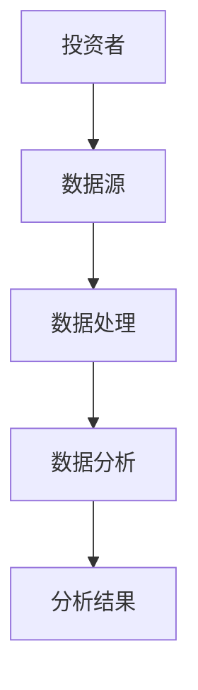
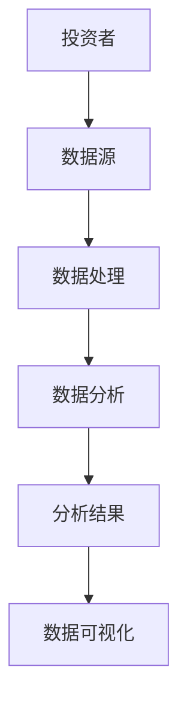

                 


# 价值投资者的数字化转型：大数据分析的应用

---

## 关键词：
价值投资、数字化转型、大数据分析、金融投资、数据驱动决策

---

## 摘要：
在金融市场的日益复杂化和竞争加剧的背景下，价值投资者正面临着前所未有的挑战。为了在市场中保持优势，价值投资者正在将数字化转型作为核心战略，其中大数据分析成为最重要的工具之一。本文将详细探讨大数据分析在价值投资中的应用，从数据分析的核心概念到算法原理，再到系统架构和项目实战，为读者提供全面的指导。通过本文，读者将了解如何利用大数据分析提升投资决策的准确性和效率，从而在数字化转型中抓住机遇，实现长期稳健的投资回报。

---

## 第一部分: 价值投资者的数字化转型概述

---

### 第1章: 价值投资与数字化转型的背景

#### 1.1 价值投资的核心理念

##### 1.1.1 价值投资的定义与特点
价值投资是一种以基本面分析为基础的投资策略，旨在通过识别市场中的低估资产，长期持有以实现超额收益。其核心理念是购买具有内在价值的资产，并在市场低估时买入，高估时卖出。

##### 1.1.2 价值投资的核心原则
- **安全边际**：买入价格低于内在价值，以降低投资风险。
- **长期视角**：关注企业的长期盈利能力，而非短期市场波动。
- **价值发现**：通过深入研究发现市场中的低估机会。

##### 1.1.3 价值投资在现代金融中的地位
尽管价值投资在传统金融理论中占据重要地位，但在现代金融市场中，随着信息的透明化和投资者行为的趋同化，单纯依赖基本面分析的效率逐渐降低。这为价值投资者带来了新的挑战，同时也催生了数字化转型的必要性。

#### 1.2 数字化转型的背景与趋势

##### 1.2.1 数字化转型的定义与内涵
数字化转型是指利用数字技术（如大数据、人工智能、云计算等）对企业或个人的业务模式、流程、文化等进行根本性变革，以适应快速变化的市场环境。在金融领域，数字化转型意味着将传统投资方法与现代技术相结合，提升投资决策的效率和准确性。

##### 1.2.2 金融行业的数字化转型趋势
- **数据驱动决策**：通过大数据分析实现更精准的投资决策。
- **自动化交易**：利用算法交易提升交易效率和准确性。
- **智能投顾**：通过人工智能提供个性化的投资建议。

##### 1.2.3 价值投资者面临的挑战与机遇
- **挑战**：传统价值投资方法面临信息过载和市场效率提升的挑战。
- **机遇**：数字化转型为价值投资者提供了新的工具和方法，帮助他们在竞争中保持优势。

#### 1.3 大数据分析在金融领域的应用前景

##### 1.3.1 大数据分析的定义与特点
大数据分析是指对海量、多样化、高速变化的数据进行处理、分析和挖掘，以提取有价值的信息和洞察。其特点包括数据量大、数据类型多样、处理速度快和价值密度低。

##### 1.3.2 大数据分析在金融中的作用
- **风险控制**：通过分析历史数据和市场动态，识别潜在风险。
- **投资决策**：利用大数据分析预测市场趋势，优化投资组合。
- **客户画像**：通过分析客户行为数据，提供个性化投资服务。

##### 1.3.3 价值投资者如何利用大数据分析
价值投资者可以通过大数据分析实现以下目标：
- **发现市场机会**：通过分析非传统数据源（如社交媒体、新闻数据）发现市场低估的机会。
- **提升分析效率**：利用大数据技术快速处理大量数据，提高投资决策的效率。
- **优化投资组合**：通过大数据分析优化资产配置，降低投资风险。

#### 1.4 本章小结
本章介绍了价值投资的核心理念和数字化转型的背景与趋势，强调了大数据分析在金融领域的重要作用。价值投资者通过数字化转型可以利用大数据分析工具提升投资决策的效率和准确性，抓住市场机会，实现长期稳健的投资回报。

---

## 第二部分: 大数据分析的核心概念与原理

---

### 第2章: 大数据分析的核心概念

#### 2.1 数据的分类与特征

##### 2.1.1 结构化数据与非结构化数据
- **结构化数据**：具有明确的数据结构，如表格数据，适合数据库存储和查询。
- **非结构化数据**：没有固定结构，如文本、图像、音频等，需要通过自然语言处理等技术进行分析。

##### 2.1.2 数据的维度与层次
- **维度**：数据的维度是指数据的特征数量，如时间、地点、价格等。
- **层次**：数据的层次是指数据的组织方式，如个体、群体、整体等。

##### 2.1.3 数据的清洗与预处理
- **数据清洗**：去除重复数据、处理缺失值、纠正错误数据。
- **数据预处理**：标准化、归一化、特征提取等，为后续分析做好准备。

#### 2.2 数据分析方法的对比

##### 2.2.1 描述性分析与诊断性分析
- **描述性分析**：总结数据的基本特征，如均值、中位数等。
- **诊断性分析**：通过统计检验发现数据中的异常点和潜在关系。

##### 2.2.2 预测性分析与规范性分析
- **预测性分析**：利用历史数据预测未来趋势，如时间序列分析。
- **规范性分析**：通过分析数据制定决策建议，如信用评分。

##### 2.2.3 不同分析方法的优缺点对比
| 分析方法 | 优点 | 缺点 |
|----------|------|------|
| 描述性分析 | 简单直观，适合初步分析 | 无法揭示数据的潜在关系 |
| 诊断性分析 | 可以发现数据中的异常点 | 依赖假设检验，结果可能受样本影响 |
| 预测性分析 | 可以预测未来趋势 | 需要大量历史数据，结果可能存在误差 |
| 规范性分析 | 提供决策建议 | 可能受到模型假设的限制 |

#### 2.3 数据分析的实体关系图


#### 2.4 本章小结
本章介绍了数据分析的核心概念，包括数据的分类与特征、数据分析方法的对比以及数据分析的实体关系图。这些内容为后续的算法原理和系统设计奠定了基础。

---

## 第三部分: 大数据分析的算法原理

---

### 第3章: 常用数据分析算法

#### 3.1 回归分析

##### 3.1.1 线性回归的原理
线性回归是一种通过拟合一条直线来预测目标变量的值的方法。其数学公式为：
$$ y = \beta_0 + \beta_1x + \epsilon $$
其中，$\beta_0$ 是截距，$\beta_1$ 是斜率，$\epsilon$ 是误差项。

##### 3.1.2 逻辑回归的应用
逻辑回归是一种用于分类问题的算法，适用于二分类问题。其核心思想是通过构建一个逻辑函数将线性回归的输出映射到0-1区间，表示概率。

##### 3.1.3 回归分析的优缺点
- **优点**：简单易懂，计算效率高。
- **缺点**：假设变量间线性关系，可能无法捕捉复杂关系。

#### 3.2 聚类分析

##### 3.2.1 K-means算法的原理
K-means算法是一种无监督学习算法，用于将数据划分为K个簇。其核心思想是通过迭代优化簇中心的位置，使得簇内数据点的相似性最大化。

##### 3.2.2 层次聚类的应用
层次聚类是一种通过递归地将数据划分为层次结构的方法。其优点是可以处理任意形状的数据，缺点是计算复杂度较高。

##### 3.2.3 聚类分析的优缺点
- **优点**：无需标签数据，可以发现数据中的潜在结构。
- **缺点**：K-means算法对初始中心敏感，层次聚类计算复杂。

#### 3.3 分类算法

##### 3.3.1 决策树的原理
决策树是一种通过构建树状结构进行分类的算法。其优点是易于解释，适合处理非线性关系。

##### 3.3.2 支持向量机的应用
支持向量机是一种用于分类和回归的算法，通过构建超平面将数据分为两类。其优点是可以处理高维数据，缺点是计算复杂度较高。

##### 3.3.3 分类算法的优缺点
- **决策树**：易于解释，但可能过拟合。
- **支持向量机**：适合高维数据，但计算复杂。

#### 3.4 本章小结
本章介绍了常用的数据分析算法，包括回归分析、聚类分析和分类算法的原理和应用。这些算法为后续的系统设计和项目实战提供了理论基础。

---

## 第四部分: 数学模型与算法实现

---

### 第4章: 数学模型与公式

#### 4.1 线性回归模型
线性回归模型的数学公式为：
$$ y = \beta_0 + \beta_1x + \epsilon $$
其中，$\beta_0$ 是截距，$\beta_1$ 是斜率，$\epsilon$ 是误差项。

#### 4.2 时间序列分析模型
时间序列分析模型的数学公式为：
$$ ARIMA(p, d, q) $$
其中，p为自回归阶数，d为差分阶数，q为移动平均阶数。

#### 4.3 聚类分析的数学公式
K-means算法的目标函数为：
$$ \sum_{i=1}^{k} \sum_{j=1}^{n_i} (x_{ij} - c_i)^2 $$
其中，k为簇的数量，$n_i$ 为第i个簇中的数据点数量，$x_{ij}$ 为第i个簇中的第j个数据点，$c_i$ 为第i个簇的中心。

#### 4.4 本章小结
本章介绍了常用数学模型和公式，为后续的系统设计和项目实战提供了理论支持。

---

## 第五部分: 系统架构与设计

---

### 第5章: 系统分析与架构设计

#### 5.1 系统功能设计

##### 5.1.1 数据采集模块
数据采集模块负责从多种数据源（如股票数据、新闻数据）获取数据，并进行初步清洗和预处理。

##### 5.1.2 数据处理模块
数据处理模块负责对采集到的数据进行进一步清洗、转换和标准化，为后续分析做好准备。

##### 5.1.3 数据分析模块
数据分析模块负责对处理后的数据进行建模和分析，生成分析结果。

##### 5.1.4 数据可视化模块
数据可视化模块负责将分析结果以图表形式展示，便于投资者理解和决策。

#### 5.2 系统架构设计


#### 5.3 本章小结
本章介绍了系统功能设计和架构设计，强调了模块化设计和数据流的清晰划分。

---

## 第六部分: 项目实战

---

### 第6章: 项目实战与应用

#### 6.1 项目背景与目标
本项目旨在利用大数据分析技术，帮助价值投资者发现市场机会，优化投资组合。

#### 6.2 系统核心实现源代码
以下是Python实现的线性回归代码示例：
```python
import numpy as np
from sklearn.linear_model import LinearRegression

# 生成数据
X = np.array([1, 2, 3, 4, 5]).reshape(-1, 1)
y = np.array([2, 4, 5, 4, 6])

# 训练模型
model = LinearRegression()
model.fit(X, y)

# 预测结果
print(model.predict([[6]]))
```

#### 6.3 代码应用解读与分析
上述代码实现了线性回归模型，用于预测股票价格。通过训练模型，投资者可以基于历史数据预测未来的价格走势。

#### 6.4 实际案例分析和详细讲解剖析
以某股票为例，通过大数据分析发现其内在价值被市场低估，建议投资者买入。分析过程包括数据采集、处理、建模和可视化。

#### 6.5 项目小结
本章通过项目实战展示了大数据分析在价值投资中的应用，帮助投资者提升投资决策的效率和准确性。

---

## 第七部分: 总结与展望

---

### 第7章: 总结与展望

#### 7.1 本章总结
本文详细探讨了价值投资者的数字化转型，重点介绍了大数据分析在金融领域的应用。通过系统设计和项目实战，展示了如何利用大数据分析技术提升投资决策的效率和准确性。

#### 7.2 最佳实践 tips
- **数据清洗**：确保数据质量，避免错误分析。
- **模型选择**：根据具体问题选择合适的算法。
- **结果验证**：通过回测验证模型的可行性。

#### 7.3 未来展望
随着人工智能和大数据技术的不断发展，价值投资者将拥有更多工具和方法提升投资效率。未来的研究方向包括深度学习在金融中的应用、多模态数据分析等。

#### 7.4 本章小结
本章总结了全文内容，并对未来的研究方向进行了展望，为读者提供了进一步思考的空间。

---

## 结语

通过本文的探讨，读者可以深入了解大数据分析在价值投资中的应用，掌握数字化转型的核心方法和技巧。希望本文能为价值投资者提供有价值的参考，帮助他们在数字化转型中抓住机遇，实现长期稳健的投资回报。

