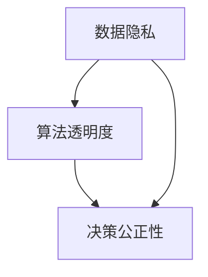
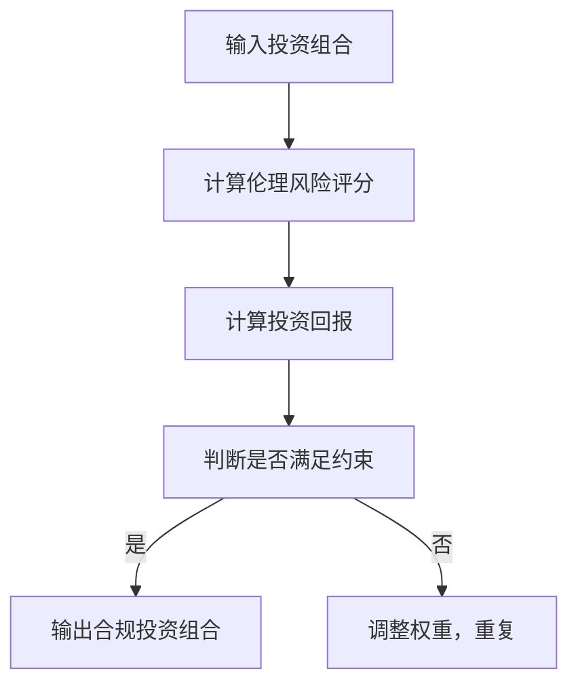
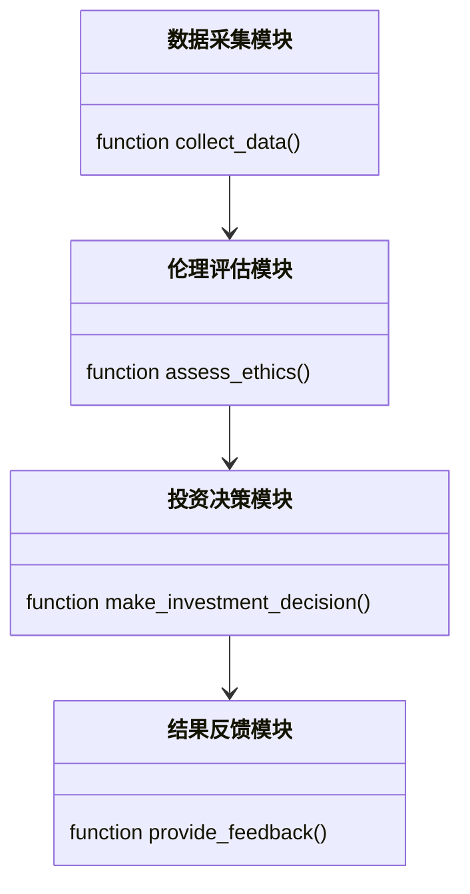
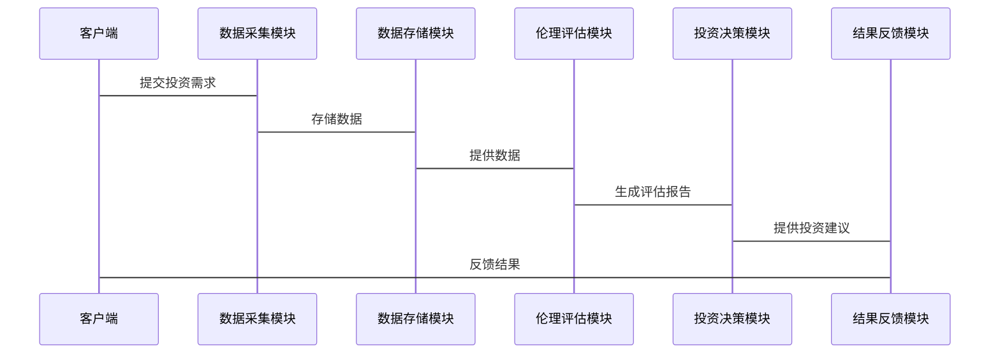

                 


# 价值投资视角下的人工智能伦理Compliance

## 关键词：人工智能，伦理，合规，价值投资，算法，系统架构

## 摘要：本文从价值投资的角度探讨人工智能系统的伦理合规性，分析其在投资决策中的重要性。通过构建评估模型，结合系统架构设计和实际案例，提出确保AI伦理合规的方法和策略。

---

## 第1章：引言

### 1.1 背景介绍

人工智能技术的快速发展带来了巨大的投资机会，同时也引发了诸多伦理问题。AI系统在金融投资中的应用日益广泛，但其决策过程可能涉及偏见、透明度不足等问题，这不仅影响投资结果，还可能引发法律和道德风险。

### 1.2 问题描述

本文探讨如何从价值投资的角度确保AI系统的伦理合规性，重点关注以下几个方面：
- **数据隐私**：AI系统处理大量数据，如何确保数据隐私合规？
- **算法透明度**：投资决策的透明度如何保证？
- **伦理评估**：如何建立伦理评估体系，确保投资决策符合道德标准？

### 1.3 研究意义与目标

通过构建伦理合规评估模型，本文旨在帮助投资者在决策中兼顾收益与道德责任，提升投资的可持续性与社会价值。

---

## 第2章：价值投资与AI伦理Compliance的核心概念

### 2.1 核心概念术语说明

- **AI伦理**：指人工智能系统在设计和应用中应遵循的道德准则，包括隐私、公正、透明等。
- **Compliance**：指遵守相关法律法规和行业标准。
- **价值投资**：强调长期投资价值，关注企业基本面和长期发展潜力。

### 2.2 概念模型构建

构建一个AI伦理Compliance的概念模型，涵盖数据、算法、决策三个核心要素。使用mermaid图展示概念之间的关系：



### 2.3 概念属性特征对比

以下是AI伦理、Compliance和价值投资的核心属性对比：

| 属性         | AI伦理         | Compliance       | 价值投资       |
|--------------|----------------|------------------|----------------|
| 关注点       | 道德准则        | 法律法规         | 长期价值       |
| 实施方式     | 设计与应用      | 遵守规范         | 投资策略       |
| 目标         | 减少伦理风险    | 避免法律纠纷     | 实现长期收益   |

---

## 第3章：AI伦理Compliance的算法原理

### 3.1 评估模型构建

建立一个伦理合规评估模型，目标是最小化伦理风险，同时最大化投资收益。数学模型如下：

$$
\text{目标函数：} \quad \min \sum_{i=1}^{n} w_i \cdot r_i
$$

$$
\text{约束条件：} \quad \sum_{i=1}^{n} w_i \cdot e_i \leq E_{\text{max}}
$$

其中，\( w_i \) 为投资权重，\( r_i \) 为投资回报率，\( e_i \) 为伦理风险评分，\( E_{\text{max}} \) 为最大可接受的伦理风险总和。

### 3.2 算法流程图

使用mermaid绘制算法流程图：



### 3.3 实际案例分析

假设某金融公司开发了一个AI投资系统，我们计算其伦理风险评分和投资回报，确保其符合合规要求。核心代码如下：

```python
def calculate_ethical_risk(weights):
    # 计算伦理风险评分
    return sum(w * e for w, e in zip(weights, ethic_risk_factors))

def optimize_portfolio(weights, max_ethical_risk):
    # 使用优化算法调整权重
    while calculate_ethical_risk(weights) > max_ethical_risk:
        adjust_weights(weights)
    return weights

# 示例应用
weights = [0.2, 0.3, 0.5]
max_ethical_risk = 0.8
optimized_weights = optimize_portfolio(weights, max_ethical_risk)
print("优化后的权重：", optimized_weights)
```

---

## 第4章：系统架构设计

### 4.1 系统功能模块设计

系统包括数据采集、伦理评估、投资决策和结果反馈四大模块。使用mermaid类图展示：



### 4.2 系统架构图

展示系统整体架构：


### 4.3 系统交互流程图

使用mermaid序列图展示交互流程：



---

## 第5章：项目实战

### 5.1 环境安装

安装必要的库，如numpy、pandas、scipy：

```bash
pip install numpy pandas scipy
```

### 5.2 核心代码实现

实现伦理评估模型的优化算法：

```python
import numpy as np

def optimize_portfolio(weights, max_ethical_risk):
    while calculate_ethical_risk(weights) > max_ethical_risk:
        weights = adjust_weights(weights)
    return weights

def calculate_ethical_risk(weights):
    return np.dot(weights, ethic_risk_factors)

# 示例应用
initial_weights = np.array([0.2, 0.3, 0.5])
max_ethical_risk = 0.8
optimized_weights = optimize_portfolio(initial_weights, max_ethical_risk)
print("优化后的权重：", optimized_weights)
```

### 5.3 案例分析

以某金融公司为例，展示如何优化投资组合，确保伦理合规，同时最大化投资回报。

---

## 第6章：最佳实践与总结

### 6.1 最佳实践tips

- 在投资决策中，优先考虑数据隐私和算法透明度。
- 定期审查和更新伦理评估模型，确保其适应法规变化。
- 结合定量分析和定性评估，全面考量投资标的的伦理风险。

### 6.2 总结

价值投资视角下的AI伦理Compliance不仅有助于提升投资的合规性，还能增强企业的社会责任感。通过构建完善的评估体系和优化算法，投资者可以在追求收益的同时，实现可持续发展。

### 6.3 未来展望

随着AI技术的不断进步，伦理合规将更加复杂，但也带来更多机遇。未来的研究应关注动态风险评估和多目标优化，以应对日益复杂的投资环境。

---

## 附录

- **附录A**：伦理评估模型的详细公式
- **附录B**：系统架构设计的扩展说明
- **附录C**：项目实战的代码仓库链接

---

通过以上内容，本文系统地探讨了价值投资视角下的AI伦理合规问题，提供了理论分析、算法实现和实际案例的全面解读，为投资者和相关从业人员提供了有价值的参考。

