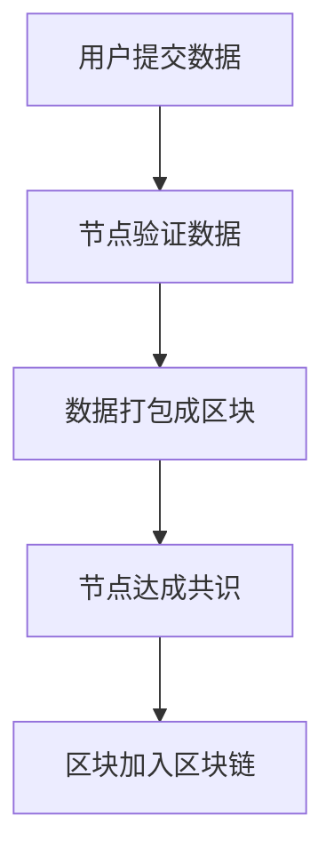
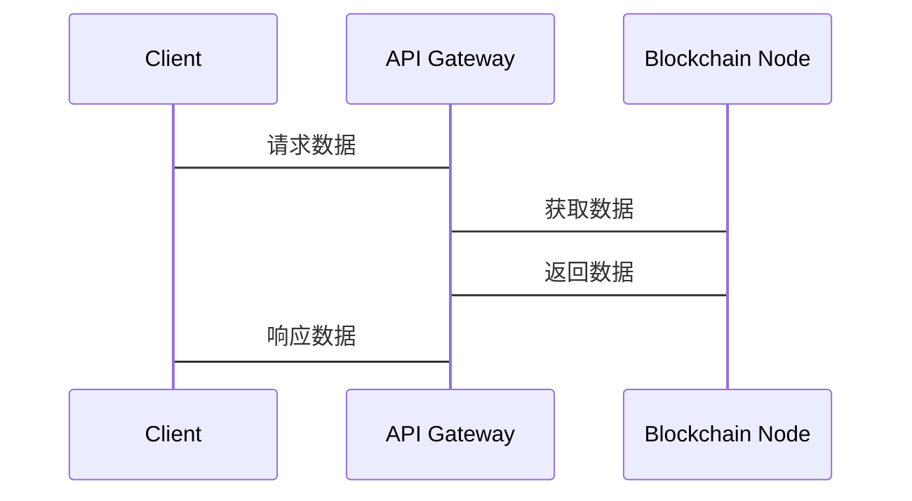

                 


# 价值投资视角下的智慧医疗区块链数据共享系统

## 关键词
- 价值投资
- 智慧医疗
- 区块链
- 数据共享系统
- 医疗数据
- 智能合约

## 摘要
本文从价值投资的角度探讨智慧医疗中的区块链数据共享系统。通过分析医疗数据共享的痛点，结合区块链技术的特点，提出一种基于价值投资的区块链数据共享解决方案。文章详细介绍了系统的背景、核心概念、算法原理、系统架构、项目实战和最佳实践，旨在为医疗行业提供一种高效、安全、可扩展的区块链数据共享方案。

---

## 第一部分：价值投资视角下的智慧医疗背景介绍

### 第1章：智慧医疗与区块链的背景

#### 1.1 问题背景
- **问题背景**：医疗数据孤岛现象严重，数据共享困难，影响医疗效率和患者体验。
- **价值投资的作用**：通过区块链技术，提升医疗数据的价值，吸引投资。
- **数据共享的挑战**：数据隐私、安全性和互操作性问题。

#### 1.2 医疗数据共享的痛点
- 数据隐私泄露风险高。
- 医疗机构之间的数据共享机制不完善。
- 患者数据难以被有效利用，影响医疗决策。

#### 1.3 区块链技术的解决方案
- 提供去中心化数据存储，确保数据安全。
- 通过智能合约实现数据共享的自动化和透明化。
- 通过激励机制提升数据共享的价值。

### 第2章：核心概念与联系

#### 2.1 核心概念原理
- **价值投资**：通过数据共享带来的经济效益。
- **区块链**：去中心化、不可篡改、可追溯。
- **智慧医疗**：利用先进技术提升医疗服务效率和质量。

#### 2.2 核心概念对比
| 核心概念 | 属性 | 描述 |
|----------|-------|------|
| 价值投资 | 经济驱动 | 数据共享带来的投资回报。 |
| 区块链   | 技术特征 | 去中心化、安全性。 |
| 智慧医疗 | 应用场景 | 提升医疗服务效率。 |
| 数据共享系统 | 功能 | 数据存储、共享、管理。 |

#### 2.3 ER实体关系图
```mermaid
erd
    Hospital(hospital_id, name, address)
    Patient(patient_id, name, contact_info)
    MedicalData(data_id, patient_id, data_type, timestamp)
    Block(block_id, data_id, timestamp, hash)
    Transaction(tx_id, block_id, timestamp)
```

---

## 第二部分：算法原理讲解

### 第3章：区块链共识机制与智能合约

#### 3.1 共识机制
- **工作原理**：节点通过共识机制验证和存储数据。
- **常见机制**：PoW、PoS、DPOS。
- **选择机制**：适用于医疗数据共享的机制是DPOS，效率高且安全性强。

#### 3.2 智能合约
- **定义**：区块链上的自动执行程序。
- **实现代码**：Solidity语言，示例代码如下：
  ```solidity
  contract MedicalDataShare {
      function shareData(uint patientId, string data) {
          // 数据存储逻辑
      }
  }
  ```

#### 3.3 区块链共识机制的mermaid流程图


### 第4章：数学模型与激励机制

#### 4.1 激励模型
- **公式**：$V = \alpha \times D + \beta \times S + \gamma \times T$
  - $V$：数据价值。
  - $D$：数据质量。
  - $S$：共享次数。
  - $T$：时间因素。
  - $\alpha, \beta, \gamma$：权重系数。

#### 4.2 数据价值的计算
- 示例：$V = 0.5 \times 0.9 + 0.3 \times 3 + 0.2 \times 2 = 0.45 + 0.9 + 0.4 = 1.75$。

---

## 第三部分：系统分析与架构设计

### 第5章：系统架构设计

#### 5.1 系统功能设计
- **功能模块**：数据采集、存储、共享、分析。
- **领域模型类图**
  ```mermaid
  classDiagram
      class Hospital {
          string name;
          int id;
      }
      class Patient {
          string name;
          int id;
      }
      class MedicalData {
          string data;
          int patientId;
      }
      class Block {
          int blockId;
          MedicalData[] data;
      }
      Hospital --> MedicalData
      Patient --> MedicalData
      Block --> MedicalData
  ```

#### 5.2 系统架构图


#### 5.3 系统接口设计
- **API接口**：
  - `GET /api/blockchain/data?id=123`
  - `POST /api/blockchain/share`

#### 5.4 交互序列图


---

## 第四部分：项目实战

### 第6章：项目实战

#### 6.1 环境安装
- **工具**：Node.js、Solidity、Ganache、 Remix。
- **步骤**：
  1. 安装Node.js和npm。
  2. 安装Solidity和Remix。
  3. 启动Ganache节点。

#### 6.2 核心代码实现
- **智能合约实现**：
  ```solidity
  contract MedicalData {
      mapping(address => uint) public shares;
      
      function setData(uint id, string data) {
          shares[id] = 1;
      }
      
      function getData(uint id) returns (string) {
          return data[id];
      }
  }
  ```

#### 6.3 案例分析
- **案例**：某医院共享患者数据，通过智能合约实现数据共享。
- **分析**：数据共享后，提升了诊断效率，增加了投资回报。

#### 6.4 项目总结
- 成功实现了医疗数据的区块链共享。
- 提高了数据的安全性和互操作性。
- 展现了区块链技术在医疗领域的巨大潜力。

---

## 第五部分：最佳实践

### 第7章：最佳实践

#### 7.1 小结
- 区块链技术为医疗数据共享提供了新的解决方案。
- 价值投资视角下，数据共享系统具有巨大的商业潜力。

#### 7.2 注意事项
- 数据隐私保护至关重要。
- 共识机制选择影响系统性能。
- 智能合约代码需经过严格测试。

#### 7.3 拓展阅读
- 推荐书籍：《区块链：价值互联网的基石》。
- 推荐网站：Remix、Solidity官方文档。

---

## 结语
价值投资视角下的智慧医疗区块链数据共享系统，不仅提升了医疗数据的安全性和共享效率，还为医疗行业带来了巨大的商业价值。通过本文的详细分析，读者可以深入了解这一系统的实现细节和应用场景，为未来的医疗技术创新提供参考。

