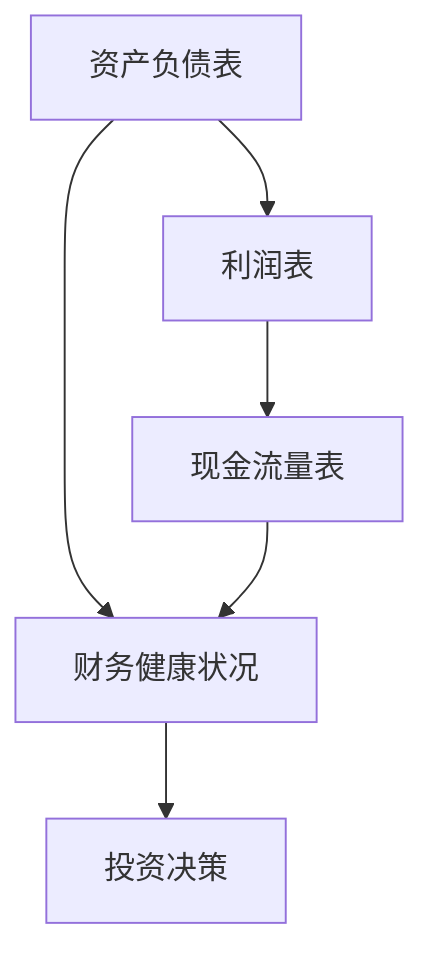

                 

# 价格公道的好公司：巴菲特投资理念的核心

## 关键词：巴菲特投资理念、价值投资、好公司标准、股票估值、长期投资、安全边际

## 摘要：  
巴菲特的投资理念以“价格公道的好公司”为核心，强调通过基本面分析和长期视角来选择具有强大竞争优势和财务健康的好公司。本文从巴菲特的投资哲学、价值投资的定义、好公司的标准、价格公道的评估方法、投资策略的分析工具、实际案例分析以及投资心态等方面进行详细探讨，揭示巴菲特投资理念的核心思想，并结合技术语言和专业分析，为投资者提供深度的理论支持和实践指导。

---

# 第一部分：巴菲特投资理念的背景与核心概念

## 第1章：巴菲特投资理念的背景与起源

### 1.1 巴菲特的生平与投资哲学

沃伦·巴菲特是全球最著名的投资者之一，被誉为“股神”。他出生于1930年，早年通过阅读投资经典书籍（如格雷厄姆的《证券分析》）和实践，逐渐形成了自己的投资理念。巴菲特的投资哲学强调长期价值投资，而非短期市场波动。他的人生信条是：“时间是伟大企业的朋友，是平庸企业的敌人。”  

### 1.2 价值投资的定义与核心思想

价值投资是一种以基本面分析为基础的投资方法，旨在找到市场价格低于其内在价值的公司。巴菲特的价值投资理念强调以下几点：
1. **安全边际**：买入价格低于内在价值，确保投资的安全性。
2. **长期视角**：关注企业的长期竞争优势和盈利能力。
3. **简单与专注**：专注于少数优质企业，避免复杂的投资决策。

### 1.3 巴菲特投资理念的演变

巴菲特的投资理念在实践中不断完善。早期，他主要关注低估值股票；后来，他逐渐转向寻找具有强大护城河（竞争优势）的企业，并长期持有这些股票，享受复利效应。这种演变使他成为价值投资的终极践行者。

---

## 第2章：巴菲特投资理念的核心要素

### 2.1 企业的护城河

**护城河**是巴菲特选择好公司的重要标准。护城河可以是技术优势、品牌影响力、成本优势或市场准入壁垒。例如，可口可乐的全球品牌影响力和分销网络就是其强大的护城河。

#### 护城河的分类
1. **成本优势**：如制造业中的规模效应。
2. **品牌影响力**：如奢侈品行业。
3. **技术壁垒**：如专利和技术独占性。
4. **网络效应**：如社交媒体平台。

### 2.2 管理层的质量与决策

巴菲特认为，管理层的质量和决策能力直接影响企业的长期发展。优秀管理层的特征包括：
- 诚实可靠，避免过度杠杆和激进扩张。
- 具有长期视野，注重股东利益。
- 能够有效分配资本，避免浪费。

### 2.3 财务健康状况的评估

巴菲特注重企业的财务健康，关注以下指标：
- **净利润**：衡量企业盈利能力。
- **现金流**：反映企业的实际运营能力。
- **负债水平**：避免过高杠杆风险。

### 2.4 企业的竞争优势

竞争优势是企业长期盈利的关键。巴菲特关注企业的市场地位、产品差异化能力以及运营效率。例如，苹果通过不断创新的产品设计和生态系统，建立了强大的竞争优势。

---

## 第3章：巴菲特投资理念的分析工具

### 3.1 基本面分析的核心方法

基本面分析是巴菲特选股的核心工具。以下是基本面分析的主要步骤：
1. **分析财务报表**：包括资产负债表、利润表和现金流量表。
2. **评估盈利能力**：关注净利润率和ROE（净资产收益率）。
3. **评估财务健康状况**：关注资产负债率和现金流情况。

#### 财务报表分析的 mermaid 图

### 3.2 股票估值的数学模型

股票估值的核心是计算企业的内在价值。以下是常用的方法：

#### 内在价值公式

$$
\text{内在价值} = \frac{\text{净利润}}{\text{贴现率} - \text{增长率}}
$$

例如，假设净利润为100万元，贴现率为10%，增长率为5%，则内在价值为：

$$
\frac{100}{0.10 - 0.05} = 2000 \text{万元}
$$

#### 市盈率与市净率的对比

市盈率（P/E）= 股价 / 每股净利润  
市净率（P/B）= 股价 / 每股净资产  

### 3.3 财务指标的对比与分析

通过对比财务指标，可以更好地评估企业的竞争力。例如，使用ROE（净资产收益率）来衡量企业的盈利能力：

$$
\text{ROE} = \frac{\text{净利润}}{\text{净资产}}
$$

---

## 第4章：巴菲特投资理念的实际案例分析

### 4.1 可口可乐：长期投资的经典案例

可口可乐是巴菲特的经典投资案例。以下是其投资逻辑：
1. **强大的品牌影响力**：可口可乐是全球最具价值的品牌之一。
2. **稳定的现金流**：公司每年产生大量现金流。
3. **合理的估值**：当巴菲特买入时，可口可乐的市盈率低于行业平均水平。

### 4.2 苹果公司：创新与市场的结合

苹果公司的投资逻辑：
1. **强大的护城河**：创新的产品设计和生态系统。
2. **高增长的现金流**：苹果每年的现金流非常稳定。
3. **合理的估值**：市盈率低于行业平均水平。

---

## 第5章：巴菲特投资心态与风险管理

### 5.1 长期视角与复利效应

巴菲特强调长期投资，复利效应是投资成功的秘密武器。以下是复利的计算公式：

$$
\text{最终价值} = \text{初始投资} \times (1 + \text{收益率})^{\text{时间}}
$$

例如，初始投资100万元，年收益率10%，10年后价值为：

$$
100 \times (1 + 0.10)^{10} = 259.37 \text{万元}
$$

### 5.2 风险管理与安全边际

巴菲特强调安全边际，即买入价格低于内在价值。以下是安全边际的计算公式：

$$
\text{安全边际} = \text{内在价值} - \text{市场价格}
$$

例如，内在价值为2000万元，市场价格为1500万元，则安全边际为500万元。

---

## 第6章：总结与展望

### 6.1 本章总结

巴菲特的投资理念以“价格公道的好公司”为核心，强调基本面分析、长期视角和安全边际。通过选择具有强大护城河和财务健康的好公司，巴菲特实现了长期稳健的投资回报。

### 6.2 对未来的展望

在现代投资环境中，巴菲特的价值投资理念依然具有重要意义。结合大数据分析和机器学习技术，投资者可以更高效地筛选出具有长期竞争优势的好公司。此外，随着ESG（环境、社会、治理）投资理念的兴起，巴菲特的投资理念也在不断演变，以适应新的市场环境。

---

## 结语

巴菲特的投资理念不仅是一种投资方法，更是一种生活哲学。通过坚持价值投资，注重长期视角，投资者可以在复杂多变的市场中实现稳健的回报。希望本文能为读者提供深刻的启示，并帮助您更好地理解巴菲特的投资智慧。

