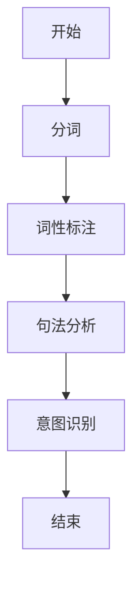
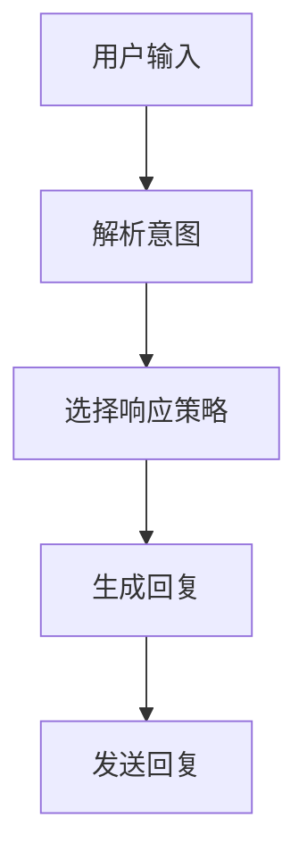
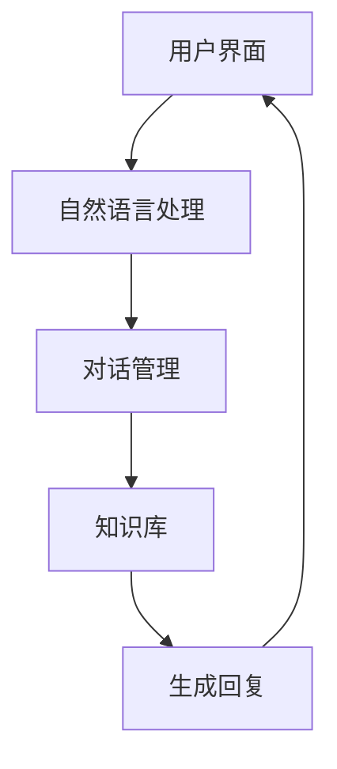
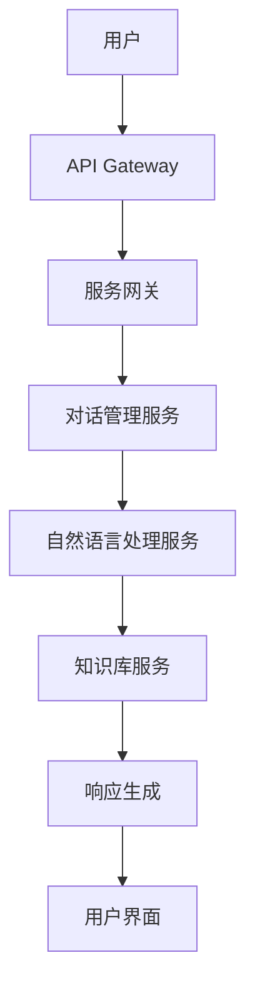
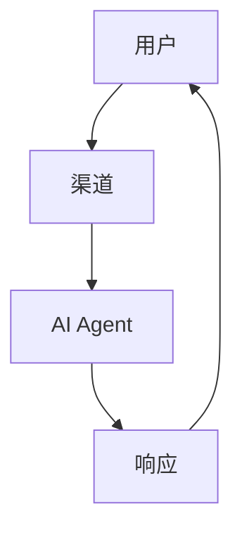

                 


# 企业AI Agent的多渠道集成：统一客户服务体验

> 关键词：AI Agent，多渠道集成，客户服务体验，自然语言处理，对话管理，系统架构

> 摘要：本文深入探讨了企业AI Agent在多渠道集成中的应用，分析了统一客户服务体验的关键技术与实现方法。文章从AI Agent的基本概念出发，详细讲解了其核心算法原理、系统架构设计，并通过实际项目案例展示了多渠道集成的实现过程。最后，本文总结了企业在实施AI Agent多渠道集成时的最佳实践和未来发展趋势。

---

## 第1章: 企业AI Agent与多渠道集成概述

### 1.1 企业AI Agent的定义与背景

#### 1.1.1 AI Agent的基本概念
AI Agent（人工智能代理）是指能够感知环境、自主决策并执行任务的智能实体。在企业场景中，AI Agent通常以虚拟助手或聊天机器人形式出现，帮助用户完成信息查询、问题解答、订单处理等任务。

#### 1.1.2 企业级AI Agent的应用场景
企业级AI Agent广泛应用于客户服务、销售支持、内部管理等领域。例如：
- **客户服务**：通过聊天机器人提供24/7的客户支持。
- **销售支持**：协助销售人员进行客户沟通和需求分析。
- **内部管理**：自动化处理员工查询和内部流程。

#### 1.1.3 多渠道集成的必要性
现代企业的客户互动渠道日益多样化，包括网页聊天、移动应用、社交媒体、电话等多种形式。为了提供一致的用户体验，企业需要将AI Agent与这些渠道无缝集成。

### 1.2 统一客户服务体验的重要性

#### 1.2.1 客户体验的核心要素
- **一致性**：无论客户通过哪种渠道与企业互动，体验应保持一致。
- **实时性**：客户期望快速响应。
- **个性化**：基于客户历史行为提供个性化服务。

#### 1.2.2 多渠道服务的挑战
- **数据孤岛**：不同渠道的数据难以整合。
- **服务不一致**：同一客户在不同渠道可能得到不同的响应。
- **技术复杂性**：集成多种渠道需要复杂的技术实现。

#### 1.2.3 统一服务体验的业务价值
- **提升客户满意度**：一致的服务体验增强客户信任。
- **提高效率**：自动化处理减少人工干预。
- **降低成本**：统一平台降低维护和运营成本。

### 1.3 本章小结
本章介绍了AI Agent的基本概念及其在企业中的应用场景，并强调了多渠道集成对统一客户服务体验的重要性。

---

## 第2章: AI Agent的核心概念与原理

### 2.1 AI Agent的构成与功能

#### 2.1.1 自然语言处理（NLP）
NLP是AI Agent理解用户输入的关键技术。通过分词、词性标注、句法分析等步骤，AI Agent能够解析用户的意图。

#### 2.1.2 对话管理（Dialog Management）
对话管理负责维护上下文，确保对话流程符合逻辑。常用方法包括基于规则的对话管理和基于机器学习的对话管理。

#### 2.1.3 知识库与意图识别
知识库存储企业相关的信息，意图识别技术（如TF-IDF或深度学习模型）用于确定用户的意图。

### 2.2 多渠道集成的关键技术

#### 2.2.1 API集成
通过API（应用程序编程接口）将AI Agent与第三方渠道（如社交媒体平台）连接。

#### 2.2.2 事件驱动架构
采用事件驱动架构，AI Agent能够实时响应渠道中的事件（如收到新消息）。

#### 2.2.3 跨平台兼容性
AI Agent需要支持多种平台（如iOS、Android、Web等），确保跨平台兼容性。

### 2.3 AI Agent与传统客服系统的区别

#### 2.3.1 功能对比
- **AI Agent**：支持自然语言处理、自动化决策。
- **传统客服系统**：依赖人工操作，功能较为单一。

#### 2.3.2 技术实现差异
- **AI Agent**：基于AI技术，能够主动学习和优化。
- **传统客服系统**：依赖预定义规则，缺乏智能性。

#### 2.3.3 优缺点分析
- **AI Agent优点**：高效、智能、7x24小时可用。
- **AI Agent缺点**：初期投入高，需要大量数据训练。

### 2.4 本章小结
本章详细讲解了AI Agent的核心组件及其与传统客服系统的区别，并强调了多渠道集成的关键技术。

---

## 第3章: AI Agent的算法原理与实现

### 3.1 自然语言处理（NLP）算法

#### 3.1.1 分词算法
分词是将连续的文本分割成有意义的词语。常用算法包括：
- **分治法**：基于词典的分词。
- **动态规划**：基于概率的分词。



#### 3.1.2 词性标注
词性标注是对分词后的词语进行词性分类（如名词、动词、形容词等）。

#### 3.1.3 意图识别
意图识别通过分析用户输入，确定用户的意图。常用的模型包括：
- **基于规则的模型**：通过预定义规则进行分类。
- **基于机器学习的模型**：如支持向量机（SVM）和随机森林。
- **基于深度学习的模型**：如卷积神经网络（CNN）和循环神经网络（RNN）。

### 3.2 对话管理算法

#### 3.2.1 基于规则的对话管理
基于预定义的规则进行对话流程控制。



#### 3.2.2 基于机器学习的对话管理
使用机器学习模型（如朴素贝叶斯）进行对话管理。

#### 3.2.3 基于强化学习的对话管理
通过强化学习优化对话策略，使对话更自然流畅。

### 3.3 多渠道集成的算法实现

#### 3.3.1 事件驱动的集成算法
通过订阅-发布模式（Pub/Sub）实现不同渠道之间的事件传递。

#### 3.3.2 数据同步算法
通过数据同步算法确保不同渠道的数据一致性和完整性。

#### 3.3.3 服务路由算法
根据用户渠道和意图，动态选择最优服务进行响应。

### 3.4 本章小结
本章详细讲解了AI Agent的核心算法，包括自然语言处理和对话管理，并介绍了多渠道集成的实现方法。

---

## 第4章: AI Agent的系统架构与设计

### 4.1 系统架构概述

#### 4.1.1 分层架构
分层架构将系统划分为数据层、业务逻辑层和用户界面层，便于模块化开发和维护。

#### 4.1.2 微服务架构
微服务架构将系统功能分解为多个独立的服务，每个服务负责特定的功能。

#### 4.1.3 可扩展性设计
通过设计可扩展的架构，确保系统能够轻松扩展以应对更大的负载。

### 4.2 系统功能设计

#### 4.2.1 用户交互层



#### 4.2.2 服务集成层
服务集成层负责将AI Agent与不同渠道（如网页、移动应用）进行集成。

#### 4.2.3 数据存储层
数据存储层用于存储用户数据、对话历史和知识库信息。

### 4.3 系统架构设计



#### 4.3.1 服务网关
服务网关负责流量控制、认证授权和请求路由。

#### 4.3.2 对话管理服务
对话管理服务负责维护对话上下文，确保对话流程正确。

#### 4.3.3 自然语言处理服务
自然语言处理服务负责解析用户的输入并生成响应。

### 4.4 系统接口设计

#### 4.4.1 API接口
API接口用于不同服务之间的通信，如：
- `/api/v1/chat/start`
- `/api/v1/chat/send_message`

#### 4.4.2 事件接口
事件接口用于处理异步事件，如：
- `event: new_message`

### 4.5 系统交互设计



#### 4.5.1 用户发起请求
用户通过某个渠道（如网页聊天）发送消息。

#### 4.5.2 Agent处理请求
AI Agent解析用户请求，生成响应。

#### 4.5.3 返回响应
AI Agent将生成的响应通过渠道返回给用户。

### 4.6 本章小结
本章详细讲解了AI Agent的系统架构和设计，包括分层架构、微服务架构和可扩展性设计，并通过mermaid图展示了系统的交互流程。

---

## 第5章: AI Agent的项目实战

### 5.1 项目背景与需求分析

#### 5.1.1 项目背景
某企业希望整合其分散在多个渠道的客户服务系统，打造统一的AI Agent解决方案。

#### 5.1.2 项目需求
- 提供24/7的客户支持。
- 支持多种渠道（如网页、移动应用、社交媒体）。
- 提供个性化服务。

### 5.2 项目实现

#### 5.2.1 环境安装
安装必要的开发工具和依赖库：
```bash
pip install python
pip install flask
pip install transformers
pip install pytorch
```

#### 5.2.2 核心代码实现

##### 5.2.2.1 自然语言处理模块
```python
from transformers import pipeline

nlp = pipeline("text-classification", model="bert-base")
```

##### 5.2.2.2 对话管理模块
```python
class DialogManager:
    def __init__(self):
        self.context = {}
    
    def process_message(self, message):
        # 解析意图
        intent = self.nlp(message)
        # 更新上下文
        self.context.update(intent)
        return self.context
```

##### 5.2.2.3 知识库模块
```python
from sqlalchemy import create_engine

engine = create_engine("sqlite:///knowledge.db")
```

#### 5.2.3 代码解读与分析
- **自然语言处理模块**：使用预训练模型进行意图识别。
- **对话管理模块**：维护对话上下文，确保对话流程正确。
- **知识库模块**：存储和检索企业相关信息。

### 5.3 实际案例分析

#### 5.3.1 案例背景
某客户通过网页聊天请求帮助查询订单状态。

#### 5.3.2 系统响应
AI Agent解析用户请求，调用知识库查询订单信息，并生成回复。

#### 5.3.3 响应结果
客户收到订单状态信息，并表示满意。

### 5.4 项目总结

#### 5.4.1 成功经验
- 采用事件驱动架构，确保系统高效响应。
- 使用预训练模型，快速实现意图识别。

#### 5.4.2 问题与不足
- 对话管理模块的规则需要不断优化。
- 知识库的更新需要与业务同步。

### 5.5 本章小结
本章通过一个实际项目案例，展示了AI Agent多渠道集成的实现过程，并总结了项目中的经验和教训。

---

## 第6章: 总结与展望

### 6.1 本章总结
本文详细探讨了企业AI Agent的多渠道集成技术，分析了统一客户服务体验的关键因素，并通过实际项目案例展示了技术实现过程。

### 6.2 未来展望
- **技术进步**：随着AI技术的发展，AI Agent将更加智能化和个性化。
- **渠道扩展**：未来将支持更多新兴渠道（如元宇宙平台）。
- **场景深化**：AI Agent将应用于更多业务场景，如智能销售和精准营销。

### 6.3 最佳实践 Tips

#### 6.3.1 技术实现
- 采用事件驱动架构，确保系统高效响应。
- 使用预训练模型，快速实现意图识别。

#### 6.3.2 项目管理
- 明确项目需求，制定详细计划。
- 定期迭代优化，提升系统性能。

### 6.4 本章小结
本章总结了全文内容，并展望了AI Agent技术的未来发展。

---

## 第7章: 注意事项与拓展阅读

### 7.1 注意事项

#### 7.1.1 数据安全
确保客户数据的安全性，防止数据泄露。

#### 7.1.2 系统稳定性
设计可靠的系统架构，确保系统稳定运行。

#### 7.1.3 用户隐私
遵守相关法律法规，保护用户隐私。

### 7.2 拓展阅读

#### 7.2.1 AI Agent的伦理问题
探讨AI Agent在企业应用中的伦理问题。

#### 7.2.2 多模态交互技术
研究AI Agent的多模态交互技术（如语音、视频）。

#### 7.2.3 智能客服系统
分析智能客服系统的最新发展趋势。

### 7.3 本章小结
本章提供了AI Agent技术应用中的注意事项，并推荐了相关拓展阅读内容。

---

## 结语

企业AI Agent的多渠道集成是未来客户服务的重要趋势。通过统一客户服务体验，企业能够提升客户满意度，降低运营成本，并增强市场竞争力。随着AI技术的不断进步，AI Agent将在企业中发挥越来越重要的作用。

