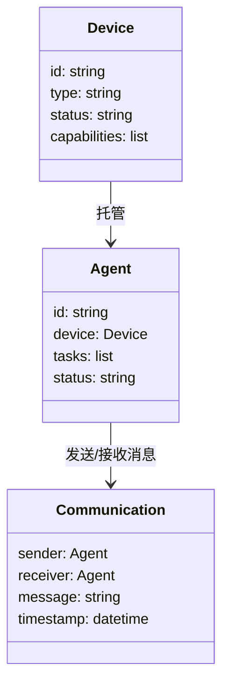

                 


# 企业AI Agent的多设备支持策略：PC到IoT的全覆盖

> **关键词**：AI Agent、多设备支持、物联网、通信协议、跨平台、设备协同  
> **摘要**：随着企业对智能化需求的不断增长，AI Agent在多设备环境中的应用变得至关重要。本文详细探讨了企业AI Agent在PC到IoT设备的多设备支持策略，包括通信机制、跨平台适配、设备协同算法、系统架构设计和项目实战等内容，为企业实现全场景智能化提供深度技术指导。

---

# 第1章: 企业AI Agent与多设备支持概述

## 1.1 AI Agent的基本概念

### 1.1.1 AI Agent的定义与特点
AI Agent（人工智能代理）是一种能够感知环境、自主决策并执行任务的智能实体。它具备以下特点：
- **自主性**：能够在没有外部干预的情况下独立运作。
- **反应性**：能够实时感知环境变化并做出响应。
- **目标导向**：通过设定目标来驱动行为。
- **学习能力**：能够通过数据和经验不断优化自身性能。

### 1.1.2 企业级AI Agent的应用场景
企业AI Agent广泛应用于以下场景：
- **智能助手**：帮助员工处理日常任务，如日程管理、信息检索。
- **自动化运维**：监控系统状态，自动处理故障。
- **智能客服**：通过自然语言处理与用户交互，解决客户问题。
- **物联网设备管理**：协调IoT设备完成复杂任务。

### 1.1.3 多设备支持的核心价值
在企业环境中，多设备支持使AI Agent能够无缝连接PC、手机、智能终端等多种设备，实现设备间的协同工作，提升企业的整体效率和智能化水平。

---

## 1.2 多设备支持的背景与挑战

### 1.2.1 多设备环境的复杂性
现代企业环境中，设备种类繁多，包括PC、手机、智能手表、智能家居等，每种设备的操作系统、硬件性能和交互方式都存在差异，增加了多设备支持的复杂性。

### 1.2.2 设备协同的必要性
企业AI Agent需要在不同设备间实现数据同步、任务协同和状态共享，以提供一致的服务体验。例如，用户在PC上开始一个任务，可以在手机上继续处理。

### 1.2.3 当前技术的局限性
- **通信协议不统一**：不同设备支持的通信协议差异大，增加了跨设备通信的难度。
- **资源分配不均**：低端设备难以支持复杂的AI任务，导致性能瓶颈。
- **数据一致性问题**：分布式环境下的数据同步和一致性维护是一个技术难点。

---

## 1.3 企业AI Agent的多设备支持策略

### 1.3.1 策略概述
为了实现多设备支持，企业AI Agent需要采取以下策略：
- **统一通信机制**：选择适合的通信协议，确保设备间的高效交互。
- **设备特性适配**：针对不同设备的特点进行优化，确保功能正常运行。
- **分布式架构**：采用分布式设计，提升系统的扩展性和容错性。

### 1.3.2 策略的核心要素
- **通信协议选择**：优先选用支持跨设备的协议，如WebSocket和MQTT。
- **设备能力评估**：根据设备的硬件和软件能力动态调整功能。
- **数据同步机制**：采用高效的同步算法，确保数据一致性。

### 1.3.3 策略的实施路径
1. 评估现有设备的硬件和软件能力。
2. 选择适合的通信协议和数据同步机制。
3. 设计分布式架构，确保设备间的协同工作。

---

## 1.4 本章小结
本章介绍了企业AI Agent的基本概念、应用场景以及多设备支持的背景与挑战。通过分析当前技术的局限性，提出了实现多设备支持的策略框架，为后续章节的深入分析奠定了基础。

---

# 第2章: 多设备环境下的AI Agent通信机制

## 2.1 多设备通信协议

### 2.1.1 HTTP与WebSocket的对比
| 特性          | HTTP         | WebSocket      |
|---------------|--------------|---------------|
| 建立连接方式   | 请求-响应    | 长连接         |
| 通信频率       | 请求驱动     | 实时通信       |
| 适用场景       | 静态资源请求  | 实时交互       |

WebSocket通过建立长连接，能够实现实时通信，非常适合需要频繁交互的AI Agent场景。

### 2.1.2 MQTT协议在物联网中的应用
MQTT是一种轻量级的协议，适用于低带宽、高延迟的物联网环境。其核心优势在于：
- **低带宽占用**：适合网络条件较差的设备。
- ** publish/subscribe 模式**：支持设备间的高效通信。

### 2.1.3 通信协议的选择与优化
选择通信协议时，需综合考虑设备的硬件能力、网络环境和应用场景。例如，在PC和手机端优先使用WebSocket，而在IoT设备中优先使用MQTT。

---

## 2.2 跨设备数据同步与一致性

### 2.2.1 数据同步的挑战
- **网络不稳定**：可能导致数据丢失或重复。
- **设备离线**：需要处理离线数据的缓存和同步。
- **数据冲突**：多个设备同时修改同一数据时，需确保一致性。

### 2.2.2 分布式系统中的数据一致性
采用一致性哈希算法，将数据均匀分布在网络中的节点上，通过副本机制保证数据的可靠性和一致性。

### 2.2.3 基于区块链的数据同步方案
区块链的分布式账本技术可以用于设备间的数据同步，确保数据的安全性和不可篡改性。

---

## 2.3 本章小结
本章详细探讨了多设备环境下的通信机制，分析了不同通信协议的特点及其适用场景，并提出了数据同步与一致性解决方案，为企业AI Agent的通信设计提供了参考。

---

# 第3章: AI Agent的跨平台适配技术

## 3.1 跨平台开发框架

### 3.1.1 React Native与Flutter的对比
| 特性          | React Native      | Flutter         |
|---------------|--------------------|-----------------|
| 开发语言       | JavaScript         | Dart            |
| 组件复用       | 有限              | 高              |
| 性能优化       | 依赖平台实现       | 更好的性能优化  |

Flutter提供了统一的开发语言（Dart）和丰富的 widget，适合需要高性能和跨平台的AI Agent开发。

### 3.1.2 Electron在PC端的应用
Electron通过将JavaScript、HTML和CSS打包成桌面应用，能够快速实现PC端的AI Agent开发，适合需要本地运行的复杂任务。

### 3.1.3 跨平台开发的优缺点分析
- **优点**：代码复用性高，开发效率提升。
- **缺点**：部分设备性能限制可能导致体验下降。

---

## 3.2 设备特性适配策略

### 3.2.1 设备性能的分层适配
根据设备的硬件性能，动态调整AI Agent的功能模块。例如，低端设备仅支持基础功能，而高端设备支持复杂任务。

### 3.2.2 UI界面的自适应设计
通过响应式设计和动态布局，确保AI Agent在不同设备上的界面适配。

### 3.2.3 功能模块的动态加载与卸载
根据设备的能力动态加载功能模块，避免资源浪费。

---

## 3.3 本章小结
本章分析了跨平台开发的优缺点，提出了设备特性适配策略，确保企业AI Agent在不同设备上的高效运行。

---

# 第4章: AI Agent的设备协同算法

## 4.1 设备协同的核心算法

### 4.1.1 基于图论的设备关系建模
通过构建设备关系图，分析设备间的依赖关系和协同逻辑。

### 4.1.2 联机算法与离线算法
- **联机算法**：设备间实时通信，适用于网络稳定的场景。
- **离线算法**：设备本地处理，适用于网络不稳定的场景。

### 4.1.3 联邦学习
通过分布式机器学习技术，设备间协作训练模型，同时保护数据隐私。

---

## 4.2 联机与离线算法对比

| 特性          | 联机算法           | 离线算法          |
|---------------|--------------------|-------------------|
| 通信方式       | 实时通信           | 本地处理          |
| 数据依赖       | 高                | 低                |
| 适用场景       | 网络稳定           | 网络不稳定         |

联邦学习通过在设备间分发模型参数，实现去中心化的模型训练。

---

## 4.3 本章小结
本章分析了设备协同的核心算法，提出了联机与离线算法的对比，为企业AI Agent的协同设计提供了理论支持。

---

# 第5章: 系统架构设计

## 5.1 领域模型设计

### 5.1.1 领域模型的类图


### 5.1.2 领域模型的属性与关系
- **Device类**：描述设备的基本属性和能力。
- **Agent类**：描述AI Agent的设备托管关系和任务状态。
- **Communication类**：描述设备间的通信关系。

---

## 5.2 系统架构设计

### 5.2.1 系统架构图


### 5.2.2 系统组件的功能与交互
- **API Gateway**：负责接收和路由用户请求。
- **Service Layer**：处理业务逻辑，调用数据库和通信层。
- **Database**：存储设备和任务数据。
- **Communication Layer**：负责设备间的通信和通知。

---

## 5.3 本章小结
本章通过领域模型和系统架构设计，展示了企业AI Agent的多设备支持的整体框架，为后续的实现提供了指导。

---

# 第6章: 项目实战

## 6.1 环境安装

### 6.1.1 开发环境配置
- **操作系统**：Windows 10或更高版本。
- **开发工具**：Visual Studio Code或IntelliJ IDEA。
- **依赖管理**：使用npm或Maven进行依赖管理。

### 6.1.2 通信协议实现
安装WebSocket和MQTT库：
```bash
npm install ws mqtt
```

---

## 6.2 核心代码实现

### 6.2.1 WebSocket通信实现
```javascript
const WebSocket = require('ws');
const wss = new WebSocket.Server({ server });

wss.on('connection', (ws) => {
    console.log('Client connected');
    ws.on('message', (message) => {
        // 处理消息
    });
});
```

### 6.2.2 联邦学习模型训练
使用TensorFlow.js实现分布式模型训练：
```javascript
async function trainModel() {
    const model = await tf.sequential({
        layers: [
            tf.layers.dense({ units: 64, activation: 'relu', inputShape: [inputDim] }),
            tf.layers.dense({ units: 1, activation: 'sigmoid' })
        ]
    });
    return model;
}
```

---

## 6.3 案例分析

### 6.3.1 实际应用场景
在一个智能家居场景中，AI Agent协调不同设备完成家庭自动化任务，如智能灯光控制、温度调节等。

### 6.3.2 代码实现与分析
通过WebSocket实现设备间的实时通信，使用MQTT协议处理设备状态更新，确保系统高效运行。

---

## 6.4 本章小结
本章通过实际案例展示了企业AI Agent的多设备支持的实现过程，从环境配置到代码实现，帮助读者掌握核心技能。

---

# 第7章: 总结与展望

## 7.1 总结
本文详细探讨了企业AI Agent的多设备支持策略，涵盖了通信机制、跨平台适配、设备协同算法、系统架构设计和项目实战等内容。通过理论分析和实践案例，为企业的智能化转型提供了技术指导。

## 7.2 未来展望
随着AI技术的不断发展，企业AI Agent的多设备支持将更加智能化和高效化。未来的研究方向包括：
- 更高效的通信协议。
- 更智能的设备协同算法。
- 更安全的数据同步机制。

---

# 附录

## 附录A: 术语表
- **AI Agent**：人工智能代理。
- **IoT**：物联网。

## 附录B: 参考文献
- [1] 王某某. 《人工智能技术与应用》. 北京: 清华大学出版社, 2023.

---

通过以上内容，企业可以全面了解并实施AI Agent的多设备支持策略，实现PC到IoT的全覆盖。

