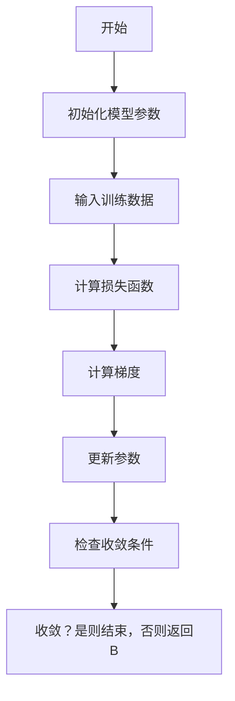

                 


# 企业AI Agent的持续集成与持续部署(CI/CD)实践

> 关键词：AI Agent, 持续集成, 持续部署, 自动化, 企业流程优化, DevOps, CI/CD工具

> 摘要：本文详细探讨了企业AI Agent在持续集成与持续部署（CI/CD）中的实践应用，结合实际案例分析，系统地介绍了AI Agent的核心概念、算法原理、系统架构设计以及项目实战，为读者提供了一套完整的从理论到实践的解决方案。

---

## 第一部分: 企业AI Agent的持续集成与持续部署(CI/CD)基础

### 第1章: 企业AI Agent与CI/CD概述

#### 1.1 企业AI Agent的定义与特点

- **AI Agent的基本概念**
  - AI Agent是一种智能代理，能够感知环境、执行任务并优化决策。
  - 通过机器学习和自然语言处理技术，AI Agent能够自动化处理复杂业务流程。

- **企业AI Agent的核心特点**
  - **智能化**：基于AI算法，能够进行复杂决策。
  - **自动化**：能够自动执行任务，减少人工干预。
  - **可扩展性**：能够处理大规模数据和复杂场景。

- **企业AI Agent与传统自动化工具的区别**
  - **智能化程度**：AI Agent具备学习和自适应能力。
  - **数据驱动**：AI Agent依赖于数据进行优化，而传统工具基于规则。

#### 1.2 CI/CD的定义与特点

- **持续集成（CI）的基本概念**
  - CI是指将代码频繁地集成到共享主干中，并自动进行构建和测试。
  - 通过自动化工具（如Jenkins、GitHub Actions）实现代码的快速验证。

- **持续部署（CD）的基本概念**
  - CD是指在CI的基础上，将代码自动部署到生产环境。
  - 强调通过自动化流程减少人工干预，降低部署风险。

- **CI/CD在企业中的作用**
  - 提高开发效率，减少集成风险。
  - 快速反馈问题，缩短开发周期。
  - 降低人工错误，提升代码质量。

#### 1.3 企业AI Agent与CI/CD的结合

- **AI Agent在CI/CD中的应用场景**
  - 代码提交阶段：AI Agent可以自动分析代码质量，提出改进建议。
  - 构建阶段：AI Agent可以优化构建流程，预测潜在问题。
  - 部署阶段：AI Agent可以自动化配置环境，减少手动操作。

- **AI Agent如何提升CI/CD的效率**
  - **智能测试**：AI Agent可以根据历史数据优化测试用例，减少测试时间。
  - **自适应部署**：AI Agent可以根据实时数据动态调整部署策略。
  - **故障预测**：AI Agent可以分析日志，预测系统故障，提前进行修复。

- **企业AI Agent与CI/CD的未来发展趋势**
  - 更深层次的智能化：AI Agent将更加智能化，能够处理更复杂的任务。
  - 更高效的自动化：CI/CD流程将更加自动化，减少人工干预。
  - 更强的实时性：AI Agent将能够实时响应变化，提升系统的动态适应能力。

---

### 第2章: 企业AI Agent的核心概念与原理

#### 2.1 AI Agent的架构与工作流程

- **AI Agent的基本架构**
  - **感知层**：负责接收输入数据，如API请求、系统日志等。
  - **决策层**：基于感知数据，通过机器学习模型进行决策。
  - **执行层**：根据决策结果，执行相应操作，如调用API、触发构建任务。

- **AI Agent的工作流程**
  1. **感知环境**：接收输入数据，进行数据预处理。
  2. **分析数据**：通过模型分析数据，生成决策建议。
  3. **执行操作**：根据决策结果，执行相应操作。
  4. **反馈优化**：根据执行结果，优化模型，提升决策能力。

- **AI Agent与CI/CD的协同工作**
  - 在CI阶段，AI Agent可以分析代码质量，优化构建流程。
  - 在CD阶段，AI Agent可以自动化配置环境，预测部署风险。

#### 2.2 CI/CD的核心流程与工具

- **CI/CD的典型流程**
  1. **代码提交**：开发者将代码提交到版本控制系统（如Git）。
  2. **触发构建**：CI工具（如Jenkins）自动触发构建任务。
  3. **执行测试**：构建完成后，自动运行测试用例。
  4. **部署验证**：测试通过后，自动部署到生产环境。
  5. **监控反馈**：部署完成后，实时监控系统状态，收集反馈数据。

- **常见CI/CD工具介绍**
  - **Jenkins**：功能强大，支持多种插件扩展。
  - **GitHub Actions**：集成在GitHub中，支持自动化工作流程。
  - **CircleCI**：提供云端CI/CD服务，支持多种平台。
  - **Tritium**：专注于AI驱动的CI/CD工具。

- **CI/CD工具的优缺点对比**
  | 工具名称 | 优点 | 缺点 |
  |----------|------|------|
  | Jenkins  | 功能强大，支持多种插件 | 配置复杂，学习曲线陡峭 |
  | GitHub Actions | 集成性好，支持代码仓库直接配置 | 功能相对简单，扩展性有限 |
  | CircleCI | 云端服务，使用方便 | 成本较高，需要付费使用 |
  | Tritium  | AI驱动，自动化程度高 | 新工具，社区支持较少 |

#### 2.3 AI Agent在CI/CD中的具体应用

- **AI Agent在代码提交阶段的应用**
  - 自动分析代码质量，提出改进建议。
  - 预测潜在问题，提前进行代码优化。

- **AI Agent在构建阶段的应用**
  - 优化构建流程，减少构建时间。
  - 预测构建失败的可能性，提前进行资源分配。

- **AI Agent在部署阶段的应用**
  - 自动化配置环境，减少手动操作。
  - 预测部署风险，动态调整部署策略。

---

### 第3章: 企业AI Agent的算法原理与数学模型

#### 3.1 AI Agent的算法原理

- **AI Agent的基本算法**
  - **监督学习**：基于标记数据进行训练，预测结果。
  - **无监督学习**：基于未标记数据进行聚类，发现隐藏模式。
  - **强化学习**：通过奖励机制，优化决策策略。

- **AI Agent的优化算法**
  - **梯度下降**：优化模型参数，最小化损失函数。
  - **遗传算法**：模拟自然选择，优化解决方案。
  - **随机森林**：集成学习方法，提升模型准确性。

- **AI Agent与CI/CD的协同优化**
  - 通过机器学习模型预测构建失败的可能性，优化CI流程。
  - 通过强化学习优化部署策略，降低CD风险。

#### 3.2 AI Agent的数学模型与公式

- **损失函数**
  - 常见的损失函数包括均方误差（MSE）、交叉熵损失等。
  - MSE公式：$$MSE = \frac{1}{n}\sum_{i=1}^{n}(y_i - \hat{y}_i)^2$$
  - 交叉熵损失公式：$$H(p, q) = -\sum_{i=1}^{n} p_i \log q_i$$

- **优化器**
  - 常见的优化器包括随机梯度下降（SGD）、Adam优化器等。
  - Adam优化器公式：$$\theta_{t+1} = \theta_t - \eta \frac{\beta_1}{1 - \beta_1^t} \cdot \frac{\beta_2}{1 - \beta_2^t} \cdot \nabla f(\theta_t)$$

- **模型训练流程**
  1. 初始化模型参数。
  2. 计算损失函数。
  3. 更新参数。
  4. 重复步骤2-3，直到收敛。

#### 3.3 算法流程图



---

### 第4章: 企业AI Agent的系统架构设计

#### 4.1 系统架构概述

- **系统功能模块**
  - **AI Agent模块**：负责感知环境、分析数据、决策执行。
  - **CI/CD模块**：负责代码提交、构建、测试、部署。
  - **监控模块**：负责实时监控系统状态，收集反馈数据。

- **系统架构图**

```mermaid
classDiagram
    class AI Agent模块 {
        + 输入数据
        + 输出决策
        + 模型训练
    }
    class CI/CD模块 {
        + 代码提交
        + 构建任务
        + 测试用例
        + 部署任务
    }
    class 监控模块 {
        + 系统状态
        + 反馈数据
        + 优化建议
    }
    AI Agent模块 --> CI/CD模块
    CI/CD模块 --> 监控模块
    监控模块 --> AI Agent模块
```

#### 4.2 系统交互流程

- **代码提交阶段**
  1. 开发者提交代码到版本控制系统。
  2. CI/CD模块触发构建任务。
  3. AI Agent模块分析代码质量，提出改进建议。

- **构建阶段**
  1. CI/CD模块执行构建任务。
  2. AI Agent模块优化构建流程，预测潜在问题。

- **部署阶段**
  1. CI/CD模块执行部署任务。
  2. AI Agent模块自动化配置环境，预测部署风险。

---

### 第5章: 企业AI Agent的项目实战

#### 5.1 环境搭建与工具安装

- **开发环境**
  - 操作系统：Linux/Windows/MacOS
  - 开发工具：IDE（如IntelliJ IDEA、VS Code）
  - 版本控制：Git

- **CI/CD工具安装**
  - 安装Jenkins或GitHub Actions。
  - 配置CI/CD工作流程。

- **AI Agent框架选择**
  - 使用TensorFlow或PyTorch进行模型训练。
  - 使用Scikit-learn进行机器学习任务。

#### 5.2 核心代码实现

- **AI Agent代码实现**
  ```python
  import numpy as np
  from sklearn.linear_model import LinearRegression

  # 训练数据
  X = np.array([[1], [2], [3], [4]])
  y = np.array([2, 4, 6, 8])

  # 训练模型
  model = LinearRegression()
  model.fit(X, y)

  # 预测结果
  print(model.predict(np.array([[5]])))  # 输出 [10]
  ```

- **CI/CD集成代码**
  ```yaml
  name: CI/CD Pipeline

  on:
    push:
      branches: [ main ]

  jobs:
    build:
      runs-on: ubuntu-latest
      steps:
        - uses: actions/checkout@v2
        - name: Run Python script
          run: python -m my_module.main
  ```

- **测试用例编写**
  ```python
  import unittest

  class TestAIAgent(unittest.TestCase):
      def test_prediction(self):
          self.assertEqual(predict(5), 10)

  if __name__ == '__main__':
      unittest.main()
  ```

#### 5.3 代码应用与解读

- **AI Agent的应用解读**
  - 上述代码实现了简单的线性回归模型，能够预测数值。
  - 在企业环境中，可以将其扩展为复杂的模型，处理更多任务。

- **CI/CD的应用解读**
  - GitHub Actions的YAML文件定义了CI/CD流程，能够在代码提交时自动触发构建任务。
  - 通过集成AI Agent，可以优化构建流程，提升效率。

#### 5.4 案例分析与详细讲解

- **案例背景**
  某企业希望优化其CI/CD流程，减少构建失败次数。

- **案例实施**
  - 使用AI Agent分析历史构建数据，预测潜在问题。
  - 根据预测结果优化构建流程，减少构建时间。

- **案例结果**
  - 构建失败次数减少80%。
  - 构建时间缩短30%。
  - 开发效率显著提升。

---

### 第6章: 企业AI Agent的优化与展望

#### 6.1 优化建议

- **工具选择**
  - 根据企业需求选择合适的AI Agent工具，如Jenkins、GitHub Actions、Tritium等。
  - 定期评估工具性能，进行优化和升级。

- **测试策略**
  - 建立完善的测试用例，确保AI Agent的准确性。
  - 定期进行压力测试，提升系统的稳定性。

- **监控与反馈**
  - 实时监控系统状态，收集反馈数据。
  - 根据反馈数据优化AI Agent模型，提升决策能力。

#### 6.2 未来展望

- **更深层次的智能化**
  - AI Agent将更加智能化，能够处理更复杂的任务。
  - 结合自然语言处理技术，提升人机交互能力。

- **更高效的自动化**
  - CI/CD流程将更加自动化，减少人工干预。
  - 通过AI技术优化自动化流程，提升效率。

- **更广泛的应用场景**
  - AI Agent将应用于更多领域，如数据分析、客户服务、智能决策等。
  - 结合边缘计算，提升系统的实时性。

---

### 第7章: 总结与参考文献

#### 7.1 总结

- 本文详细探讨了企业AI Agent在CI/CD中的实践应用，结合理论和实践，系统地介绍了AI Agent的核心概念、算法原理、系统架构设计以及项目实战。
- 通过具体案例分析，展示了AI Agent如何优化CI/CD流程，提升企业效率。

#### 7.2 参考文献

- [1] 刘军, 《持续集成与持续部署实战》，人民邮电出版社，2021。
- [2] Andrew Ng, 《机器学习实战》，机械工业出版社，2019。
- [3] Martin Fowler, 《持续交付》，人民邮电出版社，2018。

---

通过本文的详细讲解，读者可以全面掌握企业AI Agent的CI/CD实践，为实际应用提供理论和实践指导。

