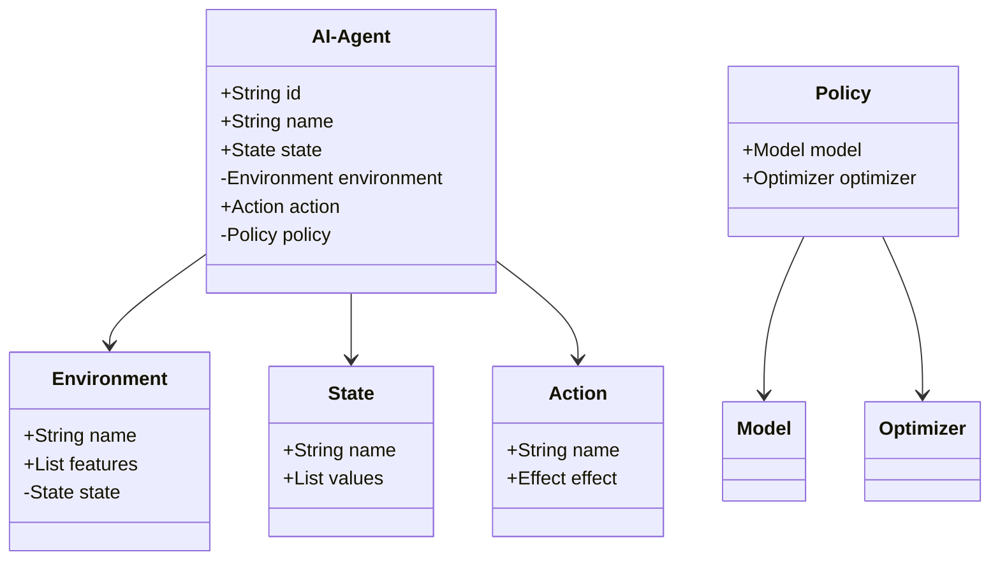
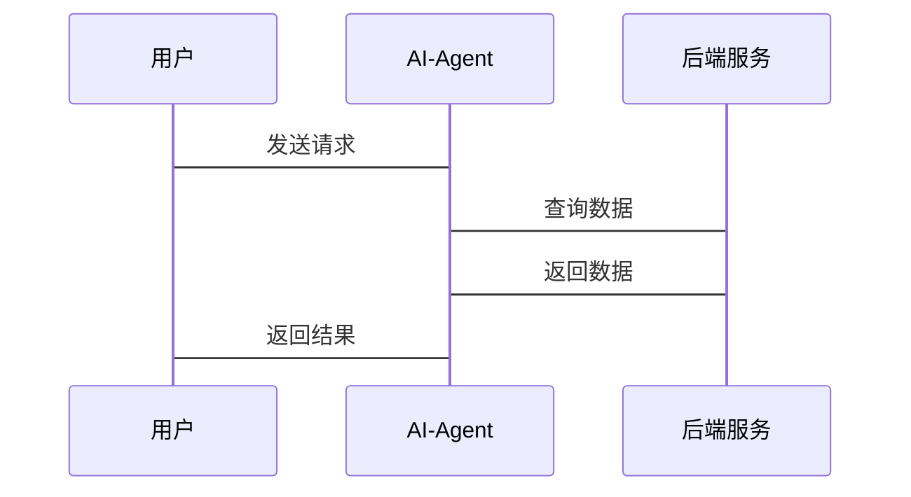

                 


# 企业AI Agent的持续集成与持续部署(CI/CD)最佳实践

## 关键词

企业AI Agent，持续集成，持续部署，AI开发，DevOps，自动化流程

## 摘要

本文深入探讨企业AI Agent在持续集成与持续部署（CI/CD）中的最佳实践，结合背景介绍、核心概念、算法原理、系统架构设计、项目实战和最佳实践，全面解析如何高效管理企业AI Agent的开发与部署流程，提升企业智能化转型的效率与质量。

---

## 第1章：企业AI Agent的背景与概念

### 1.1 企业AI Agent的定义与特点

企业AI Agent是一种能够感知环境、自主决策并执行任务的智能体，具备以下特点：

- **智能性**：通过机器学习算法理解和处理复杂问题。
- **自主性**：能在预设条件下自主决策和执行。
- **协作性**：能够与其他系统、服务或用户进行交互协作。
- **适应性**：能够根据环境变化动态调整行为。

**AI Agent与传统自动化工具的区别**：

| 特性       | AI Agent                     | 传统自动化工具               |
|------------|------------------------------|------------------------------|
| 智能性      | 高                           | 低                           |
| 决策能力    | 强，基于数据驱动             | 弱，基于规则驱动             |
| 适应性      | 能够自适应环境变化           | 需人工调整                   |
| 学习能力    | 具备机器学习能力             | 无学习能力                   |

### 1.2 企业AI Agent的应用场景

企业AI Agent广泛应用于多个场景：

- **智能客服**：通过自然语言处理提供个性化服务。
- **自动化运维**：监控系统并自动修复问题。
- **智能推荐**：基于用户行为推荐个性化内容。
- **风险控制**：实时监控并预测潜在风险。

### 1.3 CI/CD在企业AI开发中的重要性

CI/CD通过自动化构建、测试和部署，确保AI Agent的高效开发和稳定运行。以下是其重要性：

- **加快交付速度**：通过自动化流程缩短开发周期。
- **提高代码质量**：持续测试确保代码稳定。
- **降低风险**：通过自动化回滚机制减少部署风险。

---

## 第2章：企业AI Agent的实现原理

### 2.1 AI Agent的核心算法与模型

AI Agent的实现依赖多种算法，以下是核心算法的介绍：

#### 2.1.1 基于强化学习的决策模型

**算法流程**：

1. 状态识别：感知环境状态。
2. 动作选择：基于当前状态选择最优动作。
3. 奖励机制：根据结果调整策略。

**数学模型**：

- 状态空间：$S = \{s_1, s_2, ..., s_n\}$
- 动作空间：$A = \{a_1, a_2, ..., a_m\}$
- 奖励函数：$R: S \times A \rightarrow \mathbb{R}$

#### 2.1.2 基于深度学习的模型优化

**模型训练流程**：

1. 数据预处理：清洗和归一化数据。
2. 模型构建：使用神经网络构建模型。
3. 模型训练：通过反向传播优化权重。

**数学模型**：

- 损失函数：$$L = \frac{1}{N}\sum_{i=1}^{N}(y_i - \hat{y_i})^2$$
- 优化器：$$\theta_{t+1} = \theta_t - \eta \cdot \nabla L$$

### 2.2 AI Agent的系统架构

**系统架构设计**：

- **分层架构**：分为感知层、决策层和执行层。
- **微服务架构**：每个功能模块独立部署，便于扩展和维护。

**领域模型类图**：



---

## 第3章：CI/CD在企业AI开发中的流程与工具

### 3.1 CI/CD的核心流程

**CI流程**：

1. 代码提交：开发人员将代码推送到版本控制系统。
2. 自动构建：CI服务器（如Jenkins）获取代码并进行编译。
3. 自动测试：运行单元测试、集成测试等，确保代码质量。

**CD流程**：

1. 镜像构建：将应用打包成可部署的镜像。
2. 测试部署：在测试环境中部署镜像，进行验证测试。
3. 灰度发布：逐步将新版本部署到生产环境，监控稳定性。

### 3.2 CI/CD工具与技术

**常用工具**：

- **Jenkins**：功能强大，支持多种插件。
- **GitLab CI**：集成在GitLab中的CI/CD工具。
- **AWS CodePipeline**：基于云的CI/CD服务。

**工具对比表**：

| 工具名称 | 特性                          | 优缺点                          |
|----------|-------------------------------|----------------------------------|
| Jenkins  | 功能全面，插件丰富             | 配置复杂，学习曲线陡峭          |
| GitLab CI| 集成性好，易于使用             | 功能相对简单                    |
| AWS CodePipeline | 基于云，扩展性强             | 成本较高                        |

---

## 第4章：企业AI Agent的系统架构设计

### 4.1 系统架构设计

**系统架构图**：

```mermaid
graph TD

    IaaS --> C1
    C1 --> AI-Agent
    AI-Agent --> Database
    Database --> C2
    C2 --> AI-Agent
    AI-Agent --> API Gateway
    API Gateway --> Frontend
```

- **IaaS**：提供底层计算资源。
- **C1**：第一层容器化部署。
- **AI-Agent**：核心业务逻辑。
- **Database**：存储数据。
- **C2**：第二层容器化部署。
- **API Gateway**：负责API路由。
- **Frontend**：用户界面。

### 4.2 接口设计与交互流程

**系统交互流程图**：



---

## 第5章：项目实战

### 5.1 项目环境搭建

**所需工具**：

- **Jenkins**：用于CI/CD。
- **Docker**：用于容器化部署。
- **Git**：版本控制工具。

**安装步骤**：

1. 安装Jenkins：```bash
   sudo apt-get update && sudo apt-get install jenkins
   ```

2. 安装Docker：```bash
   curl -fsSL https://get.docker.com | bash -s docker
   ```

### 5.2 核心代码实现

**AI Agent核心代码示例**：

```python
class AI-Agent:
    def __init__(self, model):
        self.model = model
        self.environment = Environment()

    def感知环境(self):
        # 获取环境状态
        state = self.environment.get_state()
        return state

    def决策(self, state):
        # 基于状态进行决策
        action = self.model.predict(state)
        return action

    def执行(self, action):
        # 执行动作并返回结果
        result = self.environment.execute_action(action)
        return result
```

**模型训练代码示例**：

```python
def train_model():
    # 数据预处理
    X_train, y_train = preprocess_data()

    # 模型构建
    model = build_model()

    # 模型训练
    history = model.fit(X_train, y_train, epochs=100, batch_size=32)

    return model, history
```

### 5.3 项目案例分析与实现

**案例分析**：智能客服系统

**实现步骤**：

1. 数据准备：收集用户咨询数据。
2. 模型训练：训练自然语言处理模型。
3. 部署上线：通过CI/CD部署到生产环境。
4. 监控优化：实时监控系统性能并优化模型。

### 5.4 项目总结

通过项目实战，我们掌握了企业AI Agent的开发与部署流程，验证了CI/CD在AI开发中的有效性。同时，我们发现了一些优化点，如模型的实时更新和系统的高可用性。

---

## 第6章：企业AI Agent的CI/CD最佳实践

### 6.1 最佳实践总结

- **自动化测试**：确保代码质量。
- **持续集成**：频繁集成代码，减少集成风险。
- **蓝绿部署**：降低新版本的发布风险。
- **监控与反馈**：实时监控系统状态，快速响应问题。

### 6.2 小结

企业AI Agent的CI/CD需要结合AI开发的特点，采用合适的工具和技术，确保开发效率和系统稳定性。通过本文的实践，读者可以掌握企业AI Agent的开发与部署的最佳方法。

---

## 第7章：未来展望与拓展阅读

### 7.1 未来展望

- **AI Agent的智能化**：进一步提升自主决策能力。
- **CI/CD的自动化**：探索更高效的自动化工具和流程。
- **多云部署**：实现跨云平台的无缝部署。

### 7.2 拓展阅读

- **书籍推荐**：《持续交付2.0》
- **在线资源**：Jenkins官方文档、云原生技术社区

---

## 结语

企业AI Agent的持续集成与持续部署是企业智能化转型的关键，通过本文的深入探讨和实战分析，我们掌握了实现AI Agent的开发与部署的最佳实践。未来，随着技术的发展，企业AI Agent将在更多领域发挥重要作用。

