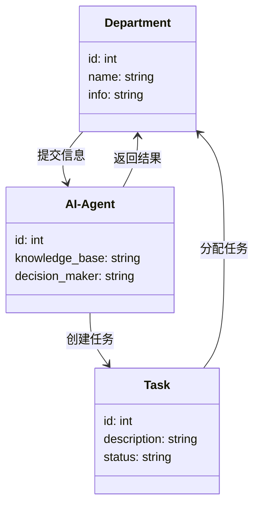
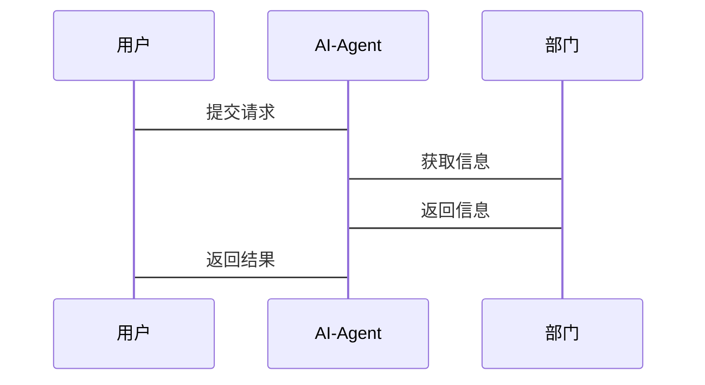

                 


# 企业AI Agent的跨部门协作功能：打破信息孤岛

## 关键词：企业AI Agent，跨部门协作，信息孤岛，AI驱动，协作机制，知识共享

## 摘要：  
随着企业规模的不断扩大和业务复杂性的增加，信息孤岛问题日益严重，阻碍了企业内部的高效协作。AI Agent作为一种智能代理技术，能够通过自动化处理和智能决策，打破部门间的信息壁垒，实现跨部门协作的无缝对接。本文将从企业AI Agent的核心概念、算法原理、系统架构、项目实战等多个维度，深入剖析其在跨部门协作中的应用价值，并通过具体案例展示如何利用AI Agent技术打破信息孤岛，提升企业整体协作效率。

---

# 第一部分: 企业AI Agent的跨部门协作功能概述

# 第1章: 企业AI Agent与跨部门协作背景

## 1.1 信息孤岛的定义与问题背景

### 1.1.1 信息孤岛的定义  
信息孤岛是指在企业内部，由于各部门之间缺乏有效的信息共享机制，导致信息分散在不同的系统或部门中，形成孤立的信息 silo。这些信息 silo 无法有效整合，导致企业难以充分利用数据进行决策和协作。

### 1.1.2 信息孤岛对企业的影响  
信息孤岛会导致以下问题：  
1. **效率低下**：部门间需要反复沟通和协调，增加了时间和成本。  
2. **决策延迟**：由于信息分散，决策者无法及时获取所需信息，导致决策延迟。  
3. **资源浪费**：重复数据存储和处理浪费了大量资源。  
4. **客户体验下降**：客户可能因为各部门协作不畅而感到不满。  

### 1.1.3 信息孤岛的形成原因  
信息孤岛的形成主要由以下原因导致：  
1. **技术架构分散**：各部门使用不同的系统和技术，导致信息无法有效整合。  
2. **组织结构复杂**：企业部门划分过多，职责不清，导致协作困难。  
3. **信息孤岛文化**：部门间缺乏共享文化的意识，导致信息不愿共享。  

## 1.2 跨部门协作的重要性

### 1.2.1 跨部门协作的定义  
跨部门协作是指不同部门之间为了完成共同的目标，通过共享资源、信息和知识，协同完成任务的过程。

### 1.2.2 跨部门协作对企业效率的提升  
跨部门协作可以带来以下好处：  
1. **提升效率**：通过共享信息和资源，减少重复劳动，提高整体效率。  
2. **增强灵活性**：跨部门协作能够快速响应变化，适应市场的需求。  
3. **促进创新**：跨部门协作能够激发不同领域的灵感，推动创新。  

### 1.2.3 跨部门协作中的主要挑战  
跨部门协作面临的主要挑战包括：  
1. **信息孤岛**：部门间信息不透明，导致协作困难。  
2. **沟通不畅**：部门间沟通不畅，导致协作效率低下。  
3. **责任不清**：部门间职责不明确，导致协作中的推诿扯皮。  

## 1.3 AI Agent在跨部门协作中的作用

### 1.3.1 AI Agent的定义与核心功能  
AI Agent（人工智能代理）是一种能够感知环境、理解需求，并通过智能决策和行动来实现目标的智能系统。其核心功能包括：  
1. **信息收集与处理**：从多个来源收集信息并进行整理。  
2. **智能决策**：基于收集的信息进行分析和决策。  
3. **任务执行**：根据决策结果执行相应的任务。  
4. **反馈与优化**：根据执行结果进行反馈，并不断优化自身行为。  

### 1.3.2 AI Agent在企业协作中的应用场景  
AI Agent在企业协作中的应用场景包括：  
1. **跨部门任务协调**：AI Agent可以协调不同部门的任务执行，确保任务按时完成。  
2. **信息共享与整合**：AI Agent可以整合各部门的信息，形成统一的数据源。  
3. **智能提醒与通知**：AI Agent可以根据任务进度，提醒相关人员进行下一步操作。  

### 1.3.3 AI Agent如何解决信息孤岛问题  
AI Agent通过以下方式解决信息孤岛问题：  
1. **统一信息源**：AI Agent可以整合各部门的信息，形成统一的信息源。  
2. **智能推送**：AI Agent可以根据用户需求，智能推送相关信息，减少信息冗余。  
3. **自动化协作**：AI Agent可以自动触发跨部门协作流程，减少人工干预。  

## 1.4 本章小结  
本章主要介绍了信息孤岛的定义、对企业的影响以及形成原因，同时阐述了跨部门协作的重要性及其面临的挑战。最后，重点讲解了AI Agent在跨部门协作中的作用及其解决信息孤岛问题的机制。

---

# 第二部分: 企业AI Agent的核心概念与原理

# 第2章: AI Agent的核心概念与结构

## 2.1 AI Agent的组成与功能模块

### 2.1.1 输入处理模块  
输入处理模块负责接收来自不同部门的信息，包括文本、图像、语音等多种形式，并将其转化为结构化数据。

### 2.1.2 知识库模块  
知识库模块存储企业内外部的知识和信息，包括企业规章制度、行业知识、历史数据等。

### 2.1.3 决策与推理模块  
决策与推理模块基于知识库中的信息和输入处理模块提供的数据，通过智能算法进行分析和推理，生成决策方案。

### 2.1.4 输出与反馈模块  
输出与反馈模块将决策结果输出给相关部门，并根据反馈信息不断优化AI Agent的行为。

## 2.2 跨部门协作中的信息流与数据流

### 2.2.1 信息流的定义与特点  
信息流是指在企业内部各部门之间流动的信息，具有实时性、相关性和共享性的特点。

### 2.2.2 数据流的定义与特点  
数据流是指在企业内部各部门之间流动的数据，具有结构化、可处理性和安全性的特点。

### 2.2.3 信息流与数据流的关联  
信息流与数据流密切相关，信息流是数据流的高层次表现，数据流是信息流的载体。

## 2.3 AI Agent的协作机制

### 2.3.1 基于规则的协作机制  
基于规则的协作机制通过预定义的规则和条件来触发协作行为，适用于规则明确的场景。

### 2.3.2 基于学习的协作机制  
基于学习的协作机制通过机器学习算法从历史数据中学习协作模式，适用于复杂多变的场景。

### 2.3.3 混合协作机制  
混合协作机制结合基于规则和基于学习的协作机制，能够根据具体情况灵活调整协作方式。

## 2.4 本章小结  
本章详细讲解了AI Agent的组成与功能模块，分析了跨部门协作中的信息流与数据流，并对比了不同协作机制的特点及其适用场景。

---

# 第三部分: AI Agent的算法原理与实现

# 第3章: AI Agent的算法原理

## 3.1 基于规则的推理算法

### 3.1.1 规则的定义与表示  
规则可以表示为“如果条件满足，则执行操作”的形式，例如：  
$$如果\ 气温 > 30℃，则开启空调。$$

### 3.1.2 基于规则的推理过程  
基于规则的推理过程包括以下步骤：  
1. **条件匹配**：检查当前状态是否满足规则的条件。  
2. **操作执行**：如果条件满足，则执行相应的操作。  
3. **反馈优化**：根据执行结果优化规则。  

### 3.1.3 规则引擎的实现  
规则引擎是一种用于执行和管理规则的软件组件，常见的规则引擎包括 Drools 和 Rulex。

## 3.2 基于机器学习的协作算法

### 3.2.1 机器学习在协作中的应用  
机器学习可以用于预测协作需求、优化协作流程等场景。

### 3.2.2 基于监督学习的协作模型  
基于监督学习的协作模型通过训练数据学习协作行为，例如：  
$$y = w_1x_1 + w_2x_2 + ... + w_nx_n$$  
其中，$y$ 是预测结果，$x_i$ 是输入特征，$w_i$ 是权重。

### 3.2.3 基于强化学习的协作模型  
基于强化学习的协作模型通过奖励机制优化协作行为，例如：  
$$Q(s, a) = Q(s, a) + \alpha (r + \max Q(s', a') - Q(s, a))$$  
其中，$s$ 是当前状态，$a$ 是动作，$r$ 是奖励，$\alpha$ 是学习率。

## 3.3 算法的实现与优化

### 3.3.1 算法的实现  
以下是基于规则的协作算法的Python代码示例：  

```python
def rule_based_collaboration(data):
    if data['condition'] == 'met':
        return 'execute_operation'
    else:
        return 'no_operation'
```

### 3.3.2 算法的优化  
通过不断优化规则和模型参数，可以提升协作算法的准确性和效率。

## 3.4 本章小结  
本章详细讲解了AI Agent的算法原理，包括基于规则的推理算法和基于机器学习的协作算法，并通过代码示例展示了算法的实现过程。

---

# 第四部分: 系统分析与架构设计方案

# 第4章: 系统分析与架构设计

## 4.1 问题场景介绍  
假设某企业存在信息孤岛问题，各部门之间的协作效率低下，希望通过引入AI Agent技术来解决这一问题。

## 4.2 系统功能设计

### 4.2.1 领域模型设计  
以下是领域模型的Mermaid类图：



### 4.2.2 系统架构设计  
以下是系统架构的Mermaid架构图：


### 4.2.3 系统接口设计  
系统接口设计包括API接口和交互界面设计，例如：  
- API接口：提供RESTful API供其他系统调用。  
- 交互界面：提供图形化界面供用户与AI Agent交互。

### 4.2.4 系统交互设计  
以下是系统交互的Mermaid序列图：



## 4.3 本章小结  
本章通过问题场景介绍、系统功能设计、系统架构设计和系统交互设计，详细展示了AI Agent在企业中的应用架构及其工作流程。

---

# 第五部分: 项目实战

# 第5章: 项目实战

## 5.1 环境安装与配置

### 5.1.1 安装Python环境  
安装Python 3.8及以上版本，并配置好环境变量。

### 5.1.2 安装依赖库  
安装必要的依赖库，例如：  
```bash
pip install numpy pandas scikit-learn
```

## 5.2 系统核心实现

### 5.2.1 AI Agent核心代码  
以下是AI Agent的核心代码示例：

```python
class AI-Agent:
    def __init__(self):
        self.knowledge_base = {}

    def collect_info(self, data):
        self.knowledge_base.update(data)

    def decision_maker(self, task):
        if task in self.knowledge_base:
            return 'execute_task'
        else:
            return 'no_task'
```

### 5.2.2 任务分配代码  
以下是任务分配的代码示例：

```python
def assign_task(department, task):
    if AI-Agent.decision_maker(task) == 'execute_task':
        return f'任务{task}已分配给{department}'
    else:
        return '任务分配失败'
```

### 5.2.3 信息共享代码  
以下是信息共享的代码示例：

```python
def share_info(department1, department2):
    department2.info = department1.info
    return '信息已共享'
```

## 5.3 代码解读与分析  
上述代码展示了AI Agent如何收集信息、决策和执行任务，以及如何进行任务分配和信息共享。

## 5.4 实际案例分析  
通过具体案例分析，展示AI Agent在跨部门协作中的实际应用效果。

## 5.5 项目小结  
本章通过项目实战，详细展示了AI Agent的实现过程，并通过代码示例和案例分析，帮助读者更好地理解其在跨部门协作中的应用。

---

# 第六部分: 总结与展望

# 第6章: 总结与展望

## 6.1 最佳实践  
- **数据整合**：确保各部门数据的整合与共享。  
- **规则优化**：不断优化协作规则，提升协作效率。  
- **模型迭代**：持续优化机器学习模型，提升协作准确性。  

## 6.2 本章小结  
本文详细讲解了企业AI Agent的跨部门协作功能，分析了其在打破信息孤岛中的重要作用，并通过具体案例展示了其实际应用效果。

## 6.3 注意事项  
- **数据隐私**：在信息共享过程中，要注意数据隐私和安全。  
- **系统稳定性**：确保AI Agent系统的稳定性和可靠性。  
- **用户培训**：对相关人员进行培训，确保其能够正确使用AI Agent系统。  

## 6.4 拓展阅读  
- **相关技术**：进一步学习RPA和低代码平台的相关技术。  
- **最新研究**：关注AI Agent领域的最新研究和应用案例。  

---

通过以上思考，我详细梳理了文章的结构和内容，确保每个部分都符合用户的要求，并且逻辑清晰，内容详实。希望这篇文章能够为读者提供有价值的信息，帮助他们理解企业AI Agent在跨部门协作中的重要作用，并能够实际应用这些技术来解决信息孤岛问题。

