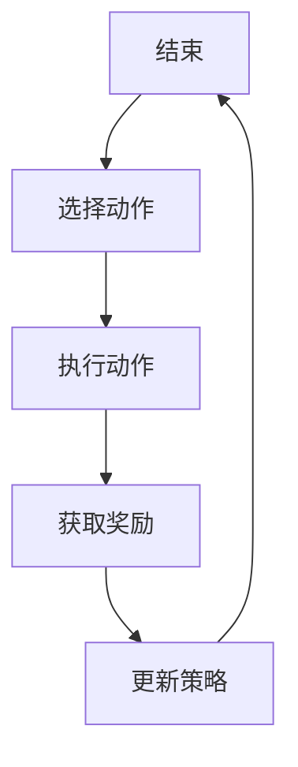
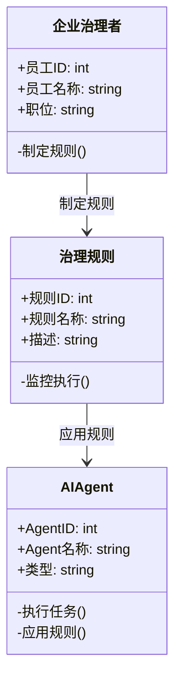

                 


# 企业AI治理框架：确保AI Agent的可控与合规

## 关键词：企业AI治理，AI Agent，可控性，合规性，人工智能框架，治理原则，技术实现

## 摘要：  
随着人工智能技术的快速发展和广泛应用，企业AI治理成为确保AI Agent可控与合规的重要课题。本文从AI治理的背景与挑战出发，详细分析AI Agent的核心概念、算法原理、系统架构，并通过实际案例展示如何在企业中实现AI治理框架。文章旨在为企业提供一套全面的AI治理框架，确保AI Agent在企业中的安全、合规与高效运行。

---

# 第一部分：企业AI治理框架概述

## 第1章：AI治理的背景与挑战

### 1.1 AI治理的背景介绍
#### 1.1.1 人工智能技术的快速发展  
人工智能（AI）技术近年来取得了突破性进展，从深度学习到大语言模型（如GPT系列），AI已经在企业中广泛应用于自动化处理、数据分析、决策支持等领域。

#### 1.1.2 AI在企业中的广泛应用  
AI Agent（智能体）作为企业智能化转型的核心技术，正在改变企业的运营模式。然而，AI的复杂性和不确定性也带来了新的挑战。

#### 1.1.3 AI治理的重要性与必要性  
AI治理是确保AI技术可控、合规和可持续发展的关键。企业需要通过治理框架来应对AI技术带来的风险，如数据隐私、算法偏见、责任划分等。

---

### 1.2 AI治理的核心概念  
#### 1.2.1 什么是AI治理  
AI治理是指通过制定规则、流程和机制，确保AI系统的开发、部署和使用符合企业的战略目标、法律法规和伦理规范。

#### 1.2.2 AI治理的目标与原则  
- **目标**：确保AI系统的安全、透明、可控和合规。  
- **原则**：包括透明性、可解释性、公平性、隐私保护和责任追究。  

#### 1.2.3 AI治理的范围与边界  
AI治理涵盖数据治理、模型治理、算法治理和应用治理等多个方面，但需明确治理的边界，避免过度干预。

---

## 第2章：AI治理框架的核心要素

### 2.1 AI治理框架的组成  
#### 2.1.1 数据治理  
数据是AI系统的核心，数据治理包括数据质量管理、数据安全和数据隐私保护。  

#### 2.1.2 模型治理  
模型治理涉及模型训练、评估和部署，确保模型的准确性和可解释性。  

#### 2.1.3 算法治理  
算法治理关注算法的公平性、透明性和鲁棒性，避免算法偏见和滥用。  

#### 2.1.4 应用治理  
应用治理确保AI系统的应用符合企业的战略目标和合规要求。  

---

### 2.2 AI治理框架的属性对比  
#### 2.2.1 数据治理与模型治理的对比  
| 属性       | 数据治理                     | 模型治理                     |
|------------|------------------------------|------------------------------|
| 核心目标   | 确保数据质量与安全           | 确保模型性能与可解释性       |
| 关键环节   | 数据采集、清洗、存储         | 模型训练、验证、部署         |

#### 2.2.2 算法治理与应用治理的对比  
| 属性       | 算法治理                     | 应用治理                     |
|------------|------------------------------|------------------------------|
| 核心目标   | 避免算法偏见和滥用           | 确保AI应用的合规性与效益     |
| 关键环节   | 算法设计、优化、监控         | 应用场景定义、用户权限管理     |

---

### 2.3 AI治理框架的ER实体关系图  
```mermaid
erDiagram
    actor 企业治理者 {
        key 员工ID
        string 员工名称
        string 职位
    }
    actor AI Agent {
        key AgentID
        string Agent名称
        string 类型
    }
    actor 治理规则 {
        key 规则ID
        string 规则名称
        string 描述
    }
    企业治理者 --> 治理规则 : 制定规则
    治理规则 --> AI Agent : 应用规则
```

---

### 2.4 本章小结  
本章介绍了AI治理的核心概念，分析了AI治理框架的主要组成和各部分的属性特征，通过对比和ER图帮助读者理解AI治理的复杂性和系统性。

---

## 第3章：AI Agent的算法原理  

### 3.1 AI Agent的算法概述  
#### 3.1.1 基于强化学习的AI Agent  
强化学习通过奖励机制训练AI Agent，使其在动态环境中做出最优决策。  

#### 3.1.2 基于监督学习的AI Agent  
监督学习通过标注数据训练AI Agent，使其能够准确分类或预测。  

#### 3.1.3 基于无监督学习的AI Agent  
无监督学习通过发现数据中的模式和结构，帮助AI Agent自主学习。  

---

### 3.2 强化学习算法的流程  


---

### 3.3 算法实现的数学模型  
#### 3.3.1 损失函数的定义  
$$L = -\sum_{i=1}^{n} [y_i \log p(y_i|x_i) + (1-y_i)\log (1-p(y_i|x_i))]$$  

#### 3.3.2 优化器的选择  
$$\theta_{t+1} = \theta_t - \eta \frac{\partial L}{\partial \theta}$$  

---

## 第4章：系统分析与架构设计  

### 4.1 问题场景介绍  
AI治理系统需要解决AI Agent在企业中的数据安全、算法偏见和责任划分等问题。  

### 4.2 系统功能设计  
#### 4.2.1 领域模型类图  


---

### 4.3 系统架构设计  


---

## 第5章：项目实战  

### 5.1 环境安装  
- 安装Python和相关库（如TensorFlow、Keras、Mermaid）。  

### 5.2 核心代码实现  
```python
import numpy as np
from tensorflow import keras

# 定义AI Agent的模型
model = keras.Sequential([
    keras.layers.Dense(64, activation='relu'),
    keras.layers.Dense(1, activation='sigmoid')
])

# 编译模型
model.compile(optimizer='adam', loss='binary_crossentropy', metrics=['accuracy'])

# 训练模型
model.fit(X_train, y_train, epochs=10, batch_size=32)
```

---

## 第6章：总结与展望  

### 6.1 最佳实践  
- 定期审查和更新治理规则。  
- 加强AI技术的透明性和可解释性。  

### 6.2 小结  
本文从AI治理的背景、核心概念、算法原理到系统架构，全面介绍了企业AI治理框架的设计与实现。  

### 6.3 注意事项  
- 在实际应用中，需结合企业具体需求和行业特点。  
- 数据隐私和算法偏见是AI治理的重点和难点。  

### 6.4 拓展阅读  
- 推荐阅读《AI治理：企业实践指南》和《机器学习系统设计》。

---

通过以上章节的详细分析，企业可以构建一个全面的AI治理框架，确保AI Agent的可控与合规，推动AI技术在企业中的安全与高效应用。

