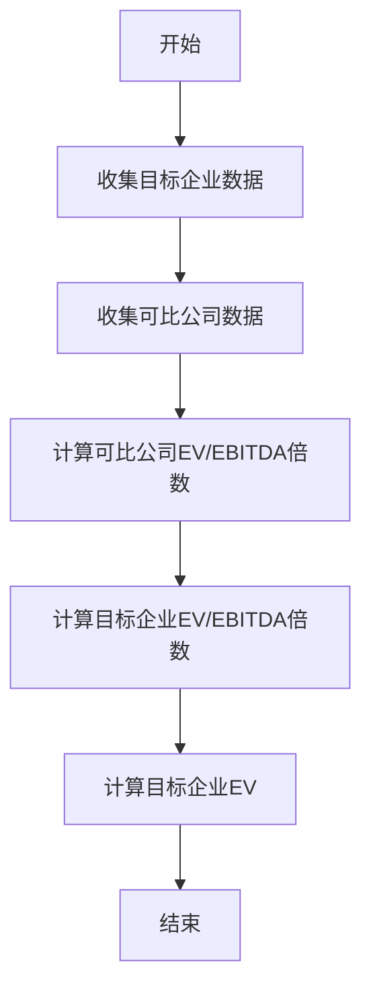

                 


# 企业价值倍数：全面考虑公司资本结构的估值

> 关键词：企业价值倍数、公司资本结构、估值模型、财务分析、投资决策

> 摘要：企业价值倍数（EV）是评估企业价值的重要指标，其计算与资本结构密切相关。本文详细探讨了EV的定义、计算方法、与资本结构的关系，以及在实际估值中的应用。通过案例分析和数学模型，帮助读者掌握EV倍数的计算技巧，并理解其在投资决策中的重要性。

---

## 第一部分：企业价值倍数的背景与概念

### 第1章：企业价值倍数的背景与概念

#### 1.1 企业价值倍数的定义与作用

- **1.1.1 什么是企业价值倍数**
  - 企业价值倍数（EV，Enterprise Value）是将企业的整体价值（包括股权和债务）与特定财务指标（如EBITDA、净利润）进行对比的比率。
  - EV = （企业整体价值） / （EBITDA、净利润等指标）

- **1.1.2 企业价值倍数在估值中的作用**
  - EV倍数是评估企业整体价值的重要工具，广泛应用于并购、投资决策和公司估值。
  - 通过EV倍数，投资者可以比较不同公司的估值水平，识别潜在的投资机会。

- **1.1.3 企业价值倍数与股东权益的关系**
  - EV倍数反映了企业整体价值，而股东权益仅是其中的一部分。EV = 股东权益 + 债务价值 + 其他权益工具。

#### 1.2 资本结构对企业价值的影响

- **1.2.1 资本结构的定义**
  - 资本结构指企业通过债务和股权融资的比例。
  - 合理的资本结构可以降低资本成本，提高企业价值。

- **1.2.2 资本结构对价值的影响**
  - 负债比例较高的企业，由于杠杆效应，可能在息税前利润（EBIT）相同的情况下，税后利润更高，从而提高EV倍数。
  - 过高的债务可能导致财务风险增加，影响企业稳定性。

- **1.2.3 杠杆效应与企业价值的关系**
  - 杠杆效应通过税盾效应（利息税前扣除）影响企业价值，但高杠杆可能增加财务风险，影响企业长期价值。

#### 1.3 企业价值倍数的计算公式

- **1.3.1 EV = EBITDA × 倍数**
  - EBITDA = 息税折旧及摊销前利润
  - EV/EBITDA倍数用于衡量企业整体价值与EBITDA的比例。

- **1.3.2 EV = 净利润 × (1 + 税率) × 倍数**
  - 净利润 = 息税后利润（Net Income）
  - 该公式考虑了税后利润的影响，适用于净利润倍数的计算。

- **1.3.3 EV = 股权价值 + 税务盾**
  - 税务盾 = 利息支出 × 税率
  - EV = 股权价值 + 税务盾，考虑了债务带来的税盾效应。

#### 1.4 本章小结

- 本章介绍了企业价值倍数的基本概念及其在估值中的作用，分析了资本结构对价值的影响，并总结了主要的计算公式。
- 下一章将深入探讨企业价值倍数的核心概念及其与其他指标的联系。

---

## 第二部分：企业价值倍数的核心概念与联系

### 第2章：企业价值倍数的核心概念与联系

#### 2.1 企业价值倍数的原理

- **2.1.1 EV/EBITDA 倍数的计算**
  - EV = EBITDA × EV/EBITDA倍数
  - EBITDA = 收入 - 成本 - 税费 - 折旧 - 摊销

- **2.1.2 EV/净利润 倍数的计算**
  - EV = 净利润 × EV/净利润倍数 × (1 + 税率)
  - 净利润 = 收入 - 成本 - 税费 - 利息支出

- **2.1.3 EV/息税折旧及摊销前利润（EBITDA）倍数的计算**
  - EV/EBITDA倍数反映了企业整体价值与EBITDA的比例。

#### 2.2 核心概念的属性特征对比

- **2.2.1 EV/EBITDA vs EV/净利润**
  - EV/EBITDA倍数考虑了企业税前利润，EV/净利润倍数考虑了税后利润。
  - EV/EBITDA倍数适用于企业处于亏损或税负不同的情况。

- **2.2.2 EV/EBITDA vs 市盈率**
  - 市盈率（P/E）= 股价 / 净利润
  - EV/EBITDA倍数与市盈率不同，EV/EBITDA考虑了企业整体价值，而市盈率仅考虑股权价值。

- **2.2.3 EV/EBITDA vs EV/息税前利润（EBIT）**
  - EV/EBIT倍数 = EV / EBIT
  - EV/EBITDA倍数 = EV / EBITDA
  - 两者均用于估值，但EBITDA考虑了折旧和摊销，EBIT不考虑。

#### 2.3 ER实体关系图

以下是一个简单的ER图，展示了EV倍数与其他财务指标的关系：

```mermaid
erdiagram
  entity 企业价值 (EV) {
    key 属性: 倍数
    属性: EBITDA, 净利润
    关系: 计算EV倍数
  }
  entity EBITDA {
    属性: 息税折旧及摊销前利润
    关系: 计算EV/EBITDA倍数
  }
  entity 净利润 {
    属性: 税后利润
    关系: 计算EV/净利润倍数
  }
```

#### 2.4 本章小结

- 本章详细分析了企业价值倍数的核心概念及其与其他财务指标的关系，通过对比分析和ER图展示了其在估值中的应用。
- 下一章将从算法原理的角度，深入探讨EV倍数的计算方法。

---

## 第三部分：企业价值倍数的算法原理

### 第3章：企业价值倍数的算法原理

#### 3.1 算法原理概述

- **3.1.1 EV倍数的计算流程**
  - 确定目标企业的财务数据（如EBITDA、净利润）。
  - 收集可比公司的EV/EBITDA或EV/净利润倍数。
  - 计算目标企业的EV倍数，并与可比公司进行对比。

- **3.1.2 EV倍数的公式推导**
  - EV = EBITDA × EV/EBITDA倍数
  - EV = 净利润 × EV/净利润倍数 × (1 + 税率)

- **3.1.3 EV倍数的数学模型**
  - EV = EBITDA × (EV/EBITDA)
  - EV = 净利润 × (EV/净利润) × (1 + 税率)

#### 3.2 算法流程图

以下是一个EV倍数计算的流程图：



#### 3.3 Python代码实现

以下是一个简单的Python代码示例，用于计算EV倍数：

```python
# EV倍数计算示例
def calculate_ev(ebitda, ev_multiplier):
    ev = ebitda * ev_multiplier
    return ev

# 示例数据
ebitda = 100  # 目标企业的EBITDA
ev_multiplier = 8.0  # 可比公司的EV/EBITDA倍数

# 计算EV
ev = calculate_ev(ebitda, ev_multiplier)
print(f"企业价值（EV）为：{ev}")
```

#### 3.4 本章小结

- 本章详细讲解了企业价值倍数的算法原理，通过流程图和代码示例展示了其计算过程。
- 下一章将从数学模型的角度，深入探讨EV倍数的公式推导和应用。

---

## 第四部分：企业价值倍数的数学模型与公式

### 第4章：企业价值倍数的数学模型与公式

#### 4.1 算法原理概述

- **4.1.1 EV倍数的计算流程**
  - EV倍数的计算涉及多个公式，如EV/EBITDA、EV/净利润等。

- **4.1.2 EV倍数的公式推导**
  - EV = EBITDA × EV/EBITDA倍数
  - EV = 净利润 × EV/净利润倍数 × (1 + 税率)

- **4.1.3 EV倍数的数学模型**
  - EV = EBITDA × (EV/EBITDA)
  - EV = 净利润 × (EV/净利润) × (1 + 税率)

#### 4.2 算法流程图

以下是一个EV倍数计算的流程图：


#### 4.3 Python代码实现

以下是一个简单的Python代码示例，用于计算EV倍数：

```python
# EV倍数计算示例
def calculate_ev(ebitda, ev_multiplier):
    ev = ebitda * ev_multiplier
    return ev

# 示例数据
ebitda = 100  # 目标企业的EBITDA
ev_multiplier = 8.0  # 可比公司的EV/EBITDA倍数

# 计算EV
ev = calculate_ev(ebitda, ev_multiplier)
print(f"企业价值（EV）为：{ev}")
```

#### 4.4 本章小结

- 本章详细讲解了企业价值倍数的算法原理，通过流程图和代码示例展示了其计算过程。
- 下一章将从数学模型的角度，深入探讨EV倍数的公式推导和应用。

---

## 第五部分：企业价值倍数的系统分析与架构设计

### 第5章：企业价值倍数的系统分析与架构设计

#### 5.1 系统分析

- **5.1.1 问题场景介绍**
  - 企业价值倍数的计算涉及多个财务指标和模型，需要一个系统化的解决方案。

- **5.1.2 系统功能设计**
  - 输入财务数据（如EBITDA、净利润）。
  - 计算EV倍数。
  - 提供可视化结果。

- **5.1.3 领域模型Mermaid类图**
  ```mermaid
  classDiagram
      class 企业 {
          EBITDA
          净利润
      }
      class EV倍数计算 {
          calculate_ev(ebitda, ev_multiplier)
      }
      class 结果展示 {
          display(ev)
      }
      企业 --> EV倍数计算
      EV倍数计算 --> 结果展示
  ```

- **5.1.4 系统架构设计Mermaid架构图**
  ```mermaid
  architecture
      frontend --> backend
      backend --> database
  ```

- **5.1.5 系统接口设计**
  - 输入接口：财务数据输入。
  - 输出接口：EV倍数结果展示。

- **5.1.6 系统交互Mermaid序列图**
  ```mermaid
  sequenceDiagram
      用户 -> 输入界面: 输入财务数据
      输入界面 -> EV计算模块: 计算EV倍数
      EV计算模块 -> 数据库: 获取可比公司倍数
      EV计算模块 -> 用户: 显示EV结果
  ```

#### 5.2 本章小结

- 本章通过系统分析与架构设计，展示了企业价值倍数计算的系统化解决方案。
- 下一章将通过项目实战，进一步验证和应用所学内容。

---

## 第六部分：企业价值倍数的项目实战

### 第6章：企业价值倍数的项目实战

#### 6.1 环境安装

- **6.1.1 安装Python**
  - 安装Python 3.x
  - 安装必要的库（如pandas、numpy）

- **6.1.2 安装其他工具**
  - 数据分析工具（Excel、Tableau）

#### 6.2 系统核心实现源代码

以下是一个完整的Python代码示例，用于计算EV倍数：

```python
import pandas as pd

# 输入数据
data = {
    '公司': ['A', 'B', 'C'],
    'EBITDA': [100, 150, 200],
    'EV/EBITDA': [8, 7, 9]
}

df = pd.DataFrame(data)

# 计算EV
df['EV'] = df['EBITDA'] * df['EV/EBITDA']

# 输出结果
print(df)

# 结果展示
print("\nEV计算结果：")
print(df[['公司', 'EV']])
```

#### 6.3 代码解读与分析

- **代码解读**
  - 使用Pandas库读取数据并计算EV。
  - EV = EBITDA × EV/EBITDA倍数。

- **代码分析**
  - 数据输入：公司名称、EBITDA、EV/EBITDA倍数。
  - 计算EV：通过公式EV = EBITDA × EV/EBITDA倍数。
  - 结果展示：输出公司名称和计算出的EV。

#### 6.4 实际案例分析

- **案例分析**
  - 假设目标企业EBITDA为150，可比公司EV/EBITDA倍数平均为8。
  - 计算EV = 150 × 8 = 1200。

#### 6.5 本章小结

- 本章通过项目实战，展示了企业价值倍数计算的具体实现过程。
- 下一章将总结关键点，并提出注意事项和未来的学习方向。

---

## 第七部分：企业价值倍数的最佳实践

### 第7章：企业价值倍数的最佳实践

#### 7.1 关键点总结

- EV倍数是评估企业整体价值的重要指标。
- EV倍数的计算需结合资本结构和财务数据。
- EV倍数的应用需考虑行业特点和市场环境。

#### 7.2 注意事项

- 数据准确性：确保输入数据的准确性和完整性。
- 模型适用性：根据具体情况选择合适的倍数指标。
- 风险控制：考虑资本结构对价值的影响，避免过度杠杆。

#### 7.3 拓展阅读

- 建议阅读更多关于企业估值和资本结构的经典书籍，如《企业价值评估》、《资本论》。

#### 7.4 本章小结

- 本章总结了企业价值倍数的最佳实践，提出了注意事项和未来的学习方向。
- 读者可以通过实际案例和深入学习，进一步掌握EV倍数的应用技巧。

---

## 总结

企业价值倍数是评估企业整体价值的重要工具，其计算与资本结构密切相关。本文从背景介绍、核心概念、算法原理、数学模型、系统分析、项目实战到最佳实践，全面探讨了企业价值倍数的计算与应用。通过实际案例和系统化的分析，帮助读者掌握EV倍数的计算技巧，并理解其在投资决策中的重要性。

希望这篇文章能为读者提供有价值的见解，并为实际工作和学习提供参考。

