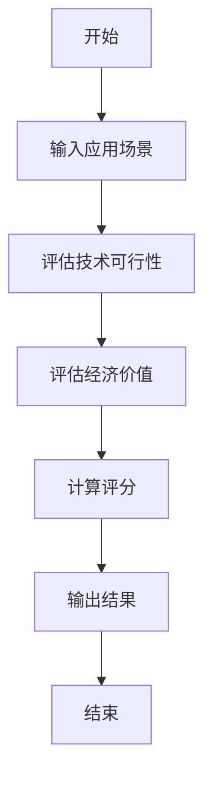
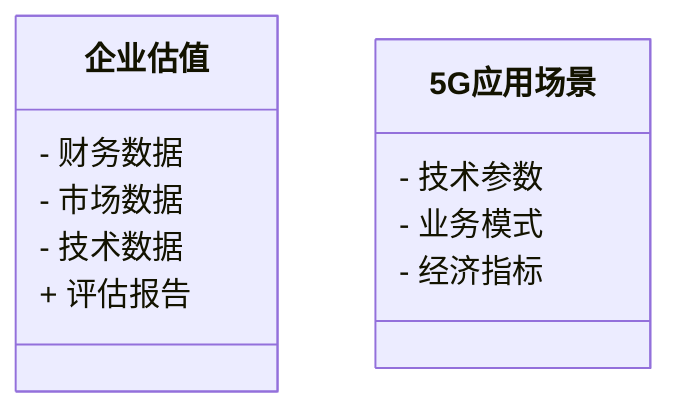

                 


# 企业估值中的5G应用场景评估

> 关键词：5G技术、企业估值、应用场景评估、算法原理、系统架构

> 摘要：本文系统地探讨了5G技术在企业估值中的应用场景评估方法，从技术背景、核心概念、算法原理到系统架构设计，逐一展开分析。通过实际案例和数学模型，详细阐述了5G应用场景对企业估值的影响，以及如何通过系统化的方法进行评估和优化。

---

## 第1章: 5G技术与企业估值的背景介绍

### 1.1 5G技术的基本概念

5G技术作为新一代移动通信技术，以其高速率、低延迟和大容量的特点，正在深刻改变企业的运营模式和价值创造方式。以下是5G技术的核心特点：

- **高速率**：5G的传输速度远超4G，能够支持高清视频、虚拟现实（VR）和增强现实（AR）等高带宽应用。
- **低延迟**：5G的低延迟特性使得实时通信和远程控制成为可能，这对于工业自动化和智能制造尤为重要。
- **大容量**：5G能够支持海量设备的连接，为物联网（IoT）和智慧城市提供了技术基础。

5G技术不仅提升了企业的运营效率，还为企业创造了新的业务模式和收入来源。例如，5G在智能制造、远程医疗、智能交通等领域的应用，显著提升了企业的市场竞争力和估值潜力。

---

### 1.2 企业估值中的应用场景评估

企业估值是衡量企业价值的重要指标，通常包括财务表现、市场竞争力、技术创新等多个维度。在5G技术的推动下，企业估值的评估维度也在不断扩展。以下是应用场景评估在企业估值中的重要性：

- **技术可行性**：5G技术的应用场景需要具备技术可行性，例如工业自动化中的5G远程控制需要低延迟和高可靠性。
- **经济价值**：应用场景的经济价值是企业估值的关键指标，例如5G在智能制造中的应用可以显著降低成本和提高效率。
- **市场潜力**：5G应用场景的市场潜力决定了企业的长期增长能力，例如5G在智能交通中的应用将推动整个交通行业的数字化转型。

通过对5G应用场景的评估，企业可以更好地识别其核心竞争力和市场定位，从而提升整体估值。

---

## 第2章: 5G应用场景评估的核心概念与联系

### 2.1 核心概念原理

5G应用场景评估的核心在于分析应用场景的技术可行性和经济价值。以下是核心概念的详细分析：

- **技术可行性**：评估应用场景是否能够充分利用5G技术的高带宽、低延迟和大容量特性。例如，智能制造中的5G远程控制需要低延迟和高可靠性。
- **经济价值**：评估应用场景为企业带来的经济收益，包括成本节约、收入增长和市场扩展。例如，5G在远程医疗中的应用可以显著降低医疗成本并提高服务质量。
- **市场潜力**：评估应用场景在市场上的潜力，包括市场规模、竞争格局和政策支持。例如，5G在智能交通中的应用将推动整个交通行业的数字化转型。

通过综合评估这些核心概念，企业可以更好地识别其5G应用场景的优势和劣势，从而优化其估值策略。

---

### 2.2 概念属性特征对比表格

以下是5G技术、企业估值和应用场景评估的核心概念对比：

| 概念       | 属性特征                     |
|------------|------------------------------|
| 5G技术     | 高速率、低延迟、大容量       |
| 企业估值   | 财务表现、市场竞争力、技术优势 |
| 应用场景评估 | 业务模式、技术可行性、经济价值 |

---

## 第3章: 5G应用场景评估的算法原理

### 3.1 算法原理概述

5G应用场景评估的核心是通过算法对应用场景的技术可行性和经济价值进行量化分析。以下是算法的详细步骤：

1. **输入应用场景**：定义需要评估的具体应用场景，例如智能制造中的5G远程控制。
2. **评估技术可行性**：通过数学模型评估应用场景的技术可行性，包括5G网络的覆盖范围、带宽和延迟等参数。
3. **评估经济价值**：通过经济模型评估应用场景的经济价值，包括成本节约、收入增长和市场扩展。
4. **计算评分**：结合技术可行性和经济价值，计算应用场景的综合评分。
5. **输出结果**：根据评分结果，输出应用场景的优劣势分析和优化建议。

---

### 3.2 算法流程图

以下是算法的流程图：



---

### 3.3 算法数学模型

以下是算法的核心数学模型：

$$
\text{评分} = \alpha \times \text{技术可行性} + \beta \times \text{经济价值}
$$

其中：
$$
\alpha + \beta = 1
$$

---

## 第4章: 系统分析与架构设计方案

### 4.1 问题场景介绍

在企业估值中，5G应用场景的评估需要解决以下问题：

- **技术可行性评估**：如何量化5G应用场景的技术可行性？
- **经济价值评估**：如何量化5G应用场景的经济价值？
- **综合评分计算**：如何结合技术可行性和经济价值进行综合评分？

---

### 4.2 系统功能设计

以下是系统功能设计的领域模型：



---

## 第5章: 项目实战与案例分析

### 5.1 环境安装

以下是系统运行环境的安装步骤：

1. **安装Python**：安装Python 3.8及以上版本。
2. **安装依赖库**：安装numpy、pandas、scikit-learn等依赖库。
3. **下载数据集**：获取企业估值和5G应用场景的数据集。

---

### 5.2 系统核心实现源代码

以下是系统核心实现的Python代码：

```python
import numpy as np
import pandas as pd

# 定义应用场景评估函数
def assess_scenario(tech_feasibility, economic_value):
    alpha = 0.6
    beta = 0.4
    score = alpha * tech_feasibility + beta * economic_value
    return score

# 读取数据集
data = pd.read_csv('scenario_dataset.csv')

# 评估应用场景
data['评分'] = data.apply(lambda x: assess_scenario(x['技术可行性'], x['经济价值']), axis=1)

# 输出结果
print(data.head())
```

---

### 5.3 实际案例分析

以下是实际案例分析：

假设我们有一个智能制造企业，其应用场景是5G远程控制。以下是具体分析步骤：

1. **技术可行性评估**：评估5G网络是否支持低延迟和高带宽。
2. **经济价值评估**：评估5G远程控制是否能够降低生产成本和提高效率。
3. **综合评分计算**：结合技术可行性和经济价值，计算应用场景的综合评分。

---

## 第6章: 总结与最佳实践

### 6.1 总结

本文系统地探讨了5G应用场景评估在企业估值中的重要性，通过算法和系统设计，提供了具体的评估方法和优化建议。

---

### 6.2 最佳实践 Tips

1. 在企业估值中，5G应用场景的评估需要结合技术可行性和经济价值。
2. 使用数学模型和算法进行量化分析，可以提高评估的准确性和科学性。
3. 定期更新数据和模型，以适应5G技术的快速发展。

---

### 6.3 未来研究方向

未来的研究可以进一步探索以下方向：

- 更复杂的数学模型，例如深度学习和神经网络。
- 多维度的综合评估方法，例如考虑环境和社会影响。
- 实时监控和动态调整的评估系统。

---

### 6.4 小结

5G技术的应用场景评估是企业估值的重要组成部分，通过系统化的分析和优化，企业可以更好地识别其核心竞争力和市场定位，从而提升整体估值。

